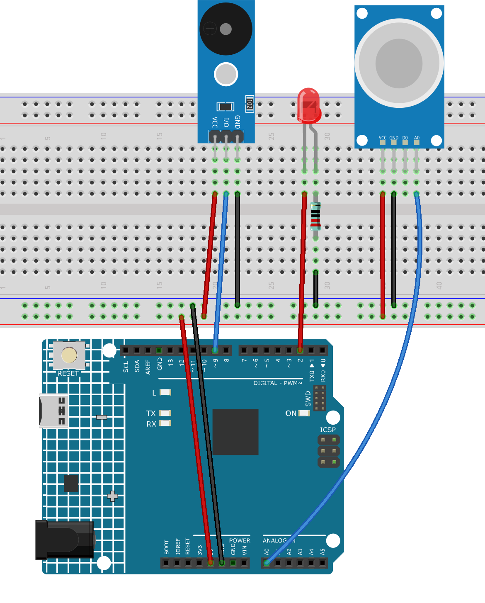

.. _gas_leak:

Gas Leak Monitor
==============================================================

.. note::
  
  🌟 Welcome to the SunFounder Facebook Community! Whether you're into Raspberry Pi, Arduino, or ESP32, you'll find inspiration, help ideas here.
   
  - ✅ Be the first to get free learning resources. 
   
  - ✅ Stay updated on new products & exclusive giveaways. 
   
  - ✅ Share your creations and get real feedback.
   
  * 👉 Need faster updates or support? Click [|link_sf_facebook|] join our Facebook community 

  * 👉 Or join our WhatsApp group: Click [|link_sf_whatsapp|]
   
  * 🎁 Looking for parts?Check out our all-in-one kits below — packed with components, beginner-friendly guides, and tons of fun.
  
  .. list-table::
    :widths: 20 20 20
    :header-rows: 1

    *   - Name	
        - Includes Arduino board
        - PURCHASE LINK
    *   - Elite Explorer Kit	
        - Arduino Uno R4 WiFi
        - |link_elite_buy|
    *   - 3 in 1 Ultimate Starter Kit
        - Arduino Uno R4 Minima
        - |link_arduinor4_buy|

Course Introduction
------------------------

This Arduino project simulates a basic gas leak detection system using an MQ-2 gas sensor, a red LED, and a buzzer. 

The sensor continuously monitors gas concentration. If the reading exceeds a set threshold, the buzzer sounds and the LED blinks to indicate danger. 

Otherwise, the system remains silent and the LED stays off.

.. .. raw:: html
 
..  <iframe width="700" height="394" src="https://www.youtube.com/embed/ZgshCyLw8Fk?si=ksBdWvVV91WM2iHN" title="YouTube video player" frameborder="0" allow="accelerometer; autoplay; clipboard-write; encrypted-media; gyroscope; picture-in-picture; web-share" referrerpolicy="strict-origin-when-cross-origin" allowfullscreen></iframe>

.. note::

  If this is your first time working with an Arduino project, we recommend downloading and reviewing the basic materials first.
  
  * :ref:`install_arduino`
  * :ref:`introduce_arduino`

**Required Components**

In this project, we need the following components:

.. list-table::
    :widths: 5 20 5 20
    :header-rows: 1

    *   - SN
        - COMPONENT INTRODUCTION	
        - QUANTITY
        - PURCHASE LINK

    *   - 1
        - Arduino UNO R4 WIFI
        - 1
        - |link_unor4_wifi_buy|
    *   - 2
        - USB Type-C cable
        - 1
        - 
    *   - 3
        - Breadboard
        - 1
        - |link_breadboard_buy|
    *   - 4
        - Wires
        - Several
        - |link_wires_buy|
    *   - 5
        - Buzzer Modudle
        - 1
        - |link_buzzer_module_buy|
    *   - 6
        - LED
        - 1
        - |link_led_buy|
    *   - 7
        - MQ-2 Gas Sensor Module
        - 1
        - |link_gas_leak_buy|
    *   - 8
        - 220Ω resistor
        - 1
        - |link_resistor_buy|

**Wiring**

**Common Connections:**

* **MQ-2 Gas Sensor Module**

  - **A0:** Connect to **A0** on the Arduino.
  - **GND:** Connect to breadboard’s negative power bus.
  - **VCC:** Connect to breadboard’s red power bus.

* **Buzzer Modudle**

  - **I/O:** Connect to **9** on the Arduino.
  - **GND:** Connect to breadboard’s negative power bus.
  - **VCC:** Connect to breadboard’s red power bus.

* **LED**

  - Connect the LED **anode** to **2** on the Arduino, and the **cathode** to a **220Ω resistor**, then to the negative power bus on the breadboard.

**Writing the Code**

.. note::

    * You can copy this code into **Arduino IDE**. 
    * Don't forget to select the board(Arduino UNO R4 WIFI) and the correct port before clicking the **Upload** button.

.. code-block:: arduino

      /*
        Demo program: Arduino Uno + MQ-2 gas sensor + red LED + buzzer.
        Purpose: Simulate gas leak detection.
        - If gas concentration > threshold (300): buzzer sounds, red LED blinks.
        - Otherwise: buzzer is silent, red LED is off.

        Hardware:
        - MQ-2 gas sensor connected to A0
        - Buzzer connected to D9
        - Red LED connected to D2 (via resistor)
      */

      const int sensorPin = A0;       // MQ-2 sensor analog pin
      const int buzzerPin = 9;        // Buzzer pin
      const int redLEDPin = 2;        // Red LED pin

      int sensorValue = 0;            // Variable to store sensor value
      const int threshold = 90;      // Gas detection threshold

      void setup() {
        Serial.begin(9600);           // Initialize serial monitor
        pinMode(buzzerPin, OUTPUT);   // Set buzzer pin as output
        pinMode(redLEDPin, OUTPUT);   // Set red LED pin as output
      }

      void loop() {o
        sensorValue = analogRead(sensorPin);  // Read sensor value
        Serial.print("Analog output: ");
        Serial.println(sensorValue);

        if (sensorValue > threshold) {
          tone(buzzerPin, 500);              // Turn on buzzer
          digitalWrite(redLEDPin, HIGH);     // LED ON
          delay(250);                        // Wait 250 ms
          digitalWrite(redLEDPin, LOW);      // LED OFF
          delay(250);                        // Wait 250 ms (total blink cycle = 500 ms)
        } else {
          noTone(buzzerPin);                 // Turn off buzzer
          digitalWrite(redLEDPin, LOW);      // LED OFF
          delay(50);                         // Short delay
        }
      }
