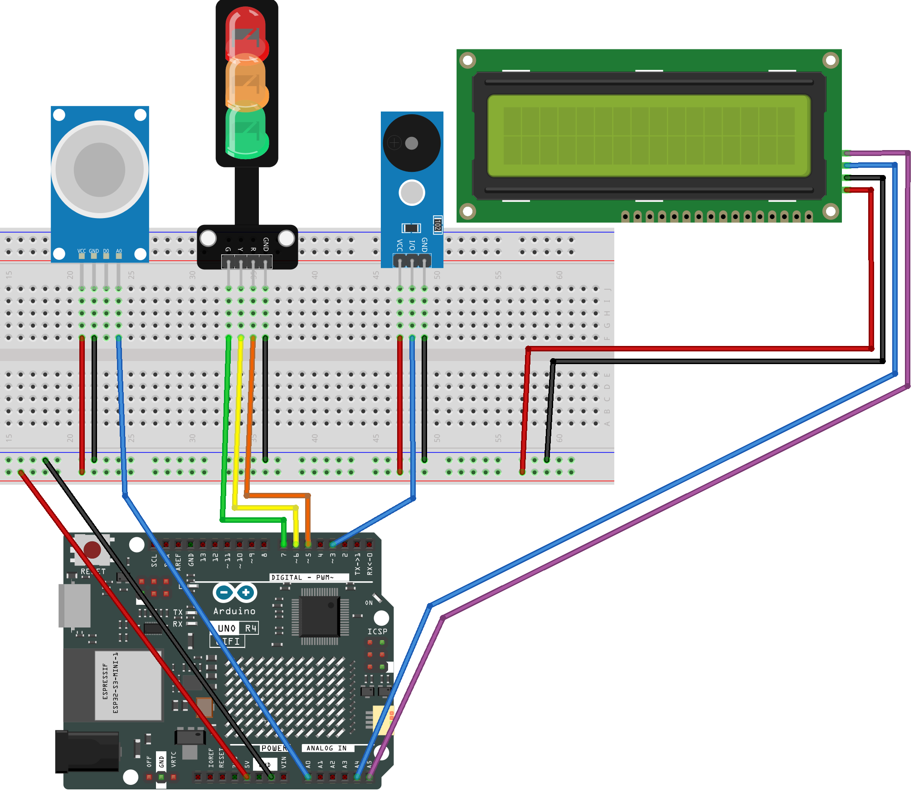

.. _gas_leak2.0:

Gas Leak Monitor 2.0
==============================================================

.. note::
  
  🌟 Welcome to the SunFounder Facebook Community! Whether you're into Raspberry Pi, Arduino, or ESP32, you'll find inspiration, help ideas here.
   
  - ✅ Be the first to get free learning resources. 
   
  - ✅ Stay updated on new products & exclusive giveaways. 
   
  - ✅ Share your creations and get real feedback.
   
  * 👉 Need faster updates or support? Click [|link_sf_facebook|] join our Facebook community 

  * 👉 Or join our WhatsApp group: Click [|link_sf_whatsapp|]
   
Kit purchase
------------------------

Looking for parts? Check out our all-in-one kits below — packed with components, beginner-friendly guides, and tons of fun.

.. image:: img/umsk_kit.png
   :width: 100%
   :align: center
   :target: https://www.sunfounder.com/collections/raspberrypi-kits/products/sunfounder-universal-maker-sensor-kit?ref=jbzmncle

.. raw:: html

     

.. list-table::
   :widths: 20 20 20
   :header-rows: 1

   * - Name
     - Includes Arduino board
     - PURCHASE LINK
   * - Ultimate Sensor Kit
     - Arduino Uno R4 Minima
     - |link_ultimate_sensor_buy|
   * - Universal Maker Sensor Kit
     - ×
     - |link_umsk_buy|

Course Introduction
------------------------

This Arduino project uses an MQ-2 gas sensor, a 16×2 I2C LCD, LEDs, and a buzzer to detect gas concentration in real time. 
It displays the sensor value on the LCD and indicates the current level with LED and buzzer alerts, switching between safe (green), warning (yellow blink with short beep), and alert (red fast blink with alarm) based on the gas level.

.. raw:: html
 
  <iframe width="700" height="394" src="https://www.youtube.com/embed/XuMtpgR5RH8?si=T8QwBhy8RWQ-1GcO" title="YouTube video player" frameborder="0" allow="accelerometer; autoplay; clipboard-write; encrypted-media; gyroscope; picture-in-picture; web-share" referrerpolicy="strict-origin-when-cross-origin" allowfullscreen></iframe>

.. note::

  If this is your first time working with an Arduino project, we recommend downloading and reviewing the basic materials first.
  
  * :ref:`install_arduino`
  * :ref:`introduce_arduino`

**Required Components**

In this project, we need the following components:

.. list-table::
    :widths: 5 20 5 20
    :header-rows: 1

    *   - SN
        - COMPONENT INTRODUCTION	
        - QUANTITY
        - PURCHASE LINK

    *   - 1
        - Arduino UNO R4 WIFI
        - 1
        - |link_unor4_wifi_buy|
    *   - 2
        - USB Type-C cable
        - 1
        - 
    *   - 3
        - Breadboard
        - 1
        - |link_breadboard_buy|
    *   - 4
        - Wires
        - Several
        - |link_wires_buy|
    *   - 5
        - Buzzer Modudle
        - 1
        - |link_buzzer_module_buy|
    *   - 6
        - Traffic Light LED
        - 1
        - |link_trafficlinght_buy|
    *   - 7
        - MQ-2 Gas Sensor Module
        - 1
        - |link_gas_leak_buy|
    *   - 6
        - I2C LCD 1602
        - 1
        - |link_i2clcd1602_buy|

**Wiring**

**Common Connections:**

* **MQ-2 Gas Sensor Module**

  - **A0:** Connect to **A0** on the Arduino.
  - **GND:** Connect to breadboard’s negative power bus.
  - **VCC:** Connect to breadboard’s red power bus.

* **I2C LCD 1602**

  - **SDA:** Connect to **A4** on the Arduino.
  - **SCL:** Connect to **A5** on the Arduino.
  - **GND:** Connect to breadboard’s negative power bus.
  - **VCC:** Connect to breadboard’s red power bus.

* **Buzzer Modudle**

  - **I/O:** Connect to **3** on the Arduino.
  - **GND:** Connect to breadboard’s negative power bus.
  - **VCC:** Connect to breadboard’s red power bus.

* **Traffic light LED**

  - **R:** Connect to **5** on the Arduino.
  - **Y:** Connect to **6** on the Arduino.
  - **G:** Connect to **7** on the Arduino.
  - **GND:** Connect to breadboard’s negative power bus.

**Writing the Code**

.. note::

    * You can copy this code into **Arduino IDE**. 
    * To install the library, use the Arduino Library Manager and search for **LiquidCrystal_I2C** and install it.
    * Don't forget to select the board(Arduino UNO R4 WIFI) and the correct port before clicking the **Upload** button.

.. code-block:: arduino

      #include <LiquidCrystal_I2C.h>

      /*
        MQ-2 Gas Monitor (Yellow: long-ON/short-OFF; immediate beep on level change)
        UI:
          - LCD line1: "Gas level:"
          - LCD line2: raw ADC value (0~1023)
        Levels (absolute thresholds):
          SAFE   : value < 100        -> Green solid, buzzer off
          WARN   : 100 <= value < 500 -> Yellow BLINK (ON 700ms / OFF 300ms) + short beep
          ALERT  : value >= 500       -> Red    BLINK (ON 120ms / OFF 130ms) + fast beep
        Notes:
          - On entering WARN/ALERT, buzzer beeps immediately (fixes delayed first beep).
          - Non-blocking timing via millis(), no delay().
      */

      // -------- Pins --------
      const int PIN_MQ2  = A0;  // MQ-2 analog output
      const int PIN_G    = 5;   // Green LED
      const int PIN_Y    = 6;   // Yellow LED
      const int PIN_R    = 7;   // Red LED
      const int PIN_BUZZ = 3;   // Passive buzzer (tone-capable)

      // -------- LCD --------
      LiquidCrystal_I2C lcd(0x27, 16, 2); // If no display, try 0x3F

      // -------- Thresholds (absolute) --------
      const int TH_YELLOW = 100; // >=100 => WARN (yellow blinking)
      const int TH_RED    = 500; // >=500 => ALERT (red blinking)

      // -------- Timing (ms) --------
      const unsigned long LCD_INTERVAL = 200;  // LCD refresh interval

      // WARN (yellow): 1000ms period; LED ON 700ms / OFF 300ms; beep 80ms at start
      const unsigned long WARN_PERIOD_MS   = 1000;
      const unsigned long WARN_LED_ON_MS   = 700;
      const unsigned long WARN_BEEP_ON_MS  = 80;

      // ALERT (red): 250ms period; LED ON 120ms / OFF 130ms; beep 120ms at start
      const unsigned long ALERT_PERIOD_MS  = 250;
      const unsigned long ALERT_LED_ON_MS  = 120;
      const unsigned long ALERT_BEEP_ON_MS = 120;

      // -------- State --------
      unsigned long tLCD        = 0;   // last LCD update
      unsigned long tWarnStart  = 0;   // start time of current WARN cycle
      unsigned long tAlertStart = 0;   // start time of current ALERT cycle

      int rawVal = 0; // current ADC reading

      enum Level { LV_SAFE, LV_WARN, LV_ALERT };
      Level curLv = LV_SAFE;

      // -------- Helpers --------
      void setLights(bool g, bool y, bool r) {
        digitalWrite(PIN_G, g ? HIGH : LOW);
        digitalWrite(PIN_Y, y ? HIGH : LOW);
        digitalWrite(PIN_R, r ? HIGH : LOW);
      }

      Level decideLevel(int v) {
        if (v >= TH_RED)    return LV_ALERT;
        if (v >= TH_YELLOW) return LV_WARN;
        return LV_SAFE;
      }

      void lcdService() {
        unsigned long now = millis();
        if (now - tLCD < LCD_INTERVAL) return; // throttle updates
        tLCD = now;

        lcd.setCursor(0, 0);
        lcd.print("Gas level:");

        lcd.setCursor(0, 1);
        lcd.print("                "); // clear 16 chars
        lcd.setCursor(0, 1);
        lcd.print(rawVal);            // show only the number
      }

      /*
        Yellow (WARN): long-ON/short-OFF with a short beep at each cycle start.
      */
      void warnService() {
        unsigned long now = millis();
        unsigned long phase = now - tWarnStart;

        if (phase >= WARN_PERIOD_MS) {       // new cycle
          tWarnStart = now;
          phase = 0;
          tone(PIN_BUZZ, 1000, WARN_BEEP_ON_MS); // immediate beep at cycle start
        }

        bool ledOn = (phase < WARN_LED_ON_MS);
        digitalWrite(PIN_Y, ledOn ? HIGH : LOW);

        // Ensure other LEDs OFF here
        digitalWrite(PIN_G, LOW);
        digitalWrite(PIN_R, LOW);
      }

      /*
        Red (ALERT): fast blinking with a beep at each cycle start.
      */
      void alertService() {
        unsigned long now = millis();
        unsigned long phase = now - tAlertStart;

        if (phase >= ALERT_PERIOD_MS) {      // new cycle
          tAlertStart = now;
          phase = 0;
          tone(PIN_BUZZ, 2000, ALERT_BEEP_ON_MS); // immediate beep at cycle start
        }

        bool ledOn = (phase < ALERT_LED_ON_MS);
        digitalWrite(PIN_R, ledOn ? HIGH : LOW);

        // Ensure other LEDs OFF here
        digitalWrite(PIN_G, LOW);
        digitalWrite(PIN_Y, LOW);
      }

      void safeService() {
        setLights(true, false, false); // green solid
        noTone(PIN_BUZZ);              // silence
      }

      // -------- Arduino --------
      void setup() {
        pinMode(PIN_G, OUTPUT);
        pinMode(PIN_Y, OUTPUT);
        pinMode(PIN_R, OUTPUT);
        pinMode(PIN_BUZZ, OUTPUT);

        safeService(); // power-up: green ON, buzzer off

        lcd.init();
        lcd.clear();
        lcd.backlight();
        lcd.setCursor(0, 0); lcd.print("Gas level:");
        lcd.setCursor(0, 1); lcd.print("----");

        unsigned long now = millis();
        tWarnStart  = now;
        tAlertStart = now;
      }

      void loop() {
        // 1) Read sensor
        rawVal = analogRead(PIN_MQ2);

        // 2) Decide level
        Level newLv = decideLevel(rawVal);

        // 3) On level change: re-anchor cycles AND BEEP IMMEDIATELY for WARN/ALERT
        if (newLv != curLv) {
          curLv = newLv;
          unsigned long now = millis();

          // Re-anchor cycle timers so LED timing starts cleanly
          tWarnStart  = now;
          tAlertStart = now;

          // Clear previous-state LEDs
          if (curLv != LV_WARN)  digitalWrite(PIN_Y, LOW);
          if (curLv != LV_ALERT) digitalWrite(PIN_R, LOW);

          // >>> Immediate beep on entering WARN/ALERT (fixes delayed first beep) <<<
          if (curLv == LV_WARN) {
            tone(PIN_BUZZ, 1000, WARN_BEEP_ON_MS);
          } else if (curLv == LV_ALERT) {
            tone(PIN_BUZZ, 2000, ALERT_BEEP_ON_MS);
          } else {
            noTone(PIN_BUZZ);
          }
        }

        // 4) Drive services
        switch (curLv) {
          case LV_SAFE:  safeService();  break;
          case LV_WARN:  warnService();  break;
          case LV_ALERT: alertService(); break;
        }

        // 5) Update LCD
        lcdService();

        // No delay()
      }
