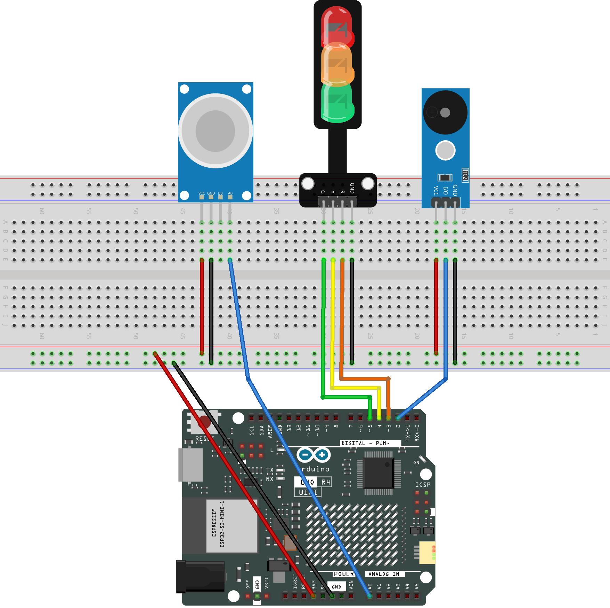

.. _gas_leak3.0:

Gas Leak Monitor 3.0
==============================================================

.. note::
  
  🌟 Welcome to the SunFounder Facebook Community! Whether you're into Raspberry Pi, Arduino, or ESP32, you'll find inspiration, help ideas here.
   
  - ✅ Be the first to get free learning resources. 
   
  - ✅ Stay updated on new products & exclusive giveaways. 
   
  - ✅ Share your creations and get real feedback.
   
  * 👉 Need faster updates or support? Click [|link_sf_facebook|] join our Facebook community 

  * 👉 Or join our WhatsApp group: Click [|link_sf_whatsapp|]
   
  * 🎁 Looking for parts?Check out our all-in-one kits below — packed with components, beginner-friendly guides, and tons of fun.
  
  .. list-table::
    :widths: 20 20 20
    :header-rows: 1

    *   - Name	
        - Includes Arduino board
        - PURCHASE LINK
    *   - Elite Explorer Kit	
        - Arduino Uno R4 WiFi
        - |link_elite_buy|
    *   - 3 in 1 Ultimate Starter Kit
        - Arduino Uno R4 Minima
        - |link_arduinor4_buy|

Course Introduction
------------------------

This Arduino project uses an MQ-2 gas sensor, Traffic Light LED Module, and a buzzer to detect gas concentration in real time. 

.. .. raw:: html
 
..  <iframe width="700" height="394" src="https://www.youtube.com/embed/XuMtpgR5RH8?si=T8QwBhy8RWQ-1GcO" title="YouTube video player" frameborder="0" allow="accelerometer; autoplay; clipboard-write; encrypted-media; gyroscope; picture-in-picture; web-share" referrerpolicy="strict-origin-when-cross-origin" allowfullscreen></iframe>

.. note::

  If this is your first time working with an Arduino project, we recommend downloading and reviewing the basic materials first.
  
  * :ref:`install_arduino`
  * :ref:`introduce_arduino`

**Required Components**

In this project, we need the following components:

.. list-table::
    :widths: 5 20 5 20
    :header-rows: 1

    *   - SN
        - COMPONENT INTRODUCTION	
        - QUANTITY
        - PURCHASE LINK

    *   - 1
        - Arduino UNO R4 WIFI
        - 1
        - |link_unor4_wifi_buy|
    *   - 2
        - USB Type-C cable
        - 1
        - 
    *   - 3
        - Breadboard
        - 1
        - |link_breadboard_buy|
    *   - 4
        - Wires
        - Several
        - |link_wires_buy|
    *   - 5
        - Buzzer Modudle
        - 1
        - |link_buzzer_module_buy|
    *   - 6
        - Traffic Light LED
        - 1
        - |link_trafficlinght_buy|
    *   - 7
        - MQ-2 Gas Sensor Module
        - 1
        - |link_gas_leak_buy|

**Wiring**

**Common Connections:**

* **MQ-2 Gas Sensor Module**

  - **A0:** Connect to **A0** on the Arduino.
  - **GND:** Connect to breadboard’s negative power bus.
  - **VCC:** Connect to breadboard’s red power bus.

* **Buzzer Modudle**

  - **I/O:** Connect to **2** on the Arduino.
  - **GND:** Connect to breadboard’s negative power bus.
  - **VCC:** Connect to breadboard’s red power bus.

* **Traffic light LED**

  - **R:** Connect to **3** on the Arduino.
  - **Y:** Connect to **4** on the Arduino.
  - **G:** Connect to **5** on the Arduino.
  - **GND:** Connect to breadboard’s negative power bus.

**Writing the Code**

.. note::

    * You can copy this code into **Arduino IDE**. 
    * Don't forget to select the board(Arduino UNO R4 WIFI) and the correct port before clicking the **Upload** button.

.. code-block:: arduino

      // -------- Pin definitions --------
      #define PIN_SMOKE  A0   // MQ-2 smoke sensor
      #define PIN_BUZZER 2    // Buzzer
      #define PIN_R      3    // Red LED
      #define PIN_Y      4    // Yellow LED
      #define PIN_G      5    // Green LED

      // -------- Thresholds --------
      #define SAFE_TH 100     // Safe level
      #define ALERT_TH 300    // Alarm level (changed to 300)

      // -------- State definition --------
      enum Level {
        LV_SAFE,
        LV_WARN,
        LV_ALERT
      };

      Level currentLevel = LV_SAFE;
      Level lastLevel = LV_SAFE;

      // -------- Setup --------
      void setup() {
        pinMode(PIN_BUZZER, OUTPUT);
        pinMode(PIN_R, OUTPUT);
        pinMode(PIN_Y, OUTPUT);
        pinMode(PIN_G, OUTPUT);

        Serial.begin(9600);   // Open serial monitor
      }

      // -------- Main loop --------
      void loop() {
        int smokeValue = analogRead(PIN_SMOKE);   // Read smoke value
        currentLevel = decideLevel(smokeValue);   // Decide current level

        // Beep once when level changes
        if (currentLevel != lastLevel) {
          immediateBeep(currentLevel);
          lastLevel = currentLevel;
        }

        serviceLevel(currentLevel);               // Handle LEDs and buzzer

        Serial.print("Smoke value: ");
        Serial.println(smokeValue);
      }

      // -------- Decide smoke level --------
      Level decideLevel(int value) {
        if (value < SAFE_TH) return LV_SAFE;
        if (value < ALERT_TH) return LV_WARN;
        return LV_ALERT;
      }

      // -------- Beep on level change --------
      void immediateBeep(Level lv) {
        if (lv == LV_WARN) {
          tone(PIN_BUZZER, 1200, 80);   // Short warning beep
        } else if (lv == LV_ALERT) {
          tone(PIN_BUZZER, 2000, 150);  // Strong alarm beep
        }
      }

      // -------- Handle current level --------
      void serviceLevel(Level lv) {
        unsigned long now = millis();

        switch (lv) {
          case LV_SAFE:
            digitalWrite(PIN_G, HIGH);  // Green on
            digitalWrite(PIN_Y, LOW);
            digitalWrite(PIN_R, LOW);
            noTone(PIN_BUZZER);
            break;

          case LV_WARN:
            warnService(now);
            break;

          case LV_ALERT:
            alertService(now);
            break;
        }
      }

      // -------- WARN mode --------
      void warnService(unsigned long now) {
        const unsigned long period = 1000; // 1 second cycle
        unsigned long phase = now % period;

        digitalWrite(PIN_G, LOW);
        digitalWrite(PIN_R, LOW);

        // Yellow LED slow blink
        if (phase < 700) {
          digitalWrite(PIN_Y, HIGH);
        } else {
          digitalWrite(PIN_Y, LOW);
        }

        // Short beep at start of cycle
        if (phase < 80) {
          tone(PIN_BUZZER, 1200);
        } else {
          noTone(PIN_BUZZER);
        }
      }

      // -------- ALERT mode --------
      void alertService(unsigned long now) {
        const unsigned long period = 250; // Fast blink
        unsigned long phase = now % period;

        digitalWrite(PIN_G, LOW);
        digitalWrite(PIN_Y, LOW);

        if (phase < 120) {
          digitalWrite(PIN_R, HIGH);     // Red LED on
          tone(PIN_BUZZER, 2000);        // Alarm sound
        } else {
          digitalWrite(PIN_R, LOW);
          noTone(PIN_BUZZER);
        }
      }
