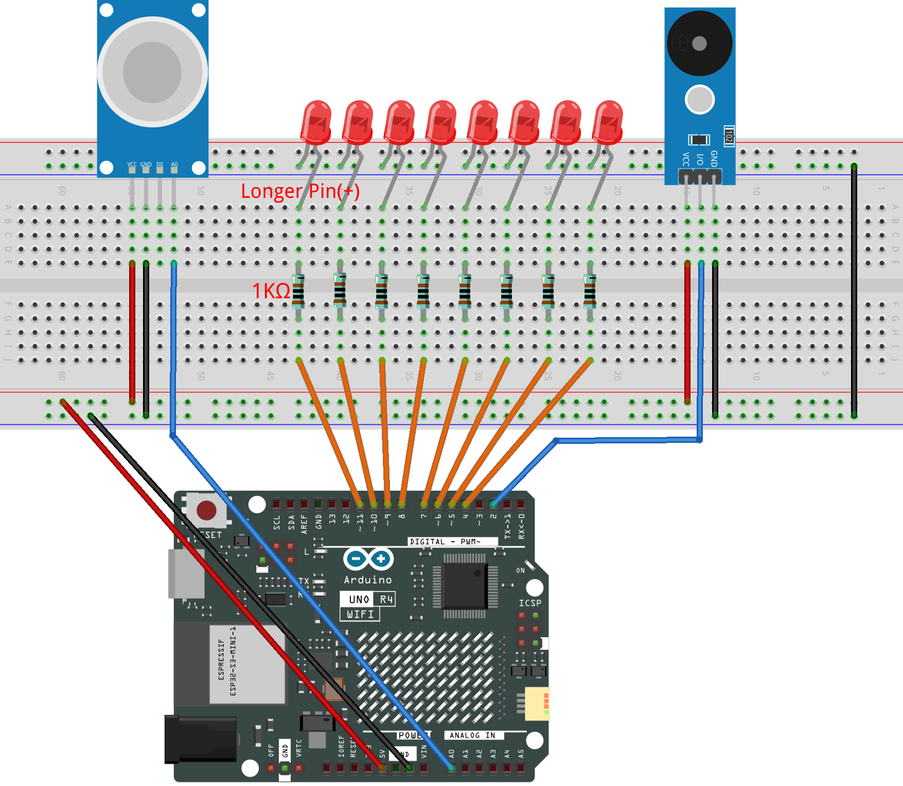

.. _gas_leak4.0:

Gas Leak Monitor 4.0
==============================================================

.. note::
  
  🌟 Welcome to the SunFounder Facebook Community! Whether you're into Raspberry Pi, Arduino, or ESP32, you'll find inspiration, help ideas here.
   
  - ✅ Be the first to get free learning resources. 
   
  - ✅ Stay updated on new products & exclusive giveaways. 
   
  - ✅ Share your creations and get real feedback.
   
  * 👉 Need faster updates or support? Click [|link_sf_facebook|] join our Facebook community 

  * 👉 Or join our WhatsApp group: Click [|link_sf_whatsapp|]
   
Kit purchase
------------------------

Looking for parts? Check out our all-in-one kits below — packed with components, beginner-friendly guides, and tons of fun.

.. image:: img/umsk_kit.png
   :width: 100%
   :align: center
   :target: https://www.sunfounder.com/collections/raspberrypi-kits/products/sunfounder-universal-maker-sensor-kit?ref=jbzmncle

.. raw:: html

     

.. list-table::
   :widths: 20 20 20
   :header-rows: 1

   * - Name
     - Includes Arduino board
     - PURCHASE LINK
   * - Ultimate Sensor Kit
     - Arduino Uno R4 Minima
     - |link_ultimate_sensor_buy|
   * - Universal Maker Sensor Kit
     - ×
     - |link_umsk_buy|

Course Introduction
------------------------

This Arduino project uses an MQ-2 gas sensor, LEDs, and a buzzer to detect gas concentration in real time. 

.. .. raw:: html
 
..  <iframe width="700" height="394" src="https://www.youtube.com/embed/XuMtpgR5RH8?si=T8QwBhy8RWQ-1GcO" title="YouTube video player" frameborder="0" allow="accelerometer; autoplay; clipboard-write; encrypted-media; gyroscope; picture-in-picture; web-share" referrerpolicy="strict-origin-when-cross-origin" allowfullscreen></iframe>

.. note::

  If this is your first time working with an Arduino project, we recommend downloading and reviewing the basic materials first.
  
  * :ref:`install_arduino`
  * :ref:`introduce_arduino`

**Required Components**

In this project, we need the following components:

.. list-table::
    :widths: 5 20 5 20
    :header-rows: 1

    *   - SN
        - COMPONENT INTRODUCTION	
        - QUANTITY
        - PURCHASE LINK

    *   - 1
        - Arduino UNO R4 WIFI
        - 1
        - |link_unor4_wifi_buy|
    *   - 2
        - USB Type-C cable
        - 1
        - 
    *   - 3
        - Breadboard
        - 1
        - |link_breadboard_buy|
    *   - 4
        - Wires
        - Several
        - |link_wires_buy|
    *   - 5
        - Buzzer Modudle
        - 1
        - |link_buzzer_module_buy|
    *   - 6
        - LED
        - Several
        - |link_led_buy|
    *   - 7
        - MQ-2 Gas Sensor Module
        - 1
        - |link_gas_leak_buy|
    *   - 8
        - 1kΩ resistor
        - Several
        - |link_resistor_buy|

**Wiring**

**Common Connections:**

* **MQ-2 Gas Sensor Module**

  - **A0:** Connect to **A0** on the Arduino.
  - **GND:** Connect to breadboard’s negative power bus.
  - **VCC:** Connect to breadboard’s red power bus.

* **Buzzer Modudle**

  - **I/O:** Connect to **2** on the Arduino.
  - **GND:** Connect to breadboard’s negative power bus.
  - **VCC:** Connect to breadboard’s red power bus.

* **LED**

  - Connect the LEDs **cathode** to  the negative power bus on the breadboard, and the LEDs **anode** to **1kΩ resistor** then to **4** to **11** on the Arduino.

**Writing the Code**

.. note::

    * You can copy this code into **Arduino IDE**. 
    * Don't forget to select the board(Arduino UNO R4 WIFI) and the correct port before clicking the **Upload** button.

.. code-block:: arduino

      // -------- Pin definitions --------
      #define PIN_SMOKE  A0    // MQ-2 smoke sensor
      #define PIN_BUZZER 2     // Buzzer

      int ledPins[] = {4, 5, 6, 7, 8, 9, 10, 11}; // LED bar
      const int LED_COUNT = 8;

      // -------- Thresholds --------
      #define LED_START_TH 50     // LED starts lighting
      #define LED_STEP     50     // One LED per 50
      #define WARN_TH      100    // Warning threshold
      #define ALARM_TH     300    // Alarm threshold (same as traffic light project)

      // -------- Setup --------
      void setup() {
        pinMode(PIN_BUZZER, OUTPUT);

        for (int i = 0; i < LED_COUNT; i++) {
          pinMode(ledPins[i], OUTPUT);
          digitalWrite(ledPins[i], LOW);
        }

        Serial.begin(9600);
      }

      // -------- Main loop --------
      void loop() {
        int smokeValue = analogRead(PIN_SMOKE); // Read smoke value

        ledBarDisplay(smokeValue);              // LED display
        buzzerService(smokeValue);              // Buzzer (same behavior as before)

        Serial.print("Smoke value: ");
        Serial.println(smokeValue);
      }

      // -------- LED bar display --------
      // 50  -> D11
      // 100 -> D11, D10
      // 150 -> D11, D10, D9 ...
      void ledBarDisplay(int value) {
        int ledCount = 0;

        if (value >= LED_START_TH) {
          ledCount = (value - LED_START_TH) / LED_STEP + 1;
        }

        if (ledCount > LED_COUNT) {
          ledCount = LED_COUNT;
        }

        // Light LEDs from D11 to D4
        for (int i = 0; i < LED_COUNT; i++) {
          int index = LED_COUNT - 1 - i;
          digitalWrite(ledPins[index], (i < ledCount) ? HIGH : LOW);
        }
      }

      // -------- Buzzer behavior --------
      // WARN  (100–299): short beep every 1 second (same as yellow)
      // ALERT (>=300): fast alarm beep (same as red)
      void buzzerService(int value) {
        unsigned long now = millis();

        // -------- ALERT mode --------
        if (value >= ALARM_TH) {
          const unsigned long period = 250;
          unsigned long phase = now % period;

          if (phase < 120) {
            tone(PIN_BUZZER, 2000);   // Alarm ON
          } else {
            noTone(PIN_BUZZER);       // Alarm OFF
          }
          return;
        }

        // -------- WARN mode --------
        if (value >= WARN_TH) {
          const unsigned long period = 1000;
          unsigned long phase = now % period;

          if (phase < 80) {
            tone(PIN_BUZZER, 1200);   // Short reminder beep
          } else {
            noTone(PIN_BUZZER);
          }
          return;
        }

        // -------- SAFE mode --------
        noTone(PIN_BUZZER);
      }
