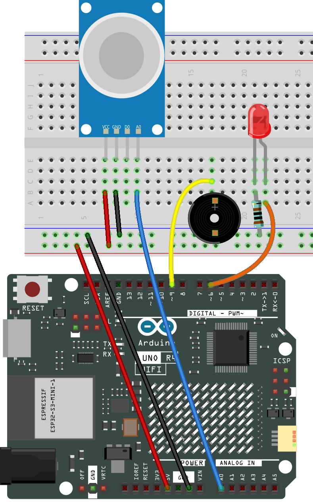

.. _gas_leak_iot:

Gas Leak Monitor (IOT)
==============================================================

.. note::
  
  🌟 Welcome to the SunFounder Facebook Community! Whether you're into Raspberry Pi, Arduino, or ESP32, you'll find inspiration, help ideas here.
   
  - ✅ Be the first to get free learning resources. 
   
  - ✅ Stay updated on new products & exclusive giveaways. 
   
  - ✅ Share your creations and get real feedback.
   
  * 👉 Need faster updates or support? Click [|link_sf_facebook|] join our Facebook community 

  * 👉 Or join our WhatsApp group: Click [|link_sf_whatsapp|]
   
  * 🎁 Looking for parts?Check out our all-in-one kits below — packed with components, beginner-friendly guides, and tons of fun.
  
  .. list-table::
    :widths: 20 20 20
    :header-rows: 1

    *   - Name	
        - Includes Arduino board
        - PURCHASE LINK
    *   - Elite Explorer Kit	
        - Arduino Uno R4 WiFi
        - |link_elite_buy|

Course Introduction
------------------------

This Arduino project simulates a basic gas leak detection system using an MQ-2 gas sensor, a red LED, and a buzzer. 

The sensor continuously monitors gas concentration. If the reading exceeds a set threshold, the buzzer sounds and the LED blinks to indicate danger. 

Otherwise, the system remains silent and the LED stays off.

.. .. raw:: html
 
..  <iframe width="700" height="394" src="https://www.youtube.com/embed/wDVh-0BptOI?si=F7Yddwn72Qfo1eqi" title="YouTube video player" frameborder="0" allow="accelerometer; autoplay; clipboard-write; encrypted-media; gyroscope; picture-in-picture; web-share" referrerpolicy="strict-origin-when-cross-origin" allowfullscreen></iframe>

**Required Components**

In this project, we need the following components:

.. list-table::
    :widths: 5 20 5 20
    :header-rows: 1

    *   - SN
        - COMPONENT INTRODUCTION	
        - QUANTITY
        - PURCHASE LINK

    *   - 1
        - Arduino UNO R4 WIFI
        - 1
        - |link_unor4_wifi_buy|
    *   - 2
        - USB Type-C cable
        - 1
        - 
    *   - 3
        - Breadboard
        - 1
        - |link_breadboard_buy|
    *   - 4
        - Wires
        - Several
        - |link_wires_buy|
    *   - 5
        - Buzzer Modudle
        - 1
        - |link_buzzer_module_buy|
    *   - 6
        - LED
        - 1
        - |link_led_buy|
    *   - 7
        - MQ-2 Gas Sensor Module
        - 1
        - |link_gas_leak_buy|
    *   - 8
        - 1kΩ resistor
        - 1
        - |link_resistor_buy|

**Wiring**

**Common Connections:**

* **MQ-2 Gas Sensor Module**

  - **A0:** Connect to **A0** on the Arduino.
  - **GND:** Connect to breadboard’s negative power bus.
  - **VCC:** Connect to breadboard’s red power bus.

* **Buzzer Modudle**

  - **I/O:** Connect to **9** on the Arduino.
  - **GND:** Connect to breadboard’s negative power bus.
  - **VCC:** Connect to breadboard’s red power bus.

* **LED**

  - Connect the LED **anode** to **6** on the Arduino, and the **cathode** to a **1kΩ resistor**, then to the negative power bus on the breadboard.

.. note::

  If this is your first time working with an Arduino IOT project, we recommend downloading and reviewing the basic materials first.
  
  * :ref:`install_arduino`
  * :ref:`introduce_arduino`

  Please follow the steps in the tutorial below to complete the binding and setup of Arduino Cloud and the Arduino WiFi board.

  * :ref:`iot_arduino_cloud`

**Create a New IoT Project**

  After configuring the Arduino Cloud and the Arduino WiFi board, follow the steps below to complete the Arduino Cloud project setup

  .. image:: img/gas_step1.png

Edit Value

.. list-table::
   :widths: 33 33 33
   :align: center

   * - .. image:: img/alarm_active.png
          :width: 200
          :align: center
     - .. image:: img/gas_percent.png
          :width: 200
          :align: center
     - .. image:: img/threshodl.png
          :width: 200
          :align: center

Follow the steps below to configure the dashboard.

  1. Create New Dashboard

  .. image:: img/dashboard_step.png

  2. Add Widgets

  .. image:: img/dashboard_steps.png

  3. Link Variable

  .. image:: img/link_variable.png
  .. image:: img/link_variable_1.png

  4. Remember to click Done

  .. image:: img/done.png

  After completing the above configuration, return to the Things page and open the sketch.
  
  .. image:: img/go_to_sketch.png

  When you have completed the configuration of the Things and Dashboard, as well as the connection and network setup of the Arduino WiFi board, the thingProperties.h and Sketch Secrets files will be generated automatically. 
  If Sketch Secrets is not generated, please manually enter the connected SSID and OPTIONAL_PASS

Copy this code into **Arduino Cloud**. 
  
  .. image:: img/gas_leak_code.png

Don't forget to select the board(Arduino UNO R4 WIFI) and the correct port before clicking the **Upload** button.

.. code-block:: arduino

      #include <I2C_RTC.h>
      #include "thingProperties.h"
      #include <math.h>  // Use pow for gamma boost

      // ========== Hardware pins (modifiable if needed) ==========
      const uint8_t PIN_GAS_AO     = A0; // Gas sensor analog output
      const uint8_t PIN_BUZZER     = 9;  // Buzzer
      const uint8_t LED_ALARM_PIN  = 6;  // Alarm LED (with 220~330Ω resistor)
      // Active buzzer: HIGH = sound; Passive buzzer: use tone() to generate sound
      const bool BUZZER_ACTIVE_TYPE = true; // true = active; false = passive
      // ==========================================================

      // UNO R4 (Renesas) uses 12-bit ADC; ignored if board does not support
      #if defined(ARDUINO_ARCH_RENESAS)
        static const int ADC_MAX = 4095;  // 12-bit
      #else
        static const int ADC_MAX = 1023;  // 10-bit
      #endif

      // Sampling and refresh
      const unsigned long SAMPLE_INTERVAL_MS = 50;    // Sampling period
      const unsigned long UI_PUSH_INTERVAL_MS = 500;  // Push period to cloud
      const unsigned long BLINK_INTERVAL_MS   = 200;  // Alarm blinking rhythm

      // Filtering
      float filteredRaw = 0.0f;           // First-order low-pass filter
      const float ALPHA = 0.15f;          // 0~1, larger = more responsive, smaller = smoother

      // Adaptive/safety parameters (for percentage mapping)
      const int   MIN_SPAN          = 50;     // Minimum mapping span to avoid small denominator
      const float INIT_SPAN_GUESS   = 200.0f; // Initial span guess
      const float LOW_FOLLOW_ALPHA  = 0.02f;  // Low-end following (slow)
      const float HIGH_EXPAND_ALPHA = 0.30f;  // High-end expansion (fast)
      const float LINEAR_GAIN       = 1.8f;   // Linear gain: larger = more sensitive
      const double GAMMA            = 0.65;   // Gamma <1 enhances low end, >1 compresses low end

      // Timers
      unsigned long tSample = 0, tPush = 0, tBlink = 0;

      // Local alarm state (corresponds to alarmActive)
      bool alarmOn = false;

      void setup() {
        Serial.begin(115200);
        delay(300);

        pinMode(PIN_BUZZER, OUTPUT);
        pinMode(LED_ALARM_PIN, OUTPUT);
        digitalWrite(PIN_BUZZER, LOW);
        digitalWrite(LED_ALARM_PIN, LOW);

      #if defined(ARDUINO_ARCH_RENESAS)
        analogReadResolution(12); // UNO R4 WiFi
      #endif

        // IoT Cloud
        initProperties();
        ArduinoCloud.begin(ArduinoIoTPreferredConnection);
        setDebugMessageLevel(2);
        ArduinoCloud.printDebugInfo();

        // Default threshold (prevents zero when not set from cloud)
        if (threshold <= 0 || threshold > 100) threshold = 30;

        // Initialize filter to avoid "jump" at startup
        int raw = analogRead(PIN_GAS_AO);
        filteredRaw = raw;
        gasPercent  = toPercent(filteredRaw);
        alarmActive = false;

        tSample = tPush = tBlink = millis();

        Serial.print("ADC_MAX="); Serial.println(ADC_MAX);
      }

      void loop() {
        ArduinoCloud.update();

        unsigned long now = millis();

        // 1) Sampling + filtering (non-blocking)
        if (now - tSample >= SAMPLE_INTERVAL_MS) {
          tSample = now;
          int raw = analogRead(PIN_GAS_AO);
          filteredRaw = ALPHA * raw + (1.0f - ALPHA) * filteredRaw;

          // 2) Calculate percentage and perform threshold check
          float percent = toPercent(filteredRaw);
          bool shouldAlarm = (percent >= (float)constrain(threshold, 0, 100));

          // 3) When alarm state changes, reset blink rhythm
          if (shouldAlarm != alarmOn) {
            alarmOn = shouldAlarm;
            alarmActive = alarmOn; // Sync to cloud
            tBlink = now;
            // Immediately unify output (avoid waiting until next blink)
            applyOutputs(alarmOn, /*blinkPhase*/true);
          }

          // 4) Push values to cloud periodically (rate-limited)
          if (now - tPush >= UI_PUSH_INTERVAL_MS) {
            tPush = now;
            gasPercent = percent;
          }
        }

        // 5) Buzzer/LED blinking rhythm during alarm (non-blocking)
        if (alarmOn && (millis() - tBlink >= BLINK_INTERVAL_MS)) {
          tBlink = millis();
          static bool phase = false;
          phase = !phase;
          applyOutputs(true, phase);
        }
        // Keep off when not alarming
        if (!alarmOn) {
          applyOutputs(false, false);
        }
      }

      // ---------- Utility functions ----------
      // Adaptive two-point + gain/gamma boost: weak leak rises noticeably, strong leak closer to 100%
      float toPercent(float raw) {
        static bool  init = false;
        static float low  = 0.0f;   // Environmental baseline (≈0%)
        static float high = 0.0f;   // Recent high value (≈100%)

        if (!init) {
          low  = raw;
          high = raw + INIT_SPAN_GUESS;
          if (high > ADC_MAX) high = (float)ADC_MAX;
          if (high <= low + MIN_SPAN) high = low + MIN_SPAN;
          init = true;
        }

        // Low endpoint: slowly follow environmental decreases
        if (raw < low)  low  = (1.0f - LOW_FOLLOW_ALPHA) * low  + LOW_FOLLOW_ALPHA * raw;
        // High endpoint: quickly expand to new highs
        if (raw > high) high = (1.0f - HIGH_EXPAND_ALPHA) * high + HIGH_EXPAND_ALPHA * raw;

        // Prevent interval from being too small
        if (high <= low + MIN_SPAN) high = low + MIN_SPAN;
        if (high > ADC_MAX) high = (float)ADC_MAX;

        // Normalize to 0..1
        float x = (raw - low) / (high - low);
        if (x < 0.0f) x = 0.0f;
        if (x > 1.0f) x = 1.0f;

        // Linear gain
        x *= LINEAR_GAIN;
        if (x > 1.0f) x = 1.0f;

        // Gamma boost (<1 enhances low range)
        double boosted = pow((double)x, GAMMA);
        float p = (float)(boosted * 100.0);

        if (p < 0.0f)   p = 0.0f;
        if (p > 100.0f) p = 100.0f;
        return p;
      }

      void applyOutputs(bool alarm, bool blinkPhase) {
        if (alarm) {
          // LED blinking
          digitalWrite(LED_ALARM_PIN, blinkPhase ? HIGH : LOW);
          // Buzzer
          if (BUZZER_ACTIVE_TYPE) {
            digitalWrite(PIN_BUZZER, blinkPhase ? HIGH : LOW);
          } else {
            if (blinkPhase) tone(PIN_BUZZER, 2000); // 2kHz
            else            noTone(PIN_BUZZER);
          }
        } else {
          digitalWrite(LED_ALARM_PIN, LOW);
          if (BUZZER_ACTIVE_TYPE) digitalWrite(PIN_BUZZER, LOW);
          else noTone(PIN_BUZZER);
        }
      }

      // ---------- Cloud property callbacks ----------
      void onThresholdChange() {
        threshold = constrain(threshold, 0, 100);
        Serial.print("Threshold set to "); Serial.println(threshold);
      }

      void onAlarmActiveChange() {}

Once you have completed the above configuration and uploaded the code, you can open IoT Remote on your phone and access the previously configured Dashboard.

.. note::
  
  Your phone and the Arduino WiFi board must be connected to the same hotspot network or WiFi.