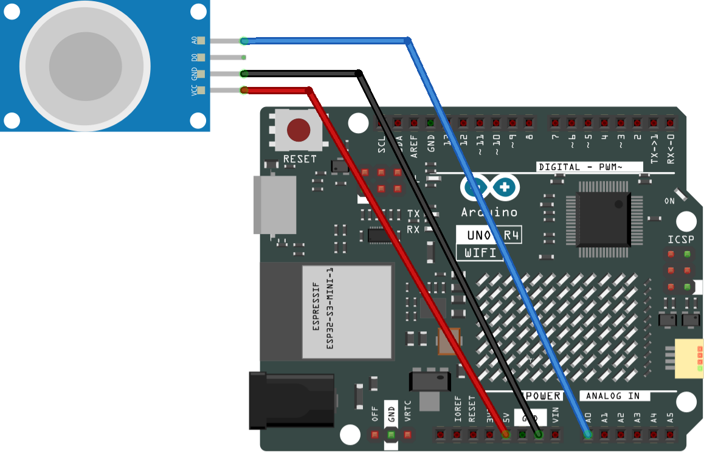

.. _gas_sensor:

Gas Sensor
==============================================================

.. note::
  
  🌟 Welcome to the SunFounder Facebook Community! Whether you're into Raspberry Pi, Arduino, or ESP32, you'll find inspiration, help ideas here.
   
  - ✅ Be the first to get free learning resources. 
   
  - ✅ Stay updated on new products & exclusive giveaways. 
   
  - ✅ Share your creations and get real feedback.
   
  * 👉 Need faster updates or support? Click [|link_sf_facebook|] join our Facebook community 

  * 👉 Or join our WhatsApp group: Click [|link_sf_whatsapp|]
   
Kit purchase
------------------------

Looking for parts? Check out our all-in-one kits below — packed with components, beginner-friendly guides, and tons of fun.

.. image:: img/umsk_kit.png
   :width: 100%
   :align: center
   :target: https://www.sunfounder.com/collections/raspberrypi-kits/products/sunfounder-universal-maker-sensor-kit?ref=jbzmncle

.. raw:: html

     

.. list-table::
   :widths: 20 20 20
   :header-rows: 1

   * - Name
     - Includes Arduino board
     - PURCHASE LINK
   * - Ultimate Sensor Kit
     - Arduino Uno R4 Minima
     - |link_ultimate_sensor_buy|
   * - Universal Maker Sensor Kit
     - ×
     - |link_umsk_buy|

Course Introduction
------------------------

In this lesson, we will learn how to use the Gas Sensor Module with Arduino.

.. raw:: html

 <iframe width="700" height="394" src="https://www.youtube.com/embed/mnMepCgOGmQ?si=YcvgkVQTeFQWD6uX" title="YouTube video player" frameborder="0" allow="accelerometer; autoplay; clipboard-write; encrypted-media; gyroscope; picture-in-picture; web-share" referrerpolicy="strict-origin-when-cross-origin" allowfullscreen></iframe>

.. note::

  If this is your first time working with an Arduino project, we recommend downloading and reviewing the basic materials first.
  
  * :ref:`install_arduino`
  * :ref:`introduce_arduino`

**Required Components**

In this project, we need the following components:

.. list-table::
    :widths: 5 20 5 20
    :header-rows: 1

    *   - SN
        - COMPONENT INTRODUCTION	
        - QUANTITY
        - PURCHASE LINK

    *   - 1
        - Arduino UNO R4 WIFI
        - 1
        - |link_unor4_wifi_buy|
    *   - 2
        - USB Type-C cable
        - 1
        - 
    *   - 3
        - Breadboard
        - 1
        - |link_breadboard_buy|
    *   - 4
        - Wires
        - Several
        - |link_wires_buy|
    *   - 5
        - MQ-2 Gas Sensor Module
        - 1
        - |link_gas_leak_buy|

**Wiring**

**Common Connections:**

* **MQ-2 Gas Sensor Module**

  - **A0:** Connect to **A0** on the Arduino.
  - **GND:** Connect to **GND** on the Arduino.
  - **VCC:** Connect to **5V** on the Arduino.

**Writing the Code**

.. note::

    * You can copy this code into **Arduino IDE**. 
    * Don't forget to select the board(Arduino UNO R4 WIFI) and the correct port before clicking the **Upload** button.

.. code-block:: arduino

    /*
      Read the analog output value(0-1023) of the gas sensor and print it 
      to the serial monitor.
      Note: After the sensor is powered on, it needs to be preheated for 
      at least 3 minute before stable measurement readings can be obtained. 
      It is normal for the sensor to generate heat during operation due to 
      the presence of a heating wire inside.

      Board: Arduino Uno R3 (or R4)
      Component: Gas Sensor(MQ-2)
    */

    // Gas sensor analog output pin
    const int sensorPin = A0;

    void setup() {
      // Start serial communication
      Serial.begin(9600);
    }

    void loop() {
      // Read gas sensor value
      int sensorValue = analogRead(sensorPin);

      // Output value to Serial Monitor
      Serial.print("Analog output: ");
      Serial.println(sensorValue);

      // Short delay between readings
      delay(50);
    }

