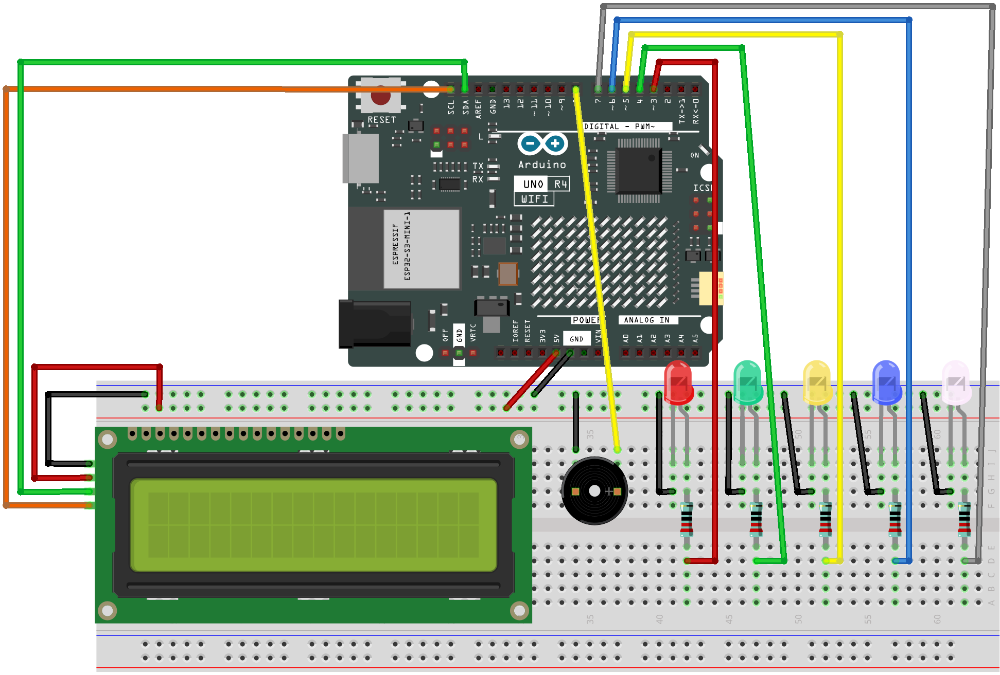

.. _hbd:

Happy Birthday
==============================================================

.. note::
  
  🌟 Welcome to the SunFounder Facebook Community! Whether you're into Raspberry Pi, Arduino, or ESP32, you'll find inspiration, help ideas here.
   
  - ✅ Be the first to get free learning resources. 
   
  - ✅ Stay updated on new products & exclusive giveaways. 
   
  - ✅ Share your creations and get real feedback.
   
  * 👉 Need faster updates or support? Click [|link_sf_facebook|] join our Facebook community 

  * 👉 Or join our WhatsApp group: Click [|link_sf_whatsapp|]
   
Kit purchase
------------------------

Looking for parts? Check out our all-in-one kits below — packed with components, beginner-friendly guides, and tons of fun.

.. image:: img/elite_explore_kit.png
   :width: 100%
   :align: center
   :target: https://www.sunfounder.com/collections/arduino-kits-bundles/products/sunfounder-elite-explorer-kit-with-official-arduino-uno-r4-wifi?ref=jbzmncle

.. raw:: html

     

.. list-table::
   :widths: 20 20 20
   :header-rows: 1

   * - Name
     - Includes Arduino board
     - PURCHASE LINK
   * - Ultimate Sensor Kit
     - Arduino Uno R4 Minima
     - |link_ultimate_sensor_buy|
   * - Elite Explorer Kit
     - Arduino Uno R4 WiFi
     - |link_elite_buy|
   * - 3 in 1 Ultimate Starter Kit
     - Arduino Uno R4 Minima
     - |link_arduinor4_buy|
   * - Universal Maker Sensor Kit
     - ×
     - |link_umsk_buy|

Course Introduction
------------------------

In this lesson, you will learn how to use Arduino along with I2C LCD, Active Buzzer, LEDs, and resistors to create a birthday show. 

.. .. raw:: html

..  <iframe width="700" height="394" src="https://www.youtube.com/embed/DyyozHdvh80?si=MztYSVEZCeRxurx0" title="YouTube video player" frameborder="0" allow="accelerometer; autoplay; clipboard-write; encrypted-media; gyroscope; picture-in-picture; web-share" referrerpolicy="strict-origin-when-cross-origin" allowfullscreen></iframe>

.. note::

  If this is your first time working with an Arduino project, we recommend downloading and reviewing the basic materials first.
  
  * :ref:`install_arduino`
  * :ref:`introduce_arduino`

**Required Components**

In this project, we need the following components:

.. list-table::
    :widths: 5 20 5 20
    :header-rows: 1

    *   - SN
        - COMPONENT INTRODUCTION	
        - QUANTITY
        - PURCHASE LINK

    *   - 1
        - Arduino UNO R4 Minima/Arduino UNO R4 WIFI
        - 1
        - |link_unor4_wifi_buy|
    *   - 2
        - USB Type-C cable
        - 1
        - 
    *   - 3
        - Breadboard
        - 1
        - |link_breadboard_buy|
    *   - 4
        - Wires
        - Several
        - |link_wires_buy|
    *   - 5
        - 220Ω resistor
        - Several
        - |link_resistor_buy|
    *   - 6
        - I2C LCD 1602
        - 1
        - |link_i2clcd1602_buy|
    *   - 7
        - LED
        - Several
        - |link_led_buy|
    *   - 8
        - Active Buzzer
        - 1
        - 

**Wiring**

**Common Connections:**

* **Active Buzzer**

  - **＋:** Connect to **8** on the Arduino.
  - **－:** Connect to breadboard’s negative power bus.

* **LED**

  - Connect the LEDs **cathode** to the negative power bus on the breadboard, and the LEDs **anode** to a **22Ω resistor** then to **3** to **7** on the Arduino.

* **I2C LCD 1602**

  - **SDA:** Connect to **SDA** on the Arduino.
  - **SCL:** Connect to **SCL** on the Arduino.
  - **GND:** Connect to breadboard’s negative power bus.
  - **VCC:** Connect to breadboard’s red power bus.

**Writing the Code**

.. note::

    * You can copy this code into **Arduino IDE**. 
    * To install the library, use the Arduino Library Manager and search for **LiquidCrystal I2C** and install it.
    * Don't forget to select the board(Arduino UNO R4 Minima) and the correct port before clicking the **Upload** button.

.. code-block:: arduino

      #include <Wire.h>
      #include <LiquidCrystal_I2C.h>

      // LCD
      LiquidCrystal_I2C lcd(0x27, 16, 2);

      // LED pins
      const int ledPins[] = {3, 4, 5, 6, 7};
      const int ledCount = 5;

      // Passive buzzer pin
      const int BUZZER_PIN = 8;

      // Start time
      int year = 2026;
      int month = 5;
      int day = 31;
      int hour = 23;
      int minute = 59;
      int second = 50;

      unsigned long lastSecondUpdate = 0;
      unsigned long lastLedUpdate = 0;

      bool birthdayStarted = false;

      int ledIndex = 0;

      // Notes
      #define NOTE_C4  262
      #define NOTE_D4  294
      #define NOTE_E4  330
      #define NOTE_F4  349
      #define NOTE_G4  392
      #define NOTE_A4  440
      #define NOTE_AS4 466
      #define NOTE_B4  494
      #define NOTE_C5  523

      // Happy Birthday melody
      int melody[] = {
        NOTE_C4, NOTE_C4, NOTE_D4, NOTE_C4, NOTE_F4, NOTE_E4,
        NOTE_C4, NOTE_C4, NOTE_D4, NOTE_C4, NOTE_G4, NOTE_F4,
        NOTE_C4, NOTE_C4, NOTE_C5, NOTE_A4, NOTE_F4, NOTE_E4, NOTE_D4,
        NOTE_AS4, NOTE_AS4, NOTE_A4, NOTE_F4, NOTE_G4, NOTE_F4
      };

      int noteDurations[] = {
        4, 4, 2, 2, 2, 1,
        4, 4, 2, 2, 2, 1,
        4, 4, 2, 2, 2, 2, 1,
        4, 4, 2, 2, 2, 1
      };

      const int melodyLength = sizeof(melody) / sizeof(melody[0]);

      int currentNote = 0;
      unsigned long noteStartTime = 0;
      bool notePlaying = false;

      void setup() {
        lcd.init();
        lcd.backlight();

        for (int i = 0; i < ledCount; i++) {
          pinMode(ledPins[i], OUTPUT);
          digitalWrite(ledPins[i], LOW);
        }

        pinMode(BUZZER_PIN, OUTPUT);

        updateLCD();
      }

      void loop() {
        updateClock();

        if (year == 2026 && month == 6 && day == 1 && hour == 0 && minute == 0) {
          birthdayStarted = true;
        }

        if (birthdayStarted) {
          lcd.setCursor(0, 1);
          lcd.print("Happy Birthday ");

          runLedEffect();
          playBirthdaySong();
        }
      }

      void updateClock() {
        if (millis() - lastSecondUpdate >= 1000) {
          lastSecondUpdate = millis();

          second++;

          if (second >= 60) {
            second = 0;
            minute++;
          }

          if (minute >= 60) {
            minute = 0;
            hour++;
          }

          if (hour >= 24) {
            hour = 0;
            day++;
          }

          if (month == 5 && day > 31) {
            month = 6;
            day = 1;
          }

          updateLCD();
        }
      }

      void updateLCD() {
        lcd.setCursor(0, 0);

        lcd.print(year);
        lcd.print("-");

        printTwoDigits(month);
        lcd.print("-");

        printTwoDigits(day);
        lcd.print(" ");

        printTwoDigits(hour);
        lcd.print(":");

        printTwoDigits(minute);
        lcd.print(" ");

        lcd.setCursor(0, 1);

        if (birthdayStarted) {
          lcd.print("Happy Birthday ");
        } else {
          lcd.print("Time ");

          printTwoDigits(hour);
          lcd.print(":");

          printTwoDigits(minute);
          lcd.print(":");

          printTwoDigits(second);
          lcd.print(" ");
        }
      }

      void printTwoDigits(int value) {
        if (value < 10) {
          lcd.print("0");
        }
        lcd.print(value);
      }

      void runLedEffect() {
        if (millis() - lastLedUpdate >= 120) {
          lastLedUpdate = millis();

          for (int i = 0; i < ledCount; i++) {
            digitalWrite(ledPins[i], LOW);
          }

          digitalWrite(ledPins[ledIndex], HIGH);

          ledIndex++;

          if (ledIndex >= ledCount) {
            ledIndex = 0;
          }
        }
      }

      void playBirthdaySong() {
        if (!notePlaying) {
          int noteDuration = 1000 / noteDurations[currentNote];

          tone(BUZZER_PIN, melody[currentNote], noteDuration);

          noteStartTime = millis();
          notePlaying = true;
        } else {
          int noteDuration = 1000 / noteDurations[currentNote];

          if (millis() - noteStartTime >= noteDuration * 1.3) {
            noTone(BUZZER_PIN);

            currentNote++;

            if (currentNote >= melodyLength) {
              currentNote = 0;
            }

            notePlaying = false;
          }
        }
      }