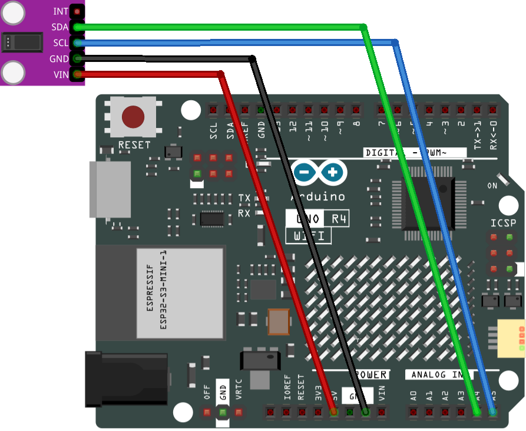

.. _heart_rate_module:

Heart Rate Sensor Module
==============================================================

.. note::
  
  🌟 Welcome to the SunFounder Facebook Community! Whether you're into Raspberry Pi, Arduino, or ESP32, you'll find inspiration, help ideas here.
   
  - ✅ Be the first to get free learning resources. 
   
  - ✅ Stay updated on new products & exclusive giveaways. 
   
  - ✅ Share your creations and get real feedback.
   
  * 👉 Need faster updates or support? Click [|link_sf_facebook|] join our Facebook community 

  * 👉 Or join our WhatsApp group: Click [|link_sf_whatsapp|]
   
Kit purchase
------------------------

Looking for parts? Check out our all-in-one kits below — packed with components, beginner-friendly guides, and tons of fun.

.. image:: img/ultimate_sensor_kit.png
   :width: 100%
   :align: center
   :target: https://www.sunfounder.com/collections/arduino-kits-bundles/products/sunfounder-ultimate-sensor-kit-with-original-arduino-uno-r4-minima?ref=jbzmncle

.. raw:: html

     

.. list-table::
   :widths: 20 20 20
   :header-rows: 1

   * - Name
     - Includes Arduino board
     - PURCHASE LINK
   * - Elite Explorer Kit
     - Arduino Uno R4 WiFi
     - |link_elite_buy|
   * - 3 in 1 Ultimate Starter Kit
     - Arduino Uno R4 Minima
     - |link_arduinor4_buy|

Course Introduction
------------------------

In this lesson, we will learn how to use the Heart Rate Sensor Module with Arduino.

.. .. raw:: html

..  <iframe width="700" height="394" src="https://www.youtube.com/embed/sO1tf1UgKJc" title="YouTube video player" frameborder="0" allow="accelerometer; autoplay; clipboard-write; encrypted-media; gyroscope; picture-in-picture; web-share" referrerpolicy="strict-origin-when-cross-origin" allowfullscreen></iframe>

.. note::

  If this is your first time working with an Arduino project, we recommend downloading and reviewing the basic materials first.
  
  * :ref:`install_arduino`
  * :ref:`introduce_arduino`

**Required Components**

In this project, we need the following components:

.. list-table::
    :widths: 5 20 5 20
    :header-rows: 1

    *   - SN
        - COMPONENT INTRODUCTION	
        - QUANTITY
        - PURCHASE LINK

    *   - 1
        - Arduino UNO R4 WIFI
        - 1
        - |link_unor4_wifi_buy|
    *   - 2
        - USB Type-C cable
        - 1
        - 
    *   - 3
        - Breadboard
        - 1
        - |link_breadboard_buy|
    *   - 4
        - Wires
        - Several
        - |link_wires_buy|
    *   - 5
        - Pulse Oximeter and Heart Rate Sensor Module (MAX30102)
        - 1
        - |link_heart_rate_buy|

**Wiring**

**Common Connections:**

* **Pulse Oximeter and Heart Rate Sensor Module (MAX30102)**

  - **SDA:** Connect to **A4** on the Arduino.
  - **SCL:** Connect to **A5** on the Arduino.
  - **GND:** Connect to breadboard’s negative power bus.
  - **VIN:** Connect to breadboard’s red power bus.

**Writing the Code**

.. note::

    * You can copy this code into **Arduino IDE**. 
    * To install the library, use the Arduino Library Manager and search for **MAX30105** and **heartRate** and install it.
    * Don't forget to select the board(Arduino UNO R4 WIFI) and the correct port before clicking the **Upload** button.

.. code-block:: arduino

      /*
        This is a demo to show the reading of heart rate or beats per minute (BPM).

        It is best to attach the sensor to your finger using a rubber band or other tightening
        device. Humans are generally bad at applying constant pressure to a thing. When you
        press your finger against the sensor it varies enough to cause the blood in your
        finger to flow differently which causes the sensor readings to go wonky.  
        
        Board: Arduino Uno R3 (or R4)
        Component: Pulse Oximeter and Heart Rate Sensor(MAX30102)
        Library: https://github.com/sparkfun/SparkFun_MAX3010x_Sensor_Library  (SparkFun MAX3010x Pulse and Proximity Sensor Library)
      */

      #include <Wire.h>
      #include "MAX30105.h"
      #include "heartRate.h"

      MAX30105 particleSensor;

      const byte RATE_SIZE = 4;  //Increase this for more averaging. 4 is good.
      byte rates[RATE_SIZE];     //Array of heart rates
      byte rateSpot = 0;
      long lastBeat = 0;  //Time at which the last beat occurred

      float beatsPerMinute;  //Current BPM value
      int beatAvg;           //Average BPM value

      void setup() {
        
        Serial.begin(9600);
        Serial.println("Initializing...");

        // Initialize sensor
        if (!particleSensor.begin(Wire, I2C_SPEED_FAST))  //Use default I2C port, 400kHz speed
        {
          Serial.println("MAX30102 was not found. Please check wiring/power. ");
          while (1) ; //Infinite loop to stop the program
        }
        Serial.println("Place your index finger on the sensor with steady pressure.");

        particleSensor.setup();                     //Configure sensor with default settings
        particleSensor.setPulseAmplitudeRed(0x0A);  //Turn Red LED to low to indicate sensor is running
        particleSensor.setPulseAmplitudeGreen(0);   //Turn off Green LED
      }

      void loop() {
        long irValue = particleSensor.getIR();

        if (checkForBeat(irValue) == true) {
          //Calculate beatsPerMinute
          long delta = millis() - lastBeat;
          lastBeat = millis();
          beatsPerMinute = 60 / (delta / 1000.0);

          //Check if the BPM value is within a valid range
          if (beatsPerMinute < 255 && beatsPerMinute > 20) {  
            rates[rateSpot++] = (byte)beatsPerMinute;         
            rateSpot %= RATE_SIZE;                            

            //Take average of readings
            beatAvg = 0;
            for (byte x = 0; x < RATE_SIZE; x++)
              beatAvg += rates[x];
            beatAvg /= RATE_SIZE;
          }
        }

        // Print IR value, current BPM, and average BPM to Serial Monitor
        Serial.print("IR=");
        Serial.print(irValue);
        Serial.print(", BPM=");
        Serial.print(beatsPerMinute);
        Serial.print(", Avg BPM=");
        Serial.print(beatAvg);
        if (irValue < 50000) {
          Serial.print(" No finger?");
        }
        Serial.println();
      }

