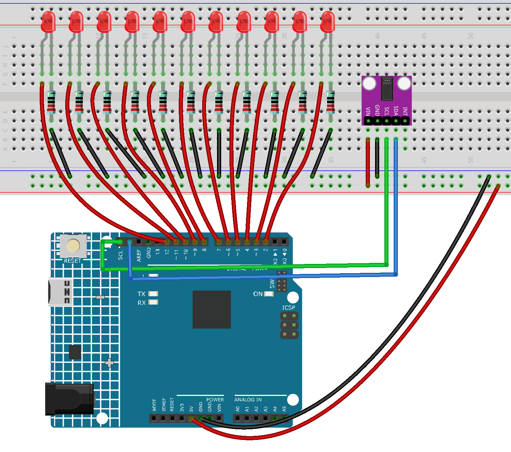

.. _heart_rate_light1.0:

Heart rate Light 1.0
==============================================================

.. note::
  
  🌟 Welcome to the SunFounder Facebook Community! Whether you're into Raspberry Pi, Arduino, or ESP32, you'll find inspiration, help ideas here.
   
  - ✅ Be the first to get free learning resources. 
   
  - ✅ Stay updated on new products & exclusive giveaways. 
   
  - ✅ Share your creations and get real feedback.
   
  * 👉 Need faster updates or support? Click [|link_sf_facebook|] join our Facebook community 

  * 👉 Or join our WhatsApp group: Click [|link_sf_whatsapp|]
   
Kit purchase
------------------------

Looking for parts? Check out our all-in-one kits below — packed with components, beginner-friendly guides, and tons of fun.

.. image:: img/elite_explore_kit.png
   :width: 100%
   :align: center
   :target: https://www.sunfounder.com/collections/arduino-kits-bundles/products/sunfounder-elite-explorer-kit-with-official-arduino-uno-r4-wifi?ref=jbzmncle

.. raw:: html

     

.. list-table::
   :widths: 20 20 20
   :header-rows: 1

   * - Name
     - Includes Arduino board
     - PURCHASE LINK
   * - Ultimate Sensor Kit
     - Arduino Uno R4 Minima
     - |link_ultimate_sensor_buy|
   * - Elite Explorer Kit
     - Arduino Uno R4 WiFi
     - |link_elite_buy|
   * - 3 in 1 Ultimate Starter Kit
     - Arduino Uno R4 Minima
     - |link_arduinor4_buy|
   * - Universal Maker Sensor Kit
     - ×
     - |link_umsk_buy|

Course Introduction
------------------------

This Arduino project builds a heartbeat-synchronized LED lighting system using a MAX30102 heart rate sensor and 11 LEDs. The code detects heartbeats and calculates the time interval between beats to determine the heart rate. Based on the detected heartbeat, the LEDs perform a smooth breathing-style light animation, gradually brightening and dimming to match the pulse rhythm. If no finger is detected on the sensor, the LEDs slowly fade out automatically.

.. .. raw:: html

..  <iframe width="700" height="394" src="https://www.youtube.com/embed/sO1tf1UgKJc" title="YouTube video player" frameborder="0" allow="accelerometer; autoplay; clipboard-write; encrypted-media; gyroscope; picture-in-picture; web-share" referrerpolicy="strict-origin-when-cross-origin" allowfullscreen></iframe>

.. note::

  If this is your first time working with an Arduino project, we recommend downloading and reviewing the basic materials first.
  
  * :ref:`install_arduino`
  * :ref:`introduce_arduino`

**Required Components**

In this project, we need the following components:

.. list-table::
    :widths: 5 20 5 20
    :header-rows: 1

    *   - SN
        - COMPONENT INTRODUCTION	
        - QUANTITY
        - PURCHASE LINK

    *   - 1
        - Arduino UNO R4 Minima
        - 1
        - |link_unor4_buy|
    *   - 2
        - USB Type-C cable
        - 1
        - 
    *   - 3
        - Breadboard
        - 1
        - |link_breadboard_buy|
    *   - 4
        - Wires
        - Several
        - |link_wires_buy|
    *   - 5
        - 1kΩ resistor
        - Several
        - |link_resistor_buy|
    *   - 6
        - LED
        - Several
        - |link_led_buy|
    *   - 7
        - Pulse Oximeter and Heart Rate Sensor Module (MAX30102)
        - 1
        - |link_heart_rate_buy|

**Wiring**

**Common Connections:**

* **Pulse Oximeter and Heart Rate Sensor Module (MAX30102)**

  - **SDA:** Connect to **SDA** on the Arduino.
  - **SCL:** Connect to **SCL** on the Arduino.
  - **GND:** Connect to breadboard’s negative power bus.
  - **VIN:** Connect to breadboard’s red power bus.

* **LED**

  - Connect the LEDs **cathode** to  the negative power bus on the breadboard, and the LEDs **anode** to **1kΩ resistor** then to **2** to **12** on the Arduino.

**Writing the Code**

.. note::

    * You can copy this code into **Arduino IDE**. 
    * To install the library, use the Arduino Library Manager and search for **MAX30105** and **heartRate** and install it.
    * Don't forget to select the board(Arduino UNO R4 WIFI) and the correct port before clicking the **Upload** button.

.. code-block:: arduino

    #include <Wire.h>
    #include "MAX30105.h"
    #include "heartRate.h"

    MAX30105 particleSensor;

    // LED pins
    const int ledPins[11] = {2,3,4,5,6,7,8,9,10,11,12};

    // Heartbeat timing
    unsigned long lastBeat = 0;
    float bpm = 60;
    float beatIntervalMs = 1000;

    // Breathing animation timing
    unsigned long breathStartMs = 0;

    // Software PWM variables
    uint8_t ledTarget[11];
    uint8_t pwmPhase = 0;
    const uint8_t MAX_BRIGHTNESS = 255;

    void setup() {
      Serial.begin(115200);
      Wire.begin();

      // LED pins setup
      for(int i=0;i<11;i++){
        pinMode(ledPins[i], OUTPUT);
        digitalWrite(ledPins[i], LOW);
      }

      // Initialize MAX30102
      if (!particleSensor.begin(Wire, I2C_SPEED_FAST)) {
        Serial.println("MAX30102 not found");
        while (1);
      }

      particleSensor.setup(); 
      particleSensor.setPulseAmplitudeRed(0x0A);
      particleSensor.setPulseAmplitudeIR(0x1F);

      Serial.println("Heart Rate Breathing LED System Ready");
    }

    void updateBreathingLEDs() {
      unsigned long now = millis();
      float interval = beatIntervalMs;

      // Clamp breathing speed
      if(interval < 500) interval = 500;
      if(interval > 2000) interval = 2000;

      float t = (now - breathStartMs) / interval;
      if(t > 1.0) t = 1.0;

      // Smooth breathing curve (0 → 1 → 0)
      float brightness = sin(PI * t);
      if(brightness < 0) brightness = 0;

      int base = brightness * MAX_BRIGHTNESS;

      // LED wave spread effect
      for(int i=0;i<11;i++){
        float scale = 1.0 - abs(i - 5) * 0.08; // center LEDs brighter
        if(scale < 0.3) scale = 0.3;
        ledTarget[i] = base * scale;
      }
    }

    void softwarePWM() {
      pwmPhase++;

      for(int i=0;i<11;i++){
        if(ledTarget[i] > pwmPhase) digitalWrite(ledPins[i], HIGH);
        else digitalWrite(ledPins[i], LOW);
      }
    }

    void loop() {
      long irValue = particleSensor.getIR();

      // Detect heartbeat
      if (checkForBeat(irValue)) {
        unsigned long now = millis();
        beatIntervalMs = now - lastBeat;
        lastBeat = now;
        bpm = 60000.0 / beatIntervalMs;

        breathStartMs = now; // restart breathing animation

        Serial.print("BPM: ");
        Serial.println(bpm);
      }

      // If no finger detected, fade out slowly
      if (irValue < 50000) {
        for(int i=0;i<11;i++){
          if(ledTarget[i] > 0) ledTarget[i]--;
        }
      } 
      else {
        updateBreathingLEDs();
      }

      softwarePWM();
      delayMicroseconds(200); // smooth PWM
    }
