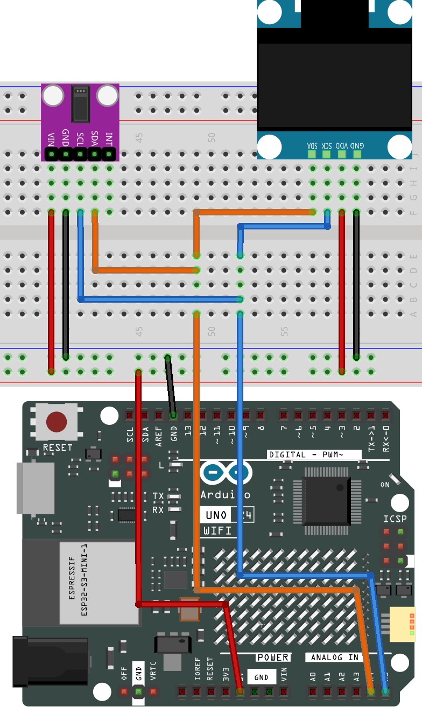

.. _heart_rate_monitor:

Heart rate monitor
==============================================================

.. note::
  
  🌟 Welcome to the SunFounder Facebook Community! Whether you're into Raspberry Pi, Arduino, or ESP32, you'll find inspiration, help ideas here.
   
  - ✅ Be the first to get free learning resources. 
   
  - ✅ Stay updated on new products & exclusive giveaways. 
   
  - ✅ Share your creations and get real feedback.
   
  * 👉 Need faster updates or support? Click [|link_sf_facebook|] join our Facebook community 

  * 👉 Or join our WhatsApp group: Click [|link_sf_whatsapp|]
   
Kit purchase
------------------------

Looking for parts? Check out our all-in-one kits below — packed with components, beginner-friendly guides, and tons of fun.

.. image:: img/ultimate_sensor_kit.png
   :width: 100%
   :align: center
   :target: https://www.sunfounder.com/collections/arduino-kits-bundles/products/sunfounder-ultimate-sensor-kit-with-original-arduino-uno-r4-minima?ref=jbzmncle

.. raw:: html

     

.. list-table::
   :widths: 20 20 20
   :header-rows: 1

   * - Name
     - Includes Arduino board
     - PURCHASE LINK
   * - Elite Explorer Kit
     - Arduino Uno R4 WiFi
     - |link_elite_buy|
   * - 3 in 1 Ultimate Starter Kit
     - Arduino Uno R4 Minima
     - |link_arduinor4_buy|
  
Course Introduction
------------------------

This Arduino project aims to build a simple Heart Rate Monitor using a MAX30102 pulse oximeter sensor and an SSD1306 OLED Display. The code takes measurements of the heart rate by determining the time between heartbeats. By taking four measurements, it computes their average and presents the resultant average heart rate on an OLED screen. If the sensor doesn’t detect a finger, it sends a prompt to the user to position their finger correctly on the sensor.

.. raw:: html

  <iframe width="700" height="394" src="https://www.youtube.com/embed/sO1tf1UgKJc" title="YouTube video player" frameborder="0" allow="accelerometer; autoplay; clipboard-write; encrypted-media; gyroscope; picture-in-picture; web-share" referrerpolicy="strict-origin-when-cross-origin" allowfullscreen></iframe>

.. note::

  If this is your first time working with an Arduino project, we recommend downloading and reviewing the basic materials first.
  
  * :ref:`install_arduino`
  * :ref:`introduce_arduino`

**Required Components**

In this project, we need the following components:

.. list-table::
    :widths: 5 20 5 20
    :header-rows: 1

    *   - SN
        - COMPONENT INTRODUCTION	
        - QUANTITY
        - PURCHASE LINK

    *   - 1
        - Arduino UNO R4 WIFI
        - 1
        - |link_unor4_wifi_buy|
    *   - 2
        - USB Type-C cable
        - 1
        - 
    *   - 3
        - Breadboard
        - 1
        - |link_breadboard_buy|
    *   - 4
        - Wires
        - Several
        - |link_wires_buy|
    *   - 5
        - OLED Display Module
        - 1
        - |link_oled_buy|
    *   - 6
        - Pulse Oximeter and Heart Rate Sensor Module (MAX30102)
        - 1
        - |link_heart_rate_buy|

**Wiring**

**Common Connections:**

* **Pulse Oximeter and Heart Rate Sensor Module (MAX30102)**

  - **SDA:** Connect to **A4** on the Arduino.
  - **SCL:** Connect to **A5** on the Arduino.
  - **GND:** Connect to breadboard’s negative power bus.
  - **VIN:** Connect to breadboard’s red power bus.

* **OLED Display Module**

  - **SDA:** Connect to **A4** on the Arduino.
  - **SCK:** Connect to **A5** on the Arduino.
  - **GND:** Connect to breadboard’s negative power bus.
  - **VCC:** Connect to breadboard’s red power bus.

**Writing the Code**

.. note::

    * You can copy this code into **Arduino IDE**. 
    * To install the library, use the Arduino Library Manager and search for **Adafruit SSD1306** , **Adafruit GFX** , **MAX30105** and **heartRate** and install it.
    * Don't forget to select the board(Arduino UNO R4 WIFI) and the correct port before clicking the **Upload** button.

.. code-block:: arduino

      #ifdef LED_RED
      #undef LED_RED  // Prevent conflict with MAX30105 enum
      #endif

      #include <Adafruit_GFX.h>       // Graphics support for OLED
      #include <Adafruit_SSD1306.h>   // OLED screen library
      #include <Wire.h>               // I2C communication
      #include "MAX30105.h"           // Sensor library
      #include "heartRate.h"          // Heartbeat detection algorithm

      // OLED screen setup
      #define SCREEN_WIDTH 128
      #define SCREEN_HEIGHT 64
      #define OLED_RESET -1
      #define SCREEN_ADDRESS 0x3C     // I2C address for most 0.96" OLEDs

      Adafruit_SSD1306 display(SCREEN_WIDTH, SCREEN_HEIGHT, &Wire, OLED_RESET);

      // Heart rate variables
      MAX30105 particleSensor;
      const byte RATE_SIZE = 4;       // Number of readings to average
      byte rates[RATE_SIZE];          // Store recent BPM values
      byte rateSpot = 0;
      long lastBeat = 0;              // Time of the last detected beat
      float beatsPerMinute;
      int beatAvg = 0;                // Averaged BPM

      // Heart icon (small)
      static const unsigned char PROGMEM beat1_bmp[] = {
        // 24x21 bitmap data
        0x03, 0xC0, 0xF0, 0x06, 0x71, 0x8C, 0x0C, 0x1B, 0x06, 0x18, 0x0E, 0x02, 0x10, 0x0C, 0x03, 0x10,
        0x04, 0x01, 0x10, 0x04, 0x01, 0x10, 0x40, 0x01, 0x10, 0x40, 0x01, 0x10, 0xC0, 0x03, 0x08, 0x88,
        0x02, 0x08, 0xB8, 0x04, 0xFF, 0x37, 0x08, 0x01, 0x30, 0x18, 0x01, 0x90, 0x30, 0x00, 0xC0, 0x60,
        0x00, 0x60, 0xC0, 0x00, 0x31, 0x80, 0x00, 0x1B, 0x00, 0x00, 0x0E, 0x00, 0x00, 0x04, 0x00
      };

      // Heart icon (large)
      static const unsigned char PROGMEM beat2_bmp[] = {
        // 32x32 bitmap data
        0x01, 0xF0, 0x0F, 0x80, 0x06, 0x1C, 0x38, 0x60, 0x18, 0x06, 0x60, 0x18, 0x10, 0x01, 0x80, 0x08,
        0x20, 0x01, 0x80, 0x04, 0x40, 0x00, 0x00, 0x02, 0x40, 0x00, 0x00, 0x02, 0xC0, 0x00, 0x08, 0x03,
        0x80, 0x00, 0x08, 0x01, 0x80, 0x00, 0x18, 0x01, 0x80, 0x00, 0x1C, 0x01, 0x80, 0x00, 0x14, 0x00,
        0x80, 0x00, 0x14, 0x00, 0x80, 0x00, 0x14, 0x00, 0x40, 0x10, 0x12, 0x00, 0x40, 0x10, 0x12, 0x00,
        0x7E, 0x1F, 0x23, 0xFE, 0x03, 0x31, 0xA0, 0x04, 0x01, 0xA0, 0xA0, 0x0C, 0x00, 0xA0, 0xA0, 0x08,
        0x00, 0x60, 0xE0, 0x10, 0x00, 0x20, 0x60, 0x20, 0x06, 0x00, 0x40, 0x60, 0x03, 0x00, 0x40, 0xC0,
        0x01, 0x80, 0x01, 0x80, 0x00, 0xC0, 0x03, 0x00, 0x00, 0x60, 0x06, 0x00, 0x00, 0x30, 0x0C, 0x00,
        0x00, 0x08, 0x10, 0x00, 0x00, 0x06, 0x60, 0x00, 0x00, 0x03, 0xC0, 0x00, 0x00, 0x01, 0x80, 0x00
      };

      void setup() {
        Wire.setClock(400000);            // Use fast I2C speed (400kHz)
        Serial.begin(9600);               // Serial monitor for debugging

        // Start OLED display
        if (!display.begin(SSD1306_SWITCHCAPVCC, SCREEN_ADDRESS)) {
          Serial.println("OLED not found");
          while (true);                   // Stop if display is not found
        }
        display.display();

        // Start MAX30102 sensor
        if (!particleSensor.begin(Wire, I2C_SPEED_FAST)) {
          Serial.println("MAX30102 not found");
          while (true);                   // Stop if sensor is not found
        }

        // Sensor configuration
        particleSensor.setup();                 // Use default settings
        particleSensor.setPulseAmplitudeRed(0x0A);  // Low red LED pulse
        particleSensor.setPulseAmplitudeGreen(0);   // Disable green LED

        Serial.println("Place your finger on the sensor.");
      }

      void loop() {
        long irValue = particleSensor.getIR();  // Get infrared value

        // Check if finger is detected
        if (irValue > 50000) {
          // Detect heartbeat
          if (checkForBeat(irValue)) {
            // Display small heart and current average BPM
            display.clearDisplay();
            display.drawBitmap(23, 15, beat1_bmp, 24, 21, WHITE);
            display.setTextSize(2);
            display.setTextColor(WHITE);
            display.setCursor(60, 10);
            display.println("BPM");
            display.setCursor(60, 28);
            display.println(beatAvg);
            display.display();

            // Calculate BPM based on time between beats
            long delta = millis() - lastBeat;
            lastBeat = millis();
            beatsPerMinute = 60 / (delta / 1000.0);

            // Keep only valid readings
            if (beatsPerMinute < 255 && beatsPerMinute > 20) {
              rates[rateSpot++] = (byte)beatsPerMinute;
              rateSpot %= RATE_SIZE;

              // Average the last few readings
              beatAvg = 0;
              for (byte x = 0; x < RATE_SIZE; x++) {
                beatAvg += rates[x];
              }
              beatAvg /= RATE_SIZE;

              delay(100);  // Small delay before drawing again

              // Display large heart and updated BPM
              display.clearDisplay();
              display.drawBitmap(18, 10, beat2_bmp, 32, 32, WHITE);
              display.setTextSize(2);
              display.setTextColor(WHITE);
              display.setCursor(60, 10);
              display.println("BPM");
              display.setCursor(60, 28);
              display.println(beatAvg);
              display.display();
            }

            // Print info to Serial Monitor
            Serial.print("IR=");
            Serial.print(irValue);
            Serial.print(", BPM=");
            Serial.print(beatsPerMinute);
            Serial.print(", Avg BPM=");
            Serial.println(beatAvg);
          }
        } else {
          // Finger not detected - show message
          Serial.println("Place your finger on the sensor");

          display.clearDisplay();
          display.setTextSize(1);
          display.setTextColor(WHITE);
          display.setCursor(30, 5);
          display.println("Please place ");
          display.setCursor(30, 15);
          display.println("your finger ");
          display.setCursor(30, 25);
          display.println("and wait... ");
          display.display();
        }
      }
