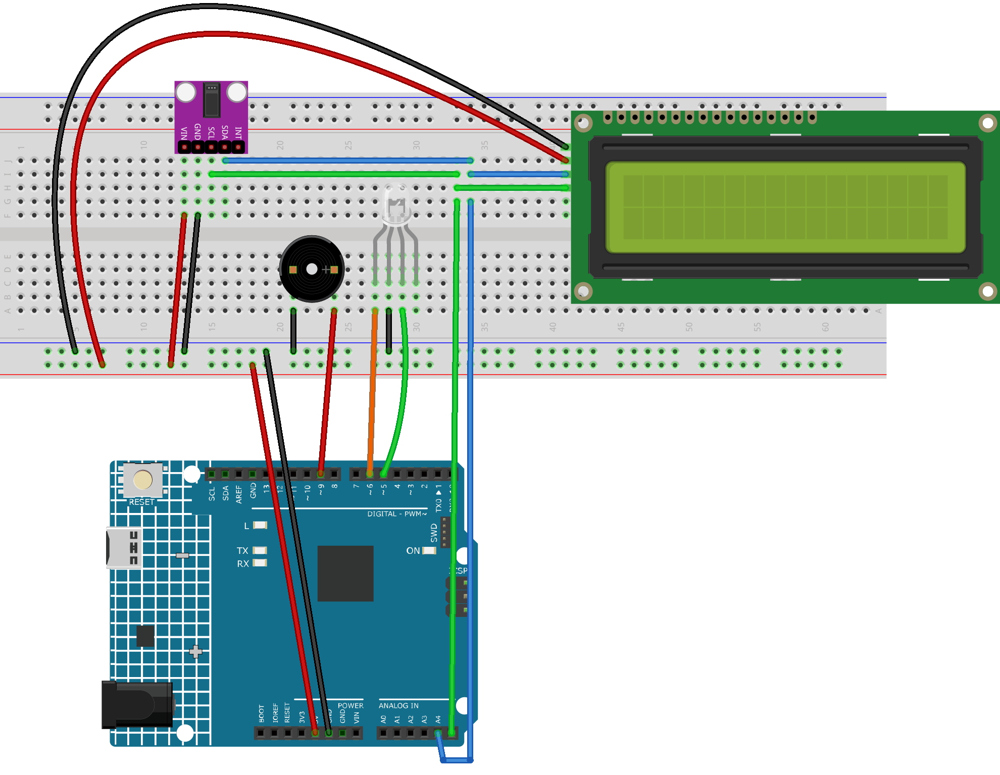

.. _heart_rate_monitor2.0:

Heart rate monitor 2.0
==============================================================

.. note::
  
  🌟 Welcome to the SunFounder Facebook Community! Whether you're into Raspberry Pi, Arduino, or ESP32, you'll find inspiration, help ideas here.
   
  - ✅ Be the first to get free learning resources. 
   
  - ✅ Stay updated on new products & exclusive giveaways. 
   
  - ✅ Share your creations and get real feedback.
   
  * 👉 Need faster updates or support? Click [|link_sf_facebook|] join our Facebook community 

  * 👉 Or join our WhatsApp group: Click [|link_sf_whatsapp|]
   
  * 🎁 Looking for parts?Check out our all-in-one kits below — packed with components, beginner-friendly guides, and tons of fun.
  
  .. list-table::
    :widths: 20 20 20
    :header-rows: 1

    *   - Name	
        - Includes Arduino board
        - PURCHASE LINK
    *   - Elite Explorer Kit	
        - Arduino Uno R4 WiFi
        - |link_elite_buy|
    *   - 3 in 1 Ultimate Starter Kit	
        - Arduino Uno R4 Minima
        - |link_arduinor4_buy|
    *   - Universal Maker Sensor Kit
        - ×
        - |link_umsk_buy|
    *   - Ultimate Sensor Kit
        - Arduino Uno R4 Minima
        - |link_ultimate_sensor_buy|

Course Introduction
------------------------

This Arduino project builds a basic Heart Rate Monitor using the MAX30102 sensor and a 16x2 I2C LCD. 

It detects heartbeats by analyzing infrared signals and calculates the heart rate in BPM. 

The measured BPM is displayed on the LCD. A buzzer beeps with each beat, and an RGB LED indicates heart rate level—red for high, green for normal.

.. .. raw:: html

..  <iframe width="700" height="394" src="https://www.youtube.com/embed/sO1tf1UgKJc" title="YouTube video player" frameborder="0" allow="accelerometer; autoplay; clipboard-write; encrypted-media; gyroscope; picture-in-picture; web-share" referrerpolicy="strict-origin-when-cross-origin" allowfullscreen></iframe>

.. note::

  If this is your first time working with an Arduino project, we recommend downloading and reviewing the basic materials first.
  
  * :ref:`install_arduino`
  * :ref:`introduce_arduino`

**Required Components**

In this project, we need the following components:

.. list-table::
    :widths: 5 20 5 20
    :header-rows: 1

    *   - SN
        - COMPONENT INTRODUCTION	
        - QUANTITY
        - PURCHASE LINK

    *   - 1
        - Arduino UNO R4 Minima
        - 1
        - |link_unor4_buy|
    *   - 2
        - USB Type-C cable
        - 1
        - 
    *   - 3
        - Breadboard
        - 1
        - |link_breadboard_buy|
    *   - 4
        - Wires
        - Several
        - |link_wires_buy|
    *   - 5
        - I2C LCD 1602
        - 1
        - |link_i2clcd1602_buy|
    *   - 6
        - Pulse Oximeter and Heart Rate Sensor Module (MAX30102)
        - 1
        - |link_heart_rate_buy|
    *   - 7
        - RGB LED
        - 1
        - 
    *   - 8
        - Passive buzzer
        - 1
        - |link_passive_buzzer_buy|

**Wiring**

**Common Connections:**

* **Pulse Oximeter and Heart Rate Sensor Module (MAX30102)**

  - **SDA:** Connect to **A4** on the Arduino.
  - **SCL:** Connect to **A5** on the Arduino.
  - **GND:** Connect to breadboard’s negative power bus.
  - **VIN:** Connect to breadboard’s red power bus.

* **I2C LCD 1602**

  - **SDA:** Connect to **A4** on the Arduino.
  - **SCL:** Connect to **A5** on the Arduino.
  - **GND:** Connect to breadboard’s negative power bus.
  - **VCC:** Connect to breadboard’s red power bus.

* **RGB LED**

  - **R:** Connect to **6** on the Arduino.
  - **G:** Connect to **5** on the Arduino.
  - **GND:** Connect to breadboard’s negative power bus.

* **Passive Buzzer**

  - **＋:** Connect to **9** on the Arduino.
  - **－:** Connect to breadboard’s negative power bus.

**Writing the Code**

.. note::

    * You can copy this code into **Arduino IDE**. 
    * To install the library, use the Arduino Library Manager and search for **LiquidCrystal_I2C** , **MAX30105** and **heartRate** and install it.
    * Don't forget to select the board(Arduino UNO R4 WIFI) and the correct port before clicking the **Upload** button.

.. code-block:: arduino

      #include <Wire.h>
      #include "MAX30105.h"
      #include "heartRate.h"
      #include <LiquidCrystal_I2C.h>

      #define BUZZER_PIN 9
      #define RED_PIN 6      // Red pin of RGB LED
      #define GREEN_PIN 5    // Green pin of RGB LED

      MAX30105 particleSensor;
      LiquidCrystal_I2C lcd(0x27, 16, 2);

      int bpm = 0;
      unsigned long lastDisplayTime = 0;

      void setup() {
        Serial.begin(9600);
        pinMode(BUZZER_PIN, OUTPUT);
        pinMode(RED_PIN, OUTPUT);
        pinMode(GREEN_PIN, OUTPUT);

        lcd.init();
        lcd.backlight();
        lcd.setCursor(0, 0);
        lcd.print("Initializing...");

        if (!particleSensor.begin(Wire, I2C_SPEED_STANDARD)) {
          Serial.println("MAX30102 not found");
          lcd.setCursor(0, 1);
          lcd.print("Sensor Error");
          while (1);
        }

        particleSensor.setup(); // Default configuration
        particleSensor.setPulseAmplitudeRed(0x0A);  // Red light for heart rate
        particleSensor.setPulseAmplitudeGreen(0);   // Turn off green light

        lcd.clear();
        lcd.setCursor(0, 0);
        lcd.print("Heart Monitor");
      }

      void loop() {
        const int NUM_READINGS = 100;
        long irValue;
        static uint32_t lastBeat = 0;

        for (int i = 0; i < NUM_READINGS; i++) {
          irValue = particleSensor.getIR();

          if (checkForBeat(irValue)) {
            uint32_t now = millis();
            int delta = now - lastBeat;
            lastBeat = now;

            bpm = 60000 / delta;

            Serial.print("BPM: ");
            Serial.println(bpm);

            lcd.setCursor(0, 1);
            lcd.print("BPM: ");
            lcd.print(bpm);
            lcd.print("   ");

            // Control RGB LED: light red or green
            if (bpm > 100) {
              digitalWrite(RED_PIN, HIGH);
              digitalWrite(GREEN_PIN, LOW);
            } else {
              digitalWrite(RED_PIN, LOW);
              digitalWrite(GREEN_PIN, HIGH);
            }

            // Beep once per heartbeat
            tone(BUZZER_PIN, 1000, 50); // 1kHz, 50ms
          }

          delay(10); // Sampling rate
        }
      }
