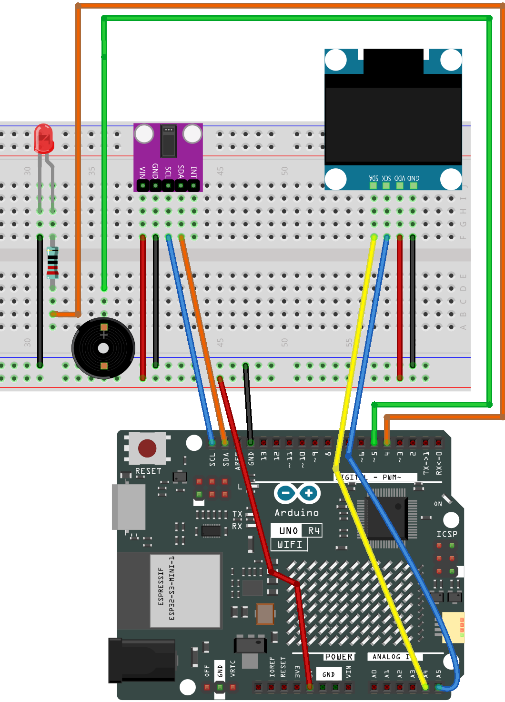

.. _heart_rate_monitor3.0:

Heart rate monitor 3.0
==============================================================

.. note::
  
  🌟 Welcome to the SunFounder Facebook Community! Whether you're into Raspberry Pi, Arduino, or ESP32, you'll find inspiration, help ideas here.
   
  - ✅ Be the first to get free learning resources. 
   
  - ✅ Stay updated on new products & exclusive giveaways. 
   
  - ✅ Share your creations and get real feedback.
   
  * 👉 Need faster updates or support? Click [|link_sf_facebook|] join our Facebook community 

  * 👉 Or join our WhatsApp group: Click [|link_sf_whatsapp|]
   
Kit purchase
------------------------

Looking for parts? Check out our all-in-one kits below — packed with components, beginner-friendly guides, and tons of fun.

.. image:: img/ultimate_sensor_kit.png
   :width: 100%
   :align: center
   :target: https://www.sunfounder.com/collections/arduino-kits-bundles/products/sunfounder-ultimate-sensor-kit-with-original-arduino-uno-r4-minima?ref=jbzmncle

.. raw:: html

     

.. list-table::
   :widths: 20 20 20
   :header-rows: 1

   * - Name
     - Includes Arduino board
     - PURCHASE LINK
   * - Elite Explorer Kit
     - Arduino Uno R4 WiFi
     - |link_elite_buy|
   * - 3 in 1 Ultimate Starter Kit
     - Arduino Uno R4 Minima
     - |link_arduinor4_buy|

Course Introduction
------------------------

This Arduino project builds a basic Heart Rate Monitor using the MAX30102 sensor and OLED. 

It detects heartbeats by analyzing infrared signals and calculates the heart rate in BPM. 

The measured BPM is displayed on the OLED. A buzzer beeps with each beat, and an RGB LED indicates heart rate level—red for high, green for normal.

.. .. raw:: html

..  <iframe width="700" height="394" src="https://www.youtube.com/embed/mcgQMxO5kBg?si=oEP4OwCOTQHdrHeJ" title="YouTube video player" frameborder="0" allow="accelerometer; autoplay; clipboard-write; encrypted-media; gyroscope; picture-in-picture; web-share" referrerpolicy="strict-origin-when-cross-origin" allowfullscreen></iframe>

.. note::

  If this is your first time working with an Arduino project, we recommend downloading and reviewing the basic materials first.
  
  * :ref:`install_arduino`
  * :ref:`introduce_arduino`

**Required Components**

In this project, we need the following components:

.. list-table::
    :widths: 5 20 5 20
    :header-rows: 1

    *   - SN
        - COMPONENT INTRODUCTION	
        - QUANTITY
        - PURCHASE LINK

    *   - 1
        - Arduino UNO R4 Minima
        - 1
        - |link_unor4_buy|
    *   - 2
        - USB Type-C cable
        - 1
        - 
    *   - 3
        - Breadboard
        - 1
        - |link_breadboard_buy|
    *   - 4
        - Wires
        - Several
        - |link_wires_buy|
    *   - 5
        - OLED Display Module
        - 1
        - |link_oled_buy|
    *   - 6
        - Pulse Oximeter and Heart Rate Sensor Module (MAX30102)
        - 1
        - |link_heart_rate_buy|
    *   - 7
        - RGB LED
        - 1
        - 
    *   - 8
        - Passive buzzer
        - 1
        - |link_passive_buzzer_buy|

**Wiring**

**Common Connections:**

* **Pulse Oximeter and Heart Rate Sensor Module (MAX30102)**

  - **SDA:** Connect to **SDA** on the Arduino.
  - **SCL:** Connect to **SCL** on the Arduino.
  - **GND:** Connect to breadboard’s negative power bus.
  - **VIN:** Connect to breadboard’s red power bus.

* **LED**

  - Connect the LED **cathode** to  the negative power bus on the breadboard, and the LED **anode** to **1kΩ resistor** then to **4** on the Arduino.

* **Passive Buzzer**

  - **＋:** Connect to **5** on the Arduino.
  - **－:** Connect to breadboard’s negative power bus.

* **OLED Display Module**

  - **SDA:** Connect to **A4** on the Arduino.
  - **SCK:** Connect to **A5** on the Arduino.
  - **GND:** Connect to breadboard’s negative power bus.
  - **VCC:** Connect to breadboard’s red power bus.

**Writing the Code**

.. note::

    * You can copy this code into **Arduino IDE**. 
    * To install the library, use the Arduino Library Manager and search for **Adafruit SSD1306** and **Adafruit GFX** , **MAX30105** and **heartRate** and install it.
    * Don't forget to select the board(Arduino UNO R4) and the correct port before clicking the **Upload** button.

.. code-block:: arduino

      #ifdef LED_RED
      #undef LED_RED  // Prevent conflict with MAX30105 enum
      #endif

      #include <Adafruit_GFX.h>
      #include <Adafruit_SSD1306.h>
      #include <Wire.h>
      #include "MAX30105.h"
      #include "heartRate.h"

      // =========================
      // OLED setup
      // =========================
      #define SCREEN_WIDTH 128
      #define SCREEN_HEIGHT 64
      #define OLED_RESET -1
      #define SCREEN_ADDRESS 0x3C

      Adafruit_SSD1306 display(SCREEN_WIDTH, SCREEN_HEIGHT, &Wire, OLED_RESET);

      // =========================
      // Pin setup
      // =========================
      const int BUZZER_PIN = 5;     // Passive buzzer signal pin
      const int RED_LED_PIN = 4;    // Red LED pin

      // =========================
      // Heart rate variables
      // =========================
      MAX30105 particleSensor;
      const byte RATE_SIZE = 4;
      byte rates[RATE_SIZE];
      byte rateSpot = 0;
      long lastBeat = 0;
      float beatsPerMinute;
      int beatAvg = 75;             // Default startup value

      // =========================
      // Beat flash / beep control
      // =========================
      bool beatEffectActive = false;
      unsigned long beatEffectStart = 0;
      const unsigned long beatEffectDuration = 80;   // LED/Buzzer pulse duration (ms)

      // =========================
      // ECG drawing area
      // Top 1/4 for BPM, bottom 3/4 for graph
      // =========================
      const int BPM_AREA_H = 16;
      const int GRAPH_TOP = BPM_AREA_H;
      const int GRAPH_BOTTOM = SCREEN_HEIGHT - 1;
      const int GRAPH_HEIGHT = SCREEN_HEIGHT - BPM_AREA_H;

      // 128 points buffer, one for each OLED column
      int ecgBuffer[SCREEN_WIDTH];

      // ECG animation timing
      unsigned long lastGraphUpdate = 0;
      const int GRAPH_UPDATE_INTERVAL = 20;  // ms, scrolling speed

      // Beat-synced ECG cycle
      unsigned long lastWaveBeatTime = 0;

      // =========================
      // Function declarations
      // =========================
      void drawBPMArea();
      void drawECGGraph();
      void pushECGPoint();
      int generateECGPoint(unsigned long now);
      void triggerBeatEffect();
      void updateBeatEffect();
      void resetECGBuffer();
      void showNoFingerMessage();

      void setup() {
        Serial.begin(9600);

        // Uno / Nano default I2C:
        // SDA -> A4
        // SCL -> A5
        Wire.begin();
        Wire.setClock(400000);

        pinMode(BUZZER_PIN, OUTPUT);
        pinMode(RED_LED_PIN, OUTPUT);
        digitalWrite(RED_LED_PIN, LOW);
        noTone(BUZZER_PIN);

        // Start OLED
        if (!display.begin(SSD1306_SWITCHCAPVCC, SCREEN_ADDRESS)) {
          Serial.println("OLED not found");
          while (true);
        }
        display.clearDisplay();
        display.display();

        // Start MAX30102 sensor
        if (!particleSensor.begin(Wire, I2C_SPEED_FAST)) {
          Serial.println("MAX30102 not found");
          while (true);
        }

        particleSensor.setup();
        particleSensor.setPulseAmplitudeRed(0x0A);
        particleSensor.setPulseAmplitudeGreen(0);

        resetECGBuffer();

        Serial.println("Place your finger on the sensor.");
      }

      void loop() {
        long irValue = particleSensor.getIR();

        // If finger detected
        if (irValue > 50000) {
          // Detect heartbeat
          if (checkForBeat(irValue)) {
            long delta = millis() - lastBeat;
            lastBeat = millis();
            lastWaveBeatTime = lastBeat;

            beatsPerMinute = 60.0 / (delta / 1000.0);

            if (beatsPerMinute < 255 && beatsPerMinute > 20) {
              rates[rateSpot++] = (byte)beatsPerMinute;
              rateSpot %= RATE_SIZE;

              beatAvg = 0;
              for (byte x = 0; x < RATE_SIZE; x++) {
                beatAvg += rates[x];
              }
              beatAvg /= RATE_SIZE;
            }

            triggerBeatEffect();

            Serial.print("IR=");
            Serial.print(irValue);
            Serial.print(", BPM=");
            Serial.print(beatsPerMinute);
            Serial.print(", Avg BPM=");
            Serial.println(beatAvg);
          }

          updateBeatEffect();

          // Update ECG scrolling
          if (millis() - lastGraphUpdate >= GRAPH_UPDATE_INTERVAL) {
            lastGraphUpdate = millis();
            pushECGPoint();
          }

          // Draw OLED
          display.clearDisplay();
          drawBPMArea();
          drawECGGraph();
          display.display();
        } else {
          // No finger
          noTone(BUZZER_PIN);
          digitalWrite(RED_LED_PIN, LOW);
          beatEffectActive = false;
          resetECGBuffer();
          showNoFingerMessage();
          Serial.println("Place your finger on the sensor");
          delay(100);
        }
      }

      // =========================
      // Trigger LED + buzzer on beat
      // =========================
      void triggerBeatEffect() {
        beatEffectActive = true;
        beatEffectStart = millis();

        digitalWrite(RED_LED_PIN, HIGH);
        tone(BUZZER_PIN, 2000);   // 2kHz short beep
      }

      void updateBeatEffect() {
        if (beatEffectActive && millis() - beatEffectStart >= beatEffectDuration) {
          beatEffectActive = false;
          digitalWrite(RED_LED_PIN, LOW);
          noTone(BUZZER_PIN);
        }
      }

      // =========================
      // OLED top area: BPM
      // =========================
      void drawBPMArea() {
        display.drawLine(0, BPM_AREA_H - 1, SCREEN_WIDTH - 1, BPM_AREA_H - 1, WHITE);

        display.setTextColor(WHITE);
        display.setTextSize(1);
        display.setCursor(4, 4);
        display.print("BPM:");

        display.setTextSize(2);
        display.setCursor(38, 0);
        display.print(beatAvg);
      }

      // =========================
      // OLED bottom area: ECG graph
      // =========================
      void drawECGGraph() {
        for (int x = 1; x < SCREEN_WIDTH; x++) {
          display.drawLine(x - 1, ecgBuffer[x - 1], x, ecgBuffer[x], WHITE);
        }
      }

      void pushECGPoint() {
        for (int i = 0; i < SCREEN_WIDTH - 1; i++) {
          ecgBuffer[i] = ecgBuffer[i + 1];
        }
        ecgBuffer[SCREEN_WIDTH - 1] = generateECGPoint(millis());
      }

      // Generate a simple ECG-like waveform synced to BPM
      int generateECGPoint(unsigned long now) {
        int baseline = GRAPH_TOP + GRAPH_HEIGHT / 2;

        // Use beatAvg to determine cycle length
        int bpm = constrain(beatAvg, 40, 180);
        unsigned long beatInterval = 60000UL / bpm;  // ms per beat
        unsigned long phase = (now - lastWaveBeatTime) % beatInterval;

        // Normalize phase into ECG segments
        // We simulate: baseline -> small rise -> sharp spike -> drop -> recovery
        int y = baseline;

        unsigned long p1 = beatInterval * 10 / 100;  // pre-rise
        unsigned long p2 = beatInterval * 14 / 100;  // sharp rise
        unsigned long p3 = beatInterval * 18 / 100;  // sharp drop
        unsigned long p4 = beatInterval * 24 / 100;  // recovery
        unsigned long p5 = beatInterval * 35 / 100;  // settle

        if (phase < p1) {
          y = baseline;
        } else if (phase < p2) {
          y = map(phase, p1, p2, baseline, baseline - 4);
        } else if (phase < p3) {
          y = map(phase, p2, p3, baseline - 4, GRAPH_TOP + 3);
        } else if (phase < p4) {
          y = map(phase, p3, p4, GRAPH_TOP + 3, GRAPH_BOTTOM - 3);
        } else if (phase < p5) {
          y = map(phase, p4, p5, GRAPH_BOTTOM - 3, baseline);
        } else {
          y = baseline;
        }

        return constrain(y, GRAPH_TOP + 1, GRAPH_BOTTOM - 1);
      }

      // =========================
      // Utilities
      // =========================
      void resetECGBuffer() {
        int baseline = GRAPH_TOP + GRAPH_HEIGHT / 2;
        for (int i = 0; i < SCREEN_WIDTH; i++) {
          ecgBuffer[i] = baseline;
        }
      }

      void showNoFingerMessage() {
        display.clearDisplay();
        display.setTextColor(WHITE);
        display.setTextSize(1);
        display.setCursor(18, 12);
        display.println("Please place");
        display.setCursor(18, 24);
        display.println("your finger");
        display.setCursor(18, 36);
        display.println("and wait...");
        display.display();
      }