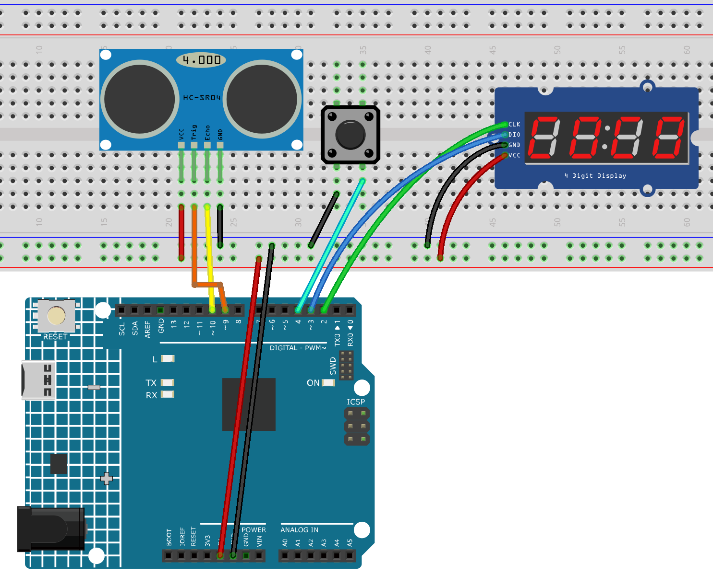

.. _height_measure:

Height Measurement
==============================================================

.. note::
  
  🌟 Welcome to the SunFounder Facebook Community! Whether you're into Raspberry Pi, Arduino, or ESP32, you'll find inspiration, help ideas here.
   
  - ✅ Be the first to get free learning resources. 
   
  - ✅ Stay updated on new products & exclusive giveaways. 
   
  - ✅ Share your creations and get real feedback.
   
  * 👉 Need faster updates or support? Click [|link_sf_facebook|] join our Facebook community 

  * 👉 Or join our WhatsApp group: Click [|link_sf_whatsapp|]
   
  * 🎁 Looking for parts?Check out our all-in-one kits below — packed with components, beginner-friendly guides, and tons of fun.
  
  .. list-table::
    :widths: 20 20 20
    :header-rows: 1

    *   - Name	
        - Includes Arduino board
        - PURCHASE LINK
    *   - Elite Explorer Kit	
        - Arduino Uno R4 WiFi
        - |link_elite_buy|
    *   - Ultimate Sensor Kit
        - Arduino Uno R4 Minima
        - |link_ultimate_sensor_buy|

Course Introduction
------------------------

This project uses an ultrasonic sensor, an Arduino, and a TM1637 7‑segment display to measure object height.

A button triggers the measurement, calculating height based on the fixed sensor position. The result is shown on the 7‑segment display with 0.1 cm accuracy, and detailed distance and height data are also sent to the serial monitor.

.. raw:: html
 
  <iframe width="700" height="394" src="https://www.youtube.com/embed/L-xUak574wg?si=lzJmPgbUg_iJcMcl" title="YouTube video player" frameborder="0" allow="accelerometer; autoplay; clipboard-write; encrypted-media; gyroscope; picture-in-picture; web-share" referrerpolicy="strict-origin-when-cross-origin" allowfullscreen></iframe>

.. note::

  If this is your first time working with an Arduino project, we recommend downloading and reviewing the basic materials first.
  
  * :ref:`install_arduino`
  * :ref:`introduce_arduino`

**Required Components**

In this project, we need the following components:

.. list-table::
    :widths: 5 20 5 20
    :header-rows: 1

    *   - SN
        - COMPONENT INTRODUCTION	
        - QUANTITY
        - PURCHASE LINK

    *   - 1
        - Arduino UNO R4 Minima
        - 1
        - |link_unor4_buy|
    *   - 2
        - USB Type-C cable
        - 1
        - 
    *   - 3
        - Breadboard
        - 1
        - |link_breadboard_buy|
    *   - 4
        - Wires
        - Several
        - |link_wires_buy|
    *   - 5
        - Ultrasonic Sensor Module
        - 1
        - |link_ultrasonic_buy|
    *   - 6
        - Button
        - 1
        - |link_button_buy|
    *   - 7
        - 4-Digit Segment Display Module
        - 1
        - |link_4segment_buy|

**Wiring**

**Common Connections:**

* **4-Digit Segment Display Module**

  - **CLK:** Connect to **3** on the Arduino.
  - **DIO:** Connect to **2** on the Arduino.
  - **GND:** Connect to breadboard’s negative power bus.
  - **VCC:** Connect to breadboard’s red power bus.

* **Button**

  - Connect to breadboard’s negative power bus.
  - Connect to **4** on the Arduino.

* **Ultrasonic Sensor Module**

  - **Trig:** Connect to **9** on the Arduino.
  - **Echo:** Connect to **10** on the Arduino.
  - **GND:** Connect to breadboard’s negative power bus.
  - **VCC:** Connect to breadboard’s red power bus.

**Writing the Code**

.. note::

    * You can copy this code into **Arduino IDE**. 
    * To install the library, use the Arduino Library Manager and search for **TM1637Display** and install it.
    * Don't forget to select the board(Arduino UNO R4 Minima/WIFI) and the correct port before clicking the **Upload** button.

.. code-block:: arduino

      #include <TM1637Display.h>

      #define TRIG_PIN 9
      #define ECHO_PIN 10
      #define CLK 2
      #define DIO 3
      #define BUTTON_PIN 4

      TM1637Display display(CLK, DIO);

      const int sensorHeight = 15;  // Fixed sensor height (cm)
      bool buttonState = HIGH;      // Current button state
      bool lastButtonState = HIGH;  // Previous button state
      unsigned long debounceDelay = 50; // Debounce time
      unsigned long lastDebounceTime = 0;

      void setup() {
        Serial.begin(9600);
        pinMode(TRIG_PIN, OUTPUT);
        pinMode(ECHO_PIN, INPUT);
        pinMode(BUTTON_PIN, INPUT_PULLUP);  // Button with pull-up input
        display.setBrightness(0x0f);
        display.showNumberDec(0, true);     // Initial display 0000
      }

      void loop() {
        int reading = digitalRead(BUTTON_PIN);

        // Button state change detection (debounce)
        if (reading != lastButtonState) {
          lastDebounceTime = millis();
        }

        if ((millis() - lastDebounceTime) > debounceDelay) {
          if (reading != buttonState) {
            buttonState = reading;
            // Button press detected
            if (buttonState == LOW) {
              measureHeight();
            }
          }
        }

        lastButtonState = reading;
      }

      void measureHeight() {
        // Trigger ultrasonic pulse
        digitalWrite(TRIG_PIN, LOW);
        delayMicroseconds(2);
        digitalWrite(TRIG_PIN, HIGH);
        delayMicroseconds(10);
        digitalWrite(TRIG_PIN, LOW);

        // Receive echo
        long duration = pulseIn(ECHO_PIN, HIGH);
        float distance = duration * 0.0343 / 2.0;
        float height = sensorHeight - distance;
        if (height < 0) height = 0;

        Serial.print("Distance: ");
        Serial.print(distance);
        Serial.print(" cm, Height: ");
        Serial.print(height);
        Serial.println(" cm");

        // Display on 7-segment display (accuracy 0.1cm)
        int displayHeight = (int)(height * 10);  // 12.3cm -> 123
        display.showNumberDecEx(displayHeight, 0b01000000, false); // Show with decimal point
      }
