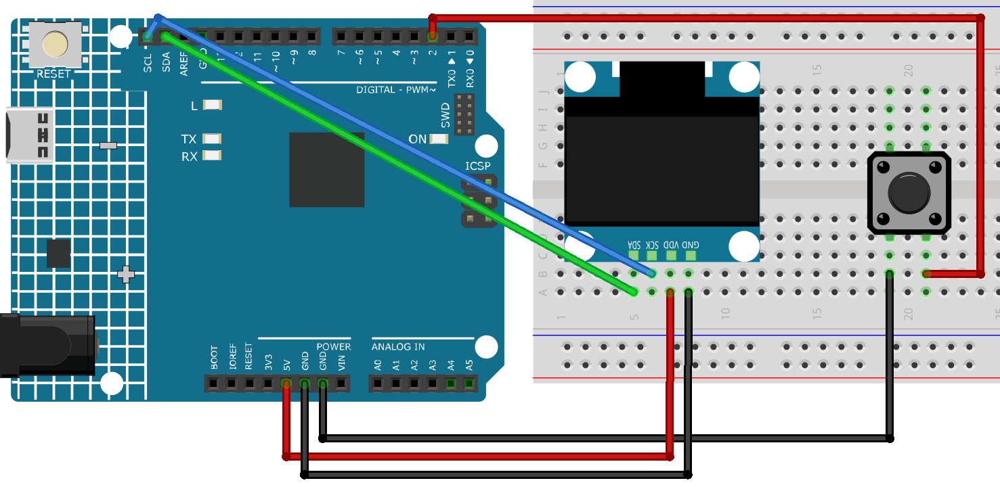

.. _lamb_run:

Lamb Run
==============================================================

.. note::
  
  🌟 Welcome to the SunFounder Facebook Community! Whether you're into Raspberry Pi, Arduino, or ESP32, you'll find inspiration, help ideas here.
   
  - ✅ Be the first to get free learning resources. 
   
  - ✅ Stay updated on new products & exclusive giveaways. 
   
  - ✅ Share your creations and get real feedback.
   
  * 👉 Need faster updates or support? Click [|link_sf_facebook|] join our Facebook community 

  * 👉 Or join our WhatsApp group: Click [|link_sf_whatsapp|]
   
  * 🎁 Looking for parts?Check out our all-in-one kits below — packed with components, beginner-friendly guides, and tons of fun.
  
  .. list-table::
    :widths: 20 20 20
    :header-rows: 1

    *   - Name	
        - Includes Arduino board
        - PURCHASE LINK
    *   - Elite Explorer Kit	
        - Arduino Uno R4 WiFi
        - |link_elite_buy|
    *   - Ultimate Sensor Kit	
        - Arduino Uno R4 Minima
        - |link_arduinor4_buy|
    *   - Universal Maker Sensor Kit
        - ×
        - |link_umsk_buy|

Course Introduction
------------------------

In this lesson, you’ll learn how to use a OLED Display Module, a button with the Arduino R4 UNO to create a Lamb Run Game. We’ll cover using the Adafruit SSD1306 and GFX libraries to display on the screen.

The OLED Screen will display the game screen, and players can use button to control the game.

.. raw:: html

  <iframe width="700" height="394" src="https://www.youtube.com/embed/KkPsawETYfg?si=4nMpy4ZNZjKVSooc" title="YouTube video player" frameborder="0" allow="accelerometer; autoplay; clipboard-write; encrypted-media; gyroscope; picture-in-picture; web-share" referrerpolicy="strict-origin-when-cross-origin" allowfullscreen></iframe>

.. note::

  If this is your first time working with an Arduino project, we recommend downloading and reviewing the basic materials first.

  * :ref:`install_arduino`
  * :ref:`introduce_arduino`

**Required Components**

In this project, we need the following components:

.. list-table::
    :widths: 5 20 5 20
    :header-rows: 1

    *   - SN
        - COMPONENT INTRODUCTION	
        - QUANTITY
        - PURCHASE LINK

    *   - 1
        - Arduino UNO R4 Minima
        - 1
        - |link_unor4_buy|
    *   - 2
        - USB Type-C cable
        - 1
        - 
    *   - 3
        - Breadboard
        - 1
        - |link_breadboard_buy|
    *   - 4
        - Wires
        - Several
        - |link_wires_buy|
    *   - 5
        - Button
        - 1
        - |link_button_buy|
    *   - 6
        - OLED Display Module
        - 1
        - |link_oled_buy|

**Wiring**

**Common Connections:**

* **OLED Display Module**

  - **SDA:** Connect to **SDA** on the Arduino.
  - **SCK:** Connect to **SCL** on the Arduino.
  - **GND:** Connect to breadboard’s negative power bus.
  - **VCC:** Connect to breadboard’s red power bus.

**Writing the Code**

.. note::

    * You can copy this code into **Arduino IDE**. 
    * To install the library, use the Arduino Library Manager and search for **Adafruit SSD1306** and **Adafruit GFX** and install it.
    * Don't forget to select the board(Arduino UNO R4 Minima) and the correct port before clicking the **Upload** button.

.. code-block:: arduino

      #include <SPI.h>
      #include <Wire.h>
      #include <Adafruit_GFX.h>
      #include <Adafruit_SSD1306.h>

      // Pin definitions
      #define BUTTON_PIN    2    // Button for jump and restart
      #define OLED_RESET    4    // OLED reset pin

      // OLED display parameters
      const uint8_t SCREEN_WIDTH  = 128;
      const uint8_t SCREEN_HEIGHT = 64;
      Adafruit_SSD1306 display(SCREEN_WIDTH, SCREEN_HEIGHT, &Wire, OLED_RESET);

      // Game frame timing and ground position
      const unsigned long FRAME_RATE = 30; // Time per frame in milliseconds
      const int GROUND_Y = 54;            // Y coordinate of the ground line

      // Sheep character parameters
      const int SHEEP_X       = 20;   // Fixed X position of the sheep
      const int SHEEP_W       = 18;   // Width of the sheep sprite
      const int SHEEP_H       = 16;   // Height of the sheep sprite
      const int JUMP_VELOCITY = -12;  // Initial jump speed (upward)
      const int GRAVITY       = 2;    // Gravity acceleration (downward)

      int sheepY;       // Current vertical position of the sheep
      int sheepVY;      // Current vertical velocity of the sheep
      bool isJumping;   // Is the sheep currently jumping?
      int hangCounter;  // Frames to pause at the top of the jump

      // Player health (number of hearts)
      int lifePoints;   // 3 hearts total

      // Distance traveled used as the score
      int distanceTraveled;

      // Obstacle parameters
      const int MAX_OBSTACLES      = 4;
      const unsigned long SPAWN_INTERVAL = 1500; // Time between spawns (ms)
      const int ROCK_W             = 12;
      const int ROCK_H             = 12;
      const int ROCK_SPEED         = 2;
      const int WOLF_W             = 21;
      const int WOLF_H             = 16;
      const int WOLF_SPEED         = 3;

      struct Obstacle {
        bool active;   // Is this obstacle active on screen?
        int  x, y;     // Position of the obstacle
        bool isWolf;   // True if this obstacle is a wolf, false if rock
      } obstacles[MAX_OBSTACLES];

      unsigned long lastFrameTime;  // Timestamp of last frame update
      unsigned long lastSpawnTime;  // Timestamp of last obstacle spawn
      bool gameOver;               // Has the game ended?

      void setup() {
        pinMode(BUTTON_PIN, INPUT_PULLUP);
        display.begin(SSD1306_SWITCHCAPVCC, 0x3C);
        display.clearDisplay();
        display.display();
        randomSeed(analogRead(A0));
        resetGame();
      }

      void loop() {
        // Wait for next frame
        if (millis() - lastFrameTime < FRAME_RATE) return;
        lastFrameTime = millis();

        // Restart game when button pressed after game over
        if (gameOver && digitalRead(BUTTON_PIN) == LOW) {
          resetGame();
        }

        // Update game state if not over
        if (!gameOver) {
          updateSheep();
          spawnObstacles();
          updateObstacles();
          checkCollisions();
          distanceTraveled++;
        }

        // Draw everything to the screen
        drawScreen();
      }

      void resetGame() {
        // Reset sheep position and state
        sheepY           = GROUND_Y - SHEEP_H;
        sheepVY          = 0;
        isJumping        = false;
        hangCounter      = 0;

        // Reset health and score
        lifePoints       = 3;
        distanceTraveled = 0;
        gameOver         = false;

        // Clear obstacles
        lastSpawnTime = millis();
        for (int i = 0; i < MAX_OBSTACLES; i++) {
          obstacles[i].active = false;
        }
      }

      void updateSheep() {
        // Start jump on button press
        if (!isJumping && digitalRead(BUTTON_PIN) == LOW) {
          isJumping   = true;
          sheepVY     = JUMP_VELOCITY;
          hangCounter = FRAME_RATE * 0.3; // Pause ~0.3 secs at apex
        }

        if (isJumping) {
          // Apply vertical movement and gravity
          sheepY += sheepVY;
          sheepVY += GRAVITY;

          // Pause at jump apex when starting to fall
          if (sheepVY > 0 && hangCounter > 0) {
            sheepVY = 0;
            hangCounter--;
          }

          // Check landing
          if (sheepY >= GROUND_Y - SHEEP_H) {
            sheepY      = GROUND_Y - SHEEP_H;
            sheepVY     = 0;
            isJumping   = false;
            hangCounter = 0;
          }
        }
      }

      void spawnObstacles() {
        // Spawn new obstacle after a delay
        if (millis() - lastSpawnTime < SPAWN_INTERVAL) return;
        lastSpawnTime = millis();

        for (int i = 0; i < MAX_OBSTACLES; i++) {
          if (!obstacles[i].active) {
            obstacles[i].active = true;
            obstacles[i].x      = SCREEN_WIDTH;
            obstacles[i].isWolf = (random(100) < 30);
            obstacles[i].y      = GROUND_Y - (obstacles[i].isWolf ? WOLF_H : ROCK_H);
            break;
          }
        }
      }

      void updateObstacles() {
        // Move obstacles left and deactivate off-screen ones
        for (int i = 0; i < MAX_OBSTACLES; i++) {
          if (!obstacles[i].active) continue;
          int speed = obstacles[i].isWolf ? WOLF_SPEED : ROCK_SPEED;
          obstacles[i].x -= speed;
          int w = obstacles[i].isWolf ? WOLF_W : ROCK_W;
          if (obstacles[i].x + w < 0) {
            obstacles[i].active = false;
          }
        }
      }

      void checkCollisions() {
        // Simple bounding-box collision detection
        for (int i = 0; i < MAX_OBSTACLES; i++) {
          if (!obstacles[i].active) continue;
          int ox = obstacles[i].x;
          int oy = obstacles[i].y;
          int ow = obstacles[i].isWolf ? WOLF_W : ROCK_W;
          int oh = obstacles[i].isWolf ? WOLF_H : ROCK_H;

          bool hitX = (SHEEP_X + SHEEP_W > ox) && (SHEEP_X < ox + ow);
          bool hitY = (sheepY + SHEEP_H > oy);
          if (hitX && hitY) {
            obstacles[i].active = false;
            lifePoints--;
            if (lifePoints <= 0) gameOver = true;
          }
        }
      }

      void drawScreen() {
        display.clearDisplay();
        display.drawLine(0, GROUND_Y, SCREEN_WIDTH, GROUND_Y, WHITE);

        // Draw sheep
        display.fillRect(SHEEP_X, sheepY + 4, 13, 8, WHITE);
        display.fillRect(SHEEP_X+11, sheepY+2, 5, 5, WHITE);
        display.drawTriangle(SHEEP_X-3, sheepY+10,
                            SHEEP_X,   sheepY+8,
                            SHEEP_X,   sheepY+13,
                            WHITE);
        display.fillRect(SHEEP_X+3, sheepY+13, 3, 5, WHITE);
        display.fillRect(SHEEP_X+8, sheepY+13, 3, 5, WHITE);

        // Draw hearts (health)
        for (int i = 0; i < lifePoints; i++) {
          int hx = SCREEN_WIDTH - 10 - i*10;
          display.fillCircle(hx+2, 4, 2, WHITE);
          display.fillCircle(hx+5, 4, 2, WHITE);
          display.fillTriangle(hx+1,6, hx+8,6, hx+4,10, WHITE);
        }

        // Draw obstacles and flipped wolves
        for (int i = 0; i < MAX_OBSTACLES; i++) {
          if (!obstacles[i].active) continue;
          int ox = obstacles[i].x;
          int oy = obstacles[i].y;
          if (obstacles[i].isWolf) {
            // Wolf head left, body right
            display.fillRect(ox, oy+3,   7, 5, WHITE);
            display.fillRect(ox+7, oy+5, 14, 8, WHITE);
            display.fillTriangle(ox+1,oy+3, ox,oy+1, ox+3,oy+2, WHITE);
            display.fillTriangle(ox+5,oy+3, ox+7,oy+1, ox+6,oy+2, WHITE);
            display.fillTriangle(ox+21,oy+8, ox+29,oy+5, ox+21,oy+10, WHITE);
          } else {
            // Rock made of three circles
            display.fillCircle(ox+4, oy+9, 3, WHITE);
            display.fillCircle(ox+8, oy+7, 4, WHITE);
            display.fillCircle(ox+12,oy+9, 3, WHITE);
          }
        }

        // Display game over and score in center
        if (gameOver) {
          display.setTextSize(1);
          display.setTextColor(WHITE);
          const char* msg = "GAME OVER";
          int16_t tw = strlen(msg)*6;
          display.setCursor((SCREEN_WIDTH - tw)/2, (SCREEN_HEIGHT - 8)/2 - 10);
          display.print(msg);

          char buf[16];
          snprintf(buf, sizeof(buf), "SCORE: %d", distanceTraveled);
          int16_t tw2 = strlen(buf)*6;
          display.setCursor((SCREEN_WIDTH - tw2)/2, (SCREEN_HEIGHT - 8)/2 + 2);
          display.print(buf);
        }

        display.display();
      }
