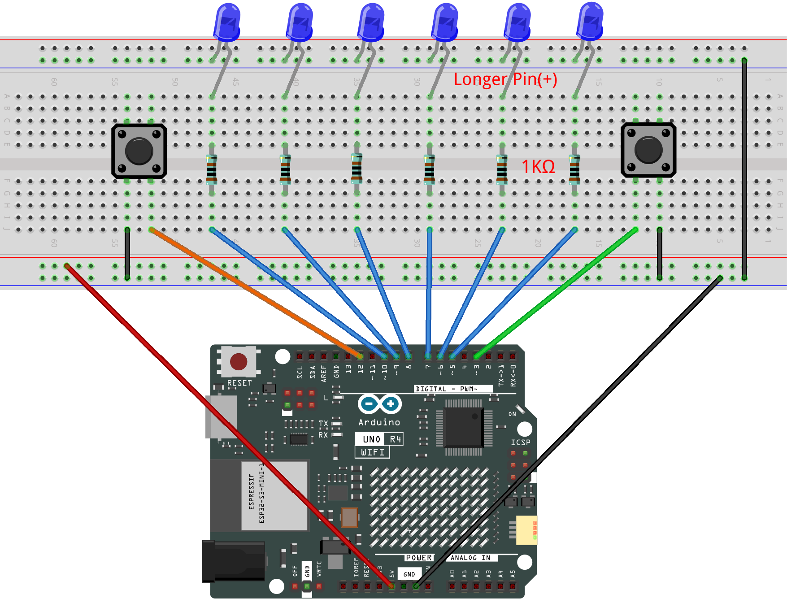

.. _led_control1.0:

LED control 1.0
==============================================================

.. note::
  
  🌟 Welcome to the SunFounder Facebook Community! Whether you're into Raspberry Pi, Arduino, or ESP32, you'll find inspiration, help ideas here.
   
  - ✅ Be the first to get free learning resources. 
   
  - ✅ Stay updated on new products & exclusive giveaways. 
   
  - ✅ Share your creations and get real feedback.
   
  * 👉 Need faster updates or support? Click [|link_sf_facebook|] join our Facebook community 

  * 👉 Or join our WhatsApp group: Click [|link_sf_whatsapp|]
   
  * 🎁 Looking for parts?Check out our all-in-one kits below — packed with components, beginner-friendly guides, and tons of fun.
  
  .. list-table::
    :widths: 20 20 20
    :header-rows: 1

    *   - Name	
        - Includes Arduino board
        - PURCHASE LINK
    *   - Electronic Kit	
        - ×
        - |link_electronic_buy|
    *   - Elite Explorer Kit	
        - Arduino Uno R4 WiFi
        - |link_elite_buy|
    *   - 3 in 1 Ultimate Starter Kit	
        - Arduino Uno R4 Minima
        - |link_arduinor4_buy|

Course Introduction
------------------------

In this lesson, you will use Arduino together with two buttons and a row of LEDs to create a directional light-flow effect.

Pressing the green button makes the LEDs light up in a forward flowing pattern, while pressing the red button triggers a backward flow. 

Each button controls the direction of the LED animation, allowing you to switch between the two lighting modes at any time.

.. raw:: html

 <iframe width="700" height="394" src="https://www.youtube.com/embed/s4v0oj7J0Jg?si=MLBRo7iijkCocl53" title="YouTube video player" frameborder="0" allow="accelerometer; autoplay; clipboard-write; encrypted-media; gyroscope; picture-in-picture; web-share" referrerpolicy="strict-origin-when-cross-origin" allowfullscreen></iframe>

.. note::

  If this is your first time working with an Arduino project, we recommend downloading and reviewing the basic materials first.
  
  * :ref:`install_arduino`
  * :ref:`introduce_arduino`

**Required Components**

In this project, we need the following components:

.. list-table::
    :widths: 5 20 5 20
    :header-rows: 1

    *   - SN
        - COMPONENT INTRODUCTION	
        - QUANTITY
        - PURCHASE LINK

    *   - 1
        - Arduino UNO R4 Minima
        - 1
        - |link_unor4_buy|
    *   - 2
        - USB Type-C cable
        - 1
        - 
    *   - 3
        - Breadboard
        - 1
        - |link_breadboard_buy|
    *   - 4
        - Wires
        - Several
        - |link_wires_buy|
    *   - 5
        - 1kΩ resistor
        - Several
        - |link_resistor_buy|
    *   - 6
        - Button
        - 2
        - |link_button_buy|
    *   - 7
        - LED
        - Several
        - |link_led_buy|

**Wiring**

**Common Connections:**

* **LED**

  - Connect the LEDs **cathode** to  the negative power bus on the breadboard, and the LEDs **anode** to **1kΩ resistor** then to **5** to **10** on the Arduino.

* **Button**

  - Connect to breadboard’s negative power bus.
  - Connect to **3** , **12** on the Arduino.

**Writing the Code**

.. note::

    * You can copy this code into **Arduino IDE**. 
    * Don't forget to select the board(Arduino UNO R4 Minima) and the correct port before clicking the **Upload** button.

.. code-block:: arduino

    // Pins for buttons
    const int buttonGreen = 3;   // Green button = forward
    const int buttonRed   = 12;  // Red button = backward

    // LED pins from 5 to 10
    const int ledPins[] = {5, 6, 7, 8, 9, 10};
    const int ledCount = 6;

    int delayTime = 80;   // Speed of flowing

    void setup() {
      // LEDs as output
      for (int i = 0; i < ledCount; i++) {
        pinMode(ledPins[i], OUTPUT);
      }

      // Buttons use internal pull-up
      pinMode(buttonGreen, INPUT_PULLUP);
      pinMode(buttonRed, INPUT_PULLUP);
    }

    void loop() {

      // Read buttons (LOW = pressed)
      bool greenPressed = (digitalRead(buttonGreen) == LOW);
      bool redPressed   = (digitalRead(buttonRed) == LOW);

      // ----- Forward Flow: 5 → 10 -----
      if (greenPressed) {
        for (int i = 0; i < ledCount; i++) {
          digitalWrite(ledPins[i], HIGH);   // Light current LED
          delay(delayTime);

          if (i > 0) {
            digitalWrite(ledPins[i - 1], LOW); // Turn off previous LED
          }
        }
        digitalWrite(ledPins[ledCount - 1], LOW); // Turn off last LED
      }

      // ----- Backward Flow: 10 → 5 -----
      if (redPressed) {
        for (int i = ledCount - 1; i >= 0; i--) {
          digitalWrite(ledPins[i], HIGH);   // Light current LED
          delay(delayTime);

          if (i < ledCount - 1) {
            digitalWrite(ledPins[i + 1], LOW); // Turn off previous LED
          }
        }
        digitalWrite(ledPins[0], LOW); // Turn off last LED
      }
    }
