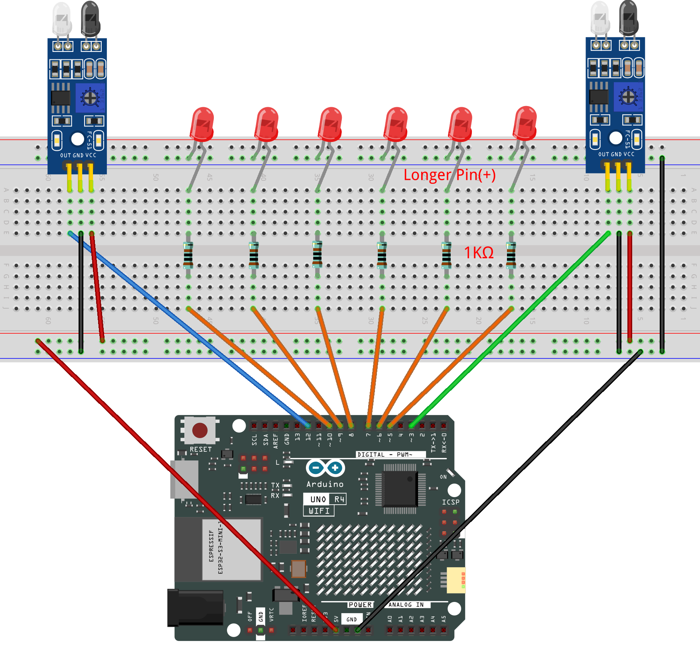

.. _led_control2.0:

LED control 2.0
==============================================================

.. note::
  
  🌟 Welcome to the SunFounder Facebook Community! Whether you're into Raspberry Pi, Arduino, or ESP32, you'll find inspiration, help ideas here.
   
  - ✅ Be the first to get free learning resources. 
   
  - ✅ Stay updated on new products & exclusive giveaways. 
   
  - ✅ Share your creations and get real feedback.
   
  * 👉 Need faster updates or support? Click [|link_sf_facebook|] join our Facebook community 

  * 👉 Or join our WhatsApp group: Click [|link_sf_whatsapp|]
   
  * 🎁 Looking for parts?Check out our all-in-one kits below — packed with components, beginner-friendly guides, and tons of fun.
  
  .. list-table::
    :widths: 20 20 20
    :header-rows: 1

    *   - Name	
        - Includes Arduino board
        - PURCHASE LINK
    *   - Electronic Kit	
        - ×
        - |link_electronic_buy|
    *   - Elite Explorer Kit	
        - Arduino Uno R4 WiFi
        - |link_elite_buy|
    *   - 3 in 1 Ultimate Starter Kit	
        - Arduino Uno R4 Minima
        - |link_arduinor4_buy|

Course Introduction
------------------------

In this lesson, you will use Arduino together with two IR obstacle sensors and a row of LEDs to create an automatic directional light-flow effect.

When the left sensor detects an object, the LEDs light up in a forward flowing pattern. When the right sensor is triggered, the LEDs flow in the opposite direction.

Each sensor controls one direction of the animation, allowing the LEDs to respond dynamically based on which side an obstacle is detected.

.. raw:: html

  <iframe width="700" height="394" src="https://www.youtube.com/embed/c8yfP9T3jB4?si=6c1veswFYB8SczuB" title="YouTube video player" frameborder="0" allow="accelerometer; autoplay; clipboard-write; encrypted-media; gyroscope; picture-in-picture; web-share" referrerpolicy="strict-origin-when-cross-origin" allowfullscreen></iframe>

.. note::

  If this is your first time working with an Arduino project, we recommend downloading and reviewing the basic materials first.
  
  * :ref:`install_arduino`
  * :ref:`introduce_arduino`

**Required Components**

In this project, we need the following components:

.. list-table::
    :widths: 5 20 5 20
    :header-rows: 1

    *   - SN
        - COMPONENT INTRODUCTION	
        - QUANTITY
        - PURCHASE LINK

    *   - 1
        - Arduino UNO R4 Minima
        - 1
        - |link_unor4_wifi_buy|
    *   - 2
        - USB Type-C cable
        - 1
        - 
    *   - 3
        - Breadboard
        - 1
        - |link_breadboard_buy|
    *   - 4
        - Wires
        - Several
        - |link_wires_buy|
    *   - 5
        - 1kΩ resistor
        - Several
        - |link_resistor_buy|
    *   - 6
        - IR Obstacle Avoidance Sensor Module
        - 2
        - |link_IR_module_buy|
    *   - 7
        - LED
        - Several
        - |link_led_buy|

**Wiring**

**Common Connections:**

* **LED**

  - Connect the LEDs **cathode** to  the negative power bus on the breadboard, and the LEDs **anode** to **1kΩ resistor** then to **5** to **10** on the Arduino.

* **IR Obstacle Avoidance Sensor Module 1**

  - **OUT:** Connect to **3** on the Arduino.
  - **GND:** Connect to breadboard’s negative power bus.
  - **VCC:** Connect to breadboard’s red power bus.

* **IR Obstacle Avoidance Sensor Module 2**

  - **OUT:** Connect to **12** on the Arduino.
  - **GND:** Connect to breadboard’s negative power bus.
  - **VCC:** Connect to breadboard’s red power bus.

**Writing the Code**

.. note::

    * You can copy this code into **Arduino IDE**. 
    * Don't forget to select the board(Arduino UNO R4 Minima) and the correct port before clicking the **Upload** button.

.. code-block:: arduino

      // Obstacle sensors
      // These sensors output LOW when an object is detected
      const int sensorLeft  = 3;     // Triggers forward flow
      const int sensorRight = 12;    // Triggers backward flow

      // LED pins in order from left to right
      const int ledPins[] = {5, 6, 7, 8, 9, 10};
      const int ledCount = 6;

      // Time between LED steps
      int delayTime = 80;

      void setup() {

        // Set all LEDs as outputs
        for (int i = 0; i < ledCount; i++) {
          pinMode(ledPins[i], OUTPUT);
        }

        // Sensors are digital inputs
        pinMode(sensorLeft, INPUT);
        pinMode(sensorRight, INPUT);
      }

      void loop() {

        // Read sensors (LOW means obstacle found)
        bool leftDetected  = (digitalRead(sensorLeft) == LOW);
        bool rightDetected = (digitalRead(sensorRight) == LOW);

        // Forward flow: LEDs move from pin 5 → 10
        if (leftDetected) {
          for (int i = 0; i < ledCount; i++) {
            digitalWrite(ledPins[i], HIGH);   // Light current LED
            delay(delayTime);

            if (i > 0) {
              digitalWrite(ledPins[i - 1], LOW); // Turn off previous LED
            }
          }
          digitalWrite(ledPins[ledCount - 1], LOW); // Clear last LED
        }

        // Backward flow: LEDs move from pin 10 → 5
        if (rightDetected) {
          for (int i = ledCount - 1; i >= 0; i--) {
            digitalWrite(ledPins[i], HIGH);   // Light current LED
            delay(delayTime);

            if (i < ledCount - 1) {
              digitalWrite(ledPins[i + 1], LOW); // Turn off previous LED
            }
          }
          digitalWrite(ledPins[0], LOW); // Clear last LED
        }
      }
