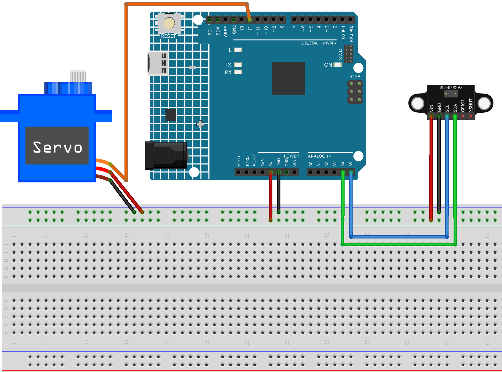

.. _lidar_guard:

Lidar Guard
==============================================================

.. note::
  
  🌟 Welcome to the SunFounder Facebook Community! Whether you're into Raspberry Pi, Arduino, or ESP32, you'll find inspiration, help ideas here.
   
  - ✅ Be the first to get free learning resources. 
   
  - ✅ Stay updated on new products & exclusive giveaways. 
   
  - ✅ Share your creations and get real feedback.
   
  * 👉 Need faster updates or support? Click [|link_sf_facebook|] join our Facebook community 

  * 👉 Or join our WhatsApp group: Click [|link_sf_whatsapp|]
   
Kit purchase
------------------------

Looking for parts? Check out our all-in-one kits below — packed with components, beginner-friendly guides, and tons of fun.

.. image:: img/ultimate_sensor_kit.png
   :width: 100%
   :align: center
   :target: https://www.sunfounder.com/collections/arduino-kits-bundles/products/sunfounder-ultimate-sensor-kit-with-original-arduino-uno-r4-minima?ref=jbzmncle

.. raw:: html

     

.. list-table::
   :widths: 20 20 20
   :header-rows: 1

   * - Name
     - Includes Arduino board
     - PURCHASE LINK
   * - Elite Explorer Kit
     - Arduino Uno R4 WiFi
     - |link_elite_buy|
   * - 3 in 1 Ultimate Starter Kit
     - Arduino Uno R4 Minima
     - |link_arduinor4_buy|

Course Introduction
------------------------

In this lesson, we will learn how to use the VL53L0X distance sensor, a digital servo motor, and the Arduino Board to build a simple Lidar system.

The servo rotates the sensor to scan the area. Distance data and angles are sent via the serial port for monitoring. 

This setup provides accurate obstacle detection using laser-based sensing.

.. raw:: html
 
  <iframe width="700" height="394" src="https://www.youtube.com/embed/qlKY4ye4YUE" title="YouTube video player" frameborder="0" allow="accelerometer; autoplay; clipboard-write; encrypted-media; gyroscope; picture-in-picture; web-share" referrerpolicy="strict-origin-when-cross-origin" allowfullscreen></iframe>

.. note::

  If this is your first time working with an Arduino project, we recommend downloading and reviewing the basic materials first.
  
  * :ref:`install_arduino`
  * :ref:`introduce_arduino`

**Required Components**

In this project, we need the following components:

.. list-table::
    :widths: 5 20 5 20
    :header-rows: 1

    *   - SN
        - COMPONENT INTRODUCTION	
        - QUANTITY
        - PURCHASE LINK

    *   - 1
        - Arduino UNO R4 Minima
        - 1
        - |link_unor4_buy|
    *   - 2
        - USB Type-C cable
        - 1
        - 
    *   - 3
        - Breadboard
        - 1
        - |link_breadboard_buy|
    *   - 4
        - Wires
        - Several
        - |link_wires_buy|
    *   - 5
        - Laser Ranging Module
        - 1
        - |link_laser_module_buy|
    *   - 6
        - Digital Servo Motor
        - 1
        - |link_motor_buy|

**Wiring**

**Common Connections:**

* **Digital Servo Motor**

  - Connect to breadboard’s positive power bus.
  - Connect to breadboard’s negative power bus.
  - Connect to **12** on the Arduino.

* **Laser Ranging Module**

  - **SDA:** Connect to **A4** on the Arduino.
  - **SCL:** Connect to **A5** on the Arduino.
  - **GND:** Connect to breadboard’s negative power bus.
  - **VCC:** Connect to breadboard’s red power bus.

**Writing the Code**

.. note::

 * Build the circuit.

 * Install the library, use the Arduino Library Manager and search for **Adafruit_VL53L0X** install it.

 * Upload the code to the Arduino board using Arduino IDE.

 * In the Arduino IDE, check the current Arduino port(COMx).

 * The ``ArduinoLidarGUI`` is used here. You can click here :download:`ArduinoSonarGUI.zip </_static/ArduinoLidarGUI.zip>` to download it. 
 
 * Open ArduinoLidarGUI.pde in the |link_processing_ide| .

 * Modify the code in line 35 to ensure the correct port number(COMx).

 * Run the Processing sketch to visualize the Lidar data.

.. code-block:: arduino

      #include <Adafruit_VL53L0X.h>
      #include <Servo.h>

      // Initialize components
      Adafruit_VL53L0X lox = Adafruit_VL53L0X();
      Servo myServo;

      const int servoPin = 12;
      const int minAngle = 5;
      const int maxAngle = 175;
      int currentAngle = minAngle;
      int step = 1;         // Angle increment for each movement
      int direction = 1;    // 1 for increasing angle, -1 for decreasing

      void setup() {
        Serial.begin(9600);
        myServo.attach(servoPin);

        while (!Serial) {
          delay(1);
        }

        if (!lox.begin()) {
          Serial.println(F("Failed to boot VL53L0X"));
          while (1);
        }
      }

      void loop() {
        // Set servo angle
        myServo.write(currentAngle);

        // Read distance
        int distance = getDistance();

        // Print data to serial port
        Serial.print(currentAngle);
        Serial.print(",");
        Serial.print(distance);
        Serial.print(".");

        // Update angle
        currentAngle += step * direction;

        // Reverse direction at limits
        if (currentAngle >= maxAngle || currentAngle <= minAngle) {
          direction = -direction;
        }

        // Small delay to control scanning speed and smoothness
        delay(15);  // Adjust as needed: smaller = faster, but may cause jerkiness
      }

      // Function to read distance from VL53L0X
      int getDistance() {
        VL53L0X_RangingMeasurementData_t measure;
        lox.rangingTest(&measure, false);

        if (measure.RangeStatus != 4) {
          return measure.RangeMilliMeter / 10;  // Convert mm to cm
        } else {
          return 0;  // Out of range
        }
      }
