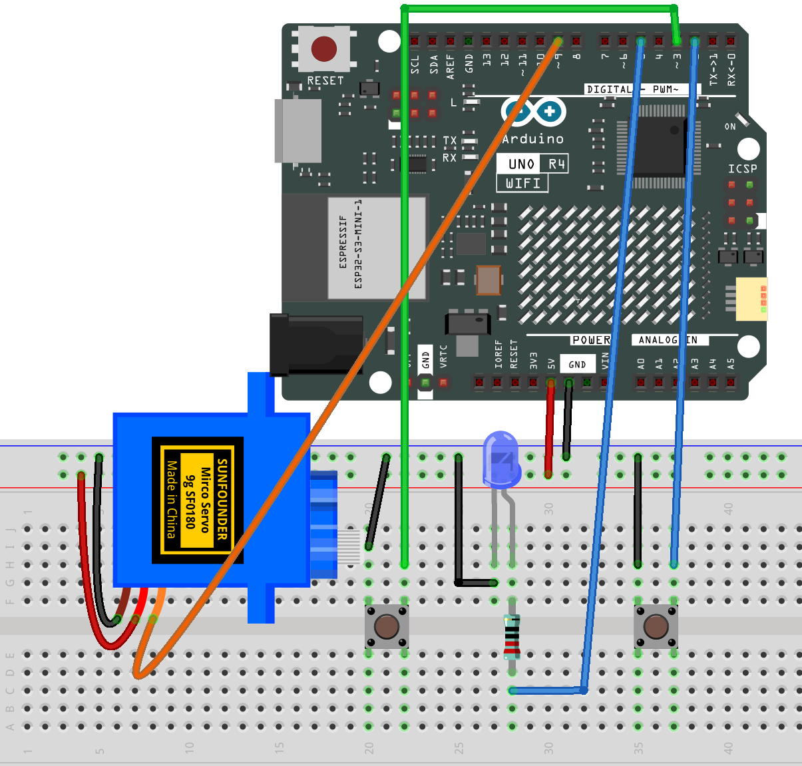

.. _light_off:

Lights Off
==============================================================

.. note::
  
  🌟 Welcome to the SunFounder Facebook Community! Whether you're into Raspberry Pi, Arduino, or ESP32, you'll find inspiration, help ideas here.
   
  - ✅ Be the first to get free learning resources. 
   
  - ✅ Stay updated on new products & exclusive giveaways. 
   
  - ✅ Share your creations and get real feedback.
   
  * 👉 Need faster updates or support? Click [|link_sf_facebook|] join our Facebook community 

  * 👉 Or join our WhatsApp group: Click [|link_sf_whatsapp|]
   
Kit purchase
------------------------

Looking for parts? Check out our all-in-one kits below — packed with components, beginner-friendly guides, and tons of fun.

.. image:: img/elite_explore_kit.png
   :width: 100%
   :align: center
   :target: https://www.sunfounder.com/collections/arduino-kits-bundles/products/sunfounder-elite-explorer-kit-with-official-arduino-uno-r4-wifi?ref=jbzmncle

.. raw:: html

     

.. list-table::
   :widths: 20 20 20
   :header-rows: 1

   * - Name
     - Includes Arduino board
     - PURCHASE LINK
   * - Ultimate Sensor Kit
     - Arduino Uno R4 Minima
     - |link_ultimate_sensor_buy|
   * - Elite Explorer Kit
     - Arduino Uno R4 WiFi
     - |link_elite_buy|
   * - 3 in 1 Ultimate Starter Kit
     - Arduino Uno R4 Minima
     - |link_arduinor4_buy|
   * - Universal Maker Sensor Kit
     - ×
     - |link_umsk_buy|

Course Introduction
------------------------

In this lesson, you will learn how to use Arduino along with servo motor, buttons, LED, and resistor to create a light play game. 

Pressing the button to start.

.. raw:: html

  <iframe width="700" height="394" src="https://www.youtube.com/embed/e7HZK54J5ZA" title="YouTube video player" frameborder="0" allow="accelerometer; autoplay; clipboard-write; encrypted-media; gyroscope; picture-in-picture; web-share" referrerpolicy="strict-origin-when-cross-origin" allowfullscreen></iframe>

.. note::

  If this is your first time working with an Arduino project, we recommend downloading and reviewing the basic materials first.
  
  * :ref:`install_arduino`
  * :ref:`introduce_arduino`

**Required Components**

In this project, we need the following components:

.. list-table::
    :widths: 5 20 5 20
    :header-rows: 1

    *   - SN
        - COMPONENT INTRODUCTION	
        - QUANTITY
        - PURCHASE LINK

    *   - 1
        - Arduino UNO R4 Minima/Arduino UNO R4 WIFI
        - 1
        - |link_unor4_wifi_buy|
    *   - 2
        - USB Type-C cable
        - 1
        - 
    *   - 3
        - Breadboard
        - 1
        - |link_breadboard_buy|
    *   - 4
        - Wires
        - Several
        - |link_wires_buy|
    *   - 5
        - 220Ω resistor
        - 1
        - |link_resistor_buy|
    *   - 6
        - Button
        - 2
        - |link_button_buy|
    *   - 7
        - LED
        - 1
        - |link_led_buy|
    *   - 8
        - Digital Servo Motor
        - 1
        - |link_motor_buy|

**Wiring**

**Common Connections:**

* **LED**

  - Connect the LED **cathode** to the negative power bus on the breadboard, and the LED **anode** to a **1kΩ resistor** then to **5** on the Arduino.

* **Button-ON**

  - Connect to breadboard’s negative power bus.
  - Connect to **2** on the Arduino.

* **Button-OFF**

  - Connect to breadboard’s negative power bus.
  - Connect to **3** on the Arduino.

* **Digital Servo Motor**

  - Connect to breadboard’s positive power bus.
  - Connect to breadboard’s negative power bus.
  - Connect to **9** on the Arduino.

**Writing the Code**

.. note::

    * You can copy this code into **Arduino IDE**. 
    * Don't forget to select the board(Arduino UNO R4 WIFI/Minima) and the correct port before clicking the **Upload** button.

.. code-block:: arduino

      #include <Servo.h>

      // Pins
      const int BUTTON_ON_PIN = 2;
      const int BUTTON_OFF_PIN = 3;
      const int LED_PIN = 5;
      const int SERVO_PIN = 9;

      // Servo angles
      const int SERVO_HOME_ANGLE = 0;
      const int SERVO_PRESS_ANGLE = 30;

      // Timing
      const unsigned long WAIT_BEFORE_PRESS = 2000;
      const unsigned long SERVO_PRESS_TIME = 600;
      const unsigned long DEBOUNCE_DELAY = 200;

      Servo switchServo;

      bool lightOn = false;
      bool servoTriggered = false;

      bool lastButtonOnState = HIGH;
      bool lastButtonOffState = HIGH;

      unsigned long lightOnTime = 0;
      unsigned long lastButtonOnTime = 0;
      unsigned long lastButtonOffTime = 0;

      void setup() {
        pinMode(BUTTON_ON_PIN, INPUT_PULLUP);
        pinMode(BUTTON_OFF_PIN, INPUT_PULLUP);
        pinMode(LED_PIN, OUTPUT);

        switchServo.attach(SERVO_PIN);
        switchServo.write(SERVO_HOME_ANGLE);

        digitalWrite(LED_PIN, LOW);
      }

      void loop() {
        handleButtons();

        if (lightOn && !servoTriggered) {
          if (millis() - lightOnTime >= WAIT_BEFORE_PRESS) {
            pressOffButton();
            servoTriggered = true;
          }
        }
      }

      void handleButtons() {
        bool currentButtonOnState = digitalRead(BUTTON_ON_PIN);
        bool currentButtonOffState = digitalRead(BUTTON_OFF_PIN);
        unsigned long now = millis();

        if (lastButtonOnState == HIGH && currentButtonOnState == LOW) {
          if (now - lastButtonOnTime > DEBOUNCE_DELAY) {
            lightOn = true;
            servoTriggered = false;
            lightOnTime = now;
            digitalWrite(LED_PIN, HIGH);
            lastButtonOnTime = now;
          }
        }

        if (lastButtonOffState == HIGH && currentButtonOffState == LOW) {
          if (now - lastButtonOffTime > DEBOUNCE_DELAY) {
            lightOn = false;
            digitalWrite(LED_PIN, LOW);
            switchServo.write(SERVO_HOME_ANGLE);
            lastButtonOffTime = now;
          }
        }

        lastButtonOnState = currentButtonOnState;
        lastButtonOffState = currentButtonOffState;
      }

      void pressOffButton() {
        switchServo.write(SERVO_PRESS_ANGLE);
        delay(SERVO_PRESS_TIME);

        if (digitalRead(BUTTON_OFF_PIN) == LOW) {
          lightOn = false;
          digitalWrite(LED_PIN, LOW);
        }

        switchServo.write(SERVO_HOME_ANGLE);
      }