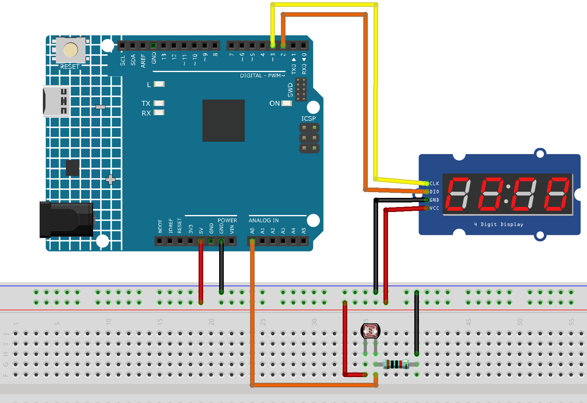

.. _light_sensing:

Light Sensing
==============================================================

.. note::
  
  🌟 Welcome to the SunFounder Facebook Community! Whether you're into Raspberry Pi, Arduino, or ESP32, you'll find inspiration, help ideas here.
   
  - ✅ Be the first to get free learning resources. 
   
  - ✅ Stay updated on new products & exclusive giveaways. 
   
  - ✅ Share your creations and get real feedback.
   
  * 👉 Need faster updates or support? Click [|link_sf_facebook|] join our Facebook community 

  * 👉 Or join our WhatsApp group: Click [|link_sf_whatsapp|]
   
  * 🎁 Looking for parts?Check out our all-in-one kits below — packed with components, beginner-friendly guides, and tons of fun.

  .. list-table::
    :widths: 20 20 20
    :header-rows: 1

    *   - Name	
        - Includes Arduino board
        - PURCHASE LINK
    *   - Ultimate Sensor Kit
        - Arduino Uno R4 Minima
        - |link_ultimate_sensor_buy|
    *   - Elite Explorer Kit
        - Arduino Uno R4 WiFi
        - |link_elite_buy|
    *   - 3 in 1 Ultimate Starter Kit
        - Arduino Uno R4 Minima
        - |link_arduinor4_buy|

Course Introduction
------------------------

In this lesson, you’ll build a light detection system using an Arduino UNO R4, an LDR, and a TM1637 display.

The display shows a 0–100 value that increases with light intensity, allowing real-time brightness monitoring.

.. raw:: html

  <iframe width="700" height="394" src="https://www.youtube.com/embed/stBGfgZagwU?si=itidRm0VU7bHoWYb" title="YouTube video player" frameborder="0" allow="accelerometer; autoplay; clipboard-write; encrypted-media; gyroscope; picture-in-picture; web-share" referrerpolicy="strict-origin-when-cross-origin" allowfullscreen></iframe>

.. note::

  If this is your first time working with an Arduino project, we recommend downloading and reviewing the basic materials first.
  
  * :ref:`install_arduino`
  * :ref:`introduce_arduino`

**Required Components**

In this project, we need the following components:

.. list-table::
    :widths: 5 20 5 20
    :header-rows: 1

    *   - SN
        - COMPONENT INTRODUCTION	
        - QUANTITY
        - PURCHASE LINK

    *   - 1
        - Arduino UNO R4 Minima/Arduino UNO R4 WIFI
        - 1
        - |link_arduinor4_buy|
    *   - 2
        - USB Type-C cable
        - 1
        - 
    *   - 3
        - Breadboard
        - 1
        - |link_breadboard_buy|
    *   - 4
        - Wires
        - Several
        - |link_wires_buy|
    *   - 5
        - 4-Digit Segment Display Module
        - 1
        - |link_4segment_buy|
    *   - 6
        - Photoresistor
        - 1
        - |link_photoresistor_buy|
    *   - 7
        - 10kΩ resistor
        - 1
        - |link_resistor_buy|

**Wiring**

**Common Connections:**

* **Photoresistor**

  - Connect to **A0** on the Arduino. Then connect a 10k resistor to the negative power bus of the breadboard
  - Connect to breadboard’s red power bus.

* **4-Digit Segment Display Module**

  - **CLK:** Connect to **3** on the Arduino.
  - **DIO:** Connect to **2** on the Arduino.
  - **GND:** Connect to breadboard’s negative power bus.
  - **VCC:** Connect to breadboard’s red power bus.

**Writing the Code**

.. note::

    * You can copy this code into **Arduino IDE**. 
    * To install the library, use the Arduino Library Manager and search for **TM1637Display** and install it.
    * Don't forget to select the board(Arduino UNO R4 Minima/WIFI) and the correct port before clicking the **Upload** button.

.. code-block:: arduino

      #include <TM1637Display.h>

      // -------- TM1637 pins (UNO R4) --------
      #define CLK_PIN 3     // TM1637 CLK
      #define DIO_PIN 2     // TM1637 DIO
      TM1637Display display(CLK_PIN, DIO_PIN);

      // -------- LDR analog pin --------
      const int LDR_PIN = A0;

      // -------- timing --------
      const unsigned long SAMPLE_MS = 50;    // sample period
      const unsigned long CALIB_MS  = 3000;  // auto-calibration duration

      // auto-calibration range (updated during first CALIB_MS)
      int adcMinSeen = 1023;
      int adcMaxSeen = 0;

      // simple low-pass filter (EMA)
      float ema = 0.0f;
      const float ALPHA = 0.25f; // 0~1, higher = more responsive

      unsigned long t0;

      void setup() {
        display.setBrightness(7);
        display.clear();

        // UNO R4 analogRead default is 0~1023 (10-bit), keep default
        // For higher resolution, you can enable: analogReadResolution(12); // 0~4095

        // Show "CAL " during calibration
        display.showNumberDecEx(0, 0, true, 4, 0); // clear
        display.setSegments((const uint8_t[]){0x39, 0x77, 0x38, 0x00}); // display "CAL "
        // If your library version doesn't support this, you can comment these two lines

        t0 = millis();
      }

      void loop() {
        static unsigned long last = 0;
        unsigned long now = millis();
        if (now - last < SAMPLE_MS) return;
        last = now;

        int adc = analogRead(LDR_PIN);   // 0(dark)~1023(bright) or reversed depending on wiring

        // 1) Auto-calibration during the first 3 seconds
        if (now - t0 < CALIB_MS) {
          if (adc < adcMinSeen) adcMinSeen = adc;
          if (adc > adcMaxSeen) adcMaxSeen = adc;
          return; // During calibration, do not update display
        }

        // If calibration range is too narrow, set default values
        if (adcMaxSeen - adcMinSeen < 50) {
          adcMinSeen = 100;
          adcMaxSeen = 900;
        }

        // 2) Map ADC to 0~100 (based on calibration range)
        // Regardless of wiring direction, map so that brighter = larger value
        int span = adcMaxSeen - adcMinSeen;
        long mapped = (long)(adc - adcMinSeen) * 100 / (span <= 0 ? 1 : span);
        if (mapped < 0)   mapped = 0;
        if (mapped > 100) mapped = 100;

        // 3) EMA smoothing
        ema = (1.0f - ALPHA) * ema + ALPHA * mapped;
        int value = (int)(ema + 0.5f);

        // 4) Display on TM1637 (0~100)
        // Right aligned: e.g. “  85”, “ 100”
        display.showNumberDec(value, true, 3, 1); // use last 3 digits for better centering
        // If you want right alignment using all 4 digits: display.showNumberDec(value, true);

        // (Optional) Update min/max boundaries slowly over time to adapt to environment:
        // if (value < 5)  adcMinSeen = (adcMinSeen*3 + adc)/4;
        // if (value > 95) adcMaxSeen = (adcMaxSeen*3 + adc)/4;
      }
