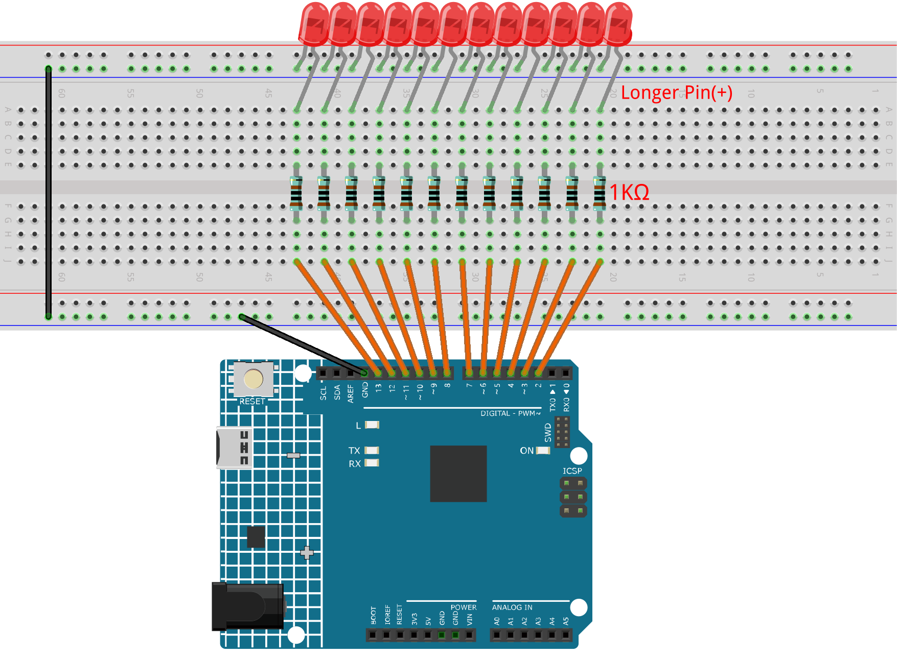

.. _light_show:

Light Show
==============================================================
.. note::
  
  Hello, welcome to the SunFounder Raspberry Pi & Arduino & ESP32 Enthusiasts Community on Facebook! Dive deeper into Raspberry Pi, Arduino, and ESP32 with fellow enthusiasts.

  👉 Ready to explore and create with us? Click [|link_sf_facebook|] and join today!

  To get all the components for this project, consider one of the kits below. 

  Each includes the required parts, extra components for other projects, and beginner-friendly tutorials.

  .. list-table::
    :widths: 20 20 20
    :header-rows: 1

    *   - Name	
        - Includes Arduino board
        - PURCHASE LINK
    *   - Electronic Kit	
        - ×
        - |link_electronic_buy|
    *   - Elite Explorer Kit	
        - Arduino Uno R4 WiFi
        - |link_elite_buy|
    *   - 3 in 1 Ultimate Starter Kit	
        - Arduino Uno R4 Minima
        - |link_arduinor4_buy|

Course Introduction
------------------------

In this lesson, you will learn how to use Arduino along with LEDs, and resistors to create a light show. 

 .. raw:: html

  <iframe width="700" height="394" src="https://www.youtube.com/embed/Zr9rE3BoyQ4?si=YTUNqNtqpI6ifZS2" title="YouTube video player" frameborder="0" allow="accelerometer; autoplay; clipboard-write; encrypted-media; gyroscope; picture-in-picture; web-share" referrerpolicy="strict-origin-when-cross-origin" allowfullscreen></iframe>

.. note::

  If this is your first time working with an Arduino project, we recommend downloading and reviewing the basic materials first.
  
  * :ref:`install_arduino`
  * :ref:`introduce_arduino`

**Required Components**

In this project, we need the following components:

.. list-table::
    :widths: 5 20 5 20
    :header-rows: 1

    *   - SN
        - COMPONENT INTRODUCTION	
        - QUANTITY
        - PURCHASE LINK

    *   - 1
        - Arduino UNO R4 Minima
        - 1
        - |link_unor4_buy|
    *   - 2
        - USB Type-C cable
        - 1
        - 
    *   - 3
        - Breadboard
        - 1
        - |link_breadboard_buy|
    *   - 4
        - Wires
        - Several
        - |link_wires_buy|
    *   - 5
        - 1kΩ resistor
        - Several
        - |link_resistor_buy|
    *   - 6
        - LED
        - Several
        - |link_led_buy|

**Wiring**

**Common Connections:**

* **LED**

  - Connect the LEDs **anode** to negative power bus on the breadboard, and the LEDs **cathode** a **1kΩ resistor** then to the **2** to **13** on the Arduino.

**Writing the Code**

.. note::

    * You can copy this code into **Arduino IDE**. 
    * Don't forget to select the board(Arduino UNO R4 Minima) and the correct port before clicking the **Upload** button.

.. code-block:: arduino

      // Define LED pins
      const int ledPins[] = {2, 3, 4, 5, 6, 7, 8, 9, 10, 11, 12, 13};
      const int numLeds = 12;

      void setup() {
        // Set all LED pins as outputs and turn them off
        for (int i = 0; i < numLeds; i++) {
          pinMode(ledPins[i], OUTPUT);
          digitalWrite(ledPins[i], LOW);
        }
      }

      void loop() {
        waterfallEffect(true);    // Waterfall (forward)
        waterfallEffect(false);   // Waterfall (reverse)
        bouncingEffect();         // Bouncing (in and out)
        bouncingEffect();         
        waveEffect();             // Wave pattern
        waveEffect();             
        alternatingEffect();      // Alternating even/odd LEDs
        runningBackEffect();      // Running light back and forth
        ladderEffect();           // Ladder on/off sequence
        progressiveKeepEffect();  // Progressive lighting
        progressiveKeepEffect();  
        dualSlidingEffect();      // Dual sliding from ends to center and back
        dualSlidingEffect();      
        dualSlidingEffect();      
      }

      void dualSlidingEffect() {
        // Move inward, blinking symmetrically
        for (int i = 0; i < numLeds / 2; i++) {
          for (int j = 0; j < 3; j++) {
            digitalWrite(ledPins[i], HIGH);
            digitalWrite(ledPins[numLeds - 1 - i], HIGH);
            delay(10);
            digitalWrite(ledPins[i], LOW);
            digitalWrite(ledPins[numLeds - 1 - i], LOW);
            delay(10);
          }
          delay(50);
        }

        // Move outward, blinking symmetrically
        for (int i = numLeds / 2 - 1; i >= 0; i--) {
          for (int j = 0; j < 3; j++) {
            digitalWrite(ledPins[i], HIGH);
            digitalWrite(ledPins[numLeds - 1 - i], HIGH);
            delay(10);
            digitalWrite(ledPins[i], LOW);
            digitalWrite(ledPins[numLeds - 1 - i], LOW);
            delay(10);
          }
          delay(50);
        }
      }

      // Waterfall effect: LEDs turn on/off in sequence
      void waterfallEffect(bool direction) {
        if (direction) {
          for (int i = 0; i < numLeds; i++) {
            digitalWrite(ledPins[i], HIGH);
            delay(50);
          }
          for (int i = 0; i < numLeds; i++) {
            digitalWrite(ledPins[i], LOW);
            delay(50);
          }
        } else {
          for (int i = numLeds - 1; i >= 0; i--) {
            digitalWrite(ledPins[i], HIGH);
            delay(50);
          }
          for (int i = numLeds - 1; i >= 0; i--) {
            digitalWrite(ledPins[i], LOW);
            delay(50);
          }
        }
      }

      // Bouncing effect: inward and outward lighting
      void bouncingEffect() {
        for (int i = 0; i < numLeds / 2; i++) {
          digitalWrite(ledPins[i], HIGH);
          digitalWrite(ledPins[numLeds - 1 - i], HIGH);
          delay(50);
        }
        for (int i = 0; i < numLeds / 2; i++) {
          digitalWrite(ledPins[i], LOW);
          digitalWrite(ledPins[numLeds - 1 - i], LOW);
          delay(50);
        }

        for (int i = numLeds / 2 - 1; i >= 0; i--) {
          digitalWrite(ledPins[i], HIGH);
          digitalWrite(ledPins[numLeds - 1 - i], HIGH);
          delay(50);
        }
        for (int i = numLeds / 2 - 1; i >= 0; i--) {
          digitalWrite(ledPins[i], LOW);
          digitalWrite(ledPins[numLeds - 1 - i], LOW);
          delay(50);
        }
      }

      // Wave effect: LEDs create a moving wave
      void waveEffect() {
        for (int i = 0; i < numLeds; i++) {
          digitalWrite(ledPins[i], HIGH);
          if (i > 1) digitalWrite(ledPins[i - 2], LOW);
          delay(50);
        }
        for (int i = numLeds - 1; i >= 0; i--) {
          digitalWrite(ledPins[i], HIGH);
          if (i < numLeds - 2) digitalWrite(ledPins[i + 2], LOW);
          delay(50);
        }
        for (int i = 0; i < 2; i++) {
          digitalWrite(ledPins[numLeds - 1 - i], LOW);
        }
      }

      // Alternating blink effect: even/odd LEDs alternate
      void alternatingEffect() {
        for (int i = 0; i < 5; i++) {
          for (int j = 0; j < numLeds; j += 2) {
            digitalWrite(ledPins[j], HIGH);
            digitalWrite(ledPins[j + 1], LOW);
          }
          delay(300);
          for (int j = 0; j < numLeds; j += 2) {
            digitalWrite(ledPins[j], LOW);
            digitalWrite(ledPins[j + 1], HIGH);
          }
          delay(300);
        }
      }

      // Running effect: light moves left-to-right and back
      void runningBackEffect() {
        for (int i = 0; i < numLeds; i++) {
          digitalWrite(ledPins[i], HIGH);
          delay(50);
          digitalWrite(ledPins[i], LOW);
        }
        for (int i = numLeds - 1; i >= 0; i--) {
          digitalWrite(ledPins[i], HIGH);
          delay(50);
          digitalWrite(ledPins[i], LOW);
        }
      }

      // Ladder effect: sequential on/off like climbing steps
      void ladderEffect() {
        for (int i = 0; i < numLeds; i++) {
          digitalWrite(ledPins[i], HIGH);
          delay(50);
        }
        for (int i = numLeds - 1; i >= 0; i--) {
          digitalWrite(ledPins[i], LOW);
          delay(50);
        }
      }

      // Progressive keep effect: gradually light LEDs and keep previous ones on
      void progressiveKeepEffect() {
        for (int round = 0; round < numLeds; round++) {
          for (int i = 0; i < numLeds; i++) {
            digitalWrite(ledPins[i], LOW);
          }

          for (int i = numLeds - 1; i >= numLeds - round; i--) {
            digitalWrite(ledPins[i], HIGH);
          }

          for (int i = 0; i < numLeds - round; i++) {
            digitalWrite(ledPins[i], HIGH);
            if (i > 0) {
              digitalWrite(ledPins[i - 1], LOW);
            }
            delay(50);
          }

          if (numLeds - round - 1 >= 0) {
            digitalWrite(ledPins[numLeds - round - 1], LOW);
          }
        }
      }

      // Center spread effect: LEDs light from the center outwards and then back
      // (Not called in the loop)
      void centerSpreadEffect() {
        int center = numLeds / 2;
        for (int offset = 0; offset < center; offset++) {
          digitalWrite(ledPins[center - offset - 1], HIGH);
          digitalWrite(ledPins[center + offset], HIGH);
          delay(100);
        }
        for (int offset = center - 1; offset >= 0; offset--) {
          digitalWrite(ledPins[center - offset - 1], LOW);
          digitalWrite(ledPins[center + offset], LOW);
          delay(100);
        }
      }
