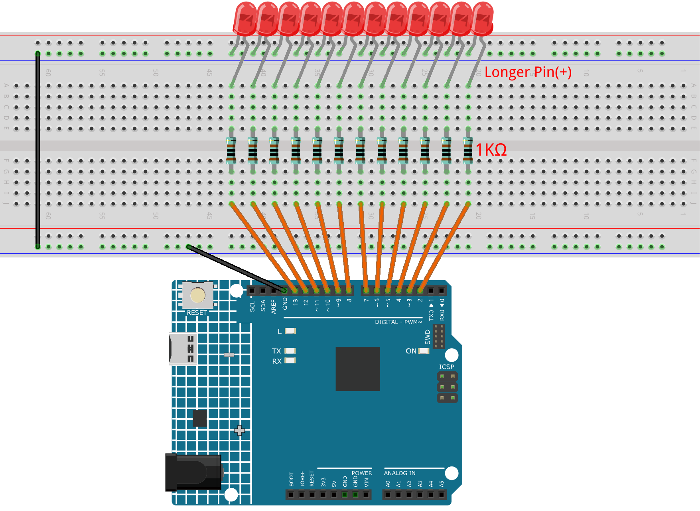

.. _light_show2.0:

Light Show 2.0
==============================================================

.. note::
  
  🌟 Welcome to the SunFounder Facebook Community! Whether you're into Raspberry Pi, Arduino, or ESP32, you'll find inspiration, help ideas here.
   
  - ✅ Be the first to get free learning resources. 
   
  - ✅ Stay updated on new products & exclusive giveaways. 
   
  - ✅ Share your creations and get real feedback.
   
  * 👉 Need faster updates or support? Click [|link_sf_facebook|] join our Facebook community 

  * 👉 Or join our WhatsApp group: Click [|link_sf_whatsapp|]
   
  * 🎁 Looking for parts?Check out our all-in-one kits below — packed with components, beginner-friendly guides, and tons of fun.
  
  .. list-table::
    :widths: 20 20 20
    :header-rows: 1

    *   - Name	
        - Includes Arduino board
        - PURCHASE LINK
    *   - Electronic Kit	
        - ×
        - |link_electronic_buy|
    *   - Elite Explorer Kit	
        - Arduino Uno R4 WiFi
        - |link_elite_buy|
    *   - 3 in 1 Ultimate Starter Kit	
        - Arduino Uno R4 Minima
        - |link_arduinor4_buy|

Course Introduction
------------------------

In this lesson, you will learn how to use Arduino along with LEDs, and resistors to create a light show. 

.. raw:: html

  <iframe width="700" height="394" src="https://www.youtube.com/embed/eMqbAINcAsI?si=oyStQK-ZjHVNumB_" title="YouTube video player" frameborder="0" allow="accelerometer; autoplay; clipboard-write; encrypted-media; gyroscope; picture-in-picture; web-share" referrerpolicy="strict-origin-when-cross-origin" allowfullscreen></iframe>

.. note::

  If this is your first time working with an Arduino project, we recommend downloading and reviewing the basic materials first.
  
  * :ref:`install_arduino`
  * :ref:`introduce_arduino`

**Required Components**

In this project, we need the following components:

.. list-table::
    :widths: 5 20 5 20
    :header-rows: 1

    *   - SN
        - COMPONENT INTRODUCTION	
        - QUANTITY
        - PURCHASE LINK

    *   - 1
        - Arduino UNO R4 Minima
        - 1
        - |link_unor4_buy|
    *   - 2
        - USB Type-C cable
        - 1
        - 
    *   - 3
        - Breadboard
        - 1
        - |link_breadboard_buy|
    *   - 4
        - Wires
        - Several
        - |link_wires_buy|
    *   - 5
        - 1kΩ resistor
        - Several
        - |link_resistor_buy|
    *   - 6
        - LED
        - Several
        - |link_led_buy|

**Wiring**

**Common Connections:**

* **LED**

  - Connect the LEDs **cathode** to negative power bus on the breadboard, and the LEDs **anode** to a **1kΩ resistor** then to the **2** to **13** on the Arduino.

**Writing the Code**

.. note::

    * You can copy this code into **Arduino IDE**. 
    * Don't forget to select the board(Arduino UNO R4 Minima) and the correct port before clicking the **Upload** button.

.. code-block:: arduino

      // =========================================
      // LED Light Show - For Beginners
      // Created for 12 LEDs connected to pins 2–13
      // -----------------------------------------
      // Effect 1: Ping-Pong
      // Effect 2: Waterfall
      // Effect 3: Wave (two rounds)
      // Effect 4: Bouncing (two rounds)
      // Effect 5: Progressive Keep (two directions)
      // Effect 6: Running Back
      // Effect 7: Ladder (two directions)
      // Effect 8: Alternating
      // Effect 9: Grouped Flash (two times)
      // Effect 10: Cross Blink (two times)
      // =========================================

      const int ledPins[] = {2, 3, 4, 5, 6, 7, 8, 9, 10, 11, 12, 13};
      const int numLeds = 12;

      void setup() {
        // Set all LED pins as outputs
        for (int i = 0; i < numLeds; i++) {
          pinMode(ledPins[i], OUTPUT);
          digitalWrite(ledPins[i], LOW);
        }
      }

      void loop() {
        pingPongEffect();          // Effect 1
        waterfallEffect();         // Effect 2
        waveEffect();              // Effect 3
        bouncingEffect();          // Effect 4
        progressiveKeepEffect();   // Effect 5
        runningBackEffect();       // Effect 6
        ladderEffect();            // Effect 7
        alternatingEffect();       // Effect 8

        // Keep consistent loop structure for repeated effects
        for (int i = 0; i < 2; i++) {
          groupedFlashEffect();    // Effect 9 - Repeat twice
        }

        for (int i = 0; i < 2; i++) {
          crossBlinkEffect();      // Effect 10 - Repeat twice
        }
      }

      // -------------------------------
      // Effect 1: Ping-Pong
      // -------------------------------
      void pingPongEffect() {
        // Move light from left to right
        for (int i = 0; i < numLeds; i++) {
          digitalWrite(ledPins[i], HIGH);
          delay(80);
          digitalWrite(ledPins[i], LOW);
        }

        // Move light from right to left
        for (int i = numLeds - 1; i >= 0; i--) {
          digitalWrite(ledPins[i], HIGH);
          delay(80);
          digitalWrite(ledPins[i], LOW);
        }
      }

      // -------------------------------
      // Effect 2: Waterfall
      // -------------------------------
      void waterfallEffect() {
        // Flow from left to right
        for (int i = 0; i < numLeds; i++) {
          digitalWrite(ledPins[i], HIGH);
          delay(50);
        }
        for (int i = 0; i < numLeds; i++) {
          digitalWrite(ledPins[i], LOW);
          delay(50);
        }

        // Flow from right to left
        for (int i = numLeds - 1; i >= 0; i--) {
          digitalWrite(ledPins[i], HIGH);
          delay(50);
        }
        for (int i = numLeds - 1; i >= 0; i--) {
          digitalWrite(ledPins[i], LOW);
          delay(50);
        }
      }

      // -------------------------------
      // Effect 3: Wave (two rounds)
      // -------------------------------
      void waveEffect() {
        for (int repeat = 0; repeat < 2; repeat++) {
          // Left to right wave
          for (int i = 0; i < numLeds; i++) {
            digitalWrite(ledPins[i], HIGH);
            if (i > 1) digitalWrite(ledPins[i - 2], LOW);
            delay(50);
          }

          // Right to left wave
          for (int i = numLeds - 1; i >= 0; i--) {
            digitalWrite(ledPins[i], HIGH);
            if (i < numLeds - 2) digitalWrite(ledPins[i + 2], LOW);
            delay(50);
          }

          // Turn off last two LEDs
          for (int i = 0; i < 2; i++) {
            digitalWrite(ledPins[numLeds - 1 - i], LOW);
          }
        }
      }

      // -------------------------------
      // Effect 4: Bouncing (two rounds)
      // -------------------------------
      void bouncingEffect() {
        for (int repeat = 0; repeat < 2; repeat++) {
          // Move inward
          for (int i = 0; i < numLeds / 2; i++) {
            digitalWrite(ledPins[i], HIGH);
            digitalWrite(ledPins[numLeds - 1 - i], HIGH);
            delay(50);
          }

          // Turn off inward
          for (int i = 0; i < numLeds / 2; i++) {
            digitalWrite(ledPins[i], LOW);
            digitalWrite(ledPins[numLeds - 1 - i], LOW);
            delay(50);
          }

          // Move outward
          for (int i = numLeds / 2 - 1; i >= 0; i--) {
            digitalWrite(ledPins[i], HIGH);
            digitalWrite(ledPins[numLeds - 1 - i], HIGH);
            delay(50);
          }

          // Turn off outward
          for (int i = numLeds / 2 - 1; i >= 0; i--) {
            digitalWrite(ledPins[i], LOW);
            digitalWrite(ledPins[numLeds - 1 - i], LOW);
            delay(50);
          }
        }
      }

      // -------------------------------
      // Effect 5: Progressive Keep (two directions)
      // -------------------------------
      void progressiveKeepEffect() {
        // Left to right progressive
        for (int round = 0; round < numLeds; round++) {
          for (int i = 0; i < numLeds; i++) digitalWrite(ledPins[i], LOW);
          for (int i = numLeds - 1; i >= numLeds - round; i--) {
            digitalWrite(ledPins[i], HIGH);
          }
          for (int i = 0; i < numLeds - round; i++) {
            digitalWrite(ledPins[i], HIGH);
            if (i > 0) digitalWrite(ledPins[i - 1], LOW);
            delay(50);
          }
          if (numLeds - round - 1 >= 0) digitalWrite(ledPins[numLeds - round - 1], LOW);
        }

        // Right to left progressive
        for (int round = 0; round < numLeds; round++) {
          for (int i = 0; i < numLeds; i++) digitalWrite(ledPins[i], LOW);
          for (int i = 0; i < round; i++) digitalWrite(ledPins[i], HIGH);
          for (int i = numLeds - 1; i >= round; i--) {
            digitalWrite(ledPins[i], HIGH);
            if (i < numLeds - 1) digitalWrite(ledPins[i + 1], LOW);
            delay(50);
          }
          if (round < numLeds) digitalWrite(ledPins[round], LOW);
        }
      }

      // -------------------------------
      // Effect 6: Running Back
      // -------------------------------
      void runningBackEffect() {
        // Forward
        for (int i = 0; i < numLeds; i++) {
          digitalWrite(ledPins[i], HIGH);
          delay(50);
          digitalWrite(ledPins[i], LOW);
        }

        // Backward
        for (int i = numLeds - 1; i >= 0; i--) {
          digitalWrite(ledPins[i], HIGH);
          delay(50);
          digitalWrite(ledPins[i], LOW);
        }
      }

      // -------------------------------
      // Effect 7: Ladder (two directions)
      // -------------------------------
      void ladderEffect() {
        // Left to right
        for (int i = 0; i < numLeds; i++) {
          digitalWrite(ledPins[i], HIGH);
          delay(50);
        }
        for (int i = numLeds - 1; i >= 0; i--) {
          digitalWrite(ledPins[i], LOW);
          delay(50);
        }

        // Right to left
        for (int i = numLeds - 1; i >= 0; i--) {
          digitalWrite(ledPins[i], HIGH);
          delay(50);
        }
        for (int i = 0; i < numLeds; i++) {
          digitalWrite(ledPins[i], LOW);
          delay(50);
        }
      }

      // -------------------------------
      // Effect 8: Alternating
      // -------------------------------
      void alternatingEffect() {
        for (int i = 0; i < 5; i++) {
          // Even LEDs ON, odd LEDs OFF
          for (int j = 0; j < numLeds; j += 2) {
            digitalWrite(ledPins[j], HIGH);
            if (j + 1 < numLeds) digitalWrite(ledPins[j + 1], LOW);
          }
          delay(300);

          // Even LEDs OFF, odd LEDs ON
          for (int j = 0; j < numLeds; j += 2) {
            digitalWrite(ledPins[j], LOW);
            if (j + 1 < numLeds) digitalWrite(ledPins[j + 1], HIGH);
          }
          delay(300);
        }

        // Turn off all LEDs
        for (int i = 0; i < numLeds; i++) digitalWrite(ledPins[i], LOW);
      }

      // -------------------------------
      // Effect 9: Grouped Flash
      // -------------------------------
      void groupedFlashEffect() {
        int groupSize = 4; // 4 LEDs per group
        for (int g = 0; g < numLeds; g += groupSize) {
          for (int i = g; i < g + groupSize && i < numLeds; i++) digitalWrite(ledPins[i], HIGH);
          delay(300);
          for (int i = g; i < g + groupSize && i < numLeds; i++) digitalWrite(ledPins[i], LOW);
        }
      }

      // -------------------------------
      // Effect 10: Cross Blink
      // -------------------------------
      void crossBlinkEffect() {
        for (int repeat = 0; repeat < 2; repeat++) {
          // Opposite LEDs ON/OFF alternately
          for (int i = 0; i < numLeds / 2; i++) {
            digitalWrite(ledPins[i], HIGH);
            digitalWrite(ledPins[numLeds - 1 - i], LOW);
          }
          delay(300);

          for (int i = 0; i < numLeds / 2; i++) {
            digitalWrite(ledPins[i], LOW);
            digitalWrite(ledPins[numLeds - 1 - i], HIGH);
          }
          delay(300);
        }
      }
