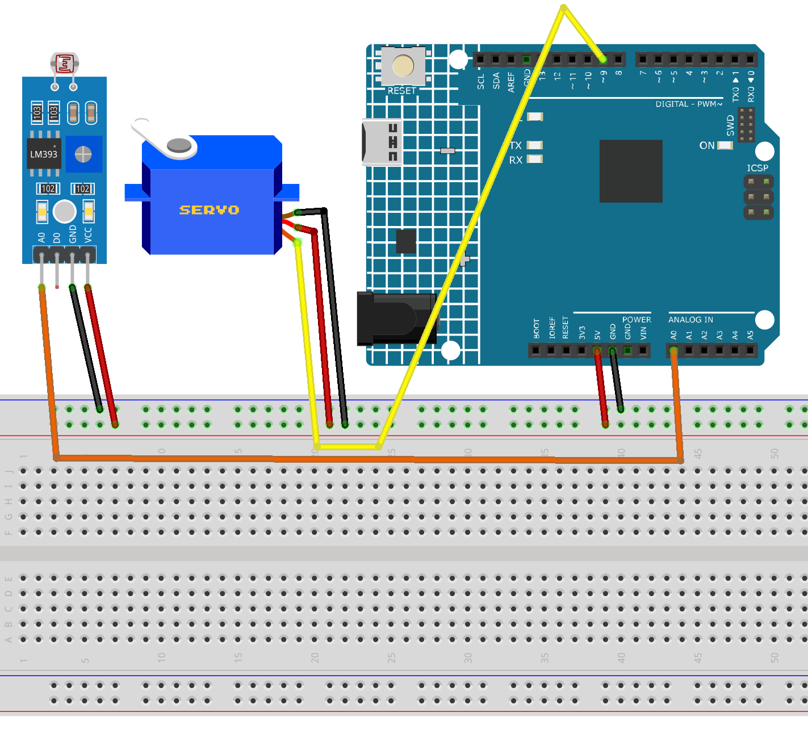

.. _light_tracing:

Light tracing
==============================================================

.. note::
  
  🌟 Welcome to the SunFounder Facebook Community! Whether you're into Raspberry Pi, Arduino, or ESP32, you'll find inspiration, help ideas here.
   
  - ✅ Be the first to get free learning resources. 
   
  - ✅ Stay updated on new products & exclusive giveaways. 
   
  - ✅ Share your creations and get real feedback.
   
  * 👉 Need faster updates or support? Click [|link_sf_facebook|] join our Facebook community 

  * 👉 Or join our WhatsApp group: Click [|link_sf_whatsapp|]
   
  * 🎁 Looking for parts?Check out our all-in-one kits below — packed with components, beginner-friendly guides, and tons of fun.

  .. list-table::
    :widths: 20 20 20
    :header-rows: 1

    *   - Name	
        - Includes Arduino board
        - PURCHASE LINK
    *   - Ultimate Sensor Kit
        - Arduino Uno R4 Minima
        - |link_ultimate_sensor_buy|
    *   - Elite Explorer Kit
        - Arduino Uno R4 WiFi
        - |link_elite_buy|
    *   - 3 in 1 Ultimate Starter Kit
        - Arduino Uno R4 Minima
        - |link_arduinor4_buy|
    *   - Universal Maker Sensor Kit
        - ×
        - |link_umsk_buy|

Course Introduction
------------------------

This Arduino project uses an LDR to detect ambient light changes and control a servo. The original code supports two LDRs, but this experiment uses only one. You can try adding a second LDR for further exploration.

The servo adjusts its angle based on light intensity, simulating responsive movement. A tolerance threshold reduces jitter from small changes. This system is ideal for light-following robots or sun trackers.

.. raw:: html

  <iframe width="700" height="394" src="https://www.youtube.com/embed/A4v7QJxjU-4?si=s6P6bt19Kos_pYKQ" title="YouTube video player" frameborder="0" allow="accelerometer; autoplay; clipboard-write; encrypted-media; gyroscope; picture-in-picture; web-share" referrerpolicy="strict-origin-when-cross-origin" allowfullscreen></iframe>

.. note::

  If this is your first time working with an Arduino project, we recommend downloading and reviewing the basic materials first.
  
  * :ref:`install_arduino`
  * :ref:`introduce_arduino`

**Required Components**

In this project, we need the following components:

.. list-table::
    :widths: 5 20 5 20
    :header-rows: 1

    *   - SN
        - COMPONENT INTRODUCTION	
        - QUANTITY
        - PURCHASE LINK

    *   - 1
        - Arduino UNO R4 Minima
        - 1
        - |link_unor4_buy|
    *   - 2
        - USB Type-C cable
        - 1
        - 
    *   - 3
        - Breadboard
        - 1
        - |link_breadboard_buy|
    *   - 4
        - Wires
        - Several
        - |link_wires_buy|
    *   - 5
        - Digital Servo Motor
        - 1
        - |link_motor_buy|
    *   - 6
        - Photoresistor Module
        - 1
        - |link_photoresistor_module_buy|

**Wiring**

**Common Connections:**

* **Digital Servo Motor**

  - Connect to breadboard’s positive power bus.
  - Connect to breadboard’s negative power bus.
  - Connect to  **9** on the Arduino.

* **Photoresistor Module**

  - **A0:** Connect to **A0** on the Arduino.
  - If there is another light-dependent resistor (LDR), then **A0** Connect to **A1** on the Arduino.
  - **GND:** Connect to breadboard’s negative power bus.
  - **VCC:** Connect to breadboard’s red power bus.

**Writing the Code**

.. note::

    * You can copy this code into **Arduino IDE**. 
    * Don't forget to select the board(Arduino UNO R4 Minima/WIFI) and the correct port before clicking the **Upload** button.

.. code-block:: arduino

      #include <Servo.h>

      Servo myServo;

      const int ldrLeft = A0;
      const int ldrRight = A1;

      int servoPin = 9;
      int pos = 90; // Initial angle centered
      int tolerance = 10; // Threshold to reduce jitter
      void setup() {
        myServo.attach(servoPin);
        myServo.write(pos);
        Serial.begin(9600);
      }

      void loop() {
        int leftValue = analogRead(ldrLeft);
        int rightValue = analogRead(ldrRight);

        int difference = leftValue - rightValue;

        Serial.print("Left: ");
        Serial.print(leftValue);
        Serial.print(" | Right: ");
        Serial.print(rightValue);
        Serial.print(" | Diff: ");
        Serial.println(difference);

        if (abs(difference) > tolerance) {
          if (difference > 0 && pos < 360) {
            pos++;
          } else if (difference < 0 && pos > 0) {
            pos--;
          }
          myServo.write(pos);
        }

        delay(20); // Proper delay to avoid movement too fast
      }
