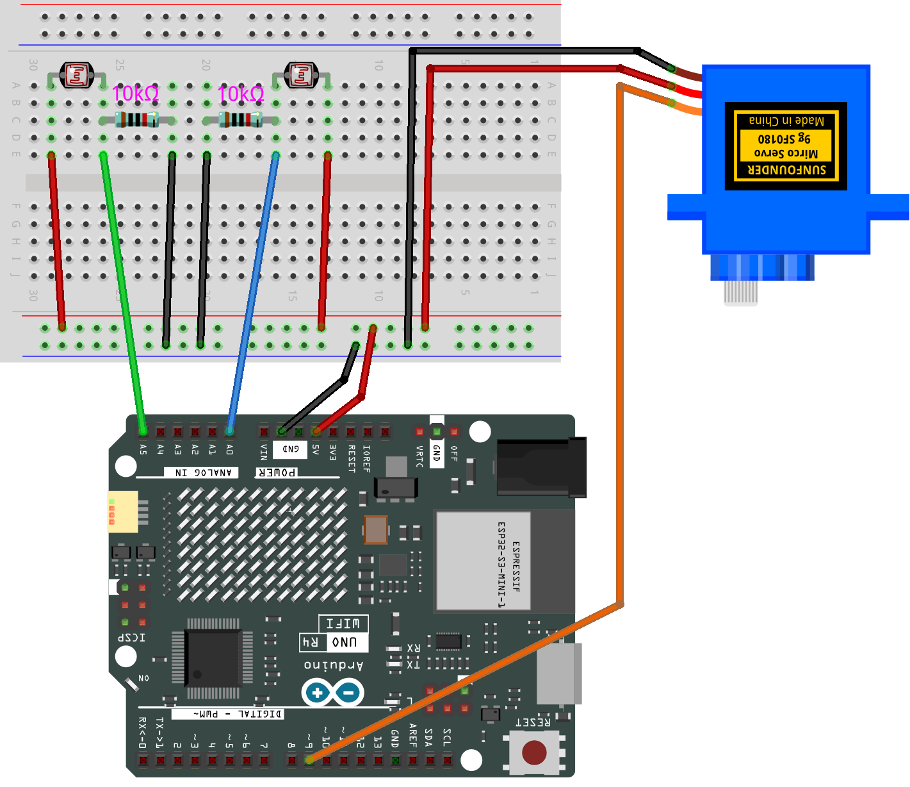

.. _light_lracker2.0:

Light Tracker 2.0
==============================================================

.. note::
  
  🌟 Welcome to the SunFounder Facebook Community! Whether you're into Raspberry Pi, Arduino, or ESP32, you'll find inspiration, help ideas here.
   
  - ✅ Be the first to get free learning resources. 
   
  - ✅ Stay updated on new products & exclusive giveaways. 
   
  - ✅ Share your creations and get real feedback.
   
  * 👉 Need faster updates or support? Click [|link_sf_facebook|] join our Facebook community 

  * 👉 Or join our WhatsApp group: Click [|link_sf_whatsapp|]
   
  * 🎁 Looking for parts?Check out our all-in-one kits below — packed with components, beginner-friendly guides, and tons of fun.

  .. list-table::
    :widths: 20 20 20
    :header-rows: 1

    *   - Name	
        - Includes Arduino board
        - PURCHASE LINK
    *   - Ultimate Sensor Kit
        - Arduino Uno R4 Minima
        - |link_ultimate_sensor_buy|
    *   - Elite Explorer Kit
        - Arduino Uno R4 WiFi
        - |link_elite_buy|
    *   - 3 in 1 Ultimate Starter Kit
        - Arduino Uno R4 Minima
        - |link_arduinor4_buy|
    *   - Universal Maker Sensor Kit
        - ×
        - |link_umsk_buy|

Course Introduction
------------------------

This Arduino project uses two photoresistors (LDRs) to detect light direction and control a servo motor.

The servo turns smoothly toward the side with brighter light, allowing the system to follow changes in lighting. By adjusting the target angle gradually, the code ensures stable and jitter-free movement. This setup is great for building light-seeking robots or automatic sun trackers.

.. raw:: html

  <iframe width="700" height="394" src="https://www.youtube.com/embed/rGZZHwgEsU8?si=K2FS8tiqgz7J73yi" title="YouTube video player" frameborder="0" allow="accelerometer; autoplay; clipboard-write; encrypted-media; gyroscope; picture-in-picture; web-share" referrerpolicy="strict-origin-when-cross-origin" allowfullscreen></iframe>

.. note::

  If this is your first time working with an Arduino project, we recommend downloading and reviewing the basic materials first.
  
  * :ref:`install_arduino`
  * :ref:`introduce_arduino`

**Required Components**

In this project, we need the following components:

.. list-table::
    :widths: 5 20 5 20
    :header-rows: 1

    *   - SN
        - COMPONENT INTRODUCTION	
        - QUANTITY
        - PURCHASE LINK

    *   - 1
        - Arduino UNO R4 WIFI
        - 1
        - |link_unor4_wifi_buy|
    *   - 2
        - USB Type-C cable
        - 1
        - 
    *   - 3
        - Breadboard
        - 1
        - |link_breadboard_buy|
    *   - 4
        - Wires
        - Several
        - |link_wires_buy|
    *   - 5
        - Digital Servo Motor
        - 1
        - |link_motor_buy|
    *   - 6
        - Photoresistor
        - 2
        - |link_photoresistor_buy|

**Wiring**

**Common Connections:**

* **Digital Servo Motor**

  - Connect to breadboard’s positive power bus.
  - Connect to breadboard’s negative power bus.
  - Connect to  **9** on the Arduino.

* **Photoresistor RIGHT**

  - Connect to **A0** on the Arduino.
  - Connect to breadboard’s negative power bus.

* **Photoresistor LEFT**

  - Connect to **A5** on the Arduino.
  - Connect to breadboard’s negative power bus.

**Writing the Code**

.. note::

    * You can copy this code into **Arduino IDE**. 
    * Don't forget to select the board(Arduino UNO R4 Minima/WIFI) and the correct port before clicking the **Upload** button.

.. code-block:: arduino

      #include <Servo.h>

      Servo myservo;

      int angle = 90;           // current servo angle
      int targetAngle = 90;     // target servo angle
      unsigned long lastMoveTime = 0;
      const int moveInterval = 30; // time between movements (ms)
      const int step = 1;          // servo moves 1° each time

      void setup() {
        Serial.begin(9600);
        myservo.attach(9);
        myservo.write(angle);  // set initial angle to 90°
      }

      void loop() {
        int sensorLeft = analogRead(A0);  // read left photoresistor (A0)
        int sensorRight = analogRead(A5); // read right photoresistor (A5)

        // print both sensor values
        Serial.print("A0: ");
        Serial.print(sensorLeft);
        Serial.print("  A5: ");
        Serial.println(sensorRight);

        // set target angle based on light level
        if (sensorLeft > 950) {
          targetAngle = 180;  // if A0 is bright, turn right
        } else if (sensorRight > 950) {
          targetAngle = 0;    // if A5 is bright, turn left
        }

        // move servo gradually without delay
        unsigned long currentTime = millis();
        if (currentTime - lastMoveTime >= moveInterval) {
          lastMoveTime = currentTime;

          if (angle < targetAngle) {
            angle += step;
            if (angle > targetAngle) angle = targetAngle;
            myservo.write(angle);
          } else if (angle > targetAngle) {
            angle -= step;
            if (angle < targetAngle) angle = targetAngle;
            myservo.write(angle);
          }
        }
      }
