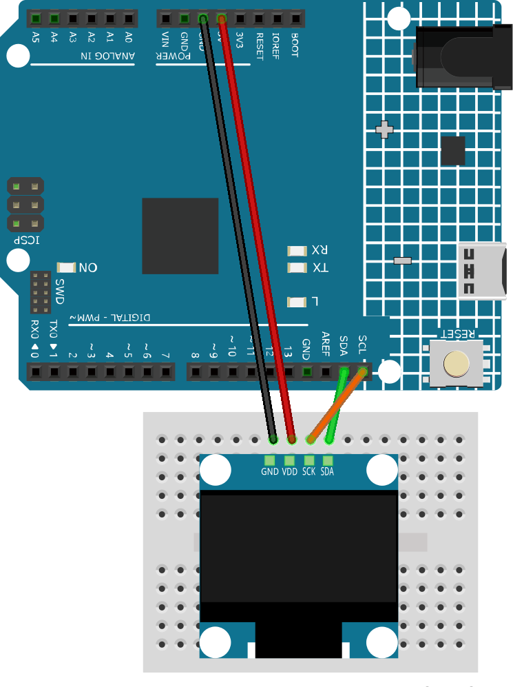

.. _love_me_not:

Love Me Not
==============================================================

.. note::
  
  🌟 Welcome to the SunFounder Facebook Community! Whether you're into Raspberry Pi, Arduino, or ESP32, you'll find inspiration, help ideas here.
   
  - ✅ Be the first to get free learning resources. 
   
  - ✅ Stay updated on new products & exclusive giveaways. 
   
  - ✅ Share your creations and get real feedback.
   
  * 👉 Need faster updates or support? Click [|link_sf_facebook|] join our Facebook community 

  * 👉 Or join our WhatsApp group: Click [|link_sf_whatsapp|]

Kit purchase
------------------------

Looking for parts? Check out our all-in-one kits below — packed with components, beginner-friendly guides, and tons of fun.

.. image:: img/ultimate_sensor_kit.png
   :width: 100%
   :align: center
   :target: https://www.sunfounder.com/collections/arduino-kits-bundles/products/sunfounder-ultimate-sensor-kit-with-original-arduino-uno-r4-minima?ref=jbzmncle

.. raw:: html

     

.. list-table::
   :widths: 20 20 20
   :header-rows: 1

   * - Name
     - Includes Arduino board
     - PURCHASE LINK
   * - Elite Explorer Kit
     - Arduino Uno R4 WiFi
     - |link_elite_buy|
   * - 3 in 1 Ultimate Starter Kit
     - Arduino Uno R4 Minima
     - |link_arduinor4_buy|

Course Introduction
------------------------

In this lesson, we will learn how to use an OLED with Arduino to play the “Love Me Not” animation.

.. .. raw:: html

.. <iframe width="700" height="394" src="https://www.youtube.com/embed/VTqcDGH7XE4?si=rJeNwznz4D8fJeKM" title="YouTube video player" frameborder="0" allow="accelerometer; autoplay; clipboard-write; encrypted-media; gyroscope; picture-in-picture; web-share" referrerpolicy="strict-origin-when-cross-origin" allowfullscreen></iframe>

.. note::

  If this is your first time working with an Arduino project, we recommend downloading and reviewing the basic materials first.

  * :ref:`install_arduino`
  * :ref:`introduce_arduino`

**Required Components**

In this project, we need the following components:

.. list-table::
    :widths: 5 20 5 20
    :header-rows: 1

    *   - SN
        - COMPONENT INTRODUCTION	
        - QUANTITY
        - PURCHASE LINK

    *   - 1
        - Arduino UNO R4 Minima
        - 1
        - |link_unor4_buy|
    *   - 2
        - USB Type-C cable
        - 1
        - 
    *   - 3
        - Breadboard
        - 1
        - |link_breadboard_buy|
    *   - 4
        - Wires
        - Several
        - |link_wires_buy|
    *   - 5
        - OLED Display Module
        - 1
        - |link_oled_buy|

**Wiring**

**Common Connections:**

* **OLED Display Module**

  - **SDA:** Connect to **SDA** on the Arduino.
  - **SCK:** Connect to **SCL** on the Arduino.
  - **GND:** Connect to **GND** on the Arduino.
  - **VCC:** Connect to **5V** on the Arduino.

**Writing the Code**

.. note::

    * You can copy this code into **Arduino IDE**. 
    * To install the library, use the Arduino Library Manager and search for **Adafruit SSD1306** and **Adafruit GFX** and install it.
    * The ``VideoFrame_R4.h`` is used here. You can click here :download:`VideoFrame_R4.zip </_static/VideoFrame_R4.zip>` to download it. 
    * Then place ``VideoFrame_R4.h`` in the same folder as the following code.
    * Don't forget to select the board(Arduino UNO R4 Minima) and the correct port before clicking the **Upload** button.

.. code-block:: arduino

      #include <Arduino.h>
      #include <Wire.h>
      #include <Adafruit_GFX.h>
      #include <Adafruit_SSD1306.h>
      #include "VideoFrame_R4.h"

      #define SCREEN_WIDTH 128
      #define SCREEN_HEIGHT 64
      #define OLED_RESET -1
      #define OLED_ADDRESS 0x3C

      Adafruit_SSD1306 display(
        SCREEN_WIDTH,
        SCREEN_HEIGHT,
        &Wire,
        OLED_RESET
      );

      unsigned long previousMillis = 0;
      int currentFrame = 0;

      void setup() {
        Serial.begin(115200);

        Wire.begin();
        Wire.setClock(400000);

        if (!display.begin(
              SSD1306_SWITCHCAPVCC,
              OLED_ADDRESS
            )) {
          Serial.println("OLED initialization failed!");

          while (true) {
            delay(100);
          }
        }

        Serial.println("OLED initialized!");

        display.clearDisplay();
        display.display();

        previousMillis = millis();
      }

      void loop() {
        unsigned long currentMillis = millis();

        if (
          currentMillis - previousMillis >=
          FRAME_DELAY
        ) {
          previousMillis = currentMillis;

          display.clearDisplay();

          display.drawBitmap(
            0,
            0,
            video_frames[currentFrame],
            SCREEN_WIDTH,
            SCREEN_HEIGHT,
            SSD1306_WHITE
          );

          display.display();

          currentFrame++;

          if (currentFrame >= TOTAL_FRAMES) {
            currentFrame = 0;
          }
        }
      }