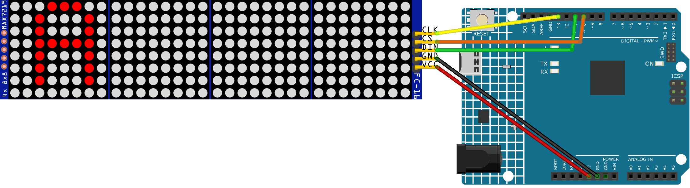

.. _matrix_flame:

Matrix Flame
==============================================================

.. note::
  
  🌟 Welcome to the SunFounder Facebook Community! Whether you're into Raspberry Pi, Arduino, or ESP32, you'll find inspiration, help ideas here.
   
  - ✅ Be the first to get free learning resources. 
   
  - ✅ Stay updated on new products & exclusive giveaways. 
   
  - ✅ Share your creations and get real feedback.
   
  * 👉 Need faster updates or support? Click [|link_sf_facebook|] join our Facebook community 

  * 👉 Or join our WhatsApp group: Click [|link_sf_whatsapp|]
   
  * 🎁 Looking for parts?Check out our all-in-one kits below — packed with components, beginner-friendly guides, and tons of fun.
  
  .. list-table::
    :widths: 20 20 20
    :header-rows: 1

    *   - Name	
        - Includes Arduino board
        - PURCHASE LINK
    *   - Elite Explorer Kit	
        - Arduino Uno R4 WiFi
        - |link_elite_buy|
    *   - Ultimate Sensor Kit	
        - Arduino Uno R4 Minima
        - |link_arduinor4_buy|
    *   - Electronic Kit	
        - ×
        - |link_electronic_buy|
    *   - Universal Maker Sensor Kit
        - ×
        - |link_umsk_buy|

Course Introduction
------------------------

In this lesson, you’ll learn how to use a MAX7219 Dot Matrix Module with the Arduino UNO R4 to create a dynamic flame animation.

The MAX7219 Dot Matrix Module simulates a realistic flickering fire effect with smooth movement and random flame variations.

.. .. raw:: html

..    <iframe width="700" height="394" src="https://www.youtube.com/embed/zlKPKK3Qink" frameborder="0" allow="accelerometer; autoplay; clipboard-write; encrypted-media; gyroscope; picture-in-picture" allowfullscreen></iframe>

.. note::

  If this is your first time working with an Arduino project, we recommend downloading and reviewing the basic materials first.

  * :ref:`install_arduino`
  * :ref:`introduce_arduino`

**Required Components**

In this project, we need the following components:

.. list-table::
    :widths: 5 20 5 20
    :header-rows: 1

    *   - SN
        - COMPONENT INTRODUCTION	
        - QUANTITY
        - PURCHASE LINK

    *   - 1
        - Arduino UNO R4 Minima
        - 1
        - |link_unor4_buy|
    *   - 2
        - USB Type-C cable
        - 1
        - 
    *   - 3
        - Breadboard
        - 1
        - |link_breadboard_buy|
    *   - 4
        - Wires
        - Several
        - |link_wires_buy|
    *   - 5
        - MAX7219 Dot Matrix Module
        - 1
        - |link_martix_buy|

**Wiring**

**Common Connections:**

* **MAX7219 Dot Matrix Module**

  - **CLK:** Connect to **13** on the Arduino.
  - **CS:** Connect to **10** on the Arduino.
  - **DIN:** Connect to **11** on the Arduino.
  - **GND:** Connect to **GND** on the Arduino.
  - **VCC:** Connect to **5V** on the Arduino.

**Writing the Code**

.. note::

    * You can copy this code into **Arduino IDE**. 
    * To install the library, use the Arduino Library Manager and search for **LedControl** and install it.
    * Don't forget to select the board(Arduino UNO R4 Minima) and the correct port before clicking the **Upload** button.

.. code-block:: arduino

      #include <LedControl.h>

      // MAX7219 pins
      const int DIN_PIN = 11;
      const int CS_PIN = 10;
      const int CLK_PIN = 13;

      // 8x32 matrix = 4 chained MAX7219 modules
      const int MODULE_COUNT = 4;

      LedControl lc = LedControl(DIN_PIN, CLK_PIN, CS_PIN, MODULE_COUNT);

      // Flame height for each of the 32 columns
      byte flameHeight[32];

      // Frame timing
      const unsigned long FRAME_DELAY = 80;

      // Base flame settings
      const int MIN_FLAME_HEIGHT = 2;
      const int MAX_FLAME_HEIGHT = 8;

      void setup() {
        for (int module = 0; module < MODULE_COUNT; module++) {
          lc.shutdown(module, false);
          lc.setIntensity(module, 10);
          lc.clearDisplay(module);
        }

        randomSeed(analogRead(A0));

        // Initialize each flame column
        for (int x = 0; x < 32; x++) {
          flameHeight[x] = random(3, 7);
        }
      }

      void loop() {
        updateFlame();
        showFlame();
        delay(FRAME_DELAY);
      }

      void updateFlame() {
        byte newHeight[32];

        for (int x = 0; x < 32; x++) {
          int leftHeight = flameHeight[(x + 31) % 32];
          int currentHeight = flameHeight[x];
          int rightHeight = flameHeight[(x + 1) % 32];

          // Blend neighboring flame columns for smoother motion
          int averageHeight =
            (leftHeight + currentHeight + rightHeight) / 3;

          // Add random flicker
          int flicker = random(-2, 3);

          int height = averageHeight + flicker;

          // Slightly higher flame around several regions
          if ((x >= 5 && x <= 10) ||
              (x >= 16 && x <= 21) ||
              (x >= 25 && x <= 29)) {
            height += random(0, 2);
          }

          height = constrain(
            height,
            MIN_FLAME_HEIGHT,
            MAX_FLAME_HEIGHT
          );

          newHeight[x] = height;
        }

        for (int x = 0; x < 32; x++) {
          flameHeight[x] = newHeight[x];
        }
      }

      void showFlame() {
        clearMatrix();

        for (int x = 0; x < 32; x++) {
          int height = flameHeight[x];

          for (int y = 0; y < height; y++) {
            bool pixelOn = true;

            // Random holes near the upper flame area
            if (y > 2 && random(0, 100) < 18) {
              pixelOn = false;
            }

            // Keep the bottom flame area denser
            if (y <= 2) {
              pixelOn = true;
            }

            setPixel32(x, 7 - y, pixelOn);
          }
        }
      }

      void setPixel32(int x, int y, bool state) {
        if (x < 0 || x >= 32 || y < 0 || y >= 8) {
          return;
        }

        int module = x / 8;
        int localX = x % 8;

        lc.setLed(module, y, localX, state);
      }

      void clearMatrix() {
        for (int module = 0; module < MODULE_COUNT; module++) {
          lc.clearDisplay(module);
        }
      }