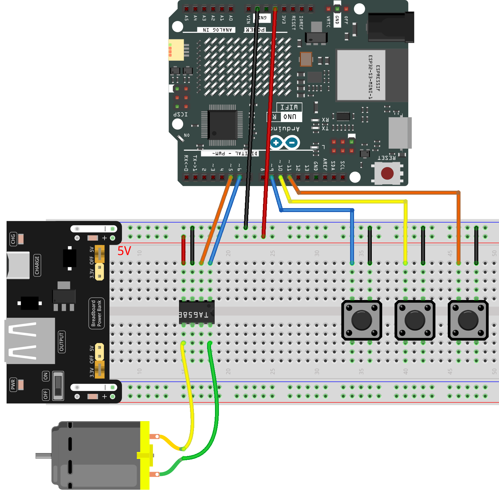

.. _mini_fan1.0:

Mini Fan 1.0
==============================================================

.. note::
  
  🌟 Welcome to the SunFounder Facebook Community! Whether you're into Raspberry Pi, Arduino, or ESP32, you'll find inspiration, help ideas here.
   
  - ✅ Be the first to get free learning resources. 
   
  - ✅ Stay updated on new products & exclusive giveaways. 
   
  - ✅ Share your creations and get real feedback.
   
  * 👉 Need faster updates or support? Click [|link_sf_facebook|] join our Facebook community 

  * 👉 Or join our WhatsApp group: Click [|link_sf_whatsapp|]
   
  * 🎁 Looking for parts?Check out our all-in-one kits below — packed with components, beginner-friendly guides, and tons of fun.
  
  .. list-table::
    :widths: 20 20 20
    :header-rows: 1

    *   - Name	
        - Includes Arduino board
        - PURCHASE LINK
    *   - Elite Explorer Kit
        - Arduino Uno R4 WiFi
        - |link_elite_buy|
    *   - Universal Maker Sensor Kit
        - ×
        - |link_umsk_buy|
    *   - 3 in 1 Ultimate Starter Kit	
        - Arduino Uno R3
        - |link_arduinor3_buy|

Course Introduction
------------------------

This Arduino project controls a DC motor using a TA6586 motor driver and three push buttons. The blue button runs the motor at full speed in reverse, the yellow button runs it at half speed in reverse, and the red button stops the motor. The system uses PWM control to adjust speed and responds immediately to button input.

.. .. raw:: html

..  <iframe width="700" height="394" src="https://www.youtube.com/embed/-Mj8XJaiYu8?si=r1ppBlGEcnBetN3q" title="YouTube video player" frameborder="0" allow="accelerometer; autoplay; clipboard-write; encrypted-media; gyroscope; picture-in-picture; web-share" referrerpolicy="strict-origin-when-cross-origin" allowfullscreen></iframe>

.. note::

  If this is your first time working with an Arduino project, we recommend downloading and reviewing the basic materials first.
  
  * :ref:`install_arduino`
  * :ref:`introduce_arduino`

**Required Components**

In this project, we need the following components:

.. list-table::
    :widths: 5 20 5 20
    :header-rows: 1

    *   - SN
        - COMPONENT INTRODUCTION	
        - QUANTITY
        - PURCHASE LINK

    *   - 1
        - Arduino UNO R4 Minima/Arduino UNO R4 WIFI
        - 1
        - |link_arduinor4_buy|
    *   - 2
        - USB Cable
        - 1
        - 
    *   - 3
        - Breadboard
        - 1
        - |link_breadboard_buy|
    *   - 4
        - Wires
        - Several
        - |link_wires_buy|
    *   - 5
        - DC Motor
        - 1
        - |link_dcmotor_buy|
    *   - 6
        - TA6586 - Motor Driver Chip
        - 1
        - 
    *   - 7
        - Button
        - 3
        - |link_button_buy|
    *   - 7
        - Button
        - 3
        - |link_power_buy|

**Wiring**

**Common Connections:**

* **TA6586 - Motor Driver Chip**

  - **BI:** Connect to **6** on the Arduino.
  - **FI:** Connect to **5** on the Arduino.
  - **GND:** Connect to breadboard’s negative power bus.
  - **VCC:** Connect to breadboard’s red power bus.

* **DC Motor**

  - **GND:** Connect to **TA6586** B0.
  - **VCC:** Connect to **TA6586** F0.

* **Button1**

  - Connect to breadboard’s negative power bus.
  - Connect to **9** on the Arduino.

* **Button2**

  - Connect to breadboard’s negative power bus.
  - Connect to **10** on the Arduino.

* **Button3**

  - Connect to breadboard’s negative power bus.
  - Connect to **11** on the Arduino.

**Writing the Code**

.. note::

    * You can copy this code into **Arduino IDE**. 
    * Don't forget to select the board(Arduino UNO R4) and the correct port before clicking the **Upload** button.

.. code-block:: arduino

      // Control a motor using TA6586 driver and three buttons
      // Blue button: full speed (reverse direction)
      // Yellow button: half speed (reverse direction)
      // Red button: stop

      const int fiPin = 5;     // Forward Input pin of TA6586
      const int biPin = 6;     // Backward Input pin of TA6586

      const int blueBtn = 9;   // Blue button pin - full speed
      const int yellowBtn = 10;// Yellow button pin - half speed
      const int redBtn = 11;   // Red button pin - stop

      void setup() {
        // Set motor control pins as outputs
        pinMode(fiPin, OUTPUT);
        pinMode(biPin, OUTPUT);

        // Set button pins as inputs with internal pull-up resistors
        // (HIGH when not pressed, LOW when pressed)
        pinMode(blueBtn, INPUT_PULLUP);
        pinMode(yellowBtn, INPUT_PULLUP);
        pinMode(redBtn, INPUT_PULLUP);
      }

      void loop() {
        // When the blue button is pressed: full speed reverse
        if (digitalRead(blueBtn) == LOW) {
          analogWrite(biPin, 255);  // Full speed reverse
          analogWrite(fiPin, 0);    // Stop forward output
        } 
        // When the yellow button is pressed: half speed reverse
        else if (digitalRead(yellowBtn) == LOW) {
          analogWrite(biPin, 128);  // Half speed reverse
          analogWrite(fiPin, 0);
        } 
        // When the red button is pressed: stop the motor
        else if (digitalRead(redBtn) == LOW) {
          analogWrite(biPin, 0);
          analogWrite(fiPin, 0);
        }
      }
