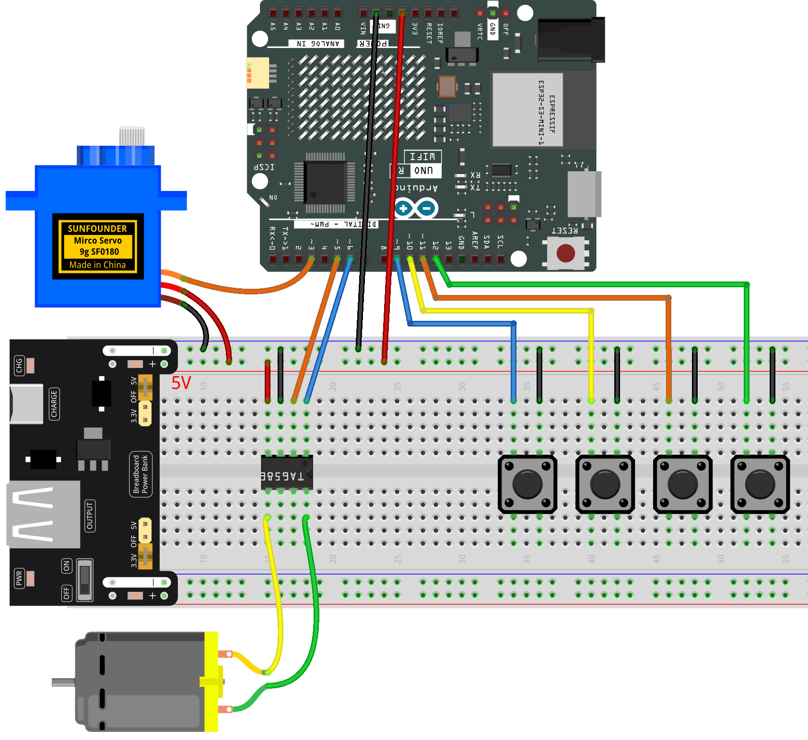

.. _mini_fan2.0:

Mini Fan 2.0
==============================================================

.. note::
  
  🌟 Welcome to the SunFounder Facebook Community! Whether you're into Raspberry Pi, Arduino, or ESP32, you'll find inspiration, help ideas here.
   
  - ✅ Be the first to get free learning resources. 
   
  - ✅ Stay updated on new products & exclusive giveaways. 
   
  - ✅ Share your creations and get real feedback.
   
  * 👉 Need faster updates or support? Click [|link_sf_facebook|] join our Facebook community 

  * 👉 Or join our WhatsApp group: Click [|link_sf_whatsapp|]
   
  * 🎁 Looking for parts?Check out our all-in-one kits below — packed with components, beginner-friendly guides, and tons of fun.
  
  .. list-table::
    :widths: 20 20 20
    :header-rows: 1

    *   - Name	
        - Includes Arduino board
        - PURCHASE LINK
    *   - Elite Explorer Kit
        - Arduino Uno R4 WiFi
        - |link_elite_buy|
    *   - Universal Maker Sensor Kit
        - ×
        - |link_umsk_buy|
    *   - 3 in 1 Ultimate Starter Kit	
        - Arduino Uno R3
        - |link_arduinor3_buy|

Course Introduction
------------------------

This Arduino project controls a DC motor using a TA6586 motor driver and four push buttons. The system uses PWM control to adjust speed and responds immediately to button input.

.. .. raw:: html

..  <iframe width="700" height="394" src="https://www.youtube.com/embed/-Mj8XJaiYu8?si=r1ppBlGEcnBetN3q" title="YouTube video player" frameborder="0" allow="accelerometer; autoplay; clipboard-write; encrypted-media; gyroscope; picture-in-picture; web-share" referrerpolicy="strict-origin-when-cross-origin" allowfullscreen></iframe>

.. note::

  If this is your first time working with an Arduino project, we recommend downloading and reviewing the basic materials first.
  
  * :ref:`install_arduino`
  * :ref:`introduce_arduino`

**Required Components**

In this project, we need the following components:

.. list-table::
    :widths: 5 20 5 20
    :header-rows: 1

    *   - SN
        - COMPONENT INTRODUCTION	
        - QUANTITY
        - PURCHASE LINK

    *   - 1
        - Arduino UNO R4 Minima/Arduino UNO R4 WIFI
        - 1
        - |link_arduinor4_buy|
    *   - 2
        - USB Cable
        - 1
        - 
    *   - 3
        - Breadboard
        - 1
        - |link_breadboard_buy|
    *   - 4
        - Wires
        - Several
        - |link_wires_buy|
    *   - 5
        - DC Motor
        - 1
        - |link_dcmotor_buy|
    *   - 6
        - TA6586 - Motor Driver Chip
        - 1
        - 
    *   - 7
        - Button
        - 3
        - |link_button_buy|
    *   - 7
        - Button
        - 4
        - |link_power_buy|

**Wiring**

**Common Connections:**

* **TA6586 - Motor Driver Chip**

  - **BI:** Connect to **6** on the Arduino.
  - **FI:** Connect to **5** on the Arduino.
  - **GND:** Connect to breadboard’s negative power bus.
  - **VCC:** Connect to breadboard’s red power bus.

* **DC Motor**

  - **GND:** Connect to **TA6586** B0.
  - **VCC:** Connect to **TA6586** F0.

* **Button1**

  - Connect to breadboard’s negative power bus.
  - Connect to **9** on the Arduino.

* **Button2**

  - Connect to breadboard’s negative power bus.
  - Connect to **10** on the Arduino.

* **Button3**

  - Connect to breadboard’s negative power bus.
  - Connect to **11** on the Arduino.

* **Button4**

  - Connect to breadboard’s negative power bus.
  - Connect to **12** on the Arduino.

**Writing the Code**

.. note::

    * You can copy this code into **Arduino IDE**. 
    * Don't forget to select the board(Arduino UNO R4) and the correct port before clicking the **Upload** button.

.. code-block:: arduino

      #include <Servo.h>

      // ===== Motor Control =====
      const int fiPin = 5;
      const int biPin = 6;
      const int blueBtn = 9;
      const int yellowBtn = 10;
      const int redBtn = 11;

      // ===== Servo Control =====
      Servo servo;
      const int servoPin = 3;
      const int greenBtn = 12;

      // ===== Variables =====
      int fanSpeed = 0;            // 0=off, 128=half, 255=full
      int angle = 90;              // Start centered
      int direction = 1;           // 1=right, -1=left
      bool servoActive = false;    // Whether oscillation is active
      bool lastBtnState = HIGH;    // For toggle detection

      // ===== Servo Limits =====
      const int leftLimit = 45;
      const int rightLimit = 135;

      void setup() {
        // Motor setup
        pinMode(fiPin, OUTPUT);
        pinMode(biPin, OUTPUT);
        pinMode(blueBtn, INPUT_PULLUP);
        pinMode(yellowBtn, INPUT_PULLUP);
        pinMode(redBtn, INPUT_PULLUP);

        // Servo setup
        servo.attach(servoPin);
        pinMode(greenBtn, INPUT_PULLUP);
        servo.write(angle); // Start at center
      }

      void loop() {
        // ===== Fan Speed Control =====
        if (digitalRead(blueBtn) == LOW) {
          fanSpeed = 255; // Full speed
        } else if (digitalRead(yellowBtn) == LOW) {
          fanSpeed = 128; // Half speed
        } else if (digitalRead(redBtn) == LOW) {
          fanSpeed = 0;   // Stop
        }

        // Apply fan speed
        if (fanSpeed > 0) {
          analogWrite(biPin, fanSpeed);
          analogWrite(fiPin, 0);
        } else {
          analogWrite(biPin, 0);
          analogWrite(fiPin, 0);
        }

        // ===== Green Button Toggle =====
        bool currentBtnState = digitalRead(greenBtn);
        if (lastBtnState == HIGH && currentBtnState == LOW) {
          servoActive = !servoActive;  // Toggle oscillation
        }
        lastBtnState = currentBtnState;

        // ===== Servo Logic =====
        if (fanSpeed == 0) {
          // Fan off → stop servo immediately (keep current angle)
          servoActive = false;
          delay(10);
          return;
        }

        if (servoActive) {
          // Oscillation active: swing between 45° and 135°
          angle += direction;
          if (angle >= rightLimit) direction = -1;
          if (angle <= leftLimit)  direction = 1;
          servo.write(angle);
          delay(30); // Movement speed (slower = smoother)
        }
        // When servoActive is false and fan running, servo holds its last angle
      }
