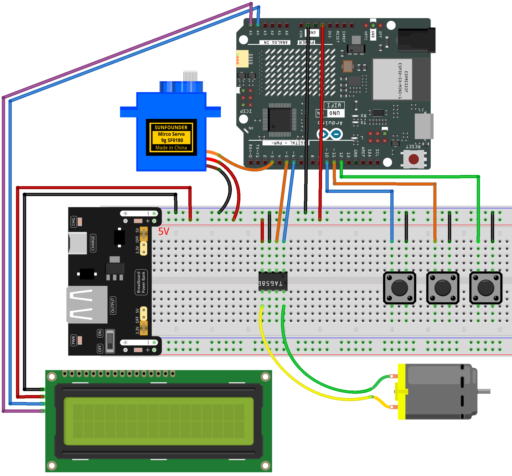

.. _mini_fan3.0:

Mini Fan 3.0
==============================================================

.. note::
  
  🌟 Welcome to the SunFounder Facebook Community! Whether you're into Raspberry Pi, Arduino, or ESP32, you'll find inspiration, help ideas here.
   
  - ✅ Be the first to get free learning resources. 
   
  - ✅ Stay updated on new products & exclusive giveaways. 
   
  - ✅ Share your creations and get real feedback.
   
  * 👉 Need faster updates or support? Click [|link_sf_facebook|] join our Facebook community 

  * 👉 Or join our WhatsApp group: Click [|link_sf_whatsapp|]
   
  * 🎁 Looking for parts?Check out our all-in-one kits below — packed with components, beginner-friendly guides, and tons of fun.
  
  .. list-table::
    :widths: 20 20 20
    :header-rows: 1

    *   - Name	
        - Includes Arduino board
        - PURCHASE LINK
    *   - Elite Explorer Kit
        - Arduino Uno R4 WiFi
        - |link_elite_buy|
    *   - Universal Maker Sensor Kit
        - ×
        - |link_umsk_buy|
    *   - 3 in 1 Ultimate Starter Kit	
        - Arduino Uno R3
        - |link_arduinor3_buy|

Course Introduction
------------------------

This Arduino project controls a DC motor using a TA6586 motor driver and three push buttons and I2C LCD. The blue button runs the motor at full speed in reverse, the yellow button runs it at half speed in reverse, and the red button stops the motor. The system uses PWM control to adjust speed and responds immediately to button input.

.. .. raw:: html

..  <iframe width="700" height="394" src="https://www.youtube.com/embed/-Mj8XJaiYu8?si=r1ppBlGEcnBetN3q" title="YouTube video player" frameborder="0" allow="accelerometer; autoplay; clipboard-write; encrypted-media; gyroscope; picture-in-picture; web-share" referrerpolicy="strict-origin-when-cross-origin" allowfullscreen></iframe>

.. note::

  If this is your first time working with an Arduino project, we recommend downloading and reviewing the basic materials first.
  
  * :ref:`install_arduino`
  * :ref:`introduce_arduino`

**Required Components**

In this project, we need the following components:

.. list-table::
    :widths: 5 20 5 20
    :header-rows: 1

    *   - SN
        - COMPONENT INTRODUCTION	
        - QUANTITY
        - PURCHASE LINK

    *   - 1
        - Arduino UNO R4 Minima/Arduino UNO R4 WIFI
        - 1
        - |link_arduinor4_buy|
    *   - 2
        - USB Cable
        - 1
        - 
    *   - 3
        - Breadboard
        - 1
        - |link_breadboard_buy|
    *   - 4
        - Wires
        - Several
        - |link_wires_buy|
    *   - 5
        - DC Motor
        - 1
        - |link_dcmotor_buy|
    *   - 6
        - TA6586 - Motor Driver Chip
        - 1
        - 
    *   - 7
        - Button
        - 3
        - |link_button_buy|
    *   - 7
        - Button
        - 3
        - |link_power_buy|
    *   - 8
        - I2C LCD 1602
        - 1
        - |link_i2clcd1602_buy|

**Wiring**

**Common Connections:**

* **TA6586 - Motor Driver Chip**

  - **BI:** Connect to **6** on the Arduino.
  - **FI:** Connect to **5** on the Arduino.
  - **GND:** Connect to breadboard’s negative power bus.
  - **VCC:** Connect to breadboard’s red power bus.

* **DC Motor**

  - **GND:** Connect to **TA6586** B0.
  - **VCC:** Connect to **TA6586** F0.

* **Button1**

  - Connect to breadboard’s negative power bus.
  - Connect to **9** on the Arduino.

* **Button2**

  - Connect to breadboard’s negative power bus.
  - Connect to **10** on the Arduino.

* **Button3**

  - Connect to breadboard’s negative power bus.
  - Connect to **11** on the Arduino.

* **I2C LCD 1602**

  - **SDA:** Connect to **A4** on the Arduino.
  - **SCL:** Connect to **A5** on the Arduino.
  - **GND:** Connect to breadboard’s negative power bus.
  - **VCC:** Connect to breadboard’s red power bus.

**Writing the Code**

.. note::

    * You can copy this code into **Arduino IDE**. 
    * To install the library, use the Arduino Library Manager and search for **LiquidCrystal I2C** and install it.
    * Don't forget to select the board(Arduino UNO R4) and the correct port before clicking the **Upload** button.

.. code-block:: arduino

      #include <Servo.h>
      #include <Wire.h>
      #include <LiquidCrystal_I2C.h>

      // ===== Pin definitions =====
      const int fiPin = 5;      // Motor control pin
      const int biPin = 6;      // Motor control pin
      const int blueBtn = 10;   // Blue button: change speed level
      const int redBtn = 11;    // Red button: turn off the fan
      const int greenBtn = 12;  // Green button: toggle servo swing
      const int servoPin = 3;   // Servo control pin

      // ===== Create objects =====
      Servo servo;
      LiquidCrystal_I2C lcd(0x27, 16, 2); // LCD address 0x27, 16x2 screen

      // ===== Variables =====
      int speedLevel = 0;          // 0=OFF, 1=Low, 2=Mid, 3=High
      bool swingActive = false;    // Whether the servo swing is ON or OFF
      int angle = 90;              // Servo starting angle (center position)
      int direction = 1;           // 1=right, -1=left (for swing movement)
      bool lastBlue = HIGH;        // Store last blue button state
      bool lastRed = HIGH;         // Store last red button state
      bool lastGreen = HIGH;       // Store last green button state

      // ===== Servo movement range =====
      const int leftLimit = 45;
      const int rightLimit = 135;

      // ===== Servo timing (non-blocking) =====
      unsigned long lastServoMove = 0;
      const unsigned long servoInterval = 30;  // Move every 30ms

      void setup() {
        // ===== Pin setup =====
        pinMode(fiPin, OUTPUT);
        pinMode(biPin, OUTPUT);
        pinMode(blueBtn, INPUT_PULLUP);
        pinMode(redBtn, INPUT_PULLUP);
        pinMode(greenBtn, INPUT_PULLUP);

        // ===== Servo setup =====
        servo.attach(servoPin);
        servo.write(angle); // Move servo to center

        // ===== LCD setup =====
        lcd.init();          // Initialize LCD
        lcd.backlight();     // Turn on backlight
        lcd.clear();         // Clear screen
        updateLCD();         // Show initial message
      }

      void loop() {
        // ===== Read button states =====
        bool blueState = digitalRead(blueBtn);
        bool redState = digitalRead(redBtn);
        bool greenState = digitalRead(greenBtn);

        // ===== Blue button: switch fan speed =====
        // Each press changes speed: 1 → 2 → 3 → 1
        if (lastBlue == HIGH && blueState == LOW) {
          speedLevel++;
          if (speedLevel > 3) speedLevel = 1;
          updateLCD();
        }

        // ===== Red button: turn off the fan =====
        // Stop motor and servo
        if (lastRed == HIGH && redState == LOW) {
          speedLevel = 0;
          swingActive = false;
          updateLCD();
        }

        // ===== Green button: toggle servo swing =====
        // Only works when the fan is ON
        if (lastGreen == HIGH && greenState == LOW) {
          if (speedLevel > 0) {
            swingActive = !swingActive;
            updateLCD();
          }
        }

        // Save last button states
        lastBlue = blueState;
        lastRed = redState;
        lastGreen = greenState;

        // ===== Control fan speed =====
        int fanSpeed = 0;
        if (speedLevel == 1) fanSpeed = 100;
        else if (speedLevel == 2) fanSpeed = 180;
        else if (speedLevel == 3) fanSpeed = 255;
        else fanSpeed = 0;

        // Apply speed to the motor (PWM control)
        if (fanSpeed > 0) {
          analogWrite(biPin, fanSpeed);
          analogWrite(fiPin, 0);
        } else {
          analogWrite(biPin, 0);
          analogWrite(fiPin, 0);
        }

        // ===== Servo swing motion =====
        // Move servo back and forth when swing is active
        if (swingActive && speedLevel > 0) {
          unsigned long currentMillis = millis();
          if (currentMillis - lastServoMove >= servoInterval) {
            lastServoMove = currentMillis;

            angle += direction;
            if (angle >= rightLimit) direction = -1;
            if (angle <= leftLimit) direction = 1;

            servo.write(angle);
          }
        }
      }

      // ===== LCD display update function =====
      // Refreshes the LCD when fan speed or swing state changes
      void updateLCD() {
        lcd.clear();

        // Line 1: Fan speed and state
        lcd.setCursor(0, 0);
        lcd.print("Fan Speed: ");
        if (speedLevel == 0) lcd.print("OFF");
        else lcd.print(speedLevel);

        // Line 2: Swing status
        lcd.setCursor(0, 1);
        lcd.print("Swing: ");
        if (speedLevel == 0) lcd.print("--");
        else lcd.print(swingActive ? "ON " : "OFF");
      }
