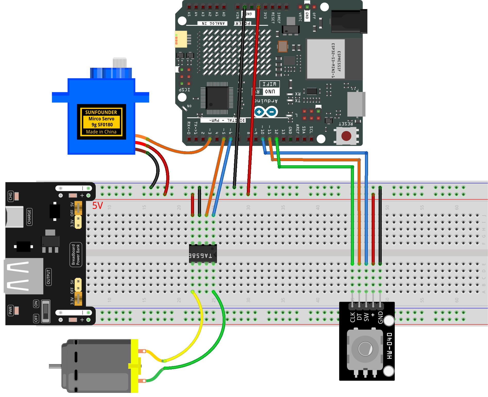

.. _mini_fan4.0:

Mini Fan 4.0
==============================================================

.. note::
  
  🌟 Welcome to the SunFounder Facebook Community! Whether you're into Raspberry Pi, Arduino, or ESP32, you'll find inspiration, help ideas here.
   
  - ✅ Be the first to get free learning resources. 
   
  - ✅ Stay updated on new products & exclusive giveaways. 
   
  - ✅ Share your creations and get real feedback.
   
  * 👉 Need faster updates or support? Click [|link_sf_facebook|] join our Facebook community 

  * 👉 Or join our WhatsApp group: Click [|link_sf_whatsapp|]
   
  * 🎁 Looking for parts?Check out our all-in-one kits below — packed with components, beginner-friendly guides, and tons of fun.
  
  .. list-table::
    :widths: 20 20 20
    :header-rows: 1

    *   - Name	
        - Includes Arduino board
        - PURCHASE LINK
    *   - Elite Explorer Kit
        - Arduino Uno R4 WiFi
        - |link_elite_buy|
    *   - Universal Maker Sensor Kit
        - ×
        - |link_umsk_buy|
    *   - 3 in 1 Ultimate Starter Kit	
        - Arduino Uno R3
        - |link_arduinor3_buy|

Course Introduction
------------------------

In this lesson, you’ll create a simple control system using a rotary encoder to steer a servo and adjust fan speed. Turning the encoder changes the servo angle, while pressing the button cycles through multiple fan speed levels.

.. raw:: html

  <iframe width="700" height="394" src="https://www.youtube.com/embed/bLl84Oqkltg" title="YouTube video player" frameborder="0" allow="accelerometer; autoplay; clipboard-write; encrypted-media; gyroscope; picture-in-picture; web-share" referrerpolicy="strict-origin-when-cross-origin" allowfullscreen></iframe>

.. note::

  If this is your first time working with an Arduino project, we recommend downloading and reviewing the basic materials first.
  
  * :ref:`install_arduino`
  * :ref:`introduce_arduino`

**Required Components**

In this project, we need the following components:

.. list-table::
    :widths: 5 20 5 20
    :header-rows: 1

    *   - SN
        - COMPONENT INTRODUCTION	
        - QUANTITY
        - PURCHASE LINK

    *   - 1
        - Arduino UNO R4 Minima/Arduino UNO R4 WIFI
        - 1
        - |link_arduinor4_buy|
    *   - 2
        - USB Cable
        - 1
        - 
    *   - 3
        - Breadboard
        - 1
        - |link_breadboard_buy|
    *   - 4
        - Wires
        - Several
        - |link_wires_buy|
    *   - 5
        - DC Motor
        - 1
        - |link_dcmotor_buy|
    *   - 6
        - TA6586 - Motor Driver Chip
        - 1
        - 
    *   - 7
        - Rotary Encoder Module
        - 1
        - |link_rotary_encoder_buy|
    *   - 8
        - Digital Servo Motor
        - 1
        - |link_motor_buy|

**Wiring**

**Common Connections:**

* **TA6586 - Motor Driver Chip**

  - **BI:** Connect to **6** on the Arduino.
  - **FI:** Connect to **5** on the Arduino.
  - **GND:** Connect to breadboard’s negative power bus.
  - **VCC:** Connect to breadboard’s red power bus.

* **DC Motor**

  - **GND:** Connect to **TA6586** B0.
  - **VCC:** Connect to **TA6586** F0.

* **Rotary Encoder Module**

  - **CLK:** Connect to **12** on the Arduino.
  - **DT:** Connect to **11** on the Arduino.
  - **SW:** Connect to **10** on the Arduino.
  - **GND:** Connect to breadboard’s negative power bus.
  - **VCC:** Connect to breadboard’s red power bus.

* **Digital Servo Motor**

  - Connect to breadboard’s positive power bus.
  - Connect to breadboard’s negative power bus.
  - Connect to **3** on the Arduino.

**Writing the Code**

.. note::

    * You can copy this code into **Arduino IDE**. 
    * Don't forget to select the board(Arduino UNO R4) and the correct port before clicking the **Upload** button.

.. code-block:: arduino

      #include <Servo.h>

      // Fan motor pins
      const int fiPin = 5;   // fixed LOW in this project
      const int biPin = 6;   // PWM output to control fan speed

      // Servo setup
      Servo servo;
      const int servoPin = 3;   // servo signal pin

      // Rotary encoder pins
      const int CLK = 12;    // main signal: detects rotation steps
      const int DT  = 11;    // direction signal
      const int SW  = 10;    // encoder button (LOW when pressed)

      // Variables for encoder reading
      int lastCLK = HIGH;              // used to detect edge
      unsigned long lastPress = 0;     // debounce timer for SW

      // Servo angle control
      int angle = 90;                  // starting angle
      const int angleMin = 45;         // left limit
      const int angleMax = 135;        // right limit
      const int angleStep = 2;         // angle change per encoder step

      // Fan gear control
      int gear = 0;                    // 0~3 speed levels
      int fanSpeed = 0;                // actual PWM value

      void setup() {
        // Motor pins
        pinMode(fiPin, OUTPUT);
        pinMode(biPin, OUTPUT);

        // Encoder pins
        pinMode(CLK, INPUT);
        pinMode(DT, INPUT);
        pinMode(SW, INPUT_PULLUP);     // button is active LOW

        // Servo setup
        servo.attach(servoPin);
        servo.write(angle);
      }

      void loop() {

        // ===============================
        // Read encoder rotation
        // ===============================
        int currentCLK = digitalRead(CLK);

        // Detect the rising edge of CLK (means one "tick")
        if (currentCLK != lastCLK && currentCLK == HIGH) {

          // Compare DT to decide direction
          if (digitalRead(DT) == currentCLK) {
            angle += angleStep;       // clockwise → angle increases
          } else {
            angle -= angleStep;       // counterclockwise → angle decreases
          }

          // Keep the servo angle inside safe limits
          angle = constrain(angle, angleMin, angleMax);

          // Move servo to new angle
          servo.write(angle);
        }

        lastCLK = currentCLK;

        // ===============================
        // Read encoder button (SW)
        // ===============================
        // Button pressed (active LOW)
        if (digitalRead(SW) == LOW) {

          // Simple debounce check
          if (millis() - lastPress > 300) {

            gear++;                   // next speed level

            if (gear > 3) gear = 0;   // wrap around (0→1→2→3→0...)

            lastPress = millis();
          }
        }

        // ===============================
        // Convert gear level to PWM speed
        // ===============================
        if (gear == 0) fanSpeed = 0;      // fan off
        if (gear == 1) fanSpeed = 85;     // low
        if (gear == 2) fanSpeed = 170;    // medium
        if (gear == 3) fanSpeed = 255;    // high

        // ===============================
        // Output speed to fan motor
        // ===============================
        if (fanSpeed > 0) {
          analogWrite(biPin, fanSpeed);   // send PWM speed
          analogWrite(fiPin, 0);          // keep opposite pin LOW
        } else {
          analogWrite(biPin, 0);          // stop fan
          analogWrite(fiPin, 0);
        }
      }
