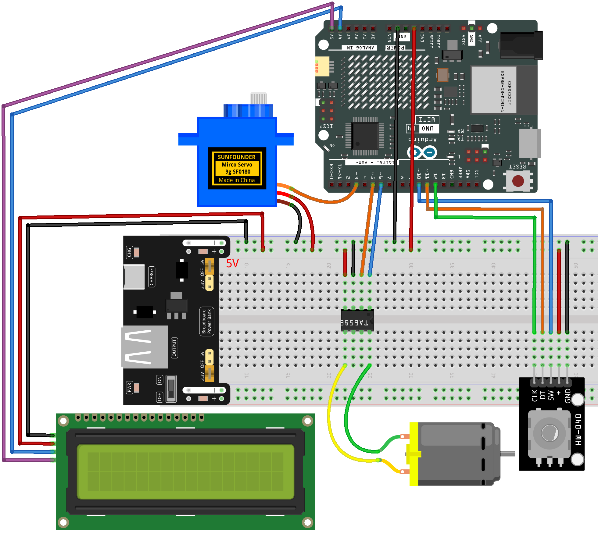

.. _mini_fan5.0:

Mini Fan 5.0
==============================================================

.. note::
  
  🌟 Welcome to the SunFounder Facebook Community! Whether you're into Raspberry Pi, Arduino, or ESP32, you'll find inspiration, help ideas here.
   
  - ✅ Be the first to get free learning resources. 
   
  - ✅ Stay updated on new products & exclusive giveaways. 
   
  - ✅ Share your creations and get real feedback.
   
  * 👉 Need faster updates or support? Click [|link_sf_facebook|] join our Facebook community 

  * 👉 Or join our WhatsApp group: Click [|link_sf_whatsapp|]
   
  * 🎁 Looking for parts?Check out our all-in-one kits below — packed with components, beginner-friendly guides, and tons of fun.
  
  .. list-table::
    :widths: 20 20 20
    :header-rows: 1

    *   - Name	
        - Includes Arduino board
        - PURCHASE LINK
    *   - Elite Explorer Kit
        - Arduino Uno R4 WiFi
        - |link_elite_buy|
    *   - Universal Maker Sensor Kit
        - ×
        - |link_umsk_buy|
    *   - 3 in 1 Ultimate Starter Kit	
        - Arduino Uno R3
        - |link_arduinor3_buy|

Course Introduction
------------------------

In this lesson, you’ll build a smart fan controller using a rotary encoder, a servo, an LCD, and PWM motor control. Turning the encoder adjusts the servo angle, pressing the button switches between fan speed levels, and the LCD displays real-time angle and gear information.

.. .. raw:: html

..  <iframe width="700" height="394" src="https://www.youtube.com/embed/bZO4OpmED8Q?si=6ALka2jfbTiNw24M" title="YouTube video player" frameborder="0" allow="accelerometer; autoplay; clipboard-write; encrypted-media; gyroscope; picture-in-picture; web-share" referrerpolicy="strict-origin-when-cross-origin" allowfullscreen></iframe>

.. note::

  If this is your first time working with an Arduino project, we recommend downloading and reviewing the basic materials first.
  
  * :ref:`install_arduino`
  * :ref:`introduce_arduino`

**Required Components**

In this project, we need the following components:

.. list-table::
    :widths: 5 20 5 20
    :header-rows: 1

    *   - SN
        - COMPONENT INTRODUCTION	
        - QUANTITY
        - PURCHASE LINK

    *   - 1
        - Arduino UNO R4 Minima/Arduino UNO R4 WIFI
        - 1
        - |link_arduinor4_buy|
    *   - 2
        - USB Cable
        - 1
        - 
    *   - 3
        - Breadboard
        - 1
        - |link_breadboard_buy|
    *   - 4
        - Wires
        - Several
        - |link_wires_buy|
    *   - 5
        - DC Motor
        - 1
        - |link_dcmotor_buy|
    *   - 6
        - TA6586 - Motor Driver Chip
        - 1
        - 
    *   - 7
        - Rotary Encoder Module
        - 1
        - |link_rotary_encoder_buy|
    *   - 8
        - Digital Servo Motor
        - 1
        - |link_motor_buy|
    *   - 9
        - I2C LCD 1602
        - 1
        - |link_i2clcd1602_buy|

**Wiring**

**Common Connections:**

* **TA6586 - Motor Driver Chip**

  - **BI:** Connect to **6** on the Arduino.
  - **FI:** Connect to **5** on the Arduino.
  - **GND:** Connect to breadboard’s negative power bus.
  - **VCC:** Connect to breadboard’s red power bus.

* **DC Motor**

  - **GND:** Connect to **TA6586** B0.
  - **VCC:** Connect to **TA6586** F0.

* **Rotary Encoder Module**

  - **CLK:** Connect to **12** on the Arduino.
  - **DT:** Connect to **11** on the Arduino.
  - **SW:** Connect to **10** on the Arduino.
  - **GND:** Connect to breadboard’s negative power bus.
  - **VCC:** Connect to breadboard’s red power bus.

* **Digital Servo Motor**

  - Connect to breadboard’s positive power bus.
  - Connect to breadboard’s negative power bus.
  - Connect to **3** on the Arduino.

* **I2C LCD 1602**

  - **SDA:** Connect to **A4** on the Arduino.
  - **SCL:** Connect to **A5** on the Arduino.
  - **GND:** Connect to breadboard’s negative power bus.
  - **VCC:** Connect to breadboard’s red power bus.

**Writing the Code**

.. note::

    * You can copy this code into **Arduino IDE**. 
    * To install the library, use the Arduino Library Manager and search for **LiquidCrystal I2C** and install it.
    * Don't forget to select the board(Arduino UNO R4) and the correct port before clicking the **Upload** button.

.. code-block:: arduino

      #include <Servo.h>
      #include <Wire.h>
      #include <LiquidCrystal_I2C.h>

      // LCD using I2C (address may be 0x27 or 0x3F)
      LiquidCrystal_I2C lcd(0x27, 16, 2);

      // Fan output pins
      const int fiPin = 5;   
      const int biPin = 6;   

      // Servo
      Servo servo;
      const int servoPin = 3;

      // Rotary encoder pins
      const int CLK = 12;    // rotation signal A
      const int DT  = 11;    // rotation signal B
      const int SW  = 10;    // push button (LOW when pressed)

      // Encoder state tracking
      int lastCLK = HIGH;
      unsigned long lastPress = 0;

      // Servo angle settings
      int angle = 90;
      const int angleMin = 45;
      const int angleMax = 135;
      const int angleStep = 5;   // rotate encoder = change 5 degrees

      // Fan gear levels (0 = off)
      int gear = 0;
      int fanSpeed = 0;

      // LCD update tracking
      int lastAngle = -1;
      int lastGear  = -1;

      void setup() {
        // Motor pins
        pinMode(fiPin, OUTPUT);
        pinMode(biPin, OUTPUT);

        // Encoder pins with pull-ups for stable signals
        pinMode(CLK, INPUT_PULLUP);
        pinMode(DT,  INPUT_PULLUP);
        pinMode(SW,  INPUT_PULLUP);

        // Servo setup
        servo.attach(servoPin);
        servo.write(angle);

        // LCD setup
        lcd.init();
        lcd.backlight();
        lcd.clear();
      }

      void loop() {

        // ----------------------------------------------------
        // Read rotary encoder rotation
        // Only allowed when fan gear > 0 (fan ON)
        // Falling edge of CLK gives stable step detection
        // ----------------------------------------------------
        int currentCLK = digitalRead(CLK);

        if (currentCLK == LOW && lastCLK == HIGH) {

          if (gear > 0) {   // servo locked when gear = 0 (fan OFF)

            // Determine rotation direction
            if (digitalRead(DT) == HIGH) {
              angle += angleStep;    // clockwise
            } else {
              angle -= angleStep;    // counterclockwise
            }

            // Keep angle within safe limits
            angle = constrain(angle, angleMin, angleMax);
            servo.write(angle);
          }
        }
        lastCLK = currentCLK;

        // ----------------------------------------------------
        // Change fan gear (0 → 3) when encoder button pressed
        // ----------------------------------------------------
        if (digitalRead(SW) == LOW) {
          if (millis() - lastPress > 300) {   // debounce

            gear++;
            if (gear > 3) gear = 0;           // loop back

            lastPress = millis();
          }
        }

        // ----------------------------------------------------
        // Convert gear level to fan PWM value
        // ----------------------------------------------------
        if (gear == 0) fanSpeed = 0;
        if (gear == 1) fanSpeed = 85;
        if (gear == 2) fanSpeed = 170;
        if (gear == 3) fanSpeed = 255;

        analogWrite(biPin, fanSpeed);
        analogWrite(fiPin, 0); // fixed LOW direction

        // ----------------------------------------------------
        // Update LCD only when values change
        // Reduces I2C traffic → prevents encoder lag
        // ----------------------------------------------------
        if (angle != lastAngle || gear != lastGear) {

          lcd.setCursor(0, 0);
          lcd.print("Angle:");
          lcd.print(angle);
          lcd.print("   ");

          lcd.setCursor(0, 1);
          lcd.print("Gear:");
          lcd.print(gear);
          lcd.print(" PWM:");
          lcd.print(fanSpeed);
          lcd.print("   ");

          lastAngle = angle;
          lastGear  = gear;
        }
      }
