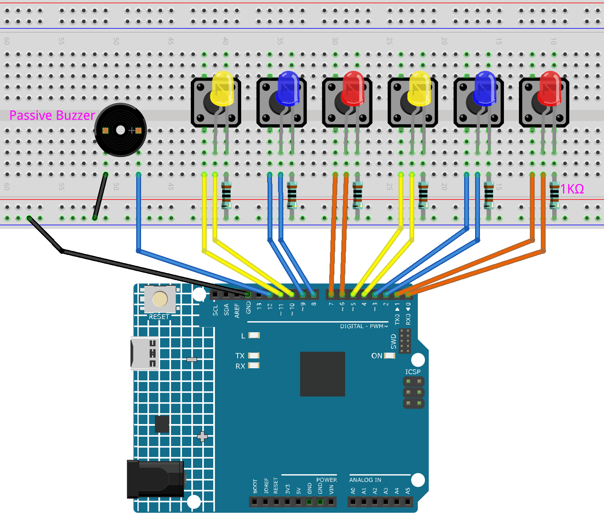

.. _mini_piano:

Mini Piano
==============================================================
.. note::
  
  Hello, welcome to the SunFounder Raspberry Pi & Arduino & ESP32 Enthusiasts Community on Facebook! Dive deeper into Raspberry Pi, Arduino, and ESP32 with fellow enthusiasts.

  👉 Ready to explore and create with us? Click [|link_sf_facebook|] and join today!

  To get all the components for this project, consider one of the kits below. 

  Each includes the required parts, extra components for other projects, and beginner-friendly tutorials.

  .. list-table::
    :widths: 20 20 20
    :header-rows: 1

    *   - Name	
        - Includes Arduino board
        - PURCHASE LINK
    *   - Electronic Kit	
        - ×
        - |link_electronic_buy|
    *   - Elite Explorer Kit	
        - ×
        - |link_elite_buy|
    *   - 3 in 1 Ultimate Starter Kit	
        - √
        - |link_arduinor4_buy|

Course Introduction
------------------------

In this lesson, you'll learn how to create a mini piano using LEDs, buttons, and a passive buzzer with Arduino. 

Pressing different buttons will light up the corresponding LED and play the matching pitch on the buzzer.

 .. raw:: html

   <iframe width="700" height="394" src="https://www.youtube.com/embed/NqJJK9VHCTk?si=FN0CSh9UgaYauU8H" title="YouTube video player" frameborder="0" allow="accelerometer; autoplay; clipboard-write; encrypted-media; gyroscope; picture-in-picture; web-share" referrerpolicy="strict-origin-when-cross-origin" allowfullscreen></iframe>

.. note::

  If this is your first time working with an Arduino project, we recommend downloading and reviewing the basic materials first.
  
  * :ref:`install_arduino`
  * :ref:`introduce_arduino`

**Required Components**

In this project, we need the following components:

.. list-table::
    :widths: 5 20 5 20
    :header-rows: 1

    *   - SN
        - COMPONENT INTRODUCTION	
        - QUANTITY
        - PURCHASE LINK

    *   - 1
        - Arduino UNO R4 Minima
        - 1
        - |link_unor4_buy|
    *   - 2
        - USB Type-C cable
        - 1
        - 
    *   - 3
        - Breadboard
        - 1
        - |link_breadboard_buy|
    *   - 4
        - Wires
        - Several
        - |link_wires_buy|
    *   - 5
        - 1kΩ resistor
        - Several
        - |link_resistor_buy|
    *   - 6
        - Button
        - 3
        - |link_button_buy|
    *   - 7
        - LED
        - Several
        - |link_led_buy|
    *   - 8
        - Passive buzzer
        - 1
        - |link_passive_buzzer_buy|

**Wiring**

**Common Connections:**

* **LED**

  - Connect the LEDs **anode** to a **1kΩ resistor** then to the negative power bus on the breadboard, and the LEDs **cathode** to **10**, **8**, **6**, **4**, **2** on the Arduino.

* **Button**

  - Connect to the **LED's cathode** on the breadboard, then connect a 1kΩ resistor from the LED's negative terminal to the negative power bus on the breadboard.
  - Connect to Digital **11**, **9**, **7**, **5**, **3**, **1** on the Arduino.

* **Passive Buzzer**

  - **＋:** Connect to **12** on the Arduino.
  - **－:** Connect to breadboard’s negative power bus.

**Writing the Code**

.. note::

    * Before you begin, you need to upload the **pitches.h** library to your Arduino. Copy the contents of the library into the Arduino IDE, save it as **pitches.h** and then upload it to your Arduino.

.. code-block:: arduino

      /*************************************************
      * Public Constants
      *************************************************/

      #define NOTE_B0  31
      #define NOTE_C1  33
      #define NOTE_CS1 35
      #define NOTE_D1  37
      #define NOTE_DS1 39
      #define NOTE_E1  41
      #define NOTE_F1  44
      #define NOTE_FS1 46
      #define NOTE_G1  49
      #define NOTE_GS1 52
      #define NOTE_A1  55
      #define NOTE_AS1 58
      #define NOTE_B1  62
      #define NOTE_C2  65
      #define NOTE_CS2 69
      #define NOTE_D2  73
      #define NOTE_DS2 78
      #define NOTE_E2  82
      #define NOTE_F2  87
      #define NOTE_FS2 93
      #define NOTE_G2  98
      #define NOTE_GS2 104
      #define NOTE_A2  110
      #define NOTE_AS2 117
      #define NOTE_B2  123
      #define NOTE_C3  131
      #define NOTE_CS3 139
      #define NOTE_D3  147
      #define NOTE_DS3 156
      #define NOTE_E3  165
      #define NOTE_F3  175
      #define NOTE_FS3 185
      #define NOTE_G3  196
      #define NOTE_GS3 208
      #define NOTE_A3  220
      #define NOTE_AS3 233
      #define NOTE_B3  247
      #define NOTE_C4  262
      #define NOTE_CS4 277
      #define NOTE_D4  294
      #define NOTE_DS4 311
      #define NOTE_E4  330
      #define NOTE_F4  349
      #define NOTE_FS4 370
      #define NOTE_G4  392
      #define NOTE_GS4 415
      #define NOTE_A4  440
      #define NOTE_AS4 466
      #define NOTE_B4  494
      #define NOTE_C5  523
      #define NOTE_CS5 554
      #define NOTE_D5  587
      #define NOTE_DS5 622
      #define NOTE_E5  659
      #define NOTE_F5  698
      #define NOTE_FS5 740
      #define NOTE_G5  784
      #define NOTE_GS5 831
      #define NOTE_A5  880
      #define NOTE_AS5 932
      #define NOTE_B5  988
      #define NOTE_C6  1047
      #define NOTE_CS6 1109
      #define NOTE_D6  1175
      #define NOTE_DS6 1245
      #define NOTE_E6  1319
      #define NOTE_F6  1397
      #define NOTE_FS6 1480
      #define NOTE_G6  1568
      #define NOTE_GS6 1661
      #define NOTE_A6  1760
      #define NOTE_AS6 1865
      #define NOTE_B6  1976
      #define NOTE_C7  2093
      #define NOTE_CS7 2217
      #define NOTE_D7  2349
      #define NOTE_DS7 2489
      #define NOTE_E7  2637
      #define NOTE_F7  2794
      #define NOTE_FS7 2960
      #define NOTE_G7  3136
      #define NOTE_GS7 3322
      #define NOTE_A7  3520
      #define NOTE_AS7 3729
      #define NOTE_B7  3951
      #define NOTE_C8  4186
      #define NOTE_CS8 4435
      #define NOTE_D8  4699
      #define NOTE_DS8 4978

.. note::

    * You can copy this code into **Arduino IDE**. 
    * Don't forget to select the board(Arduino UNO R4 Minima) and the correct port before clicking the **Upload** button.
  
.. code-block:: arduino

      #include "pitches.h"

      // LED pin numbers (C, D, E, F, G, A)
      const int ledPins[6] = {0, 2, 4, 6, 8, 10};

      // Button pin numbers (C, D, E, F, G, A)
      const int buttonPins[6] = {1, 3, 5, 7, 9, 11};

      // Passive buzzer pin
      const int buzzerPin = 12;

      // Note frequencies (C4 to A4)
      const int noteFrequencies[6] = {
        NOTE_C4, NOTE_D4, NOTE_E4,
        NOTE_F4, NOTE_G4, NOTE_A4
      };

      // Length of each note in milliseconds
      const int noteDuration = 250;

      // Pause time between notes
      const int pauseDuration = 30;

      void setup() {
        // Set LED pins as outputs
        for (int i = 0; i < 6; i++) {
          pinMode(ledPins[i], OUTPUT);
        }

        // Set button pins as inputs with internal pull-up resistors
        for (int i = 0; i < 6; i++) {
          pinMode(buttonPins[i], INPUT_PULLUP);
        }

        pinMode(buzzerPin, OUTPUT);
      }

      void loop() {
        // Check each button
        for (int i = 0; i < 6; i++) {
          // Button is pressed when the pin reads LOW
          if (digitalRead(buttonPins[i]) == LOW) {
            playNote(i);
            delay(150); // Simple debounce delay
          }
        }
      }

      // Play a note and flash the matching LED
      void playNote(int index) {
        tone(buzzerPin, noteFrequencies[index], noteDuration);
        digitalWrite(ledPins[index], HIGH);  // Turn on LED
        delay(noteDuration);                 // Wait for note to finish
        digitalWrite(ledPins[index], LOW);   // Turn off LED
        noTone(buzzerPin);                   // Stop sound
        delay(pauseDuration);               // Short pause between notes
      }
