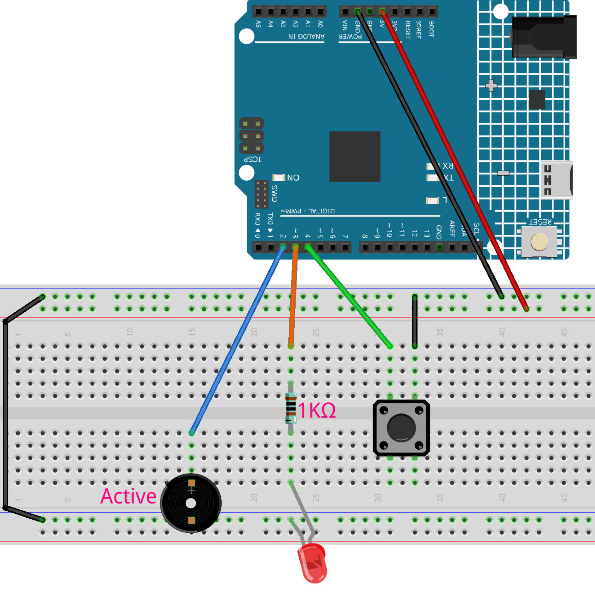

.. _morse_code:

Morse Code
==============================================================

.. note::
  
  🌟 Welcome to the SunFounder Facebook Community! Whether you're into Raspberry Pi, Arduino, or ESP32, you'll find inspiration, help ideas here.
   
  - ✅ Be the first to get free learning resources. 
   
  - ✅ Stay updated on new products & exclusive giveaways. 
   
  - ✅ Share your creations and get real feedback.
   
  * 👉 Need faster updates or support? Click [|link_sf_facebook|] join our Facebook community 

  * 👉 Or join our WhatsApp group: Click [|link_sf_whatsapp|]
   
   
Kit purchase
------------------------

Looking for parts? Check out our all-in-one kits below — packed with components, beginner-friendly guides, and tons of fun.

.. image:: img/elite_explore_kit.png
   :width: 100%
   :align: center
   :target: https://www.sunfounder.com/collections/arduino-kits-bundles/products/sunfounder-elite-explorer-kit-with-official-arduino-uno-r4-wifi?ref=jbzmncle

.. raw:: html

     

.. list-table::
   :widths: 20 20 20
   :header-rows: 1

   * - Name
     - Includes Arduino board
     - PURCHASE LINK
   * - Ultimate Sensor Kit
     - Arduino Uno R4 Minima
     - |link_ultimate_sensor_buy|
   * - Elite Explorer Kit
     - Arduino Uno R4 WiFi
     - |link_elite_buy|
   * - 3 in 1 Ultimate Starter Kit
     - Arduino Uno R4 Minima
     - |link_arduinor4_buy|
   * - Universal Maker Sensor Kit
     - ×
     - |link_umsk_buy|

Course Introduction
------------------------

In this lesson, you'll use a button, an LED, and a buzzer with the Arduino R4 UNO to create a simple Morse code trainer.

By pressing the button for short or long durations, you can input dots and dashes. The LED and buzzer provide immediate feedback, and the serial monitor displays whether you sent a dot (·) or a dash (—). This project is great for learning Morse code basics interactively.

.. raw:: html

  <iframe width="700" height="394" src="https://www.youtube.com/embed/itvyQ4JMRbU?si=e2y2_PAK3W2yfU3D" title="YouTube video player" frameborder="0" allow="accelerometer; autoplay; clipboard-write; encrypted-media; gyroscope; picture-in-picture; web-share" referrerpolicy="strict-origin-when-cross-origin" allowfullscreen></iframe>

.. note::

  If this is your first time working with an Arduino project, we recommend downloading and reviewing the basic materials first.
  
  * :ref:`install_arduino`
  * :ref:`introduce_arduino`

**Required Components**

In this project, we need the following components:

.. list-table::
    :widths: 5 20 5 20
    :header-rows: 1

    *   - SN
        - COMPONENT INTRODUCTION	
        - QUANTITY
        - PURCHASE LINK

    *   - 1
        - Arduino UNO R4 Minima
        - 1
        - |link_unor4_buy|
    *   - 2
        - USB Type-C cable
        - 1
        - 
    *   - 3
        - Breadboard
        - 1
        - |link_breadboard_buy|
    *   - 4
        - Wires
        - Several
        - |link_wires_buy|
    *   - 5
        - Passive Buzzer
        - 1
        - |link_passive_buzzer_buy|
    *   - 6
        - Button
        - 1
        - |link_button_buy|
    *   - 7
        - LED
        - 1
        - |link_led_buy|
    *   - 8
        - 1kΩ resistor
        - 1
        - |link_resistor_buy|

**Wiring**

**Common Connections:**

* **LED**

  - Connect the LED to a **1kΩ resistor**, then to **anode** to **3** on the Arduino, and the **cathode** to  the negative power bus on the breadboard.

* **Passive Buzzer**

  - **＋:** Connect to **2** on the Arduino.
  - **－:** Connect to breadboard’s negative power bus.

* **Button**

  - Connect to the breadboard’s negative power bus, and the other end to **4** on the Arduino board.

**Writing the Code**

.. note::

    * You can copy this code into **Arduino IDE**. 
    * Don't forget to select the board(Arduino UNO R4 Minima) and the correct port before clicking the **Upload** button.

.. code-block:: arduino

      // Pin Definitions
      const int BUTTON_PIN = 4;   // Push button (connect to GND)
      const int BUZZER_PIN = 2;   // Active buzzer (+) 
      const int LED_PIN = 3;      // LED anode (with 220Ω resistor)

      // Timing Constants (milliseconds)
      const int DOT_DURATION = 200;   // Standard dot duration
      const int DASH_DURATION = 600;  // Standard dash duration
      const int DEBOUNCE_DELAY = 50;  // Button debounce time

      // Global Variables
      bool lastButtonState = HIGH;    // Track previous button state
      unsigned long pressStartTime = 0; // Timing variable

      void setup() {
        // Initialize pins
        pinMode(BUTTON_PIN, INPUT_PULLUP); // Internal pull-up
        pinMode(LED_PIN, OUTPUT);
        pinMode(BUZZER_PIN, OUTPUT);
        
        // Ensure outputs start OFF
        digitalWrite(LED_PIN, LOW);
        digitalWrite(BUZZER_PIN, LOW);
        
        // Start serial communication
        Serial.begin(9600);
        Serial.println("Morse Code Trainer Ready");
        Serial.println("Short press: Dot(·)  Long press: Dash(—)");
      }

      void loop() {
        int currentButtonState = digitalRead(BUTTON_PIN);
        
        // Handle button press (active LOW)
        if (currentButtonState == LOW && lastButtonState == HIGH) {
          delay(DEBOUNCE_DELAY); // Debounce
          if (digitalRead(BUTTON_PIN) == LOW) { // Confirmed press
            pressStartTime = millis(); // Record start time
            activateFeedback(); // Turn on LED and buzzer
            Serial.println("Button PRESSED");
          }
        }
        
        // Handle button release
        if (currentButtonState == HIGH && lastButtonState == LOW) {
          delay(DEBOUNCE_DELAY);
          if (digitalRead(BUTTON_PIN) == HIGH) { // Confirmed release
            deactivateFeedback(); // Turn off immediately
            handleMorseSymbol(); // Process the symbol
          }
        }
        
        lastButtonState = currentButtonState; // Update state
      }

      // Turn on both visual and audio feedback
      void activateFeedback() {
        digitalWrite(LED_PIN, HIGH);
        digitalWrite(BUZZER_PIN, HIGH);
      }

      // Turn off both feedback channels
      void deactivateFeedback() {
        digitalWrite(LED_PIN, LOW);
        digitalWrite(BUZZER_PIN, LOW);
      }

      // Determine if it's a dot or dash
      void handleMorseSymbol() {
        unsigned long pressDuration = millis() - pressStartTime;
        
        if (pressDuration < DASH_DURATION) {
          Serial.println("Sent: DOT(·)");
          // Ensure minimum dot duration
          if (pressDuration < DOT_DURATION) {
            delay(DOT_DURATION - pressDuration);
          }
        } else {
          Serial.println("Sent: DASH(—)");
          // Ensure minimum dash duration
          if (pressDuration < DASH_DURATION) {
            delay(DASH_DURATION - pressDuration);
          }
        }
      }