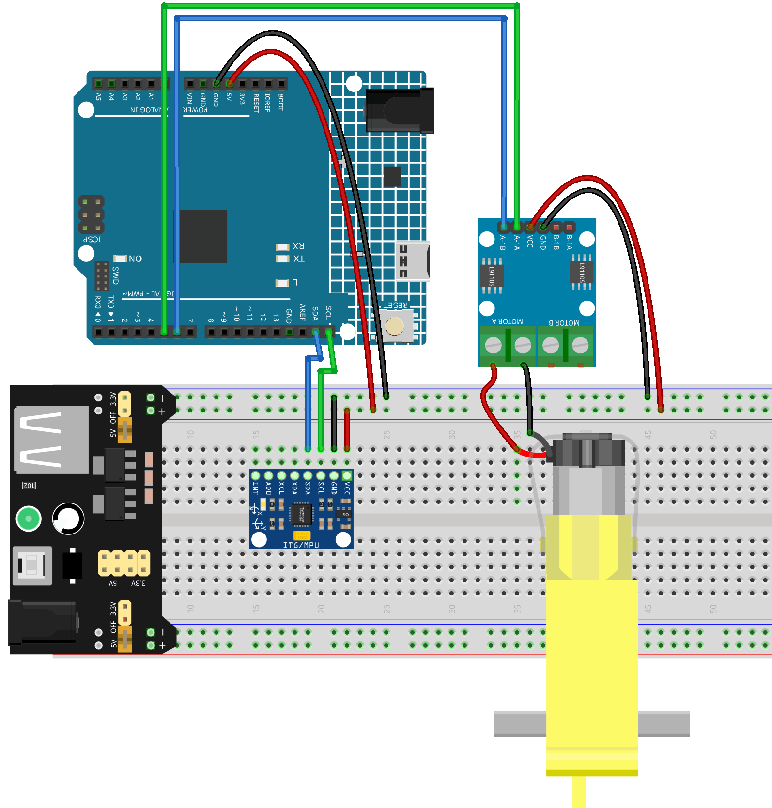

.. _motor_controll:

Motor Controll
==============================================================

.. note::
  
  🌟 Welcome to the SunFounder Facebook Community! Whether you're into Raspberry Pi, Arduino, or ESP32, you'll find inspiration, help ideas here.
   
  - ✅ Be the first to get free learning resources. 
   
  - ✅ Stay updated on new products & exclusive giveaways. 
   
  - ✅ Share your creations and get real feedback.
   
  * 👉 Need faster updates or support? Click [|link_sf_facebook|] join our Facebook community 

  * 👉 Or join our WhatsApp group: Click [|link_sf_whatsapp|]
   
  * 🎁 Looking for parts?Check out our all-in-one kits below — packed with components, beginner-friendly guides, and tons of fun.
  
  .. list-table::
    :widths: 20 20 20
    :header-rows: 1

    *   - Name	
        - Includes Arduino board
        - PURCHASE LINK
    *   - Elite Explorer Kit
        - Arduino Uno R4 WiFi
        - |link_elite_buy|
    *   - Universal Maker Sensor Kit
        - ×
        - |link_umsk_buy|
    *   - 3 in 1 Ultimate Starter Kit	
        - Arduino Uno R3
        - |link_arduinor3_buy|

Course Introduction
------------------------

In this lesson, you’ll learn how to build a simple tilt-controlled motor system using the Arduino UNO R4, an MPU6050 sensor, and an L9110 motor driver.

Tilting the MPU6050 forward makes the motor spin forward, and tilting it backward makes the motor spin in reverse. The greater the tilt, the faster the motor rotates, and when the board is level, the motor stops.

.. .. raw:: html

..  <iframe width="700" height="394" src="https://www.youtube.com/embed/-Mj8XJaiYu8?si=r1ppBlGEcnBetN3q" title="YouTube video player" frameborder="0" allow="accelerometer; autoplay; clipboard-write; encrypted-media; gyroscope; picture-in-picture; web-share" referrerpolicy="strict-origin-when-cross-origin" allowfullscreen></iframe>

.. note::

  If this is your first time working with an Arduino project, we recommend downloading and reviewing the basic materials first.
  
  * :ref:`install_arduino`
  * :ref:`introduce_arduino`

**Required Components**

In this project, we need the following components:

.. list-table::
    :widths: 5 20 5 20
    :header-rows: 1

    *   - SN
        - COMPONENT INTRODUCTION	
        - QUANTITY
        - PURCHASE LINK

    *   - 1
        - Arduino UNO R4 Minima/Arduino UNO R4 WIFI
        - 1
        - |link_arduinor4_buy|
    *   - 2
        - USB Cable
        - 1
        - 
    *   - 3
        - Breadboard
        - 1
        - |link_breadboard_buy|
    *   - 4
        - Wires
        - Several
        - |link_wires_buy|
    *   - 5
        - L9110 Motor Driver Module
        - 1
        - 
    *   - 6
        - MPU6050 Module
        - 1
        - |link_mpu6050_buy|
    *   - 7
        - TT Motor
        - 1
        - 

**Wiring**

**Common Connections:**

* **MPU6050**

  - **SDA:** Connect to **SDA** on the Arduino.
  - **SCL:** Connect to **SCL** on the Arduino.
  - **GND:** Connect to breadboard’s negative power bus.
  - **VCC:** Connect to breadboard’s red power bus.

* **TT Motor**

  -  Connect to **MOTOR A** on the L9110 Motor Driver Module.

* **L9110 Motor Driver Module**

  - **GND:** Connect to breadboard’s negative power bus.
  - **VCC:** Connect to breadboard’s red power bus.
  - **A-1B:** Connect to **6** on the Arduino.
  - **A-1A:** Connect to **5** on the Arduino.

**Writing the Code**

.. note::

    * You can copy this code into **Arduino IDE**. 
    * Don't forget to select the board(Arduino UNO R4) and the correct port before clicking the **Upload** button.

.. code-block:: arduino

      #include <Wire.h>

      // ====== MPU6050 ======
      #define MPU_ADDR       0x68
      #define REG_PWR_MGMT_1 0x6B
      #define REG_ACCEL_XOUT_H 0x3B

      // ====== L9110 motor pins (choose PWM-capable pins) ======
      const int PIN_INA = 5;   // L9110 INA  -> Arduino D5 (PWM)
      const int PIN_INB = 6;   // L9110 INB  -> Arduino D6 (PWM)

      // ====== Mapping / filter ======
      const float DEAD_ZONE_DEG = 3.0f;     // deadband around level
      const float MAX_TILT_DEG  = 25.0f;    // tilt that maps to full speed
      const float EMA_ALPHA     = 0.15f;    // low-pass filter for pitch

      // Calibration
      const unsigned long CALIB_MS = 2000;  // time to average zero level (ms)
      float pitchZero = 0.0f;               // baseline (level) pitch
      float pitchFilt = 0.0f;               // filtered pitch

      // -------- helpers --------
      int16_t read16(int reg) {
        Wire.beginTransmission(MPU_ADDR);
        Wire.write(reg);
        Wire.endTransmission(false);
        Wire.requestFrom(MPU_ADDR, 2, true);
        int16_t hi = Wire.read();
        int16_t lo = Wire.read();
        return (hi << 8) | lo;
      }

      void mpuInit() {
        Wire.begin();
        // wake up MPU6050
        Wire.beginTransmission(MPU_ADDR);
        Wire.write(REG_PWR_MGMT_1);
        Wire.write(0x00);
        Wire.endTransmission();
        delay(100);
      }

      float readPitchDeg() {
        // read accelerometer raw
        int16_t ax = read16(REG_ACCEL_XOUT_H);
        int16_t ay = read16(REG_ACCEL_XOUT_H + 2);
        int16_t az = read16(REG_ACCEL_XOUT_H + 4);

        // Convert to g (±2g default -> 16384 LSB/g)
        float Ax = ax / 16384.0f;
        float Ay = ay / 16384.0f;
        float Az = az / 16384.0f;

        // Pitch (front/back tilt). Depending on sensor mounting, you may swap Ax/Ay.
        // Here we use atan2(Ax, Az) : positive when tilting "forward" if X-axis points forward.
        float pitch = atan2f(Ax, Az) * 180.0f / PI;
        return pitch;
      }

      void motorStop() {
        analogWrite(PIN_INA, 0);
        analogWrite(PIN_INB, 0);
      }

      void motorForward(uint8_t pwm) {
        analogWrite(PIN_INA, pwm);
        analogWrite(PIN_INB, 0);
      }

      void motorBackward(uint8_t pwm) {
        analogWrite(PIN_INA, 0);
        analogWrite(PIN_INB, pwm);
      }

      void setup() {
        pinMode(PIN_INA, OUTPUT);
        pinMode(PIN_INB, OUTPUT);
        motorStop();

        Wire.begin();
        mpuInit();
        Serial.begin(115200);
        Serial.println("MPU6050 + L9110 TT motor control (UNO R4)");

        // ---- calibration: average pitch while held level ----
        unsigned long t0 = millis();
        double sum = 0.0;
        uint32_t n = 0;
        while (millis() - t0 < CALIB_MS) {
          float p = readPitchDeg();
          sum += p;
          n++;
          delay(10);
        }
        pitchZero = (n > 0) ? (sum / n) : 0.0f;
        pitchFilt = 0.0f; // start filter at zeroed reference

        Serial.print("Calibrated pitchZero = ");
        Serial.println(pitchZero, 2);
      }

      void loop() {
        // 1) read & zero
        float pitch = readPitchDeg() - pitchZero;

        // 2) low-pass filter
        pitchFilt = (1.0f - EMA_ALPHA) * pitchFilt + EMA_ALPHA * pitch;

        // 3) dead zone & scaling
        float p = pitchFilt;
        if (fabs(p) < DEAD_ZONE_DEG) {
          motorStop();
        } else {
          // clamp and map abs(p) to PWM 0..255
          float mag = constrain(fabs(p), 0.0f, MAX_TILT_DEG);
          uint8_t pwm = (uint8_t) map((long)(mag * 1000), 0, (long)(MAX_TILT_DEG * 1000), 0, 255);

          if (p > 0) {
            motorForward(pwm);   // forward when tilting forward
          } else {
            motorBackward(pwm);  // backward when tilting backward
          }
        }

        // debug (optional)
        static uint32_t last = 0;
        uint32_t now = millis();
        if (now - last > 200) {
          last = now;
          Serial.print("pitchRaw=");
          Serial.print(readPitchDeg() - pitchZero, 2);
          Serial.print("  pitchFilt=");
          Serial.print(pitchFilt, 2);
          Serial.print("  PWM=");
          // read back approximate PWM (not exact on UNO R4, just logic)
          Serial.println();
        }

        delay(10);
      }
