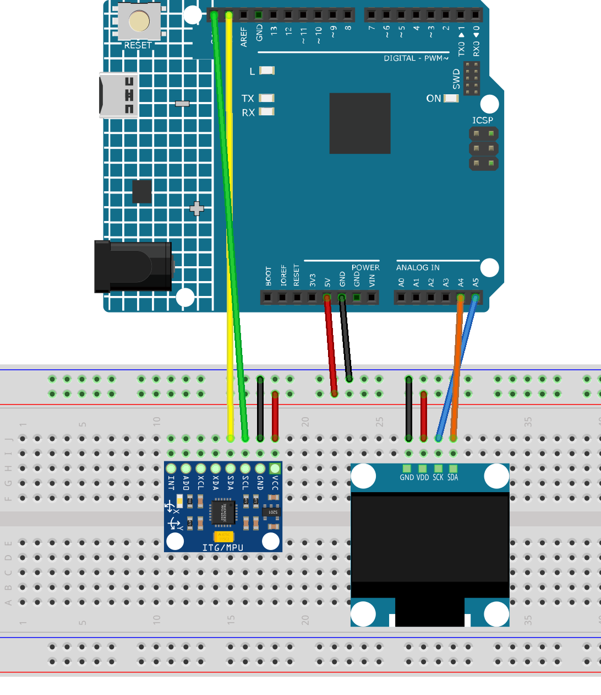

.. _mpu6050_maze:

MPU6050 Maze
==============================================================

.. note::
  
  🌟 Welcome to the SunFounder Facebook Community! Whether you're into Raspberry Pi, Arduino, or ESP32, you'll find inspiration, help ideas here.
   
  - ✅ Be the first to get free learning resources. 
   
  - ✅ Stay updated on new products & exclusive giveaways. 
   
  - ✅ Share your creations and get real feedback.
   
  * 👉 Need faster updates or support? Click [|link_sf_facebook|] join our Facebook community 

  * 👉 Or join our WhatsApp group: Click [|link_sf_whatsapp|]
   
Kit purchase
------------------------

Looking for parts? Check out our all-in-one kits below — packed with components, beginner-friendly guides, and tons of fun.

.. image:: img/ultimate_sensor_kit.png
   :width: 100%
   :align: center
   :target: https://www.sunfounder.com/collections/arduino-kits-bundles/products/sunfounder-ultimate-sensor-kit-with-original-arduino-uno-r4-minima?ref=jbzmncle

.. raw:: html

     

.. list-table::
   :widths: 20 20 20
   :header-rows: 1

   * - Name
     - Includes Arduino board
     - PURCHASE LINK
   * - Ultimate Sensor Kit
     - Arduino Uno R4 Minima
     - |link_ultimate_sensor_buy|
   * - Elite Explorer Kit
     - Arduino Uno R4 WiFi
     - |link_elite_buy|
   * - 3 in 1 Ultimate Starter Kit
     - Arduino Uno R4 Minima
     - |link_arduinor4_buy|
   * - Universal Maker Sensor Kit
     - ×
     - |link_umsk_buy|

Course Introduction
------------------------

In this lesson, you'll use an MPU6050 motion sensor and an OLED display with the Arduino UNO R4 to create a tilt-controlled maze game.

By tilting the device, you guide a ball through a randomly generated maze. Reach the exit to complete the maze, and a new one is generated automatically for endless gameplay.

.. .. raw:: html

..  <iframe width="700" height="394" src="https://www.youtube.com/embed/JLhhN_MoEz8?si=zYGO2rifeyTH2yfs" title="YouTube video player" frameborder="0" allow="accelerometer; autoplay; clipboard-write; encrypted-media; gyroscope; picture-in-picture; web-share" referrerpolicy="strict-origin-when-cross-origin" allowfullscreen></iframe>

.. note::

  If this is your first time working with an Arduino project, we recommend downloading and reviewing the basic materials first.

  * :ref:`install_arduino`
  * :ref:`introduce_arduino`

**Required Components**

In this project, we need the following components:

.. list-table::
    :widths: 5 20 5 20
    :header-rows: 1

    *   - SN
        - COMPONENT INTRODUCTION	
        - QUANTITY
        - PURCHASE LINK

    *   - 1
        - Arduino UNO R4 Minima
        - 1
        - |link_unor4_buy|
    *   - 2
        - USB Type-C cable
        - 1
        - 
    *   - 3
        - Breadboard
        - 1
        - |link_breadboard_buy|
    *   - 4
        - Wires
        - Several
        - |link_wires_buy|
    *   - 5
        - OLED Display Module
        - 1
        - |link_oled_buy|
    *   - 6
        - MPU6050 Module
        - 1
        - |link_mpu6050_buy|

**Wiring**

**Common Connections:**

* **OLED Display Module**

  - **SDA:** Connect to **A4** on the Arduino.
  - **SCK:** Connect to **A5** on the Arduino.
  - **GND:** Connect to breadboard’s negative power bus.
  - **VCC:** Connect to breadboard’s red power bus.

* **MPU6050**

  - **SDA:** Connect to **SDA** on the Arduino.
  - **SCL:** Connect to **SCL** on the Arduino.
  - **GND:** Connect to breadboard’s negative power bus.
  - **VCC:** Connect to breadboard’s red power bus.

**Writing the Code**

.. note::

    * You can copy this code into **Arduino IDE**. 
    * To install the library, use the Arduino Library Manager and search for **Adafruit SSD1306** and **Adafruit GFX** and install it.
    * Don't forget to select the board(Arduino UNO R4 Minima) and the correct port before clicking the **Upload** button.

.. code-block:: arduino

      #include <Wire.h>
      #include <Adafruit_GFX.h>
      #include <Adafruit_SSD1306.h>

      // OLED settings
      #define SCREEN_WIDTH 128
      #define SCREEN_HEIGHT 64
      #define OLED_RESET -1
      #define OLED_ADDR 0x3C

      Adafruit_SSD1306 display(SCREEN_WIDTH, SCREEN_HEIGHT, &Wire, OLED_RESET);

      // MPU6050 address
      const int MPU_ADDR = 0x68;

      // Maze settings
      const int COLS = 16;
      const int ROWS = 8;
      const int CELL_SIZE = 8;
      const int TOTAL_CELLS = COLS * ROWS;

      // Wall bits
      const byte WALL_TOP = 1;
      const byte WALL_RIGHT = 2;
      const byte WALL_BOTTOM = 4;
      const byte WALL_LEFT = 8;

      byte maze[ROWS][COLS];
      bool visited[ROWS][COLS];

      int stackX[TOTAL_CELLS];
      int stackY[TOTAL_CELLS];
      int stackTop = 0;

      int playerX = 0;
      int playerY = 0;

      unsigned long lastMoveTime = 0;
      const unsigned long moveDelay = 180;

      // Tilt threshold
      const int TILT_THRESHOLD = 6000;

      void setup() {
        Wire.begin();

        if (!display.begin(SSD1306_SWITCHCAPVCC, OLED_ADDR)) {
          while (true);
        }

        initMPU6050();

        randomSeed(analogRead(A0));

        generateNewMaze();
        drawMaze();
      }

      void loop() {
        int16_t ax, ay, az;
        readMPU6050(ax, ay, az);

        if (millis() - lastMoveTime > moveDelay) {
          if (ay > TILT_THRESHOLD) {
            movePlayer(-1, 0);   // Left
          } else if (ay < -TILT_THRESHOLD) {
            movePlayer(1, 0);    // Right
          } else if (ax > TILT_THRESHOLD) {
            movePlayer(0, -1);   // Up
          } else if (ax < -TILT_THRESHOLD) {
            movePlayer(0, 1);    // Down
          }
        }

        if (playerX == COLS - 1 && playerY == ROWS - 1) {
          showWinScreen();
          delay(800);
          generateNewMaze();
          drawMaze();
        }
      }

      void initMPU6050() {
        Wire.beginTransmission(MPU_ADDR);
        Wire.write(0x6B);
        Wire.write(0);
        Wire.endTransmission(true);
      }

      void readMPU6050(int16_t &ax, int16_t &ay, int16_t &az) {
        Wire.beginTransmission(MPU_ADDR);
        Wire.write(0x3B);
        Wire.endTransmission(false);
        Wire.requestFrom(MPU_ADDR, 6, true);

        ax = Wire.read() << 8 | Wire.read();
        ay = Wire.read() << 8 | Wire.read();
        az = Wire.read() << 8 | Wire.read();
      }

      void generateNewMaze() {
        for (int y = 0; y < ROWS; y++) {
          for (int x = 0; x < COLS; x++) {
            maze[y][x] = WALL_TOP | WALL_RIGHT | WALL_BOTTOM | WALL_LEFT;
            visited[y][x] = false;
          }
        }

        playerX = 0;
        playerY = 0;

        stackTop = 0;
        int cx = 0;
        int cy = 0;

        visited[cy][cx] = true;
        stackX[stackTop] = cx;
        stackY[stackTop] = cy;
        stackTop++;

        while (stackTop > 0) {
          cx = stackX[stackTop - 1];
          cy = stackY[stackTop - 1];

          int dirs[4];
          int count = 0;

          if (cy > 0 && !visited[cy - 1][cx]) dirs[count++] = 0;
          if (cx < COLS - 1 && !visited[cy][cx + 1]) dirs[count++] = 1;
          if (cy < ROWS - 1 && !visited[cy + 1][cx]) dirs[count++] = 2;
          if (cx > 0 && !visited[cy][cx - 1]) dirs[count++] = 3;

          if (count > 0) {
            int dir = dirs[random(count)];
            int nx = cx;
            int ny = cy;

            if (dir == 0) {
              ny--;
              maze[cy][cx] &= ~WALL_TOP;
              maze[ny][nx] &= ~WALL_BOTTOM;
            } else if (dir == 1) {
              nx++;
              maze[cy][cx] &= ~WALL_RIGHT;
              maze[ny][nx] &= ~WALL_LEFT;
            } else if (dir == 2) {
              ny++;
              maze[cy][cx] &= ~WALL_BOTTOM;
              maze[ny][nx] &= ~WALL_TOP;
            } else if (dir == 3) {
              nx--;
              maze[cy][cx] &= ~WALL_LEFT;
              maze[ny][nx] &= ~WALL_RIGHT;
            }

            visited[ny][nx] = true;
            stackX[stackTop] = nx;
            stackY[stackTop] = ny;
            stackTop++;
          } else {
            stackTop--;
          }
        }

        // Entrance and exit
        maze[0][0] &= ~WALL_LEFT;
        maze[ROWS - 1][COLS - 1] &= ~WALL_RIGHT;
      }

      void movePlayer(int dx, int dy) {
        byte walls = maze[playerY][playerX];

        if (dx == -1 && (walls & WALL_LEFT)) return;
        if (dx == 1 && (walls & WALL_RIGHT)) return;
        if (dy == -1 && (walls & WALL_TOP)) return;
        if (dy == 1 && (walls & WALL_BOTTOM)) return;

        int newX = playerX + dx;
        int newY = playerY + dy;

        if (newX < 0 || newX >= COLS || newY < 0 || newY >= ROWS) return;

        playerX = newX;
        playerY = newY;
        lastMoveTime = millis();

        drawMaze();
      }

      void drawMaze() {
        display.clearDisplay();

        for (int y = 0; y < ROWS; y++) {
          for (int x = 0; x < COLS; x++) {
            int px = x * CELL_SIZE;
            int py = y * CELL_SIZE;

            byte walls = maze[y][x];

            if (walls & WALL_TOP) {
              display.drawLine(px, py, px + CELL_SIZE, py, SSD1306_WHITE);
            }

            if (walls & WALL_RIGHT) {
              display.drawLine(px + CELL_SIZE - 1, py, px + CELL_SIZE - 1, py + CELL_SIZE, SSD1306_WHITE);
            }

            if (walls & WALL_BOTTOM) {
              display.drawLine(px, py + CELL_SIZE - 1, px + CELL_SIZE, py + CELL_SIZE - 1, SSD1306_WHITE);
            }

            if (walls & WALL_LEFT) {
              display.drawLine(px, py, px, py + CELL_SIZE, SSD1306_WHITE);
            }
          }
        }

        // Draw exit
        display.fillRect(124, 58, 4, 4, SSD1306_WHITE);

        // Draw player ball
        int ballX = playerX * CELL_SIZE + CELL_SIZE / 2;
        int ballY = playerY * CELL_SIZE + CELL_SIZE / 2;
        display.fillCircle(ballX, ballY, 2, SSD1306_WHITE);

        display.display();
      }

      void showWinScreen() {
        display.clearDisplay();
        display.setTextColor(SSD1306_WHITE);

        display.setTextSize(2);
        display.setCursor(22, 18);
        display.print("YOU WIN");

        display.setTextSize(1);
        display.setCursor(20, 45);
        display.print("New maze loading");

        display.display();
      }