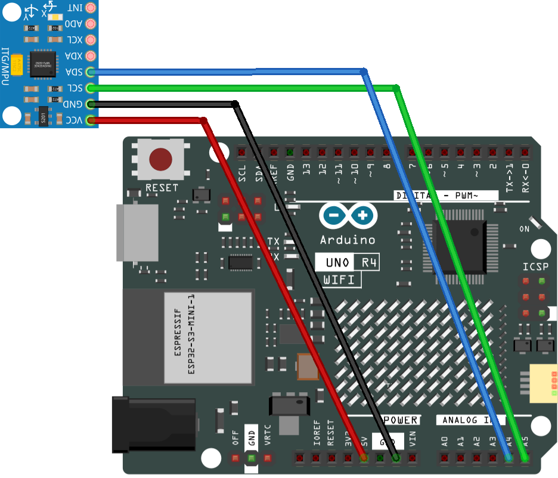

.. _mpu6050_module:

MPU6050 Module
==============================================================

.. note::
  
  🌟 Welcome to the SunFounder Facebook Community! Whether you're into Raspberry Pi, Arduino, or ESP32, you'll find inspiration, help ideas here.
   
  - ✅ Be the first to get free learning resources. 
   
  - ✅ Stay updated on new products & exclusive giveaways. 
   
  - ✅ Share your creations and get real feedback.
   
  * 👉 Need faster updates or support? Click [|link_sf_facebook|] join our Facebook community 

  * 👉 Or join our WhatsApp group: Click [|link_sf_whatsapp|]
   
Kit purchase
------------------------

Looking for parts? Check out our all-in-one kits below — packed with components, beginner-friendly guides, and tons of fun.

.. image:: img/ultimate_sensor_kit.png
   :width: 100%
   :align: center
   :target: https://www.sunfounder.com/collections/arduino-kits-bundles/products/sunfounder-ultimate-sensor-kit-with-original-arduino-uno-r4-minima?ref=jbzmncle

.. raw:: html

     

.. list-table::
   :widths: 20 20 20
   :header-rows: 1

   * - Name
     - Includes Arduino board
     - PURCHASE LINK
   * - Elite Explorer Kit
     - Arduino Uno R4 WiFi
     - |link_elite_buy|
   * - 3 in 1 Ultimate Starter Kit
     - Arduino Uno R4 Minima
     - |link_arduinor4_buy|

Course Introduction
------------------------

In this lesson, we will learn how to use the MPU6050 Module with Arduino.

.. .. raw:: html

..  <iframe width="700" height="394" src="https://www.youtube.com/embed/URUrUUSfsKs" title="YouTube video player" frameborder="0" allow="accelerometer; autoplay; clipboard-write; encrypted-media; gyroscope; picture-in-picture; web-share" referrerpolicy="strict-origin-when-cross-origin" allowfullscreen></iframe>

.. note::

  If this is your first time working with an Arduino project, we recommend downloading and reviewing the basic materials first.
  
  * :ref:`install_arduino`
  * :ref:`introduce_arduino`

**Required Components**

In this project, we need the following components:

.. list-table::
    :widths: 5 20 5 20
    :header-rows: 1

    *   - SN
        - COMPONENT INTRODUCTION	
        - QUANTITY
        - PURCHASE LINK

    *   - 1
        - Arduino UNO R4 Minima
        - 1
        - |link_unor4_buy|
    *   - 2
        - USB Type-C cable
        - 1
        - 
    *   - 3
        - Breadboard
        - 1
        - |link_breadboard_buy|
    *   - 4
        - Wires
        - Several
        - |link_wires_buy|
    *   - 5
        - MPU6050 Module
        - 1
        - |link_mpu6050_buy|

**Wiring**

**Common Connections:**

* **MPU6050**

  - **SDA:** Connect to **A4** on the Arduino.
  - **SCL:** Connect to **A5** on the Arduino.
  - **GND:** Connect to breadboard’s negative power bus.
  - **VCC:** Connect to breadboard’s red power bus.

**Writing the Code**

.. note::

    * You can copy this code into **Arduino IDE**. 
    * To install the library, use the Arduino Library Manager and search for **Adafruit_MPU6050** , **Adafruit_Sensor** and install it.
    * Don't forget to select the board(Arduino UNO R4 Minima/WIFI) and the correct port before clicking the **Upload** button.

.. code-block:: arduino

      /*
        Uses the Adafruit_MPU6050 library to retrieve data from the MPU6050 sensor. 
        The process involves initializing serial communication, 
        verifying if the sensor is detected, configuring accelerometer and gyro ranges, 
        reading sensor data, and displaying acceleration, rotation, and temperature values 
        on the serial monitor.
        
        Board: Arduino Uno R3 (or R4)
        Component: Accelerometer & Gyroscope Sensor(MPU6050)
        Library: https://github.com/adafruit/Adafruit_MPU6050  (Adafruit MPU6050 by Adafruit)
      */

      // Include the necessary libraries
      #include <Adafruit_MPU6050.h>
      #include <Adafruit_Sensor.h>
      #include <Wire.h>

      // Create an object for the MPU6050 sensor
      Adafruit_MPU6050 mpu;

      void setup() {
        // Initialize the serial communication
        Serial.begin(9600);

        // Check if the MPU6050 sensor is detected
        if (!mpu.begin()) {
          Serial.println("Failed to find MPU6050 chip");
          while (1) {
            delay(10);
          }
        }
        Serial.println("MPU6050 Found!");

        // set accelerometer range to +-8G
        mpu.setAccelerometerRange(MPU6050_RANGE_8_G);

        // set gyro range to +- 500 deg/s
        mpu.setGyroRange(MPU6050_RANGE_500_DEG);

        // set filter bandwidth to 21 Hz
        mpu.setFilterBandwidth(MPU6050_BAND_21_HZ);

        // Add a delay for stability
        delay(100);
      }

      void loop() {
        // Get new sensor events with the readings
        sensors_event_t a, g, temp;
        mpu.getEvent(&a, &g, &temp);

        // Print out the acceleration readings in m/s^2
        Serial.print("Acceleration:   X:");
        Serial.print(a.acceleration.x);
        Serial.print(", Y:");
        Serial.print(a.acceleration.y);
        Serial.print(", Z:");
        Serial.print(a.acceleration.z);
        Serial.println(" (m/s^2)");

        // Print out the rotation readings in rad/s
        Serial.print("Rotation:       X:");
        Serial.print(g.gyro.x);
        Serial.print(", Y:");
        Serial.print(g.gyro.y);
        Serial.print(", Z:");
        Serial.print(g.gyro.z);
        Serial.println(" (rad/s)");

        // Print out the temperature reading in degrees Celsius
        Serial.print("Temperature:    ");
        Serial.print(temp.temperature);
        Serial.println(" (degC)");

        // Add a blank line for readability
        Serial.println("");

        // Add a delay to avoid flooding the serial monitor
        delay(1000);
      }

