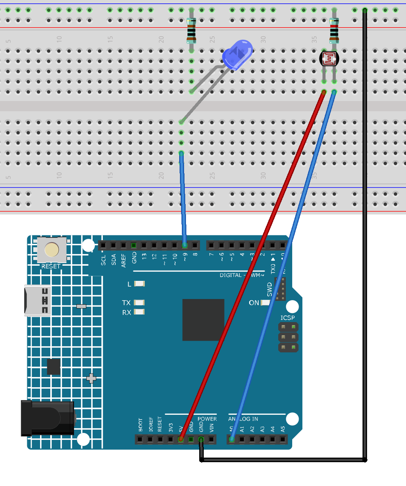

.. _night_light:

Night light
==============================================================

.. note::
  
  🌟 Welcome to the SunFounder Facebook Community! Whether you're into Raspberry Pi, Arduino, or ESP32, you'll find inspiration, help ideas here.
   
  - ✅ Be the first to get free learning resources. 
   
  - ✅ Stay updated on new products & exclusive giveaways. 
   
  - ✅ Share your creations and get real feedback.
   
  * 👉 Need faster updates or support? Click [|link_sf_facebook|] join our Facebook community 

  * 👉 Or join our WhatsApp group: Click [|link_sf_whatsapp|]
   
  * 🎁 Looking for parts?Check out our all-in-one kits below — packed with components, beginner-friendly guides, and tons of fun.

  .. list-table::
    :widths: 20 20 20
    :header-rows: 1

    *   - Name	
        - Includes Arduino board
        - PURCHASE LINK
    *   - Ultimate Sensor Kit
        - Arduino Uno R4 Minima
        - |link_ultimate_sensor_buy|
    *   - Elite Explorer Kit
        - Arduino Uno R4 WiFi
        - |link_elite_buy|
    *   - 3 in 1 Ultimate Starter Kit
        - Arduino Uno R4 Minima
        - |link_arduinor4_buy|
    *   - Universal Maker Sensor Kit
        - ×
        - |link_umsk_buy|

Course Introduction
------------------------

This Arduino project uses a photoresistor (LDR) to detect ambient light levels and automatically control an LED. 

When the environment gets dark, the LED turns on; when it's bright, the LED turns off. The light threshold can be adjusted for sensitivity. 

This simple system is ideal for automatic night lights or basic light-sensing applications.

.. .. raw:: html

..  <iframe width="700" height="394" src="https://www.youtube.com/embed/A4v7QJxjU-4?si=s6P6bt19Kos_pYKQ" title="YouTube video player" frameborder="0" allow="accelerometer; autoplay; clipboard-write; encrypted-media; gyroscope; picture-in-picture; web-share" referrerpolicy="strict-origin-when-cross-origin" allowfullscreen></iframe>

.. note::

  If this is your first time working with an Arduino project, we recommend downloading and reviewing the basic materials first.
  
  * :ref:`install_arduino`
  * :ref:`introduce_arduino`

**Required Components**

In this project, we need the following components:

.. list-table::
    :widths: 5 20 5 20
    :header-rows: 1

    *   - SN
        - COMPONENT INTRODUCTION	
        - QUANTITY
        - PURCHASE LINK

    *   - 1
        - Arduino UNO R4 Minima
        - 1
        - |link_unor4_buy|
    *   - 2
        - USB Type-C cable
        - 1
        - 
    *   - 3
        - Breadboard
        - 1
        - |link_breadboard_buy|
    *   - 4
        - Wires
        - Several
        - |link_wires_buy|
    *   - 5
        - LED
        - 1
        - |link_led_buy|
    *   - 6
        - Photoresistor
        - 1
        - |link_photoresistor_buy|

**Wiring**

**Common Connections:**

* **LED**

  - **Blue:** Connect the LED **anode** to **9** on the Arduino, and the **cathode** to a **1kΩ resistor**, then to the negative power bus on the breadboard.

* **Photoresistor**

  - **VCC:** Connect to **A0** on the Arduino.
  - **GND:** Connect to breadboard’s negative power bus.

**Writing the Code**

.. note::

    * You can copy this code into **Arduino IDE**. 
    * Don't forget to select the board(Arduino UNO R4 Minima/WIFI) and the correct port before clicking the **Upload** button.

.. code-block:: arduino

      // Define pins
      const int sensorPin = A0;   // Photoresistor voltage divider output to A0
      const int ledPin = 9;       // Blue LED connected to D9

      // Sensitivity threshold (higher = darker, can be adjusted)
      const int threshold = 500;  // Recommended initial value 500, adjust via Serial monitor

      void setup() {
        pinMode(ledPin, OUTPUT); 
        digitalWrite(ledPin, LOW);  // LED off by default
        Serial.begin(9600);         // For monitoring light level and threshold
      }

      void loop() {
        int sensorValue = analogRead(sensorPin);  // Range: 0~1023

        Serial.print("Light sensor: ");
        Serial.println(sensorValue);

        if(sensorValue < threshold) {
          // Environment is dark, turn on LED
          digitalWrite(ledPin, HIGH);
        } else {
          // Environment is bright, turn off LED
          digitalWrite(ledPin, LOW);
        }

        delay(100); // Slight delay to avoid Serial flooding
      }
