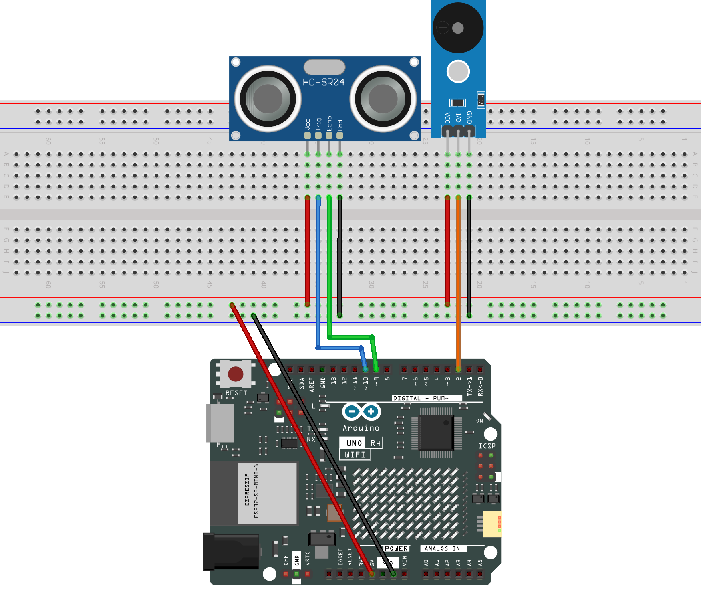

.. _object_detection2.0:

Object Detection 2.0
==============================================================

.. note::
  
  🌟 Welcome to the SunFounder Facebook Community! Whether you're into Raspberry Pi, Arduino, or ESP32, you'll find inspiration, help ideas here.
   
  - ✅ Be the first to get free learning resources. 
   
  - ✅ Stay updated on new products & exclusive giveaways. 
   
  - ✅ Share your creations and get real feedback.
   
  * 👉 Need faster updates or support? Click [|link_sf_facebook|] join our Facebook community 

  * 👉 Or join our WhatsApp group: Click [|link_sf_whatsapp|]
   
Kit purchase
------------------------

Looking for parts? Check out our all-in-one kits below — packed with components, beginner-friendly guides, and tons of fun.

.. image:: img/umsk_kit.png
   :width: 100%
   :align: center
   :target: https://www.sunfounder.com/collections/raspberrypi-kits/products/sunfounder-universal-maker-sensor-kit?ref=jbzmncle

.. raw:: html

     

.. list-table::
   :widths: 20 20 20
   :header-rows: 1

   * - Name
     - Includes Arduino board
     - PURCHASE LINK
   * - Ultimate Sensor Kit
     - Arduino Uno R4 Minima
     - |link_ultimate_sensor_buy|
   * - Universal Maker Sensor Kit
     - ×
     - |link_umsk_buy|

Course Introduction
------------------------

This Arduino project uses an Ultrasonic Sensor Module to detect obstacles. When an object is detected, a passive buzzer plays two alert tones (C5 and G5). 

If no obstacle is present, the buzzer stays off. It's a simple alert system for object detection.

.. raw:: html
 
  <iframe width="700" height="394" src="https://www.youtube.com/embed/NoW1sRErZGk?si=lW1Bcelyzh1ikOU6" title="YouTube video player" frameborder="0" allow="accelerometer; autoplay; clipboard-write; encrypted-media; gyroscope; picture-in-picture; web-share" referrerpolicy="strict-origin-when-cross-origin" allowfullscreen></iframe>

.. note::

  If this is your first time working with an Arduino project, we recommend downloading and reviewing the basic materials first.
  
  * :ref:`install_arduino`
  * :ref:`introduce_arduino`

**Required Components**

In this project, we need the following components:

.. list-table::
    :widths: 5 20 5 20
    :header-rows: 1

    *   - SN
        - COMPONENT INTRODUCTION
        - QUANTITY
        - PURCHASE LINK

    *   - 1
        - Arduino UNO R4 WIFI
        - 1
        - |link_unor4_wifi_buy|
    *   - 2
        - USB Type-C cable
        - 1
        - 
    *   - 3
        - Breadboard
        - 1
        - |link_breadboard_buy|
    *   - 4
        - Wires
        - Several
        - |link_wires_buy|
    *   - 5
        - Ultrasonic Sensor Module
        - 1
        - |link_ultrasonic_buy|
    *   - 6
        - Buzzer Modudle
        - 1
        - |link_buzzer_module_buy|

**Wiring**

**Common Connections:**

* **Buzzer Module**

  - **I/0:** Connect to **2** on the Arduino.
  - **＋:** Connect to breadboard’s red power bus. 
  - **－:** Connect to breadboard’s negative power bus.

* **Ultrasonic Sensor Module**

  - **Trig:** Connect to **10** on the Arduino.
  - **Echo:** Connect to **9** on the Arduino.
  - **GND:** Connect to breadboard’s negative power bus.
  - **VCC:** Connect to breadboard’s red power bus.

**Writing the Code**

.. note::

    * Before you begin, you need to upload the **pitches.h** library to your Arduino. Copy the contents of the library into the Arduino IDE, save it as **pitches.h** and then upload it to your Arduino.

.. code-block:: arduino

      #define NOTE_B0  31
      #define NOTE_C1  33
      #define NOTE_CS1 35
      #define NOTE_D1  37
      #define NOTE_DS1 39
      #define NOTE_E1  41
      #define NOTE_F1  44
      #define NOTE_FS1 46
      #define NOTE_G1  49
      #define NOTE_GS1 52
      #define NOTE_A1  55
      #define NOTE_AS1 58
      #define NOTE_B1  62
      #define NOTE_C2  65
      #define NOTE_CS2 69
      #define NOTE_D2  73
      #define NOTE_DS2 78
      #define NOTE_E2  82
      #define NOTE_F2  87
      #define NOTE_FS2 93
      #define NOTE_G2  98
      #define NOTE_GS2 104
      #define NOTE_A2  110
      #define NOTE_AS2 117
      #define NOTE_B2  123
      #define NOTE_C3  131
      #define NOTE_CS3 139
      #define NOTE_D3  147
      #define NOTE_DS3 156
      #define NOTE_E3  165
      #define NOTE_F3  175
      #define NOTE_FS3 185
      #define NOTE_G3  196
      #define NOTE_GS3 208
      #define NOTE_A3  220
      #define NOTE_AS3 233
      #define NOTE_B3  247
      #define NOTE_C4  262
      #define NOTE_CS4 277
      #define NOTE_D4  294
      #define NOTE_DS4 311
      #define NOTE_E4  330
      #define NOTE_F4  349
      #define NOTE_FS4 370
      #define NOTE_G4  392
      #define NOTE_GS4 415
      #define NOTE_A4  440
      #define NOTE_AS4 466
      #define NOTE_B4  494
      #define NOTE_C5  523
      #define NOTE_CS5 554
      #define NOTE_D5  587
      #define NOTE_DS5 622
      #define NOTE_E5  659
      #define NOTE_F5  698
      #define NOTE_FS5 740
      #define NOTE_G5  784
      #define NOTE_GS5 831
      #define NOTE_A5  880
      #define NOTE_AS5 932
      #define NOTE_B5  988
      #define NOTE_C6  1047
      #define NOTE_CS6 1109
      #define NOTE_D6  1175
      #define NOTE_DS6 1245
      #define NOTE_E6  1319
      #define NOTE_F6  1397
      #define NOTE_FS6 1480
      #define NOTE_G6  1568
      #define NOTE_GS6 1661
      #define NOTE_A6  1760
      #define NOTE_AS6 1865
      #define NOTE_B6  1976
      #define NOTE_C7  2093
      #define NOTE_CS7 2217
      #define NOTE_D7  2349
      #define NOTE_DS7 2489
      #define NOTE_E7  2637
      #define NOTE_F7  2794
      #define NOTE_FS7 2960
      #define NOTE_G7  3136
      #define NOTE_GS7 3322
      #define NOTE_A7  3520
      #define NOTE_AS7 3729
      #define NOTE_B7  3951
      #define NOTE_C8  4186
      #define NOTE_CS8 4435
      #define NOTE_D8  4699
      #define NOTE_DS8 4978

.. note::

    * You can copy this code into **Arduino IDE**. 
    * Don't forget to select the board(Arduino UNO R4 Minima/WIFI) and the correct port before clicking the **Upload** button.

.. code-block:: arduino

      #include "pitches.h"

      const int trigPin = 10;     // Ultrasonic sensor Trig pin
      const int echoPin = 9;      // Ultrasonic sensor Echo pin
      const int buzzerPin = 2;    // Passive buzzer pin

      long duration;              // Variable to store echo time
      int distance;               // Variable to store calculated distance
      const int threshold = 10;   // Threshold distance in cm

      void setup() {
        pinMode(trigPin, OUTPUT);   // Set Trig pin as output
        pinMode(echoPin, INPUT);    // Set Echo pin as input
        pinMode(buzzerPin, OUTPUT); // Set buzzer pin as output
        Serial.begin(9600);         // Start serial monitor at 9600 baud
      }

      void loop() {
        // Send a 10us HIGH pulse to trigger the ultrasonic sensor
        digitalWrite(trigPin, LOW);
        delayMicroseconds(2);
        digitalWrite(trigPin, HIGH);
        delayMicroseconds(10);
        digitalWrite(trigPin, LOW);

        // Measure the duration of the echo signal
        duration = pulseIn(echoPin, HIGH, 30000); // Timeout set to 30ms (~5 meters)

        // Convert time into distance (cm)
        distance = duration * 0.034 / 2;

        // Print distance to the Serial Monitor
        Serial.print("Distance: ");
        Serial.print(distance);
        Serial.println(" cm");

        // If an object is within the threshold distance
        if (distance > 0 && distance < threshold) {
          // Play two tones (C5 and G5) as a warning signal
          tone(buzzerPin, NOTE_C5, 200);
          delay(250);
          tone(buzzerPin, NOTE_G5, 200);
          delay(250);
        } else {
          // No object detected, keep the buzzer silent
          noTone(buzzerPin);
          delay(100);
        }
      }
