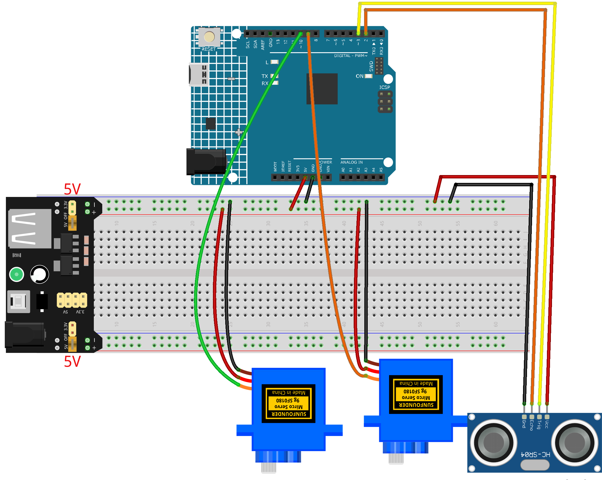

.. _object_shooter1.0:

Object Shooter 1.0
==============================================================

.. note::
  
  🌟 Welcome to the SunFounder Facebook Community! Whether you're into Raspberry Pi, Arduino, or ESP32, you'll find inspiration, help ideas here.
   
  - ✅ Be the first to get free learning resources. 
   
  - ✅ Stay updated on new products & exclusive giveaways. 
   
  - ✅ Share your creations and get real feedback.
   
  * 👉 Need faster updates or support? Click [|link_sf_facebook|] join our Facebook community 

  * 👉 Or join our WhatsApp group: Click [|link_sf_whatsapp|]
   
Kit purchase
------------------------

Looking for parts? Check out our all-in-one kits below — packed with components, beginner-friendly guides, and tons of fun.

.. image:: img/elite_explore_kit.png
   :width: 100%
   :align: center
   :target: https://www.sunfounder.com/collections/arduino-kits-bundles/products/sunfounder-elite-explorer-kit-with-official-arduino-uno-r4-wifi?ref=jbzmncle

.. raw:: html

     

.. list-table::
   :widths: 20 20 20
   :header-rows: 1

   * - Name
     - Includes Arduino board
     - PURCHASE LINK
   * - Ultimate Sensor Kit
     - Arduino Uno R4 Minima
     - |link_ultimate_sensor_buy|
   * - Elite Explorer Kit
     - Arduino Uno R4 WiFi
     - |link_elite_buy|
   * - 3 in 1 Ultimate Starter Kit
     - Arduino Uno R4 Minima
     - |link_arduinor4_buy|
   * - Universal Maker Sensor Kit
     - ×
     - |link_umsk_buy|

Course Introduction
------------------------

In this lesson, we will learn how to use the Ultrasonic Sensor Module and two Servo Motors with the Arduino Board to create a simple object tracking system.

The radar servo scans a 90° range to detect the nearest object, then the second servo automatically rotates to point toward the detected target.
A button is used to trigger a new scan, allowing the system to update and re-aim when needed.

.. .. raw:: html
 
..  <iframe width="700" height="394" src="https://www.youtube.com/embed/IIe3DMzaRSA?si=EmbqV2plsvQtJ3yr" title="YouTube video player" frameborder="0" allow="accelerometer; autoplay; clipboard-write; encrypted-media; gyroscope; picture-in-picture; web-share" referrerpolicy="strict-origin-when-cross-origin" allowfullscreen></iframe>

.. note::

  If this is your first time working with an Arduino project, we recommend downloading and reviewing the basic materials first.
  
  * :ref:`install_arduino`
  * :ref:`introduce_arduino`

**Required Components**

In this project, we need the following components:

.. list-table::
    :widths: 5 20 5 20
    :header-rows: 1

    *   - SN
        - COMPONENT INTRODUCTION	
        - QUANTITY
        - PURCHASE LINK

    *   - 1
        - Arduino UNO R4 Minima
        - 1
        - |link_unor4_buy|
    *   - 2
        - USB Type-C cable
        - 1
        - 
    *   - 3
        - Breadboard
        - 1
        - |link_breadboard_buy|
    *   - 4
        - Wires
        - Several
        - |link_wires_buy|
    *   - 5
        - Ultrasonic Sensor Module
        - 1
        - |link_ultrasonic_buy|
    *   - 6
        - Digital Servo Motor
        - 2
        - |link_motor_buy|

**Wiring**

**Common Connections:**

* **Digital Servo Motor 1**

  - Connect to breadboard’s positive power bus.
  - Connect to breadboard’s negative power bus.
  - Connect to **9** on the Arduino.

* **Digital Servo Motor 2**

  - Connect to breadboard’s positive power bus.
  - Connect to breadboard’s negative power bus.
  - Connect to **10** on the Arduino.

* **Ultrasonic Sensor Module**

  - **Trig:** Connect to **3** on the Arduino.
  - **Echo:** Connect to **2** on the Arduino.
  - **GND:** Connect to breadboard’s negative power bus.
  - **VCC:** Connect to breadboard’s red power bus.

**Writing the Code**

.. note::

    * You can copy this code into **Arduino IDE**. 
    * Don't forget to select the board(Arduino UNO R4) and the correct port before clicking the **Upload** button.

.. code-block:: arduino

      #include <Servo.h>

      // Ultrasonic pins
      const int TRIG_PIN = 3;
      const int ECHO_PIN = 2;

      // Servo pins
      const int RADAR_SERVO_PIN = 9;
      const int SHOOTER_SERVO_PIN = 10;

      // Button pin
      const int BUTTON_PIN = 6;

      // Servo objects
      Servo radarServo;
      Servo shooterServo;

      // Servo center
      const int RADAR_CENTER = 90;
      const int SHOOTER_CENTER = 90;

      // Scan settings
      const int SCAN_START = 45;
      const int SCAN_END = 135;
      const int SCAN_STEP = 2;

      // Geometry
      const float BASELINE_CM = 5.0;

      // Detection range
      const float MIN_DIST = 5.0;
      const float MAX_DIST = 80.0;

      // Calibration
      const int SHOOTER_OFFSET = 6;

      // Timing
      const int SERVO_DELAY = 40;

      // State
      bool scanned = false;

      // Target
      float bestDistance = 999.0;
      int bestAngle = RADAR_CENTER;
      bool targetFound = false;

      // -------------------- Distance --------------------
      float readDistanceCM() {
        digitalWrite(TRIG_PIN, LOW);
        delayMicroseconds(2);

        digitalWrite(TRIG_PIN, HIGH);
        delayMicroseconds(10);
        digitalWrite(TRIG_PIN, LOW);

        long duration = pulseIn(ECHO_PIN, HIGH, 18000);

        if (duration == 0) return 999.0;

        return duration * 0.0343 / 2.0;
      }

      // -------------------- Filter --------------------
      float getDistanceFiltered() {
        float a = readDistanceCM();
        float b = readDistanceCM();
        float c = readDistanceCM();

        float mid = max(min(a, b), min(max(a, b), c));
        return mid;
      }

      // -------------------- Scan --------------------
      void scanTarget() {
        bestDistance = 999.0;
        bestAngle = RADAR_CENTER;
        targetFound = false;

        for (int angle = SCAN_START; angle <= SCAN_END; angle += SCAN_STEP) {
          radarServo.write(angle);
          delay(SERVO_DELAY);

          float d = getDistanceFiltered();

          if (d > MIN_DIST && d < MAX_DIST) {
            if (d < bestDistance) {
              bestDistance = d;
              bestAngle = angle;
              targetFound = true;
            }
          }
        }

        radarServo.write(RADAR_CENTER);
        delay(200);
      }

      // -------------------- Aim --------------------
      void aimTarget() {
        if (!targetFound) {
          shooterServo.write(SHOOTER_CENTER);
          return;
        }

        float theta = radians(bestAngle - RADAR_CENTER);

        float x = bestDistance * sin(theta);
        float y = bestDistance * cos(theta);

        float dx = x - BASELINE_CM;
        float dy = y;

        float angleOffset = degrees(atan2(dx, dy));

        int finalAngle = SHOOTER_CENTER + angleOffset + SHOOTER_OFFSET;
        finalAngle = constrain(finalAngle, 0, 180);

        shooterServo.write(finalAngle);
      }

      // -------------------- Setup --------------------
      void setup() {
        pinMode(TRIG_PIN, OUTPUT);
        pinMode(ECHO_PIN, INPUT);

        pinMode(BUTTON_PIN, INPUT_PULLUP);

        radarServo.attach(RADAR_SERVO_PIN);
        shooterServo.attach(SHOOTER_SERVO_PIN);

        radarServo.write(RADAR_CENTER);
        shooterServo.write(SHOOTER_CENTER);

        delay(1000);
      }

      // -------------------- Loop --------------------
      void loop() {
        // If not scanned yet → scan once
        if (!scanned) {
          scanTarget();
          aimTarget();
          scanned = true;
        }

        // Button pressed → reset scan
        if (digitalRead(BUTTON_PIN) == LOW) {
          delay(200);  // debounce

          scanned = false;
        }
      }