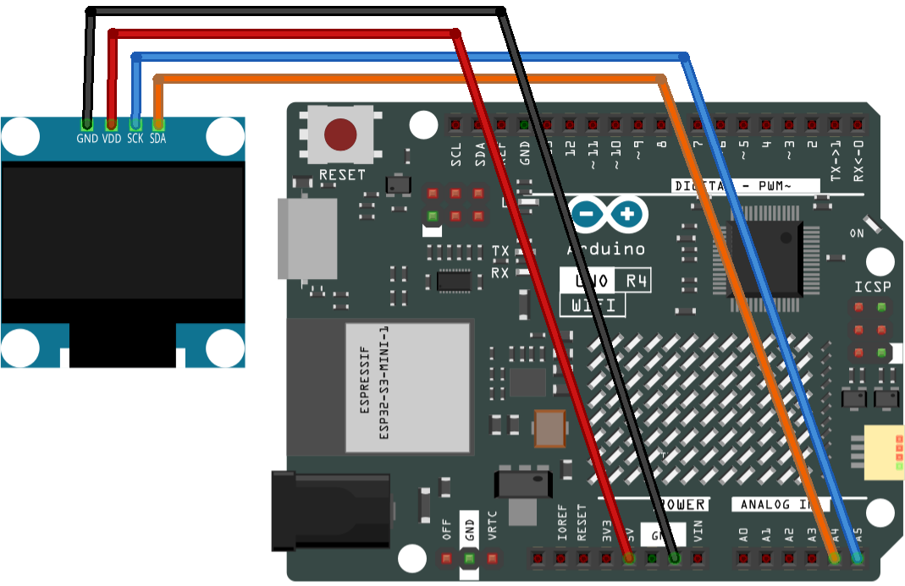

.. _oled:

OLED
==============================================================

.. note::
  
  🌟 Welcome to the SunFounder Facebook Community! Whether you're into Raspberry Pi, Arduino, or ESP32, you'll find inspiration, help ideas here.
   
  - ✅ Be the first to get free learning resources. 
   
  - ✅ Stay updated on new products & exclusive giveaways. 
   
  - ✅ Share your creations and get real feedback.
   
  * 👉 Need faster updates or support? Click [|link_sf_facebook|] join our Facebook community 

  * 👉 Or join our WhatsApp group: Click [|link_sf_whatsapp|]
   
Kit purchase
------------------------

Looking for parts? Check out our all-in-one kits below — packed with components, beginner-friendly guides, and tons of fun.

.. image:: img/ultimate_sensor_kit.png
   :width: 100%
   :align: center
   :target: https://www.sunfounder.com/collections/arduino-kits-bundles/products/sunfounder-ultimate-sensor-kit-with-original-arduino-uno-r4-minima?ref=jbzmncle

.. raw:: html

     

.. list-table::
   :widths: 20 20 20
   :header-rows: 1

   * - Name
     - Includes Arduino board
     - PURCHASE LINK
   * - Elite Explorer Kit
     - Arduino Uno R4 WiFi
     - |link_elite_buy|
   * - 3 in 1 Ultimate Starter Kit
     - Arduino Uno R4 Minima
     - |link_arduinor4_buy|

Course Introduction
------------------------

In this lesson, we will learn how to use the OLED with Arduino.

.. .. raw:: html

..  <iframe width="700" height="394" src="https://www.youtube.com/embed/KkPsawETYfg?si=4nMpy4ZNZjKVSooc" title="YouTube video player" frameborder="0" allow="accelerometer; autoplay; clipboard-write; encrypted-media; gyroscope; picture-in-picture; web-share" referrerpolicy="strict-origin-when-cross-origin" allowfullscreen></iframe>

.. note::

  If this is your first time working with an Arduino project, we recommend downloading and reviewing the basic materials first.

  * :ref:`install_arduino`
  * :ref:`introduce_arduino`

**Required Components**

In this project, we need the following components:

.. list-table::
    :widths: 5 20 5 20
    :header-rows: 1

    *   - SN
        - COMPONENT INTRODUCTION	
        - QUANTITY
        - PURCHASE LINK

    *   - 1
        - Arduino UNO R4 Minima
        - 1
        - |link_unor4_buy|
    *   - 2
        - USB Type-C cable
        - 1
        - 
    *   - 3
        - Breadboard
        - 1
        - |link_breadboard_buy|
    *   - 4
        - Wires
        - Several
        - |link_wires_buy|
    *   - 5
        - OLED Display Module
        - 1
        - |link_oled_buy|

**Wiring**

**Common Connections:**

* **OLED Display Module**

  - **SDA:** Connect to **A4** on the Arduino.
  - **SCK:** Connect to **A5** on the Arduino.
  - **GND:** Connect to **GND** on the Arduino.
  - **VCC:** Connect to **5V** on the Arduino.

**Writing the Code**

.. note::

    * You can copy this code into **Arduino IDE**. 
    * To install the library, use the Arduino Library Manager and search for **Adafruit SSD1306** and **Adafruit GFX** and install it.
    * Don't forget to select the board(Arduino UNO R4 Minima) and the correct port before clicking the **Upload** button.

.. code-block:: arduino

    /*
      This code initializes an OLED display (SSD1306) using the Adafruit SSD1306 library, 
      and displays various text, numbers, and scroll animations on the screen.

      Board: Arduino Uno R3 (or R4)
      Component: OLED (SSD1306)
      Library: https://github.com/adafruit/Adafruit_SSD1306 (Adafruit SSD1306 by Adafruit)  
              https://github.com/adafruit/Adafruit-GFX-Library (Adafruit GFX Library by Adafruit) 
    */

    #include <SPI.h>
    #include <Wire.h>
    #include <Adafruit_GFX.h>
    #include <Adafruit_SSD1306.h>

    #define SCREEN_WIDTH 128  // OLED display width, in pixels
    #define SCREEN_HEIGHT 64  // OLED display height, in pixels

    // Declaration for SSD1306 display connected using I2C
    #define OLED_RESET -1  // Reset pin # (or -1 if sharing Arduino reset pin)
    #define SCREEN_ADDRESS 0x3C
    Adafruit_SSD1306 display(SCREEN_WIDTH, SCREEN_HEIGHT, &Wire, OLED_RESET);

    //Bitmap data
    static const unsigned char PROGMEM sunfounderIcon[] = {
      0xff, 0xff, 0xff, 0xff, 0xff, 0xff, 0xff, 0xff, 0xff, 0xff, 0xff, 0xf8, 0x7f, 0xff, 0xff, 0xff, 
      0xff, 0xff, 0xff, 0xf0, 0x1f, 0xff, 0xff, 0xff, 0xff, 0xff, 0xff, 0xe0, 0x0f, 0xff, 0xff, 0xff, 
      0xff, 0xff, 0xff, 0xc0, 0x07, 0xff, 0xff, 0xff, 0xff, 0xff, 0xff, 0x80, 0x03, 0xff, 0xff, 0xff, 
      0xff, 0xff, 0xff, 0x00, 0x01, 0xff, 0xff, 0xff, 0xff, 0xff, 0xfe, 0x00, 0x00, 0x7f, 0xff, 0xff, 
      0xff, 0xff, 0xfc, 0x00, 0x00, 0x3f, 0xff, 0xff, 0xff, 0xff, 0xf8, 0x00, 0x00, 0x1f, 0xff, 0xff, 
      0xff, 0xff, 0xf0, 0x00, 0x00, 0x0f, 0xff, 0xff, 0xff, 0xff, 0xe0, 0x01, 0x00, 0x07, 0xff, 0xff, 
      0xff, 0xff, 0xc0, 0x07, 0xc0, 0x01, 0xff, 0xff, 0xff, 0xff, 0x80, 0x0f, 0xe0, 0x00, 0xff, 0xff, 
      0xff, 0xff, 0x00, 0x1f, 0xf0, 0x00, 0x7f, 0xff, 0xff, 0xfe, 0x00, 0x3f, 0xf8, 0x00, 0x3f, 0xff, 
      0xff, 0xfc, 0x00, 0x7f, 0xfe, 0x00, 0x0f, 0xff, 0xff, 0xfc, 0x00, 0xfe, 0xff, 0x00, 0x07, 0xff, 
      0xff, 0xf8, 0x01, 0xfc, 0x7f, 0x80, 0x03, 0xff, 0xff, 0xf0, 0x03, 0xf8, 0x3f, 0xc0, 0x01, 0xff, 
      0xff, 0xe0, 0x07, 0xf0, 0x0f, 0xe0, 0x00, 0xff, 0xff, 0xc0, 0x0f, 0xe0, 0x07, 0xf8, 0x00, 0x3f, 
      0xff, 0x80, 0x0f, 0xc0, 0x03, 0xfc, 0x00, 0x7f, 0xff, 0x00, 0x1f, 0xc0, 0x01, 0xfe, 0x00, 0xff, 
      0xff, 0x00, 0x0f, 0xe0, 0x00, 0x7f, 0x81, 0xff, 0xff, 0x00, 0x0f, 0xf0, 0x00, 0x3f, 0xc3, 0xff, 
      0xff, 0x80, 0x03, 0xfc, 0x00, 0x1f, 0xe7, 0xff, 0xff, 0xc0, 0x01, 0xfe, 0x00, 0x0f, 0xff, 0xff, 
      0xff, 0xe0, 0x00, 0xff, 0x00, 0x03, 0xff, 0xff, 0xff, 0xf0, 0x00, 0x7f, 0x80, 0x01, 0xff, 0xff, 
      0xff, 0xf8, 0x00, 0x1f, 0xe0, 0x00, 0xff, 0xff, 0xff, 0xfe, 0x00, 0x0f, 0xf0, 0x00, 0x7f, 0xff, 
      0xff, 0xff, 0x00, 0x07, 0xf8, 0x00, 0x3f, 0xff, 0xff, 0xff, 0x80, 0x03, 0xfc, 0x00, 0x0f, 0xff, 
      0xff, 0xff, 0xc0, 0x00, 0xff, 0x00, 0x07, 0xff, 0xff, 0xff, 0xe0, 0x00, 0x7f, 0x80, 0x03, 0xff, 
      0xff, 0xff, 0xf8, 0x00, 0x3f, 0xc0, 0x01, 0xff, 0xff, 0xf3, 0xfc, 0x00, 0x1f, 0xe0, 0x00, 0xff, 
      0xff, 0xe1, 0xfe, 0x00, 0x07, 0xf8, 0x00, 0x7f, 0xff, 0xc0, 0x7f, 0x00, 0x03, 0xf8, 0x00, 0x7f, 
      0xff, 0x80, 0x3f, 0xc0, 0x01, 0xfc, 0x00, 0xff, 0xff, 0x00, 0x1f, 0xe0, 0x03, 0xf8, 0x00, 0xff, 
      0xfe, 0x00, 0x0f, 0xf0, 0x03, 0xf0, 0x01, 0xff, 0xff, 0x80, 0x07, 0xf8, 0x07, 0xe0, 0x03, 0xff, 
      0xff, 0xc0, 0x01, 0xfc, 0x0f, 0xc0, 0x07, 0xff, 0xff, 0xe0, 0x00, 0xff, 0x1f, 0xc0, 0x0f, 0xff, 
      0xff, 0xf0, 0x00, 0x7f, 0xbf, 0x00, 0x1f, 0xff, 0xff, 0xf8, 0x00, 0x3f, 0xff, 0x00, 0x3f, 0xff, 
      0xff, 0xfe, 0x00, 0x0f, 0xfe, 0x00, 0x7f, 0xff, 0xff, 0xff, 0x00, 0x07, 0xfc, 0x00, 0xff, 0xff, 
      0xff, 0xff, 0x80, 0x03, 0xf8, 0x01, 0xff, 0xff, 0xff, 0xff, 0xc0, 0x01, 0xf0, 0x03, 0xff, 0xff, 
      0xff, 0xff, 0xf0, 0x00, 0x00, 0x07, 0xff, 0xff, 0xff, 0xff, 0xf8, 0x00, 0x00, 0x0f, 0xff, 0xff, 
      0xff, 0xff, 0xfc, 0x00, 0x00, 0x0f, 0xff, 0xff, 0xff, 0xff, 0xfe, 0x00, 0x00, 0x1f, 0xff, 0xff, 
      0xff, 0xff, 0xff, 0x00, 0x00, 0x3f, 0xff, 0xff, 0xff, 0xff, 0xff, 0xc0, 0x00, 0x7f, 0xff, 0xff, 
      0xff, 0xff, 0xff, 0xe0, 0x00, 0xff, 0xff, 0xff, 0xff, 0xff, 0xff, 0xf0, 0x01, 0xff, 0xff, 0xff, 
      0xff, 0xff, 0xff, 0xf8, 0x03, 0xff, 0xff, 0xff, 0xff, 0xff, 0xff, 0xfc, 0x07, 0xff, 0xff, 0xff, 
      0xff, 0xff, 0xff, 0xff, 0x0f, 0xff, 0xff, 0xff, 0xff, 0xff, 0xff, 0xff, 0xff, 0xff, 0xff, 0xff
    };

    void setup() {
      Serial.begin(9600);

      // initialize the OLED object
      if (!display.begin(SSD1306_SWITCHCAPVCC, SCREEN_ADDRESS)) {
        Serial.println(F("SSD1306 allocation failed"));
        for (;;)
          ;
      }

      // Clear the buffer.
      display.clearDisplay();

      // Display Text
      display.setTextSize(1);       // Set text size
      display.setTextColor(WHITE);  // Set text color
      display.setCursor(0, 28);     // Set cursor position
      display.println("Hello world!");
      display.display();  // Display the content on the screen
      delay(2000);
      display.clearDisplay();  // Clear the screen

      // Display Inverted Text
      display.setTextColor(BLACK, WHITE);  // 'inverted' text
      display.setCursor(0, 28);
      display.println("Hello world!");
      display.display();
      delay(2000);
      display.clearDisplay();

      // Changing Font Size
      display.setTextColor(WHITE);
      display.setCursor(0, 24);
      display.setTextSize(3);
      display.println("Hello!");
      display.display();
      delay(2000);
      display.clearDisplay();

      // Display Numbers
      display.setTextSize(2);
      display.setCursor(0, 28);
      display.println(123456789);
      display.display();
      delay(2000);
      display.clearDisplay();

      // Display ASCII Characters
      display.setCursor(0, 24);
      display.setTextSize(2);
      for (int i = 1; i < 8; i++) {
        display.write(i);
      }
      display.display();
      delay(2000);
      display.clearDisplay();

      // Scroll full screen
      display.setCursor(0, 0);
      display.setTextSize(1);
      display.println("Full");
      display.println("screen");
      display.println("scrolling!");
      display.display();
      display.startscrollright(0x00, 0x07);  // Scroll the screen to the right
      delay(5000);
      display.stopscroll();
      delay(500);
      display.startscrollleft(0x00, 0x07);  // Scroll the screen to the left
      delay(5000);
      display.stopscroll();
      delay(500);
      display.clearDisplay();

      // Scroll part of the screen
      display.setCursor(0, 0);
      display.setTextSize(1);
      display.println("Scroll");
      display.println("some part");
      display.println("of the screen.");
      display.display();
      display.startscrollright(0x00, 0x00);  // Scroll the first column of the screen to the right
      delay(6500);
      display.stopscroll();
      display.clearDisplay();

      // Display bitmap
      display.drawBitmap(32, 0, sunfounderIcon, 64, 64, WHITE);
      display.display();
    }

    void loop() {
    }