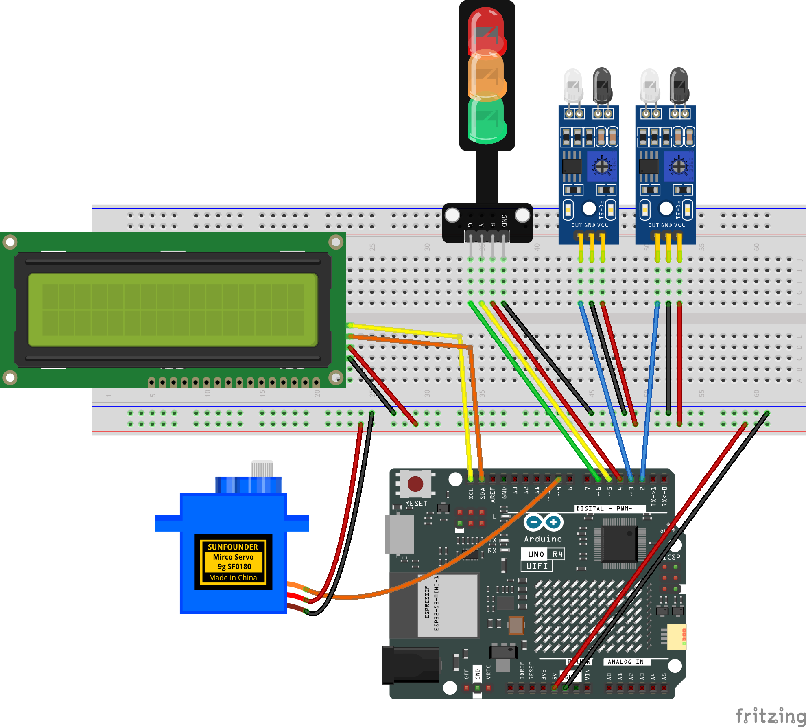

.. _parking_lot:

Parking Lot
==============================================================

.. note::
  
  🌟 Welcome to the SunFounder Facebook Community! Whether you're into Raspberry Pi, Arduino, or ESP32, you'll find inspiration, help ideas here.
   
  - ✅ Be the first to get free learning resources. 
   
  - ✅ Stay updated on new products & exclusive giveaways. 
   
  - ✅ Share your creations and get real feedback.
   
  * 👉 Need faster updates or support? Click [|link_sf_facebook|] join our Facebook community 

  * 👉 Or join our WhatsApp group: Click [|link_sf_whatsapp|]
   
  * 🎁 Looking for parts?Check out our all-in-one kits below — packed with components, beginner-friendly guides, and tons of fun.

  .. list-table::
    :widths: 20 20 20
    :header-rows: 1

    *   - Name	
        - Includes Arduino board
        - PURCHASE LINK
    *   - Ultimate Sensor Kit
        - Arduino Uno R4 Minima
        - |link_ultimate_sensor_buy|
    *   - Elite Explorer Kit
        - Arduino Uno R4 WiFi
        - |link_elite_buy|
    *   - 3 in 1 Ultimate Starter Kit
        - Arduino Uno R4 Minima
        - |link_arduinor4_buy|

Course Introduction
------------------------

In this project, you will use an Arduino board, a servo motor, IR sensors, and a traffic light module to build an intelligent parking lot barrier system.

The system detects vehicles with IR sensors, automatically controls the barrier gate, updates the car count on the LCD, and manages the traffic light for safe entry and exit.

.. .. raw:: html

..  <iframe width="700" height="394" src="https://www.youtube.com/embed/iHSgDp1uMHI?si=xqwuJeHBcI4jQSob" title="YouTube video player" frameborder="0" allow="accelerometer; autoplay; clipboard-write; encrypted-media; gyroscope; picture-in-picture; web-share" referrerpolicy="strict-origin-when-cross-origin" allowfullscreen></iframe>

.. note::

  If this is your first time working with an Arduino project, we recommend downloading and reviewing the basic materials first.
  
  * :ref:`install_arduino`
  * :ref:`introduce_arduino`

**Required Components**

In this project, we need the following components:

.. list-table::
    :widths: 5 20 5 20
    :header-rows: 1

    *   - SN
        - COMPONENT INTRODUCTION	
        - QUANTITY
        - PURCHASE LINK

    *   - 1
        - Arduino UNO R4 Minima/Arduino UNO R4 WIFI
        - 1
        - |link_unor4_wifi_buy|
    *   - 2
        - USB Type-C cable
        - 1
        - 
    *   - 3
        - Breadboard
        - 1
        - |link_breadboard_buy|
    *   - 4
        - Wires
        - Several
        - |link_wires_buy|
    *   - 5
        - IR Obstacle Avoidance Sensor Module
        - 2
        - |link_IR_module_buy|
    *   - 6
        - Digital Servo Motor
        - 1
        - |link_motor_buy|
    *   - 7
        - I2C LCD 1602
        - 1
        - |link_i2clcd1602_buy|
    *   - 8
        - Traffic Light LED
        - 1
        - |link_trafficlinght_buy|

**Wiring**

**Common Connections:**

* **Traffic light LED**

  - **R:** Connect to **4** on the Arduino.
  - **Y:** Connect to **5** on the Arduino.
  - **G:** Connect to **6** on the Arduino.
  - **GND:** Connect to breadboard’s negative power bus.

* **Digital Servo Motor**

  - Connect to breadboard’s positive power bus.
  - Connect to breadboard’s negative power bus.
  - Connect to  **9** on the Arduino.

* **IR Obstacle Avoidance Sensor Module 1**

  - **OUT:** Connect to **2** on the Arduino.
  - **GND:** Connect to breadboard’s negative power bus.
  - **VCC:** Connect to breadboard’s red power bus.

* **IR Obstacle Avoidance Sensor Module 1**

  - **OUT:** Connect to **3** on the Arduino.
  - **GND:** Connect to breadboard’s negative power bus.
  - **VCC:** Connect to breadboard’s red power bus.

* **I2C LCD 1602**

  - **SDA:** Connect to **SDA** on the Arduino.
  - **SCL:** Connect to **SCL** on the Arduino.
  - **GND:** Connect to breadboard’s negative power bus.
  - **VCC:** Connect to breadboard’s red power bus.

**Writing the Code**

.. note::

    * You can copy this code into **Arduino IDE**. 
    * To install the library, use the Arduino Library Manager and search for **LiquidCrystal I2C** and install it.
    * Don't forget to select the board(Arduino UNO R4 Minima/WIFI) and the correct port before clicking the **Upload** button.

.. code-block:: arduino

      #include <Wire.h>
      #include <LiquidCrystal_I2C.h>
      #include <Servo.h>

      // LCD setup
      LiquidCrystal_I2C lcd(0x27, 16, 2);

      // Servo setup
      Servo gateServo;
      const int SERVO_PIN = 9;

      // IR sensor pins
      const int IR1_PIN = 2;
      const int IR2_PIN = 3;

      // Traffic light module pins
      const int RED_PIN = 4;
      const int YELLOW_PIN = 5;
      const int GREEN_PIN = 6;

      // Status variable
      int carCount = 2;

      enum State {
        IDLE,
        ENTER_WAIT_YELLOW,    // Detected at entrance, yellow light blinking
        ENTER_WAIT_GREEN,     // Raise barrier, green light
        ENTER_WAIT_EXIT,      // Waiting for IR2 to count
        EXIT_WAIT_YELLOW,     // Detected at exit, yellow light blinking
        EXIT_WAIT_GREEN,      // Raise barrier, green light
        EXIT_WAIT_EXIT        // Waiting for IR1 to count
      };

      State state = IDLE;

      // Timing variables
      unsigned long stateStartTime = 0;
      const unsigned long YELLOW_BLINK_TIME = 2000;
      const unsigned long GREEN_TIME = 1000;
      bool yellowBlinkState = false;
      unsigned long lastBlinkTime = 0;
      const unsigned long BLINK_INTERVAL = 300;

      void setup() {
        // LCD
        lcd.init();
        lcd.backlight();
        lcd.setCursor(0, 0);
        lcd.print("Parking Lot");
        lcd.setCursor(0, 1);
        lcd.print("Car Count: ");
        lcd.print(carCount);

        // Servo
        gateServo.attach(SERVO_PIN);
        gateServo.write(0); // Initial down

        // IR sensors
        pinMode(IR1_PIN, INPUT);
        pinMode(IR2_PIN, INPUT);

        // Traffic light
        pinMode(RED_PIN, OUTPUT);
        pinMode(YELLOW_PIN, OUTPUT);
        pinMode(GREEN_PIN, OUTPUT);
        setTrafficLight('R');
      }

      void loop() {
        bool ir1State = digitalRead(IR1_PIN) == LOW;
        bool ir2State = digitalRead(IR2_PIN) == LOW;
        unsigned long now = millis();

        switch(state) {
          case IDLE:
            setTrafficLight('R');
            gateServo.write(0); // Down
            // Detect entry
            if (ir1State) {
              state = ENTER_WAIT_YELLOW;
              stateStartTime = now;
              lastBlinkTime = now;
              yellowBlinkState = false;
            }
            // Detect exit
            else if (ir2State) {
              state = EXIT_WAIT_YELLOW;
              stateStartTime = now;
              lastBlinkTime = now;
              yellowBlinkState = false;
            }
            break;

          case ENTER_WAIT_YELLOW:
            // Non-blocking yellow light blinking
            if (now - lastBlinkTime > BLINK_INTERVAL) {
              yellowBlinkState = !yellowBlinkState;
              digitalWrite(YELLOW_PIN, yellowBlinkState ? HIGH : LOW);
              lastBlinkTime = now;
            }
            if (now - stateStartTime > YELLOW_BLINK_TIME) {
              digitalWrite(YELLOW_PIN, LOW);
              setTrafficLight('G');
              gateServo.write(90); // Raise barrier
              state = ENTER_WAIT_GREEN;
              stateStartTime = now;
            }
            break;

          case ENTER_WAIT_GREEN:
            // Allow car to pass during green light
            if (now - stateStartTime > GREEN_TIME) {
              // Wait for IR2 detection (car passes IR2 to count)
              state = ENTER_WAIT_EXIT;
            }
            break;

          case ENTER_WAIT_EXIT:
            // Count only after IR2 is detected
            if (ir2State) {
              carCount++;
              updateLCD();
              setTrafficLight('R');
              gateServo.write(0); // Barrier down
              state = IDLE;
              // Wait for IR2 to be released before allowing next entry
              while (digitalRead(IR2_PIN) == LOW) { delay(10); }
            }
            break;

          case EXIT_WAIT_YELLOW:
            if (now - lastBlinkTime > BLINK_INTERVAL) {
              yellowBlinkState = !yellowBlinkState;
              digitalWrite(YELLOW_PIN, yellowBlinkState ? HIGH : LOW);
              lastBlinkTime = now;
            }
            if (now - stateStartTime > YELLOW_BLINK_TIME) {
              digitalWrite(YELLOW_PIN, LOW);
              setTrafficLight('G');
              gateServo.write(90); // Raise barrier
              state = EXIT_WAIT_GREEN;
              stateStartTime = now;
            }
            break;

          case EXIT_WAIT_GREEN:
            if (now - stateStartTime > GREEN_TIME) {
              state = EXIT_WAIT_EXIT;
            }
            break;

          case EXIT_WAIT_EXIT:
            // Count only after IR1 is detected
            if (ir1State) {
              if (carCount > 0) carCount--;
              updateLCD();
              setTrafficLight('R');
              gateServo.write(0); // Barrier down
              state = IDLE;
              // Wait for IR1 to be released before allowing next exit
              while (digitalRead(IR1_PIN) == LOW) { delay(10); }
            }
            break;
        }
      }

      // Traffic light control
      void setTrafficLight(char color) {
        switch (color) {
          case 'R':
            digitalWrite(RED_PIN, HIGH);
            digitalWrite(YELLOW_PIN, LOW);
            digitalWrite(GREEN_PIN, LOW);
            break;
          case 'Y':
            digitalWrite(RED_PIN, LOW);
            digitalWrite(YELLOW_PIN, HIGH);
            digitalWrite(GREEN_PIN, LOW);
            break;
          case 'G':
            digitalWrite(RED_PIN, LOW);
            digitalWrite(YELLOW_PIN, LOW);
            digitalWrite(GREEN_PIN, HIGH);
            break;
        }
      }

      // Update LCD display
      void updateLCD() {
        lcd.setCursor(0, 1);
        lcd.print("Car Count:    ");
        lcd.setCursor(11, 1);
        lcd.print(carCount);
      }
