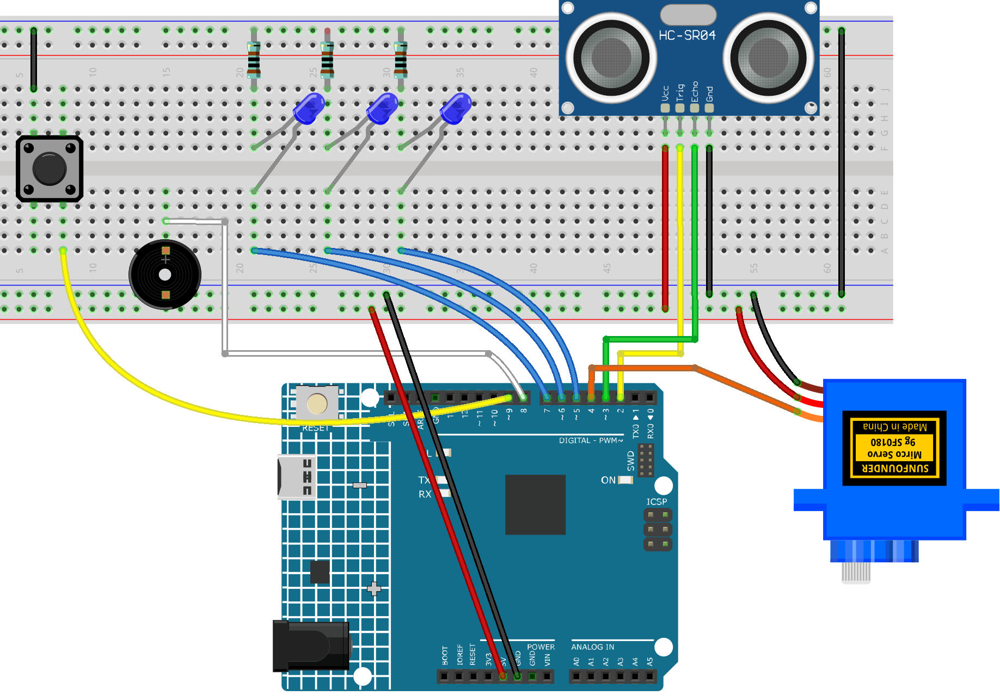

.. _parking_lot2.0:

Parking Lot 2.0
==============================================================

.. note::
  
  🌟 Welcome to the SunFounder Facebook Community! Whether you're into Raspberry Pi, Arduino, or ESP32, you'll find inspiration, help ideas here.
   
  - ✅ Be the first to get free learning resources. 
   
  - ✅ Stay updated on new products & exclusive giveaways. 
   
  - ✅ Share your creations and get real feedback.
   
  * 👉 Need faster updates or support? Click [|link_sf_facebook|] join our Facebook community 

  * 👉 Or join our WhatsApp group: Click [|link_sf_whatsapp|]
   
Kit purchase
------------------------

Looking for parts? Check out our all-in-one kits below — packed with components, beginner-friendly guides, and tons of fun.

.. image:: img/ultimate_sensor_kit.png
   :width: 100%
   :align: center
   :target: https://www.sunfounder.com/collections/arduino-kits-bundles/products/sunfounder-ultimate-sensor-kit-with-original-arduino-uno-r4-minima?ref=jbzmncle

.. raw:: html

     

.. list-table::
   :widths: 20 20 20
   :header-rows: 1

   * - Name
     - Includes Arduino board
     - PURCHASE LINK
   * - Elite Explorer Kit
     - Arduino Uno R4 WiFi
     - |link_elite_buy|
   * - 3 in 1 Ultimate Starter Kit
     - Arduino Uno R4 Minima
     - |link_arduinor4_buy|

Course Introduction
------------------------

In this project, you'll use an Arduino board, an ultrasonic sensor, a servo motor, LEDs, and a buzzer to create a smart parking gate system.

The system automatically opens the gate for incoming vehicles, tracks the number of cars, and uses LEDs and a buzzer to indicate when the lot is full. A reset button allows manual system control for testing or restarting.

.. raw:: html

  <iframe width="700" height="394" src="https://www.youtube.com/embed/vqSj8SmrrQA?si=yGg-yv0ou2zxbBvL" title="YouTube video player" frameborder="0" allow="accelerometer; autoplay; clipboard-write; encrypted-media; gyroscope; picture-in-picture; web-share" referrerpolicy="strict-origin-when-cross-origin" allowfullscreen></iframe>

.. note::

  If this is your first time working with an Arduino project, we recommend downloading and reviewing the basic materials first.
  
  * :ref:`install_arduino`
  * :ref:`introduce_arduino`

**Required Components**

In this project, we need the following components:

.. list-table::
    :widths: 5 20 5 20
    :header-rows: 1

    *   - SN
        - COMPONENT INTRODUCTION	
        - QUANTITY
        - PURCHASE LINK

    *   - 1
        - Arduino UNO R4 Minima/Arduino UNO R4 WIFI
        - 1
        - |link_unor4_wifi_buy|
    *   - 2
        - USB Type-C cable
        - 1
        - 
    *   - 3
        - Breadboard
        - 1
        - |link_breadboard_buy|
    *   - 4
        - Wires
        - Several
        - |link_wires_buy|
    *   - 5
        - Ultrasonic Sensor Module
        - 1
        - |link_ultrasonic_buy|
    *   - 6
        - Digital Servo Motor
        - 1
        - |link_motor_buy|
    *   - 7
        - Active Buzzer
        - 1
        - 
    *   - 8
        - LED
        - 3
        - |link_led_buy|
    *   - 9
        - Button
        - 1
        - |link_button_buy|

**Wiring**

**Common Connections:**

* **Button**

  - Connect to breadboard’s negative power bus.
  - Connect to **9** on the Arduino.

* **Ultrasonic Sensor Module**

  - **Trig:** Connect to **2** on the Arduino.
  - **Echo:** Connect to **3** on the Arduino.
  - **GND:** Connect to breadboard’s negative power bus.
  - **VCC:** Connect to breadboard’s red power bus.

* **Active Buzzer**

  - **＋:** Connect to **8** on the Arduino.
  - **－:** Connect to breadboard’s negative power bus.

* **Digital Servo Motor**

  - Connect to breadboard’s positive power bus.
  - Connect to breadboard’s negative power bus.
  - Connect to **4** on the Arduino.

* **LEDS**

  - Connect the LED **anode** to **5~7** on the Arduino, and the **cathode** to a **1kΩ resistor**, then to the negative power bus on the breadboard.

**Writing the Code**

.. note::

    * You can copy this code into **Arduino IDE**. 
    * Don't forget to select the board(Arduino UNO R4 Minima/WIFI) and the correct port before clicking the **Upload** button.

.. code-block:: arduino

      #include <Servo.h>

      // Pins
      #define TRIG_PIN 2
      #define ECHO_PIN 3
      #define SERVO_PIN 4
      #define LED1 5
      #define LED2 6
      #define LED3 7
      #define BUZZER 8
      #define BUTTON 9

      // Objects
      Servo gateServo;

      // Variables
      int vehicleCount = 0;
      bool alertMode = false;
      long distance;
      unsigned long lastFlashTime = 0;
      bool ledState = false;

      void setup() {
        Serial.begin(9600);

        pinMode(TRIG_PIN, OUTPUT);
        pinMode(ECHO_PIN, INPUT);
        
        pinMode(LED1, OUTPUT);
        pinMode(LED2, OUTPUT);
        pinMode(LED3, OUTPUT);
        pinMode(BUZZER, OUTPUT);
        pinMode(BUTTON, INPUT_PULLUP); // Using internal pull-up
        
        gateServo.attach(SERVO_PIN);
        gateServo.write(0); // Gate down

        // Turn off LEDs and buzzer at start
        digitalWrite(LED1, LOW);
        digitalWrite(LED2, LOW);
        digitalWrite(LED3, LOW);
        digitalWrite(BUZZER, LOW);
      }

      void loop() {
        distance = getDistance();

        // Button pressed: reset system
        if (digitalRead(BUTTON) == LOW) {
          vehicleCount = 0;
          alertMode = false;
          digitalWrite(BUZZER, LOW);
          digitalWrite(LED1, LOW);
          digitalWrite(LED2, LOW);
          digitalWrite(LED3, LOW);
          Serial.println("System Reset");
          delay(500); // Debounce
        }

        // Vehicle detected within 10 cm range
        if (distance > 0 && distance < 10) {
          handleVehicleDetection();
          delay(1000); // Prevent multiple counts for same vehicle
        }

        // If over capacity and vehicle still there, alert
        if (vehicleCount >= 3 && distance > 0 && distance < 10) {
          alertMode = true;
        } else {
          alertMode = false;
          digitalWrite(BUZZER, LOW);
        }

        if (alertMode) {
          flashLEDs();
          digitalWrite(BUZZER, HIGH);
        }
      }

      // Function to measure distance from ultrasonic sensor
      long getDistance() {
        digitalWrite(TRIG_PIN, LOW);
        delayMicroseconds(2);
        digitalWrite(TRIG_PIN, HIGH);
        delayMicroseconds(10);
        digitalWrite(TRIG_PIN, LOW);

        long duration = pulseIn(ECHO_PIN, HIGH, 30000); // Timeout 30ms
        if (duration == 0) return -1; // Timeout
        return duration * 0.034 / 2;
      }

      // Vehicle enters: open gate, count, close
      void handleVehicleDetection() {
        if (vehicleCount < 3) {
          vehicleCount++;
          Serial.print("Vehicle Count: ");
          Serial.println(vehicleCount);
          updateLEDs();

          gateServo.write(90); // Gate up
          delay(3000);
          gateServo.write(0); // Gate down
        }
      }

      // Update LEDs based on vehicle count
      void updateLEDs() {
        digitalWrite(LED1, vehicleCount >= 1 ? HIGH : LOW);
        digitalWrite(LED2, vehicleCount >= 2 ? HIGH : LOW);
        digitalWrite(LED3, vehicleCount >= 3 ? HIGH : LOW);
      }

      // Flash LEDs in alert mode
      void flashLEDs() {
        unsigned long now = millis();
        if (now - lastFlashTime >= 500) {
          ledState = !ledState;
          digitalWrite(LED1, ledState);
          digitalWrite(LED2, ledState);
          digitalWrite(LED3, ledState);
          lastFlashTime = now;
        }
      }
