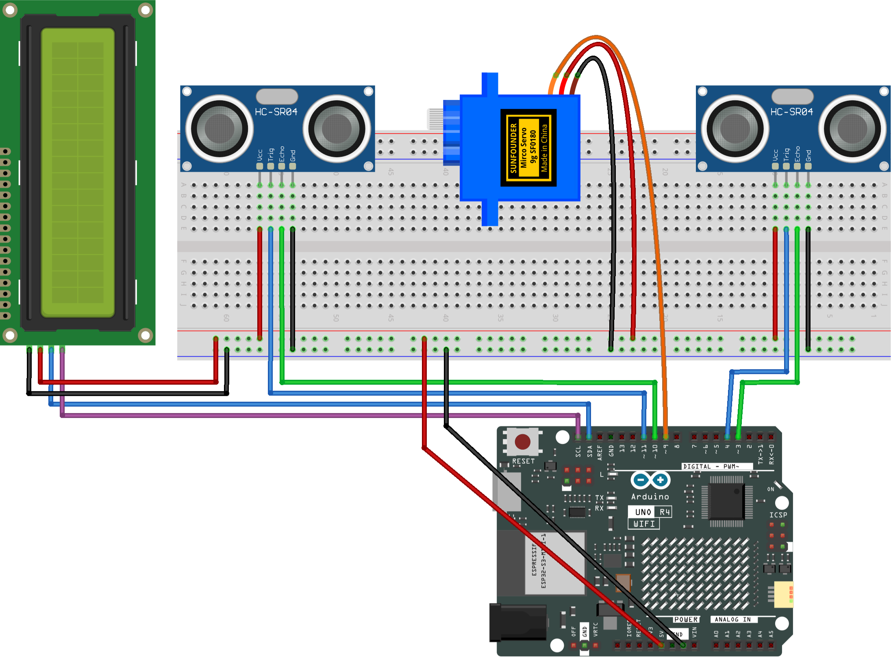

.. _parking_lot3.0:

Parking Lot 3.0
==============================================================

.. note::
  
  🌟 Welcome to the SunFounder Facebook Community! Whether you're into Raspberry Pi, Arduino, or ESP32, you'll find inspiration, help ideas here.
   
  - ✅ Be the first to get free learning resources. 
   
  - ✅ Stay updated on new products & exclusive giveaways. 
   
  - ✅ Share your creations and get real feedback.
   
  * 👉 Need faster updates or support? Click [|link_sf_facebook|] join our Facebook community 

  * 👉 Or join our WhatsApp group: Click [|link_sf_whatsapp|]

Kit purchase
------------------------

Looking for parts? Check out our all-in-one kits below — packed with components, beginner-friendly guides, and tons of fun.

.. image:: img/ultimate_sensor_kit.png
   :width: 100%
   :align: center
   :target: https://www.sunfounder.com/collections/arduino-kits-bundles/products/sunfounder-ultimate-sensor-kit-with-original-arduino-uno-r4-minima?ref=jbzmncle

.. raw:: html

     

.. list-table::
   :widths: 20 20 20
   :header-rows: 1

   * - Name
     - Includes Arduino board
     - PURCHASE LINK
   * - Elite Explorer Kit
     - Arduino Uno R4 WiFi
     - |link_elite_buy|
   * - 3 in 1 Ultimate Starter Kit
     - Arduino Uno R4 Minima
     - |link_arduinor4_buy|

Course Introduction
------------------------

In this project, you will use an Arduino board, a servo motor, Ultrasonic Sensor Modules, and I2C LCD 1602 to build an intelligent parking lot barrier system.

The system detects vehicles with  Ultrasonic Sensor Modules, automatically controls the barrier gate, updates the car count on the LCD for safe entry and exit.

.. .. raw:: html

..  <iframe width="700" height="394" src="https://www.youtube.com/embed/R3Zpc3-IgRw?si=1kxl8c-d22eUEGFj" title="YouTube video player" frameborder="0" allow="accelerometer; autoplay; clipboard-write; encrypted-media; gyroscope; picture-in-picture; web-share" referrerpolicy="strict-origin-when-cross-origin" allowfullscreen></iframe>

.. note::

  If this is your first time working with an Arduino project, we recommend downloading and reviewing the basic materials first.
  
  * :ref:`install_arduino`
  * :ref:`introduce_arduino`

**Required Components**

In this project, we need the following components:

.. list-table::
    :widths: 5 20 5 20
    :header-rows: 1

    *   - SN
        - COMPONENT INTRODUCTION	
        - QUANTITY
        - PURCHASE LINK

    *   - 1
        - Arduino UNO R4 Minima/Arduino UNO R4 WIFI
        - 1
        - |link_unor4_wifi_buy|
    *   - 2
        - USB Type-C cable
        - 1
        - 
    *   - 3
        - Breadboard
        - 1
        - |link_breadboard_buy|
    *   - 4
        - Wires
        - Several
        - |link_wires_buy|
    *   - 5
        - Ultrasonic Sensor Module
        - 2
        - |link_ultrasonic_buy|
    *   - 6
        - Digital Servo Motor
        - 1
        - |link_motor_buy|
    *   - 7
        - I2C LCD 1602
        - 1
        - |link_i2clcd1602_buy|

**Wiring**

**Common Connections:**

* **Digital Servo Motor**

  - Connect to breadboard’s positive power bus.
  - Connect to breadboard’s negative power bus.
  - Connect to  **9** on the Arduino.

* **Ultrasonic Sensor Module Front**

  - **Trig:** Connect to **4** on the Arduino.
  - **Echo:** Connect to **3** on the Arduino.
  - **GND:** Connect to breadboard’s negative power bus.
  - **VCC:** Connect to breadboard’s red power bus.

* **Ultrasonic Sensor Module Back**

  - **Trig:** Connect to **11** on the Arduino.
  - **Echo:** Connect to **10** on the Arduino.
  - **GND:** Connect to breadboard’s negative power bus.
  - **VCC:** Connect to breadboard’s red power bus.

* **I2C LCD 1602**

  - **SDA:** Connect to **SDA** on the Arduino.
  - **SCL:** Connect to **SCL** on the Arduino.
  - **GND:** Connect to breadboard’s negative power bus.
  - **VCC:** Connect to breadboard’s red power bus.

**Writing the Code**

.. note::

    * You can copy this code into **Arduino IDE**. 
    * To install the library, use the Arduino Library Manager and search for **LiquidCrystal I2C** and install it.
    * Don't forget to select the board(Arduino UNO R4 Minima/WIFI) and the correct port before clicking the **Upload** button.

.. code-block:: arduino

      #include <Wire.h>
      #include <LiquidCrystal_I2C.h>
      #include <Servo.h>

      // Pins for the entrance ultrasonic sensor
      #define TRIG1 4
      #define ECHO1 3

      // Pins for the exit ultrasonic sensor
      #define TRIG2 11
      #define ECHO2 10

      // Servo signal pin
      #define SERVO_PIN 9

      // LCD display object (I2C address 0x27)
      LiquidCrystal_I2C lcd(0x27, 16, 2);
      Servo gateServo;

      // Total parking spaces and current available spaces
      const int TOTAL_SPOTS = 3;
      int availableSpots = TOTAL_SPOTS;

      // Servo angles for gate positions
      const int GATE_CLOSE_ANGLE = 90;
      const int GATE_OPEN_ANGLE  = 0;

      // Delay between each servo step (controls gate speed)
      const int SERVO_STEP_DELAY_MS = 15;

      // Wait time after a car is detected before opening the gate
      const int GATE_PREOPEN_DELAY_MS = 100;

      // Wait time after the car passes before closing the gate
      const int GATE_PRECLOSE_DELAY_MS = 500;

      // Distance threshold to consider that a car is detected
      const int DETECT_CM = 20;

      // Number of consistent readings required to confirm detection
      const int HIT_REQUIRED = 2;

      // Timeout for ultrasonic pulse reading
      const unsigned long PULSE_TIMEOUT_US = 30000;

      // Interval between ultrasonic measurements
      const unsigned long ULTRA_INTERVAL_MS = 60;

      // System states used to control the workflow
      enum State {
        IDLE,
        ENTER_PREPARE,
        ENTER_OPEN,
        ENTER_WAIT_PASS,
        EXIT_OPEN,
        EXIT_WAIT_PASS,
        WAIT_BEFORE_CLOSE,
        WAIT_CLEAR
      };

      State state = IDLE;

      // Used to control ultrasonic reading timing
      unsigned long lastUltraTime = 0;
      bool measureFirst = true;

      // Used for timing inside states
      unsigned long stateStartTime = 0;

      // Measured distances from the two sensors
      int d1 = 999;
      int d2 = 999;

      // Detection stability counters
      int hit1 = 0;
      int hit2 = 0;

      // Final detection results
      bool present1 = false;
      bool present2 = false;

      // -1 means entry (use one spot), +1 means exit (free one spot)
      int pendingDelta = 0;

      // Send ultrasonic pulse and return measured distance in cm
      int readDistanceCm(int trigPin, int echoPin) {
        digitalWrite(trigPin, LOW);
        delayMicroseconds(2);
        digitalWrite(trigPin, HIGH);
        delayMicroseconds(10);
        digitalWrite(trigPin, LOW);

        unsigned long duration = pulseIn(echoPin, HIGH, PULSE_TIMEOUT_US);

        // If no echo is received, treat as "far away"
        if (duration == 0) return 999;

        int cm = duration / 58;
        if (cm <= 0) cm = 999;
        return cm;
      }

      // Convert distance readings into stable car detection signals
      void updatePresence() {
        bool raw1 = (d1 < DETECT_CM);
        bool raw2 = (d2 < DETECT_CM);

        // Require multiple consistent readings to reduce noise
        hit1 = raw1 ? min(hit1 + 1, HIT_REQUIRED) : 0;
        hit2 = raw2 ? min(hit2 + 1, HIT_REQUIRED) : 0;

        present1 = (hit1 >= HIT_REQUIRED);
        present2 = (hit2 >= HIT_REQUIRED);
      }

      // Move the servo gradually to create a smooth gate motion
      void moveGateSlow(int targetAngle) {
        int currentAngle = gateServo.read();

        if (currentAngle < targetAngle) {
          for (int pos = currentAngle; pos <= targetAngle; pos++) {
            gateServo.write(pos);
            delay(SERVO_STEP_DELAY_MS);
          }
        } else {
          for (int pos = currentAngle; pos >= targetAngle; pos--) {
            gateServo.write(pos);
            delay(SERVO_STEP_DELAY_MS);
          }
        }
      }

      // Open or close the gate using smooth motion
      void setGate(bool open) {
        moveGateSlow(open ? GATE_OPEN_ANGLE : GATE_CLOSE_ANGLE);
      }

      // Print static text on the LCD
      void initLCDText() {
        lcd.setCursor(0, 0);
        lcd.print("Parking Lot     ");
        lcd.setCursor(0, 1);
        lcd.print("Spaces Left:    ");
      }

      // Update only the number on the LCD to avoid flicker
      void updateSpotsOnly() {
        lcd.setCursor(13, 1);
        lcd.print("   ");
        lcd.setCursor(13, 1);
        lcd.print(availableSpots);
      }

      // Apply the pending parking space change safely
      void applyPendingDelta() {
        if (pendingDelta == -1) {
          if (availableSpots > 0) availableSpots--;
        } else if (pendingDelta == 1) {
          if (availableSpots < TOTAL_SPOTS) availableSpots++;
        }
        pendingDelta = 0;
      }

      void setup() {
        pinMode(TRIG1, OUTPUT);
        pinMode(ECHO1, INPUT);
        pinMode(TRIG2, OUTPUT);
        pinMode(ECHO2, INPUT);

        // Attach servo and start with gate closed
        gateServo.attach(SERVO_PIN);
        setGate(false);

        // Initialize LCD display
        lcd.init();
        lcd.backlight();
        initLCDText();
        updateSpotsOnly();
      }

      void loop() {
        unsigned long now = millis();

        // Alternate between sensors to reduce ultrasonic interference
        if (now - lastUltraTime >= ULTRA_INTERVAL_MS) {
          lastUltraTime = now;

          if (measureFirst) d1 = readDistanceCm(TRIG1, ECHO1);
          else             d2 = readDistanceCm(TRIG2, ECHO2);

          measureFirst = !measureFirst;
          updatePresence();
        }

        switch (state) {
          // Waiting for a car
          case IDLE:
            // Entry trigger (only if space is available)
            if (present1 && !present2 && availableSpots > 0) {
              state = ENTER_PREPARE;
              stateStartTime = now;
            }
            // Exit trigger
            else if (present2 && !present1) {
              state = EXIT_OPEN;
            }
            break;

          // Short delay before opening the gate for entry
          case ENTER_PREPARE:
            if (now - stateStartTime >= (unsigned long)GATE_PREOPEN_DELAY_MS) {
              state = present1 ? ENTER_OPEN : IDLE; // Re-check presence to avoid false open
            }
            break;

          // Open gate for entering car
          case ENTER_OPEN:
            setGate(true);
            state = ENTER_WAIT_PASS;
            break;

          // Wait until the car reaches the second sensor
          case ENTER_WAIT_PASS:
            if (present2) {
              pendingDelta = -1;
              applyPendingDelta();
              updateSpotsOnly();
              state = WAIT_BEFORE_CLOSE;
              stateStartTime = now;
            }
            break;

          // Open gate for exiting car
          case EXIT_OPEN:
            setGate(true);
            state = EXIT_WAIT_PASS;
            break;

          // Wait until the car reaches the first sensor
          case EXIT_WAIT_PASS:
            if (present1) {
              pendingDelta = 1;
              applyPendingDelta();
              updateSpotsOnly();
              state = WAIT_BEFORE_CLOSE;
              stateStartTime = now;
            }
            break;

          // Keep gate open briefly after the car passes
          case WAIT_BEFORE_CLOSE:
            if (now - stateStartTime >= (unsigned long)GATE_PRECLOSE_DELAY_MS) {
              setGate(false);
              state = WAIT_CLEAR;
            }
            break;

          // Wait until both sensors are clear before resetting
          case WAIT_CLEAR:
            if (!present1 && !present2) state = IDLE;
            break;
        }
      }

