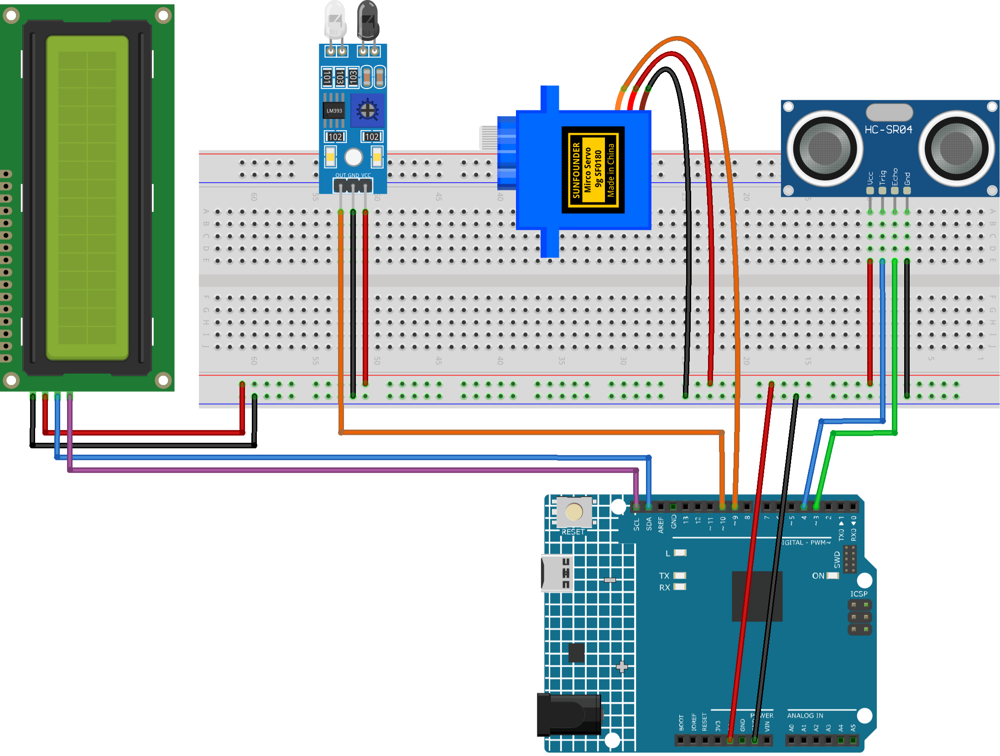

.. _parking_lot4.0:

Parking Lot 4.0
==============================================================

.. note::
  
  🌟 Welcome to the SunFounder Facebook Community! Whether you're into Raspberry Pi, Arduino, or ESP32, you'll find inspiration, help ideas here.
   
  - ✅ Be the first to get free learning resources. 
   
  - ✅ Stay updated on new products & exclusive giveaways. 
   
  - ✅ Share your creations and get real feedback.
   
  * 👉 Need faster updates or support? Click [|link_sf_facebook|] join our Facebook community 

  * 👉 Or join our WhatsApp group: Click [|link_sf_whatsapp|]

Kit purchase
------------------------

Looking for parts? Check out our all-in-one kits below — packed with components, beginner-friendly guides, and tons of fun.

.. image:: img/ultimate_sensor_kit.png
   :width: 100%
   :align: center
   :target: https://www.sunfounder.com/collections/arduino-kits-bundles/products/sunfounder-ultimate-sensor-kit-with-original-arduino-uno-r4-minima?ref=jbzmncle

.. raw:: html

     

.. list-table::
   :widths: 20 20 20
   :header-rows: 1

   * - Name
     - Includes Arduino board
     - PURCHASE LINK
   * - Elite Explorer Kit
     - Arduino Uno R4 WiFi
     - |link_elite_buy|
   * - 3 in 1 Ultimate Starter Kit
     - Arduino Uno R4 Minima
     - |link_arduinor4_buy|

Course Introduction
------------------------

In this project, you will use an Arduino board, a servo motor, IR sensor, Ultrasonic Sensor Modules, and I2C LCD 1602 to build an intelligent parking lot barrier system4.0.

The system detects vehicles with  Ultrasonic Sensor Module and IR sensor, automatically controls the barrier gate, updates the car count on the LCD for safe entry and exit.

.. .. raw:: html

..  <iframe width="700" height="394" src="https://www.youtube.com/embed/BA5O5NMWYIg?si=w2SlwgzK_UgR_0lz" title="YouTube video player" frameborder="0" allow="accelerometer; autoplay; clipboard-write; encrypted-media; gyroscope; picture-in-picture; web-share" referrerpolicy="strict-origin-when-cross-origin" allowfullscreen></iframe>

.. note::

  If this is your first time working with an Arduino project, we recommend downloading and reviewing the basic materials first.
  
  * :ref:`install_arduino`
  * :ref:`introduce_arduino`

**Required Components**

In this project, we need the following components:

.. list-table::
    :widths: 5 20 5 20
    :header-rows: 1

    *   - SN
        - COMPONENT INTRODUCTION	
        - QUANTITY
        - PURCHASE LINK

    *   - 1
        - Arduino UNO R4 Minima/Arduino UNO R4 WIFI
        - 1
        - |link_unor4_buy|
    *   - 2
        - USB Type-C cable
        - 1
        - 
    *   - 3
        - Breadboard
        - 1
        - |link_breadboard_buy|
    *   - 4
        - Wires
        - Several
        - |link_wires_buy|
    *   - 5
        - Ultrasonic Sensor Module
        - 1
        - |link_ultrasonic_buy|
    *   - 6
        - Digital Servo Motor
        - 1
        - |link_motor_buy|
    *   - 7
        - I2C LCD 1602
        - 1
        - |link_i2clcd1602_buy|
    *   - 8
        - IR Obstacle Avoidance Sensor Module
        - 1
        - |link_IR_module_buy|

**Wiring**

**Common Connections:**

* **Digital Servo Motor**

  - Connect to breadboard’s positive power bus.
  - Connect to breadboard’s negative power bus.
  - Connect to  **9** on the Arduino.

* **Ultrasonic Sensor Module Back**

  - **Trig:** Connect to **4** on the Arduino.
  - **Echo:** Connect to **3** on the Arduino.
  - **GND:** Connect to breadboard’s negative power bus.
  - **VCC:** Connect to breadboard’s red power bus.

* **I2C LCD 1602**

  - **SDA:** Connect to **SDA** on the Arduino.
  - **SCL:** Connect to **SCL** on the Arduino.
  - **GND:** Connect to breadboard’s negative power bus.
  - **VCC:** Connect to breadboard’s red power bus.

* **IR Obstacle Avoidance Sensor Module**

  - **OUT:** Connect to **10** on the Arduino.
  - **GND:** Connect to breadboard’s negative power bus.
  - **VCC:** Connect to breadboard’s red power bus.

**Writing the Code**

.. note::

    * You can copy this code into **Arduino IDE**. 
    * To install the library, use the Arduino Library Manager and search for **LiquidCrystal I2C** and install it.
    * Don't forget to select the board(Arduino UNO R4 Minima/WIFI) and the correct port before clicking the **Upload** button.

.. code-block:: arduino

      #include <Wire.h>
      #include <LiquidCrystal_I2C.h>
      #include <Servo.h>

      // Entrance ultrasonic sensor pins
      #define TRIG1 4
      #define ECHO1 3

      // Exit obstacle sensor pin
      #define OBSTACLE_PIN 10
      #define OBSTACLE_DETECTED LOW   // Change if needed

      // Servo signal pin
      #define SERVO_PIN 9

      LiquidCrystal_I2C lcd(0x27, 16, 2);
      Servo gateServo;

      // Total parking spaces
      const int TOTAL_SPOTS = 3;
      int availableSpots = TOTAL_SPOTS;

      // Gate angles
      const int GATE_CLOSE_ANGLE = 90;
      const int GATE_OPEN_ANGLE  = 0;

      // Gate movement speed
      const int SERVO_STEP_DELAY_MS = 15;

      // Gate timing delays
      const int GATE_PREOPEN_DELAY_MS = 100;
      const int GATE_PRECLOSE_DELAY_MS = 500;

      // Car detection distance
      const int DETECT_CM = 20;

      // Stable detection count
      const int HIT_REQUIRED = 2;

      // Ultrasonic timeout
      const unsigned long PULSE_TIMEOUT_US = 30000;

      // Sensor read interval
      const unsigned long ULTRA_INTERVAL_MS = 60;

      // System states
      enum State {
        IDLE,
        ENTER_PREPARE,
        ENTER_OPEN,
        ENTER_WAIT_PASS,
        EXIT_OPEN,
        EXIT_WAIT_PASS,
        WAIT_BEFORE_CLOSE,
        WAIT_CLEAR
      };

      State state = IDLE;

      unsigned long lastUltraTime = 0;
      unsigned long stateStartTime = 0;

      int d1 = 999;

      int hit1 = 0;
      int hit2 = 0;

      bool present1 = false;
      bool present2 = false;

      int pendingDelta = 0;

      // LCD cache values
      int lastSpots = -1;
      String lastGateState = "";

      // Read ultrasonic distance
      int readDistanceCm(int trigPin, int echoPin) {
        digitalWrite(trigPin, LOW);
        delayMicroseconds(2);

        digitalWrite(trigPin, HIGH);
        delayMicroseconds(10);
        digitalWrite(trigPin, LOW);

        unsigned long duration = pulseIn(echoPin, HIGH, PULSE_TIMEOUT_US);

        if (duration == 0) return 999;

        int cm = duration / 58;
        if (cm <= 0) cm = 999;

        return cm;
      }

      // Update sensor detection result
      void updatePresence() {
        bool raw1 = (d1 < DETECT_CM);
        bool raw2 = (digitalRead(OBSTACLE_PIN) == OBSTACLE_DETECTED);

        hit1 = raw1 ? min(hit1 + 1, HIT_REQUIRED) : 0;
        hit2 = raw2 ? min(hit2 + 1, HIT_REQUIRED) : 0;

        present1 = (hit1 >= HIT_REQUIRED);
        present2 = (hit2 >= HIT_REQUIRED);
      }

      // Move gate smoothly
      void moveGateSlow(int targetAngle) {
        int currentAngle = gateServo.read();

        if (currentAngle < targetAngle) {
          for (int pos = currentAngle; pos <= targetAngle; pos++) {
            gateServo.write(pos);
            delay(SERVO_STEP_DELAY_MS);
          }
        } else {
          for (int pos = currentAngle; pos >= targetAngle; pos--) {
            gateServo.write(pos);
            delay(SERVO_STEP_DELAY_MS);
          }
        }
      }

      // Open or close gate
      void setGate(bool open) {
        moveGateSlow(open ? GATE_OPEN_ANGLE : GATE_CLOSE_ANGLE);
      }

      // Update LCD display
      void updateLCD(String gateState) {
        if (availableSpots == lastSpots && gateState == lastGateState) {
          return;
        }

        lastSpots = availableSpots;
        lastGateState = gateState;

        lcd.setCursor(0, 0);
        lcd.print("Spaces Left:    ");
        lcd.setCursor(13, 0);
        lcd.print("   ");
        lcd.setCursor(13, 0);
        lcd.print(availableSpots);

        lcd.setCursor(0, 1);
        lcd.print("Gate:           ");
        lcd.setCursor(6, 1);
        lcd.print("          ");
        lcd.setCursor(6, 1);
        lcd.print(gateState);
      }

      // Change parking count
      void applyPendingDelta() {
        if (pendingDelta == -1) {
          if (availableSpots > 0) availableSpots--;
        } 
        else if (pendingDelta == 1) {
          if (availableSpots < TOTAL_SPOTS) availableSpots++;
        }

        pendingDelta = 0;
      }

      void setup() {
        // Set sensor pins
        pinMode(TRIG1, OUTPUT);
        pinMode(ECHO1, INPUT);
        pinMode(OBSTACLE_PIN, INPUT);

        // Attach servo
        gateServo.attach(SERVO_PIN);
        setGate(false);

        // Start LCD
        lcd.init();
        lcd.backlight();

        updateLCD("Waiting");
      }

      void loop() {
        unsigned long now = millis();

        // Read sensors regularly
        if (now - lastUltraTime >= ULTRA_INTERVAL_MS) {
          lastUltraTime = now;
          d1 = readDistanceCm(TRIG1, ECHO1);
          updatePresence();
        }

        switch (state) {

          // Wait for car
          case IDLE:
            updateLCD("Waiting");

            if (present1 && !present2 && availableSpots > 0) {
              state = ENTER_PREPARE;
              stateStartTime = now;
            }
            else if (present2 && !present1) {
              state = EXIT_OPEN;
            }
            break;

          // Check before opening
          case ENTER_PREPARE:
            if (now - stateStartTime >= GATE_PREOPEN_DELAY_MS) {
              if (present1) state = ENTER_OPEN;
              else state = IDLE;
            }
            break;

          // Open for entering car
          case ENTER_OPEN:
            updateLCD("Opening");
            setGate(true);
            state = ENTER_WAIT_PASS;
            break;

          // Wait car pass gate
          case ENTER_WAIT_PASS:
            if (present2) {
              pendingDelta = -1;
              applyPendingDelta();

              state = WAIT_BEFORE_CLOSE;
              stateStartTime = now;
            }
            break;

          // Open for exiting car
          case EXIT_OPEN:
            updateLCD("Opening");
            setGate(true);
            state = EXIT_WAIT_PASS;
            break;

          // Wait leaving car pass
          case EXIT_WAIT_PASS:
            if (present1) {
              pendingDelta = 1;
              applyPendingDelta();

              state = WAIT_BEFORE_CLOSE;
              stateStartTime = now;
            }
            break;

          // Keep gate open shortly
          case WAIT_BEFORE_CLOSE:
            if (now - stateStartTime >= GATE_PRECLOSE_DELAY_MS) {
              updateLCD("Closing");
              setGate(false);
              state = WAIT_CLEAR;
            }
            break;

          // Wait area becomes clear
          case WAIT_CLEAR:
            updateLCD("Waiting");

            if (!present1 && !present2) {
              state = IDLE;
            }
            break;
        }
      }