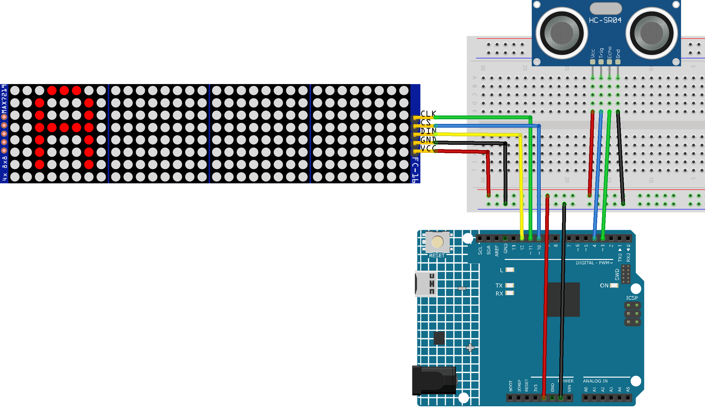

.. _parking_sensor:

Parking Sensor
==============================================================
.. note::
  
  Hello, welcome to the SunFounder Raspberry Pi & Arduino & ESP32 Enthusiasts Community on Facebook! Dive deeper into Raspberry Pi, Arduino, and ESP32 with fellow enthusiasts.

  👉 Ready to explore and create with us? Click [|link_sf_facebook|] and join today!

  Here are some related kits for this project. If you're interested, you can try other projects from these kits.

  .. list-table::
    :widths: 20 20 20
    :header-rows: 1

    *   - Name	
        - Includes Arduino board
        - PURCHASE LINK
    *   - Electronic Kit
        - ×
        - |link_electronic_buy|
    *   - Elite Explorer Kit	
        - ×
        - |link_elite_buy|
    *   - 3 in 1 Ultimate Starter Kit	
        - √
        - |link_arduinor4_buy|
    *   - Universal Maker Sensor Kit
        - ×
        - |link_umsk_buy|

Course Introduction
------------------------

In this lesson, you'll learn how to create a parking sensor system using the Ultrasonic Sensor Module and MAX7219 Dot Matrix Module. 

As an obstacle gets closer to the sensor, the distance will be displayed on the dot matrix module.

.. .. raw:: html

..     <iframe width="700" height="394" src="https://www.youtube.com/embed/tXVDkziwIbU?si=KxsVHx-1tClx8HN6" title="YouTube video player" frameborder="0" allow="accelerometer; autoplay; clipboard-write; encrypted-media; gyroscope; picture-in-picture; web-share" referrerpolicy="strict-origin-when-cross-origin" allowfullscreen></iframe>

.. note::

  If this is your first time working with an Arduino project, we recommend downloading and reviewing the basic materials first.
  
  * :ref:`install_arduino`
  * :ref:`introduce_arduino`

**Required Components**

In this project, we need the following components:

.. list-table::
    :widths: 5 20 5 20
    :header-rows: 1

    *   - SN
        - COMPONENT INTRODUCTION	
        - QUANTITY
        - PURCHASE LINK

    *   - 1
        - Arduino UNO R4 Minima
        - 1
        - |link_unor4_buy|
    *   - 2
        - USB Type-C cable
        - 1
        - 
    *   - 3
        - Breadboard
        - 1
        - |link_breadboard_buy|
    *   - 4
        - Wires
        - Several
        - |link_wires_buy|
    *   - 5
        - MAX7219 Dot Matrix Module
        - 1
        - |link_martix_buy|
    *   - 6
        - Ultrasonic Sensor Module
        - 1
        - |link_ultrasonic_buy|

**Wiring**

**Common Connections:**

* **MAX7219 Dot Matrix Module**

  - **CLK:** Connect to **11** on the Arduino.
  - **CS:** Connect to PWM **10** on the Arduino.
  - **DIN:** Connect to PWM **12** on the Arduino.
  - **GND:** Connect to breadboard’s negative power bus.
  - **VCC:** Connect to breadboard’s red power bus.

* **Ultrasonic Sensor Module**

  - **Trig:** Connect to PWM **4** on the Arduino.
  - **Echo:** Connect to PWM **3** on the Arduino.
  - **GND:** Connect to breadboard’s negative power bus.
  - **VCC:** Connect to breadboard’s red power bus.

**Writing the Code**

.. note::

    * You can copy this code into **Arduino IDE**. 
    * To install the library, use the Arduino Library Manager and search for **LedControl** install it.
    * Don't forget to select the board(Arduino UNO R4 Minima) and the correct port before clicking the **Upload** button.

.. code-block:: arduino

      #include "LedControl.h"

      // Initialize the LedControl object for 4 connected modules
      LedControl lc = LedControl(12, 11, 10, 4);

      // Define pins for ultrasonic sensor
      const int echoPin = 3; // Echo pin for the ultrasonic sensor
      const int trigPin = 4; // Trigger pin for the ultrasonic sensor

      // 8x8 dot matrix representations of numbers 0-9
      byte numbers[10][8] = {
          {0x3C, 0x42, 0x42, 0x42, 0x42, 0x42, 0x42, 0x3C}, // 0
          {0x08, 0x18, 0x38, 0x08, 0x08, 0x08, 0x08, 0x7E}, // 1
          {0x3C, 0x42, 0x40, 0x20, 0x10, 0x08, 0x04, 0x7E}, // 2
          {0x3C, 0x42, 0x40, 0x30, 0x40, 0x40, 0x42, 0x3C}, // 3
          {0x20, 0x30, 0x28, 0x24, 0x7E, 0x20, 0x20, 0x20}, // 4
          {0x7E, 0x02, 0x1E, 0x20, 0x40, 0x40, 0x42, 0x3C}, // 5
          {0x3C, 0x02, 0x02, 0x1E, 0x22, 0x42, 0x42, 0x3C}, // 6
          {0x7E, 0x40, 0x20, 0x10, 0x08, 0x08, 0x08, 0x08}, // 7
          {0x3C, 0x42, 0x42, 0x3C, 0x42, 0x42, 0x42, 0x3C}, // 8
          {0x3C, 0x42, 0x42, 0x3C, 0x40, 0x40, 0x40, 0x3C}  // 9
      };

      unsigned long lastMeasurementTime = 0;
      const int measurementInterval = 400; // Interval for distance measurements
      const int animationInterval = 40; // Refresh interval for animations
      unsigned long lastAnimationTime = 0;
      int targetColumnsLit = 0;
      int currentCol = 0;

      void setup() {
        Serial.begin(9600);
        pinMode(echoPin, INPUT);
        pinMode(trigPin, OUTPUT);

        // Initialize all LED modules
        for (int i = 0; i < 4; i++) {
          lc.shutdown(i, false);
          lc.setIntensity(i, 8);
          lc.clearDisplay(i);
        }
      }

      void loop() {
        // Measure distance
        if (millis() - lastMeasurementTime >= measurementInterval) {
          lastMeasurementTime = millis();
          float distance = readDistance();
          Serial.print("Distance: ");
          Serial.print(distance);
          Serial.println(" cm");

          // Update the displayed number based on the measured distance
          int displayValue = constrain((int)distance, 0, 99);
          displayNumber(displayValue);

          // Update the target number of columns to light up based on distance
          targetColumnsLit = calculateColumnsToLight(distance);
        }

        // Update the animation display
        updateAnimation();
      }

      float readDistance() {
        digitalWrite(trigPin, LOW);
        delayMicroseconds(2);
        digitalWrite(trigPin, HIGH);
        delayMicroseconds(10);
        digitalWrite(trigPin, LOW);
        float distance = pulseIn(echoPin, HIGH) / 58.00;
        return distance > 400 ? 400 : distance; // Limit max measurement distance
      }

      void displayNumber(int number) {
        lc.clearDisplay(2); // Clear display module 2
        lc.clearDisplay(3); // Clear display module 3
        if (number < 10) {
          displayDigit(2, number); // Display a single digit on module 3
        } else {
          displayDigit(2, number % 10); // Unit digit on module 2
          displayDigit(3, number / 10); // Tens digit on module 3
        }
      }

      void displayDigit(int module, int digit) {
        for (int row = 0; row < 8; row++) {
          byte reversed = needsMirror(digit) ? reverseByte(numbers[digit][row]) : numbers[digit][row];
          lc.setRow(module, row, reversed);
        }
      }

      bool needsMirror(int digit) {
        return (digit == 2 || digit == 3 || digit == 4 || digit == 5 || digit == 6 || digit == 7 || digit == 9);
      }

      byte reverseByte(byte b) {
        b = (b & 0xF0) >> 4 | (b & 0x0F) << 4;
        b = (b & 0xCC) >> 2 | (b & 0x33) << 2;
        b = (b & 0xAA) >> 1 | (b & 0x55) << 1;
        return b;
      }

      int calculateColumnsToLight(float distance) {
        return constrain(map(distance, 21, 0, 0, 18), 0, 16);
      }

      void updateAnimation() {
        if (millis() - lastAnimationTime >= animationInterval) {
          lastAnimationTime = millis();
          if (currentCol < targetColumnsLit) {
            lightUpColumn(currentCol, true);
            currentCol++;
          } else if (currentCol > targetColumnsLit) {
            currentCol--;
            lightUpColumn(currentCol, false);
          }
        }
      }

      void lightUpColumn(int col, bool state) {
        int matrixIndex = 1 - (col / 8);
        int colIndex = col % 8;
        for (int row = 0; row < (col / 2) + 1; row++) {
          lc.setLed(matrixIndex, 7 - row, colIndex, state);
        }
      }
