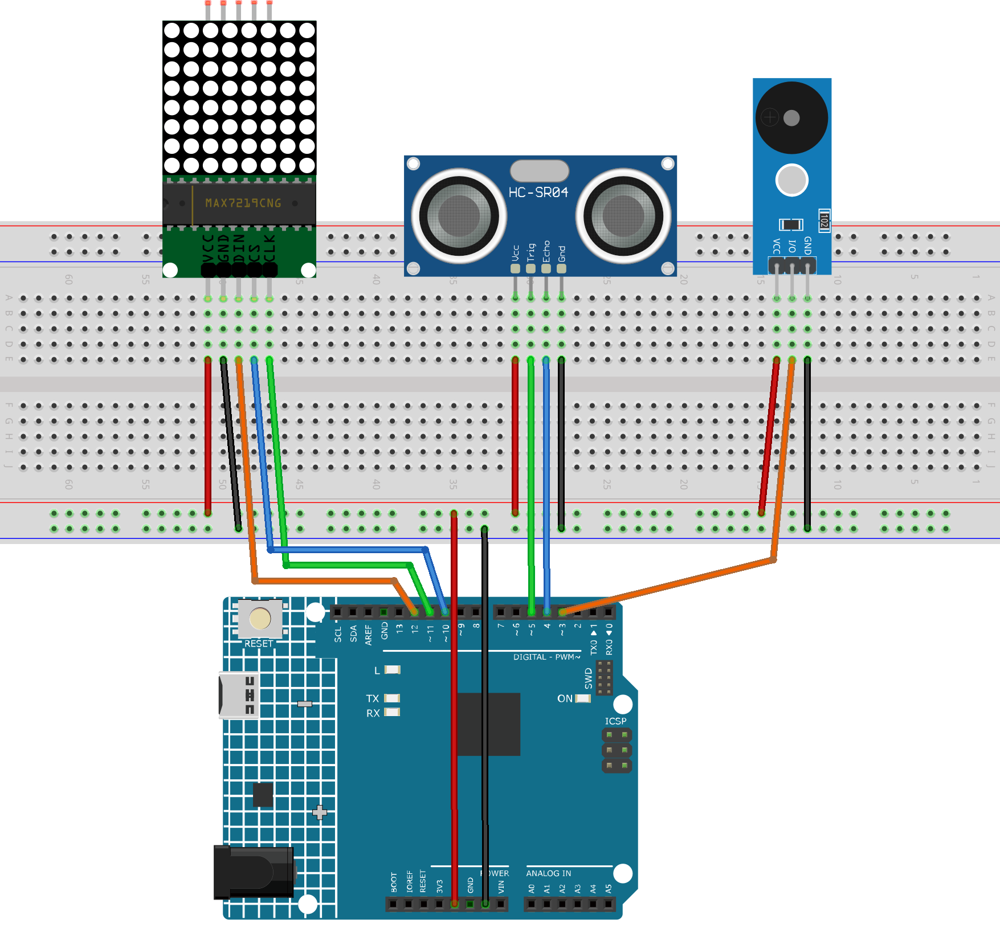

.. _parking_sensor1.0:

Parking Sensor 1.0
==============================================================

.. note::
  
  🌟 Welcome to the SunFounder Facebook Community! Whether you're into Raspberry Pi, Arduino, or ESP32, you'll find inspiration, help ideas here.
   
  - ✅ Be the first to get free learning resources. 
   
  - ✅ Stay updated on new products & exclusive giveaways. 
   
  - ✅ Share your creations and get real feedback.
   
  * 👉 Need faster updates or support? Click [|link_sf_facebook|] join our Facebook community 

  * 👉 Or join our WhatsApp group: Click [|link_sf_whatsapp|]
   
  * 🎁 Looking for parts?Check out our all-in-one kits below — packed with components, beginner-friendly guides, and tons of fun.
  
  .. list-table::
    :widths: 20 20 20
    :header-rows: 1

    *   - Name	
        - Includes Arduino board
        - PURCHASE LINK
    *   - Elite Explorer Kit	
        - Arduino Uno R4 WiFi
        - |link_elite_buy|
    *   - 3 in 1 Ultimate Starter Kit
        - Arduino Uno R4 Minima
        - |link_arduinor4_buy|

Course Introduction
------------------------

In this lesson, we’ll build a basic parking assistance system (v1.0) using an Ultrasonic Sensor Module, MAX7219 Dot Matrix Module, and a passive buzzer Module with Arduino board.

As an obstacle approaches the ultrasonic sensor, the buzzer will emit warning sounds that become increasingly rapid, while the dot matrix display will show a rough visual representation of the obstacle’s proximity.

.. .. raw:: html
 
..  <iframe width="700" height="394" src="https://www.youtube.com/embed/IIe3DMzaRSA?si=EmbqV2plsvQtJ3yr" title="YouTube video player" frameborder="0" allow="accelerometer; autoplay; clipboard-write; encrypted-media; gyroscope; picture-in-picture; web-share" referrerpolicy="strict-origin-when-cross-origin" allowfullscreen></iframe>

.. note::

  If this is your first time working with an Arduino project, we recommend downloading and reviewing the basic materials first.
  
  * :ref:`install_arduino`
  * :ref:`introduce_arduino`

**Required Components**

In this project, we need the following components:

.. list-table::
    :widths: 5 20 5 20
    :header-rows: 1

    *   - SN
        - COMPONENT INTRODUCTION	
        - QUANTITY
        - PURCHASE LINK

    *   - 1
        - Arduino UNO R4 Minima/Arduino UNO R4 WIFI
        - 1
        - |link_unor4_wifi_buy|
    *   - 2
        - USB Type-C cable
        - 1
        - 
    *   - 3
        - Breadboard
        - 1
        - |link_breadboard_buy|
    *   - 4
        - Wires
        - Several
        - |link_wires_buy|
    *   - 5
        - Ultrasonic Sensor Module
        - 1
        - |link_ultrasonic_buy|
    *   - 6
        - MAX7219 Dot Matrix Module
        - 1
        - |link_martix1_buy|
    *   - 7
        - Alarm Sound Module
        - 1
        - |link_buzzer_module_buy|

**Wiring**

**Common Connections:**

* **Passive Buzzer Module**

  - **VCC:** Connect to breadboard’s red power bus.
  - **I/O:** Connect to **3** on the Arduino.
  - **GND:** Connect to breadboard’s negative power bus.

* **MAX7219 Dot Matrix Module**

  - **CLK:** Connect to **11** on the Arduino.
  - **CS:** Connect to **10** on the Arduino.
  - **DIN:** Connect to **12** on the Arduino.
  - **GND:** Connect to breadboard’s negative power bus.
  - **VCC:** Connect to breadboard’s red power bus.

* **Ultrasonic Sensor Module**

  - **Trig:** Connect to **5** on the Arduino.
  - **Echo:** Connect to **4** on the Arduino.
  - **GND:** Connect to breadboard’s negative power bus.
  - **VCC:** Connect to breadboard’s red power bus.

**Writing the Code**

.. note::

    * You can copy this code into **Arduino IDE**. 
    * To install the library, use the Arduino Library Manager and search for **LedControl** and install it.
    * Don't forget to select the board(Arduino UNO R4 WIFI) and the correct port before clicking the **Upload** button.

.. code-block:: arduino

      #include <LedControl.h>

      // Pin definitions
      const int echoPin = 4;    // Ultrasonic sensor Echo pin
      const int trigPin = 5;    // Ultrasonic sensor Trig pin
      const int buzzerPin = 3;  // Buzzer pin

      // Initialize LedControl for MAX7219: DIN=12, CLK=11, CS=10, 1 device
      LedControl lc = LedControl(12, 11, 10, 1);

      int previousColumnsLit = 0;       // Last number of lit columns

      // Buzzer non-blocking control variables
      unsigned long lastBeepTime = 0;   // Timestamp of last beep toggle
      bool isBeepOn = false;            // Current buzzer state
      unsigned long beepInterval = 500; // Interval for buzzer toggle in ms

      void setup() {
        Serial.begin(9600);            // Start serial communication at 9600 baud
        pinMode(echoPin, INPUT);       // Set echoPin as input
        pinMode(trigPin, OUTPUT);      // Set trigPin as output
        pinMode(buzzerPin, OUTPUT);    // Set buzzerPin as output

        lc.shutdown(0, false);         // Wake up MAX7219
        lc.setIntensity(0, 8);         // Set brightness level (0-15)
        lc.clearDisplay(0);            // Clear the display
      }

      void loop() {
        // 1. Read distance and update LED columns
        float distance = readSensorData();             
        int columnsToLight = calculateColumnsToLight(distance);
        displayColumnsWithTransition(previousColumnsLit, columnsToLight);
        previousColumnsLit = columnsToLight;

        // 2. Update beep speed based on distance, then toggle buzzer
        updateBeepInterval(distance);
        updateBeepState();

        // 3. Print distance for debugging
        Serial.print("Distance: ");
        Serial.print(distance);
        Serial.println(" cm");
      }

      // Read distance from ultrasonic sensor in centimeters
      float readSensorData() {
        digitalWrite(trigPin, LOW);
        delayMicroseconds(2);                 // Ensure clean LOW pulse
        digitalWrite(trigPin, HIGH);
        delayMicroseconds(10);                // Send 10µs HIGH pulse
        digitalWrite(trigPin, LOW);

        float duration = pulseIn(echoPin, HIGH); // Read echo time in µs
        float distance = duration / 58.0;        // Convert to cm (approx.)
        return distance;
      }

      // Map distance to number of LED matrix columns (0 to 8)
      int calculateColumnsToLight(float distance) {
        if (distance > 20) {                  // If farther than 20 cm
          return 0;                           // No columns lit
        } else {
          int cols = (20 - distance) / 2;     // Every 2 cm closer lights one column
          return constrain(cols, 0, 8);       // Limit result between 0 and 8
        }
      }

      // Animate LED columns lighting/unlighting with small blocking delay
      void displayColumnsWithTransition(int previousColumns, int currentColumns) {
        if (currentColumns > previousColumns) {
          // Light up new columns from left to right
          for (int col = previousColumns; col < currentColumns; col++) {
            for (int row = 0; row <= col; row++) {
              lc.setLed(0, col, row, true);  // Turn on LED at (col, row)
            }
            delay(50);                        // Small delay for animation effect
          }
        } else if (currentColumns < previousColumns) {
          // Turn off columns from left to right
          for (int col = previousColumns - 1; col >= currentColumns; col--) {
            for (int row = 0; row <= col; row++) {
              lc.setLed(0, col, row, false); // Turn off LED at (col, row)
            }
            delay(50);                        // Small delay for animation effect
          }
        }
      }

      // Set beep interval based on distance:
      // <6 cm   -> fast beep (100 ms on/off)
      // <12 cm  -> medium beep (300 ms on/off)
      // <18 cm  -> slow beep (500 ms on/off)
      // >=18 cm -> no beep
      void updateBeepInterval(float distance) {
        if (distance < 6) {
          beepInterval = 100;   // Fast beep: 100 ms on, 100 ms off
        } else if (distance < 12) {
          beepInterval = 300;   // Medium beep: 300 ms on, 300 ms off
        } else if (distance < 18) {
          beepInterval = 500;   // Slow beep: 500 ms on, 500 ms off
        } else {
          beepInterval = 0;     // Disable beep
          noTone(buzzerPin);
          isBeepOn = false;
        }
      }

      // Toggle buzzer on/off without blocking using millis()
      void updateBeepState() {
        if (beepInterval == 0) {
          return;               // No beep needed
        }

        unsigned long currentMillis = millis();
        if (currentMillis - lastBeepTime >= beepInterval) {
          if (isBeepOn) {
            noTone(buzzerPin);  // Turn off buzzer
            isBeepOn = false;
          } else {
            tone(buzzerPin, 1000); // Turn on buzzer at 1 kHz
            isBeepOn = true;
          }
          lastBeepTime = currentMillis; // Reset timestamp
        }
      }
