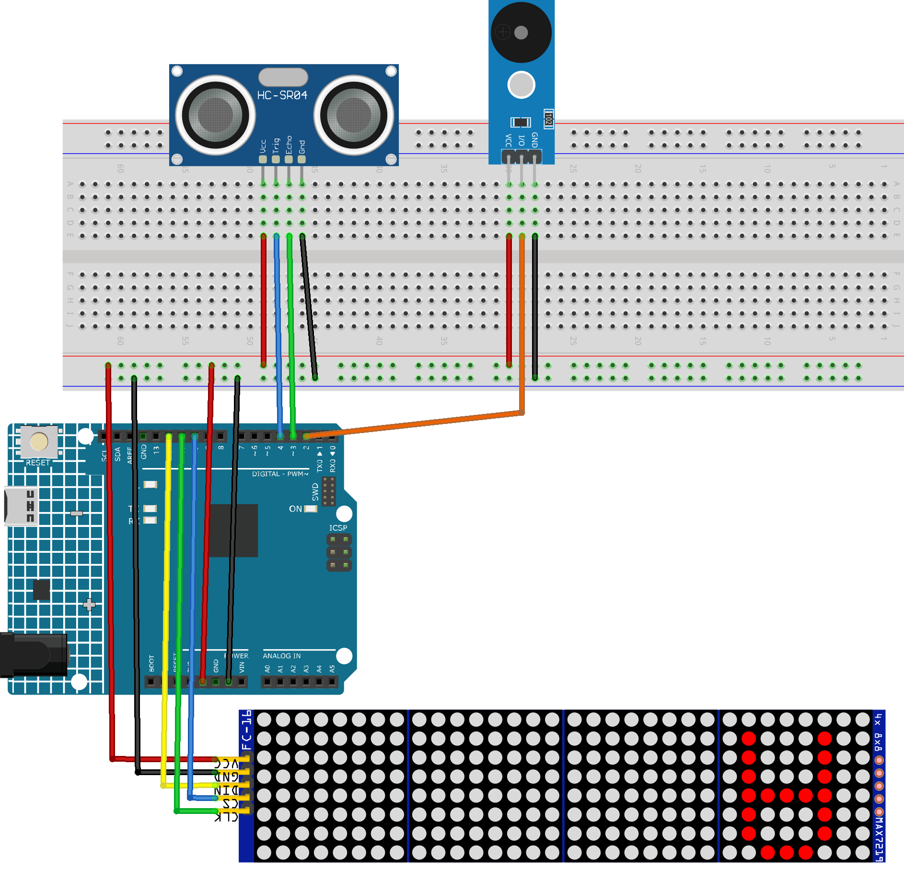

.. _parking_sensor2.0:

Parking Sensor 2.0
==============================================================

.. note::
  
  🌟 Welcome to the SunFounder Facebook Community! Whether you're into Raspberry Pi, Arduino, or ESP32, you'll find inspiration, help ideas here.
   
  - ✅ Be the first to get free learning resources. 
   
  - ✅ Stay updated on new products & exclusive giveaways. 
   
  - ✅ Share your creations and get real feedback.
   
  * 👉 Need faster updates or support? Click [|link_sf_facebook|] join our Facebook community 

  * 👉 Or join our WhatsApp group: Click [|link_sf_whatsapp|]
   
  * 🎁 Looking for parts?Check out our all-in-one kits below — packed with components, beginner-friendly guides, and tons of fun.
  
  .. list-table::
    :widths: 20 20 20
    :header-rows: 1

    *   - Name	
        - Includes Arduino board
        - PURCHASE LINK
    *   - Elite Explorer Kit	
        - Arduino Uno R4 WiFi
        - |link_elite_buy|
    *   - 3 in 1 Ultimate Starter Kit
        - Arduino Uno R4 Minima
        - |link_arduinor4_buy|

Course Introduction
------------------------

In this lesson, we’ll build a basic parking assistance system (v2.0) using an Ultrasonic Sensor Module, MAX7219 Dot Matrix Module, and a passive buzzer Module with Arduino board.

As an obstacle moves closer to the sensor, the buzzer will sound increasingly faster, and the dot matrix display will show both the approximate distance and a visual representation of the approaching object.

.. raw:: html
 
  <iframe width="700" height="394" src="https://www.youtube.com/embed/QE2zcwk0PvY?si=hh1Y4-2US3y_VJzC" title="YouTube video player" frameborder="0" allow="accelerometer; autoplay; clipboard-write; encrypted-media; gyroscope; picture-in-picture; web-share" referrerpolicy="strict-origin-when-cross-origin" allowfullscreen></iframe>

.. note::

  If this is your first time working with an Arduino project, we recommend downloading and reviewing the basic materials first.
  
  * :ref:`install_arduino`
  * :ref:`introduce_arduino`

**Required Components**

In this project, we need the following components:

.. list-table::
    :widths: 5 20 5 20
    :header-rows: 1

    *   - SN
        - COMPONENT INTRODUCTION	
        - QUANTITY
        - PURCHASE LINK

    *   - 1
        - Arduino UNO R4 Minima/Arduino UNO R4 WIFI
        - 1
        - |link_unor4_wifi_buy|
    *   - 2
        - USB Type-C cable
        - 1
        - 
    *   - 3
        - Breadboard
        - 1
        - |link_breadboard_buy|
    *   - 4
        - Wires
        - Several
        - |link_wires_buy|
    *   - 5
        - Ultrasonic Sensor Module
        - 1
        - |link_ultrasonic_buy|
    *   - 6
        - MAX7219 Dot Matrix Module
        - 1
        - |link_martix_buy|
    *   - 7
        - Alarm Sound Module
        - 1
        - |link_buzzer_module_buy|

**Wiring**

**Common Connections:**

* **Passive Buzzer Module**

  - **VCC:** Connect to breadboard’s red power bus.
  - **I/O:** Connect to **2** on the Arduino.
  - **GND:** Connect to breadboard’s negative power bus.

* **MAX7219 Dot Matrix Module**

  - **CLK:** Connect to **11** on the Arduino.
  - **CS:** Connect to **10** on the Arduino.
  - **DIN:** Connect to **12** on the Arduino.
  - **GND:** Connect to breadboard’s negative power bus.
  - **VCC:** Connect to breadboard’s red power bus.

* **Ultrasonic Sensor Module**

  - **Trig:** Connect to **4** on the Arduino.
  - **Echo:** Connect to **3** on the Arduino.
  - **GND:** Connect to breadboard’s negative power bus.
  - **VCC:** Connect to breadboard’s red power bus.

**Writing the Code**

.. note::

    * You can copy this code into **Arduino IDE**. 
    * To install the library, use the Arduino Library Manager and search for **LedControl** and install it.
    * Don't forget to select the board(Arduino UNO R4 WIFI) and the correct port before clicking the **Upload** button.

.. code-block:: arduino

      #include "LedControl.h"

      // Initialize the LedControl object for 4 connected modules
      LedControl lc = LedControl(12, 11, 10, 4);

      // Define pins
      const int echoPin   = 3;  // Echo pin for the ultrasonic sensor
      const int trigPin   = 4;  // Trigger pin for the ultrasonic sensor
      const int buzzerPin = 2;  // Buzzer pin

      // Beep control variables
      unsigned long beepInterval = 0;    // current on/off interval (ms)
      unsigned long lastBeepTime  = 0;   // last toggle timestamp
      bool         isBeepOn       = false;

      // 8×8 dot-matrix representations of digits 0–9
      byte numbers[10][8] = {
        {0x3C,0x42,0x42,0x42,0x42,0x42,0x42,0x3C}, // 0
        {0x08,0x18,0x38,0x08,0x08,0x08,0x08,0x7E}, // 1
        {0x3C,0x42,0x40,0x20,0x10,0x08,0x04,0x7E}, // 2
        {0x3C,0x42,0x40,0x30,0x40,0x40,0x42,0x3C}, // 3
        {0x20,0x30,0x28,0x24,0x7E,0x20,0x20,0x20}, // 4
        {0x7E,0x02,0x1E,0x20,0x40,0x40,0x42,0x3C}, // 5
        {0x3C,0x02,0x02,0x1E,0x22,0x42,0x42,0x3C}, // 6
        {0x7E,0x40,0x20,0x10,0x08,0x08,0x08,0x08}, // 7
        {0x3C,0x42,0x42,0x3C,0x42,0x42,0x42,0x3C}, // 8
        {0x3C,0x42,0x42,0x3C,0x40,0x40,0x40,0x3C}  // 9
      };

      unsigned long lastMeasurementTime = 0;
      const int measurementInterval     = 400;  // ms between distance readings
      const int animationInterval       = 40;   // ms between animation frames
      unsigned long lastAnimationTime   = 0;
      int targetColumnsLit              = 0;
      int currentCol                    = 0;

      void setup() {
        Serial.begin(9600);
        pinMode(echoPin, INPUT);
        pinMode(trigPin, OUTPUT);
        pinMode(buzzerPin, OUTPUT);

        // Initialize all LED modules
        for (int i = 0; i < 4; i++) {
          lc.shutdown(i, false);
          lc.setIntensity(i, 8);
          lc.clearDisplay(i);
        }
      }

      void loop() {
        // 1. Measure distance at fixed intervals
        if (millis() - lastMeasurementTime >= measurementInterval) {
          lastMeasurementTime = millis();
          float distance = readDistance();
          Serial.print("Distance: ");
          Serial.print(distance);
          Serial.println(" cm");

          // Display the distance (0–99 cm) on modules 2 & 3
          int displayValue = constrain((int)distance, 0, 99);
          displayNumber(displayValue);

          // Compute how many columns to light for the bar graph
          targetColumnsLit = calculateColumnsToLight(distance);

          // Update the beep on/off interval based on distance
          updateBeepInterval(distance);
        }

        // 2. Animate the bar-graph on modules 0 & 1
        updateAnimation();

        // 3. Toggle buzzer on/off according to the current beep interval
        updateBeep();
      }

      // --- Distance measurement ---
      float readDistance() {
        digitalWrite(trigPin, LOW);
        delayMicroseconds(2);
        digitalWrite(trigPin, HIGH);
        delayMicroseconds(10);
        digitalWrite(trigPin, LOW);
        float duration = pulseIn(echoPin, HIGH);
        float distance = duration / 58.0;          // cm
        return (distance > 400 ? 400.0 : distance);
      }

      // --- Buzzer control ---
      void updateBeepInterval(float distance) {
        if (distance < 6) {
          beepInterval = 100;   // Fast beep
        } else if (distance < 12) {
          beepInterval = 300;   // Medium beep
        } else if (distance < 20) {
          beepInterval = 500;   // Slow beep
        } else {
          // Disable beep when distance ≥ 20 cm
          beepInterval = 0;
          noTone(buzzerPin);
          isBeepOn = false;
        }
      }

      void updateBeep() {
        if (beepInterval == 0) return;
        unsigned long now = millis();
        if (now - lastBeepTime >= beepInterval) {
          lastBeepTime = now;
          if (isBeepOn) {
            noTone(buzzerPin);
          } else {
            tone(buzzerPin, 1000);  // 1 kHz tone
          }
          isBeepOn = !isBeepOn;
        }
      }

      // --- 2-digit display on modules 2 & 3 ---
      void displayNumber(int number) {
        lc.clearDisplay(2);
        lc.clearDisplay(3);
        if (number < 10) {
          displayDigit(2, number);
        } else {
          displayDigit(2, number % 10);  // units
          displayDigit(3, number / 10);  // tens
        }
      }

      void displayDigit(int module, int digit) {
        for (int row = 0; row < 8; row++) {
          byte pattern = numbers[digit][row];
          if (needsMirror(digit)) {
            pattern = reverseByte(pattern);
          }
          lc.setRow(module, row, pattern);
        }
      }

      bool needsMirror(int digit) {
        // Mirror 2, 3, 4, 5, 6, 7, 9 for correct orientation
        return (digit == 2 || digit == 3 || digit == 4 ||
                digit == 5 || digit == 6 || digit == 7 ||
                digit == 9);
      }

      byte reverseByte(byte b) {
        b = (b & 0xF0) >> 4 | (b & 0x0F) << 4;
        b = (b & 0xCC) >> 2 | (b & 0x33) << 2;
        b = (b & 0xAA) >> 1 | (b & 0x55) << 1;
        return b;
      }

      // --- Bar-graph animation on modules 0 & 1 ---
      int calculateColumnsToLight(float distance) {
        // Map 0–21 cm to 0–18 columns, then constrain to 0–16
        return constrain(map(distance, 21, 0, 0, 18), 0, 16);
      }

      void updateAnimation() {
        if (millis() - lastAnimationTime >= animationInterval) {
          lastAnimationTime = millis();
          if (currentCol < targetColumnsLit) {
            lightUpColumn(currentCol, true);
            currentCol++;
          } else if (currentCol > targetColumnsLit) {
            currentCol--;
            lightUpColumn(currentCol, false);
          }
        }
      }

      void lightUpColumn(int col, bool state) {
        int matrixIndex = 1 - (col / 8);  // use modules 1 then 0
        int colIndex     = col % 8;
        for (int row = 0; row < (col / 2) + 1; row++) {
          // draw from bottom up
          lc.setLed(matrixIndex, 7 - row, colIndex, state);
        }
      }
