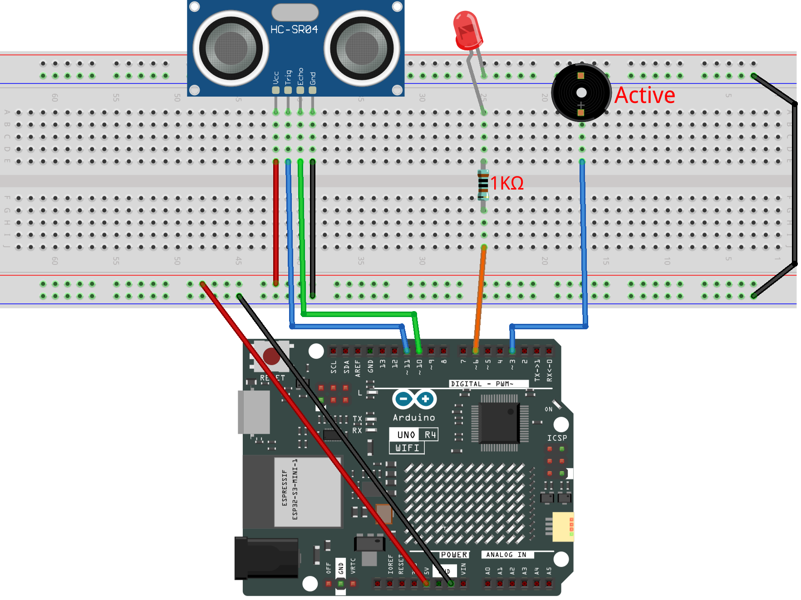

.. _parking_sensor3.0:

Parking Sensor 3.0
==============================================================

.. note::
  
  🌟 Welcome to the SunFounder Facebook Community! Whether you're into Raspberry Pi, Arduino, or ESP32, you'll find inspiration, help ideas here.
   
  - ✅ Be the first to get free learning resources. 
   
  - ✅ Stay updated on new products & exclusive giveaways. 
   
  - ✅ Share your creations and get real feedback.
   
  * 👉 Need faster updates or support? Click [|link_sf_facebook|] join our Facebook community 

  * 👉 Or join our WhatsApp group: Click [|link_sf_whatsapp|]
   
Kit purchase
------------------------

Looking for parts? Check out our all-in-one kits below — packed with components, beginner-friendly guides, and tons of fun.

.. image:: img/elite_explore_kit.png
   :width: 100%
   :align: center
   :target: https://www.sunfounder.com/collections/arduino-kits-bundles/products/sunfounder-elite-explorer-kit-with-official-arduino-uno-r4-wifi?ref=jbzmncle

.. raw:: html

     

.. list-table::
   :widths: 20 20 20
   :header-rows: 1

   * - Name
     - Includes Arduino board
     - PURCHASE LINK
   * - Ultimate Sensor Kit
     - Arduino Uno R4 Minima
     - |link_ultimate_sensor_buy|
   * - Elite Explorer Kit
     - Arduino Uno R4 WiFi
     - |link_elite_buy|
   * - 3 in 1 Ultimate Starter Kit
     - Arduino Uno R4 Minima
     - |link_arduinor4_buy|
   * - Universal Maker Sensor Kit
     - ×
     - |link_umsk_buy|

Course Introduction
------------------------

In this lesson, you’ll build a basic parking assistance system using an ultrasonic sensor, an LED, and a buzzer with Arduino.

As an obstacle gets closer, the LED and buzzer will warn you at increasing speeds. When the obstacle is within 5 cm, both will stay on continuously.

.. .. raw:: html
 
..  <iframe width="700" height="394" src="https://www.youtube.com/embed/QE2zcwk0PvY?si=hh1Y4-2US3y_VJzC" title="YouTube video player" frameborder="0" allow="accelerometer; autoplay; clipboard-write; encrypted-media; gyroscope; picture-in-picture; web-share" referrerpolicy="strict-origin-when-cross-origin" allowfullscreen></iframe>

.. note::

  If this is your first time working with an Arduino project, we recommend downloading and reviewing the basic materials first.
  
  * :ref:`install_arduino`
  * :ref:`introduce_arduino`

**Required Components**

In this project, we need the following components:

.. list-table::
    :widths: 5 20 5 20
    :header-rows: 1

    *   - SN
        - COMPONENT INTRODUCTION	
        - QUANTITY
        - PURCHASE LINK

    *   - 1
        - Arduino UNO R4 Minima/Arduino UNO R4 WIFI
        - 1
        - |link_unor4_wifi_buy|
    *   - 2
        - USB Type-C cable
        - 1
        - 
    *   - 3
        - Breadboard
        - 1
        - |link_breadboard_buy|
    *   - 4
        - Wires
        - Several
        - |link_wires_buy|
    *   - 5
        - Ultrasonic Sensor Module
        - 1
        - |link_ultrasonic_buy|
    *   - 6
        - LED
        - 1
        - |link_led_buy|
    *   - 7
        - Active Buzzer
        - 1
        - 
    *   - 8
        - 1kΩ resistor
        - 1
        - |link_resistor_buy|

**Wiring**

**Common Connections:**

* **LED**

  - Connect the LED **cathode** to the negative power bus on the breadboard, and the LED **anode** to a **1kΩ resistor** then to  **6** on the Arduino.

* **Active Buzzer**

  - **＋:** Connect to **3** on the Arduino.
  - **－:** Connect to breadboard’s negative power bus.

* **Ultrasonic Sensor Module**

  - **Trig:** Connect to **11** on the Arduino.
  - **Echo:** Connect to **10** on the Arduino.
  - **GND:** Connect to breadboard’s negative power bus.
  - **VCC:** Connect to breadboard’s red power bus.

**Writing the Code**

.. note::

    * You can copy this code into **Arduino IDE**. 
    * Don't forget to select the board(Arduino UNO R4 WIFI) and the correct port before clicking the **Upload** button.

.. code-block:: arduino

      const int ECHO_PIN = 10;
      const int TRIG_PIN = 11;

      const int BUZZER_PIN = 3;
      const int LED_PIN = 6;

      // Distance thresholds in centimeters
      const float STOP_DISTANCE = 5.0;
      const float FAST_DISTANCE = 9.0;
      const float MEDIUM_DISTANCE = 13.0;
      const float MAX_DISTANCE = 17.0;

      // Time between warning beeps
      const unsigned long SLOW_INTERVAL = 800;
      const unsigned long MEDIUM_INTERVAL = 400;
      const unsigned long FAST_INTERVAL = 180;

      // Each beep and LED flash lasts 100 ms
      const unsigned long BEEP_DURATION = 100;

      // Measure the distance every 70 ms
      const unsigned long MEASURE_INTERVAL = 70;

      // Store timing values
      unsigned long lastMeasureTime = 0;
      unsigned long lastBeepTime = 0;
      unsigned long beepStartTime = 0;

      // Store the measured distance and warning interval
      float distance = -1;
      unsigned long warningInterval = 0;

      // Track whether the buzzer and LED are active
      bool beepActive = false;

      // Define the five warning levels
      enum WarningLevel {
        SAFE,
        SLOW,
        MEDIUM,
        FAST,
        STOP
      };

      WarningLevel currentLevel = SAFE;

      void setup() {
        pinMode(ECHO_PIN, INPUT);
        pinMode(TRIG_PIN, OUTPUT);

        pinMode(BUZZER_PIN, OUTPUT);
        pinMode(LED_PIN, OUTPUT);

        // Make sure all outputs start off
        digitalWrite(TRIG_PIN, LOW);
        digitalWrite(BUZZER_PIN, LOW);
        digitalWrite(LED_PIN, LOW);
      }

      void loop() {
        unsigned long currentTime = millis();

        // Measure the distance at regular intervals
        if (currentTime - lastMeasureTime >= MEASURE_INTERVAL) {
          lastMeasureTime = currentTime;

          distance = readDistance();
          updateWarningLevel();
        }

        // Update the LED and buzzer
        updateWarningOutput();
      }

      // Measure the distance with the ultrasonic sensor
      float readDistance() {
        // Send a short pulse from the TRIG pin
        digitalWrite(TRIG_PIN, LOW);
        delayMicroseconds(2);

        digitalWrite(TRIG_PIN, HIGH);
        delayMicroseconds(10);

        digitalWrite(TRIG_PIN, LOW);

        // Measure how long the echo signal stays HIGH
        unsigned long duration = pulseIn(ECHO_PIN, HIGH, 5000);

        // Return -1 if no echo is received
        if (duration == 0) {
          return -1;
        }

        // Convert the echo time to distance in centimeters
        return duration / 58.0;
      }

      // Choose a warning level based on the distance
      void updateWarningLevel() {
        // No valid reading
        if (distance < 0) {
          currentLevel = SAFE;
          warningInterval = 0;
          return;
        }

        // More than 17 cm: no warning
        if (distance > MAX_DISTANCE) {
          currentLevel = SAFE;
          warningInterval = 0;
        }

        // 13-17 cm: slow warning
        else if (distance > MEDIUM_DISTANCE) {
          currentLevel = SLOW;
          warningInterval = SLOW_INTERVAL;
        }

        // 9-13 cm: medium warning
        else if (distance > FAST_DISTANCE) {
          currentLevel = MEDIUM;
          warningInterval = MEDIUM_INTERVAL;
        }

        // 5-9 cm: fast warning
        else if (distance > STOP_DISTANCE) {
          currentLevel = FAST;
          warningInterval = FAST_INTERVAL;
        }

        // 5 cm or less: continuous warning
        else {
          currentLevel = STOP;
          warningInterval = 0;
        }
      }

      // Control the LED and buzzer without using delay()
      void updateWarningOutput() {
        unsigned long currentTime = millis();

        // Turn everything off when the distance is safe
        if (currentLevel == SAFE) {
          digitalWrite(BUZZER_PIN, LOW);
          digitalWrite(LED_PIN, LOW);

          beepActive = false;
          return;
        }

        // Keep the LED and buzzer on in the stop zone
        if (currentLevel == STOP) {
          digitalWrite(BUZZER_PIN, HIGH);
          digitalWrite(LED_PIN, HIGH);

          beepActive = true;
          return;
        }

        // Start a beep and LED flash
        if (!beepActive &&
            currentTime - lastBeepTime >= warningInterval) {

          beepActive = true;
          beepStartTime = currentTime;
          lastBeepTime = currentTime;

          digitalWrite(BUZZER_PIN, HIGH);
          digitalWrite(LED_PIN, HIGH);
        }

        // Turn them off after the warning pulse
        if (beepActive &&
            currentTime - beepStartTime >= BEEP_DURATION) {

          beepActive = false;

          digitalWrite(BUZZER_PIN, LOW);
          digitalWrite(LED_PIN, LOW);
        }
      }