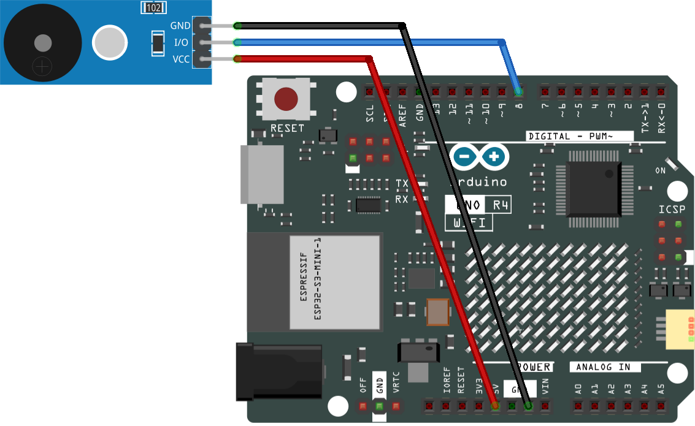

.. _passive_buzzer:

Passive Buzzer
==============================================================

.. note::
  
  🌟 Welcome to the SunFounder Facebook Community! Whether you're into Raspberry Pi, Arduino, or ESP32, you'll find inspiration, help ideas here.
   
  - ✅ Be the first to get free learning resources. 
   
  - ✅ Stay updated on new products & exclusive giveaways. 
   
  - ✅ Share your creations and get real feedback.
   
  * 👉 Need faster updates or support? Click [|link_sf_facebook|] join our Facebook community 

  * 👉 Or join our WhatsApp group: Click [|link_sf_whatsapp|]
   
Kit purchase
------------------------

Looking for parts? Check out our all-in-one kits below — packed with components, beginner-friendly guides, and tons of fun.

.. image:: img/ultimate_sensor_kit.png
   :width: 100%
   :align: center
   :target: https://www.sunfounder.com/collections/arduino-kits-bundles/products/sunfounder-ultimate-sensor-kit-with-original-arduino-uno-r4-minima?ref=jbzmncle

.. raw:: html

     

.. list-table::
   :widths: 20 20 20
   :header-rows: 1

   * - Name
     - Includes Arduino board
     - PURCHASE LINK
   * - Ultimate Sensor Kit
     - Arduino Uno R4 Minima
     - |link_ultimate_sensor_buy|
   * - Elite Explorer Kit
     - Arduino Uno R4 WiFi
     - |link_elite_buy|
   * - 3 in 1 Ultimate Starter Kit
     - Arduino Uno R4 Minima
     - |link_arduinor4_buy|
   * - Universal Maker Sensor Kit
     - ×
     - |link_umsk_buy|

Course Introduction
------------------------

In this lesson, we will learn how to use the Passive Buzzer Module with Arduino.

.. raw:: html

 <iframe width="700" height="394" src="https://www.youtube.com/embed/npsJT10hC04?si=7j2AN_1u4cDNQABr" title="YouTube video player" frameborder="0" allow="accelerometer; autoplay; clipboard-write; encrypted-media; gyroscope; picture-in-picture; web-share" referrerpolicy="strict-origin-when-cross-origin" allowfullscreen></iframe>

.. note::

  If this is your first time working with an Arduino project, we recommend downloading and reviewing the basic materials first.
  
  * :ref:`install_arduino`
  * :ref:`introduce_arduino`

**Required Components**

In this project, we need the following components:

.. list-table::
    :widths: 5 20 5 20
    :header-rows: 1

    *   - SN
        - COMPONENT INTRODUCTION	
        - QUANTITY
        - PURCHASE LINK

    *   - 1
        - Arduino UNO R4 Minima
        - 1
        - |link_unor4_buy|
    *   - 2
        - USB Type-C cable
        - 1
        - 
    *   - 3
        - Breadboard
        - 1
        - |link_breadboard_buy|
    *   - 4
        - Wires
        - Several
        - |link_wires_buy|
    *   - 5
        - Passive Buzzer Module
        - 1
        - |link_buzzer_module_buy|

**Wiring**

**Common Connections:**

* **Passive Buzzer Module**

  - **I/O:** Connect to **8** on the Arduino.
  - **－:** Connect to **GND** on the Arduino.
  - **+:** Connect to **5V** on the Arduino.

**Writing the Code**

.. note::

    * You can copy this code into **Arduino IDE**. 
    * Don't forget to select the board(Arduino UNO R4 Minima) and the correct port before clicking the **Upload** button.

.. code-block:: arduino

      /*
        This example demonstrates how to play simple melodies
        using a passive buzzer module and the tone() function.

        Board: Arduino Uno R3 / Uno R4
        Component: Passive Buzzer Module (e.g. KY-006)
        Pin connection:
          - Buzzer signal pin -> Digital pin 8
          - VCC -> 5V
          - GND -> GND

        Note:
        Two melodies are included in this sketch.
        Only ONE melody should be active at a time.
        The other melody is commented out and can be enabled if needed.
      */

      #include "pitches.h"

      const int buzzerPin = 8;

      // ------------------------------------------------------------
      // Melody selection
      // Uncomment ONE melody block below to play the desired song
      // ------------------------------------------------------------

      // Melody 1: Ode to Joy (Beethoven) - one section
      /*
      int melody[] = {
        NOTE_E4, NOTE_E4, NOTE_F4, NOTE_G4,
        NOTE_G4, NOTE_F4, NOTE_E4, NOTE_D4,
        NOTE_C4, NOTE_C4, NOTE_D4, NOTE_E4,
        NOTE_E4, NOTE_D4, NOTE_D4
      };

      int noteDurations[] = {
        4, 4, 4, 4,
        4, 4, 4, 4,
        4, 4, 4, 4,
        2, 4, 2
      };
      */

      // Melody 2: Happy Birthday (classic version)
      int melody[] = {
        NOTE_G4, NOTE_G4, NOTE_A4, NOTE_G4, NOTE_C5, NOTE_B4,
        NOTE_G4, NOTE_G4, NOTE_A4, NOTE_G4, NOTE_D5, NOTE_C5,
        NOTE_G4, NOTE_G4, NOTE_G5, NOTE_E5, NOTE_C5, NOTE_B4, NOTE_A4,
        NOTE_F5, NOTE_F5, NOTE_E5, NOTE_C5, NOTE_D5, NOTE_C5
      };

      int noteDurations[] = {
        4, 4, 4, 4, 4, 4,
        4, 4, 4, 4, 4, 4,
        4, 4, 4, 4, 4, 4, 4,
        4, 4, 4, 4, 4, 4
      };

      void setup() {
        // Calculate the total number of notes in the melody
        int notes = sizeof(melody) / sizeof(melody[0]);

        // Play the melody once
        for (int i = 0; i < notes; i++) {

          // Calculate note duration
          // 1000 ms = one whole note
          // 4 = quarter note, 8 = eighth note, etc.
          int noteDuration = 1000 / noteDurations[i];

          // Generate the sound at the given frequency
          // Duration is controlled manually using delay()
          tone(buzzerPin, melody[i]);

          // Keep the note playing for the calculated duration
          delay(noteDuration);

          // Stop the sound before the next note
          noTone(buzzerPin);

          // Short pause between notes for better clarity
          delay(noteDuration * 0.3);
        }
      }

      void loop() {
        // The melody is played once in setup().
        // No repetition is needed in loop().
      }
