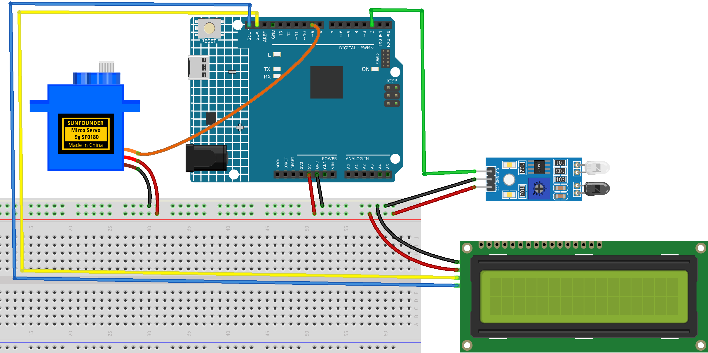

.. _piggy_bank:

Piggy Bank
==============================================================

.. note::
  
  🌟 Welcome to the SunFounder Facebook Community! Whether you're into Raspberry Pi, Arduino, or ESP32, you'll find inspiration, help ideas here.
   
  - ✅ Be the first to get free learning resources. 
   
  - ✅ Stay updated on new products & exclusive giveaways. 
   
  - ✅ Share your creations and get real feedback.
   
  * 👉 Need faster updates or support? Click [|link_sf_facebook|] join our Facebook community 

  * 👉 Or join our WhatsApp group: Click [|link_sf_whatsapp|]
   
Kit purchase
------------------------

Looking for parts? Check out our all-in-one kits below — packed with components, beginner-friendly guides, and tons of fun.

.. image:: img/elite_explore_kit.png
   :width: 100%
   :align: center
   :target: https://www.sunfounder.com/collections/arduino-kits-bundles/products/sunfounder-elite-explorer-kit-with-official-arduino-uno-r4-wifi?ref=jbzmncle

.. raw:: html

     

.. list-table::
   :widths: 20 20 20
   :header-rows: 1

   * - Name
     - Includes Arduino board
     - PURCHASE LINK
   * - Ultimate Sensor Kit
     - Arduino Uno R4 Minima
     - |link_ultimate_sensor_buy|
   * - Elite Explorer Kit
     - Arduino Uno R4 WiFi
     - |link_elite_buy|
   * - 3 in 1 Ultimate Starter Kit
     - Arduino Uno R4 Minima
     - |link_arduinor4_buy|
   * - Universal Maker Sensor Kit
     - ×
     - |link_umsk_buy|

Course Introduction
------------------------

In this lesson, you'll use an IR Sensor Module, a servo motor, an I2C LCD, and Arduino to create a smart piggy bank system.

When a bill is detected by the IR sensor, the servo automatically opens the bank entrance to let the money drop inside. The LCD then updates the bill count, and the servo returns to the closed position, creating a simple automatic counting effect.

.. .. raw:: html

..  <iframe width="700" height="394" src="https://www.youtube.com/embed/ca2vRwRQJkk?si=Nzmhr1BEuKKSN9NK" title="YouTube video player" frameborder="0" allow="accelerometer; autoplay; clipboard-write; encrypted-media; gyroscope; picture-in-picture; web-share" referrerpolicy="strict-origin-when-cross-origin" allowfullscreen></iframe>

.. note::

  If this is your first time working with an Arduino project, we recommend downloading and reviewing the basic materials first.
  
  * :ref:`install_arduino`
  * :ref:`introduce_arduino`

**Required Components**

In this project, we need the following components:

.. list-table::
    :widths: 5 20 5 20
    :header-rows: 1

    *   - SN
        - COMPONENT INTRODUCTION	
        - QUANTITY
        - PURCHASE LINK

    *   - 1
        - Arduino UNO R4 Minima/Arduino UNO R4 WIFI
        - 1
        - |link_unor4_wifi_buy|
    *   - 2
        - USB Type-C cable
        - 1
        - 
    *   - 3
        - Breadboard
        - 1
        - |link_breadboard_buy|
    *   - 4
        - Wires
        - Several
        - |link_wires_buy|
    *   - 5
        - IR Obstacle Avoidance Sensor Module
        - 1
        - |link_IR_module_buy|
    *   - 6
        - I2C LCD 1602
        - 1
        - |link_i2clcd1602_buy|
    *   - 7
        - Digital Servo Motor
        - 1
        - |link_motor_buy|

**Wiring**

**Common Connections:**

* **Digital Servo Motor**

  - Connect to breadboard’s positive power bus.
  - Connect to breadboard’s negative power bus.
  - Connect to **9** on the Arduino.

* **I2C LCD 1602**

  - **SDA:** Connect to **SDA** on the Arduino.
  - **SCL:** Connect to **SCL** on the Arduino.
  - **GND:** Connect to breadboard’s negative power bus.
  - **VCC:** Connect to breadboard’s red power bus.

* **IR Obstacle Avoidance Sensor Module**

  - **OUT:** Connect to **2** on the Arduino.
  - **GND:** Connect to breadboard’s negative power bus.
  - **VCC:** Connect to breadboard’s red power bus.

**Writing the Code**

.. note::

    * You can copy this code into **Arduino IDE**. 
    * To install the library, use the Arduino Library Manager and search for **LiquidCrystal I2C** and install it.
    * Don't forget to select the board(Arduino UNO R4 Minima/WIFI) and the correct port before clicking the **Upload** button.

.. code-block:: arduino

      #include <Wire.h>
      #include <LiquidCrystal_I2C.h>
      #include <Servo.h>

      // -------------------- Pins --------------------
      const int IR_PIN = 2;
      const int SERVO_PIN = 9;

      // -------------------- LCD ---------------------
      LiquidCrystal_I2C lcd(0x27, 16, 2);

      // -------------------- Servo -------------------
      Servo bankServo;

      // Adjust these angles based on your structure
      const int SERVO_CLOSED_ANGLE = 0;
      const int SERVO_OPEN_ANGLE = 90;

      // -------------------- Counter -----------------
      int billCount = 0;

      // -------------------- Timing ------------------
      const unsigned long openTime = 1000;      // door open time
      const unsigned long settleTime = 300;     // small delay before counting
      const unsigned long cooldownTime = 1200;  // anti-repeat timing

      // -------------------- Sensor Logic ------------
      // Most IR obstacle modules output LOW when an object is detected.
      // If your sensor behaves the opposite way, change LOW to HIGH.
      const int IR_DETECTED_STATE = LOW;

      // -------------------- State -------------------
      bool lastDetected = false;
      unsigned long lastActionTime = 0;

      void updateLCD() {
        lcd.clear();
        lcd.setCursor(0, 0);
        lcd.print("Piggy Bank");
        lcd.setCursor(0, 1);
        lcd.print("Bills: ");
        lcd.print(billCount);
      }

      void openBank() {
        bankServo.write(SERVO_OPEN_ANGLE);
      }

      void closeBank() {
        bankServo.write(SERVO_CLOSED_ANGLE);
      }

      void setup() {
        pinMode(IR_PIN, INPUT);

        bankServo.attach(SERVO_PIN);
        closeBank();

        lcd.init();
        lcd.backlight();
        updateLCD();
      }

      void loop() {
        bool currentDetected = (digitalRead(IR_PIN) == IR_DETECTED_STATE);
        unsigned long now = millis();

        // Trigger only when the bill is newly detected
        if (currentDetected && !lastDetected && (now - lastActionTime > cooldownTime)) {
          // Step 1: IR detects the bill
          // Step 2: Open the piggy bank
          openBank();

          // Wait for the bill to enter
          delay(openTime);

          // Step 3: Increase bill count
          billCount++;

          // Step 4: Update LCD
          updateLCD();

          // Step 5: Return servo to initial position
          delay(settleTime);
          closeBank();

          lastActionTime = millis();
        }

        lastDetected = currentDetected;
      }