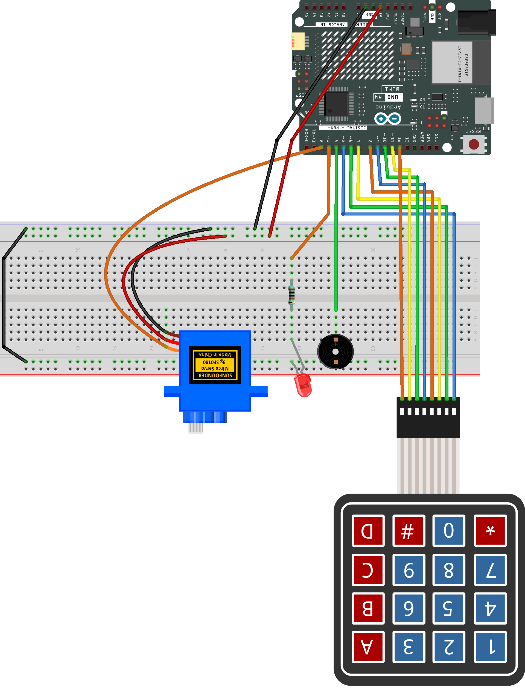

.. _pin_lock1.0:

PIN Lock 1.0
==============================================================

.. note::
  
  🌟 Welcome to the SunFounder Facebook Community! Whether you're into Raspberry Pi, Arduino, or ESP32, you'll find inspiration, help ideas here.
   
  - ✅ Be the first to get free learning resources. 
   
  - ✅ Stay updated on new products & exclusive giveaways. 
   
  - ✅ Share your creations and get real feedback.
   
  * 👉 Need faster updates or support? Click [|link_sf_facebook|] join our Facebook community 

  * 👉 Or join our WhatsApp group: Click [|link_sf_whatsapp|]
   
  * 🎁 Looking for parts?Check out our all-in-one kits below — packed with components, beginner-friendly guides, and tons of fun.
  
  .. list-table::
    :widths: 20 20 20
    :header-rows: 1

    *   - Name	
        - Includes Arduino board
        - PURCHASE LINK
    *   - Elite Explorer Kit	
        - Arduino Uno R4 WiFi
        - |link_elite_buy|
    *   - 3 in 1 Ultimate Starter Kit
        - Arduino Uno R4 Minima
        - |link_arduinor4_buy|

Course Introduction
------------------------

This project creates a PIN lock system with an Arduino, a 4×4 keypad, servo, LED, and buzzer.

Users enter the PIN to unlock the servo door.
The LED shows lock status, and the buzzer gives audio feedback for key presses, success, and errors.

.. raw:: html
 
  <iframe width="700" height="394" src="https://www.youtube.com/embed/BkxemBGrpUk?si=Vj6NkZTFRYvzNMiQ" title="YouTube video player" frameborder="0" allow="accelerometer; autoplay; clipboard-write; encrypted-media; gyroscope; picture-in-picture; web-share" referrerpolicy="strict-origin-when-cross-origin" allowfullscreen></iframe>

.. note::

  If this is your first time working with an Arduino project, we recommend downloading and reviewing the basic materials first.
  
  * :ref:`install_arduino`
  * :ref:`introduce_arduino`

**Required Components**

In this project, we need the following components:

.. list-table::
    :widths: 5 20 5 20
    :header-rows: 1

    *   - SN
        - COMPONENT INTRODUCTION	
        - QUANTITY
        - PURCHASE LINK

    *   - 1
        - Arduino UNO R4 Minima/Arduino UNO R4 WIFI
        - 1
        - |link_unor4_buy|
    *   - 2
        - USB Type-C cable
        - 1
        - 
    *   - 3
        - Breadboard
        - 1
        - |link_breadboard_buy|
    *   - 4
        - Wires
        - Several
        - |link_wires_buy|
    *   - 5
        - Passive buzzer
        - 1
        - |link_passive_buzzer_buy|
    *   - 6
        - KeyPad
        - 1
        - |link_keypad_buy|
    *   - 7
        - LED
        - 1
        - |link_led_buy|
    *   - 8
        - Digital Servo Motor
        - 1
        - |link_motor_buy|
    *   - 9
        - 1kΩ resistor
        - 1
        - |link_resistor_buy|

**Wiring**

**Common Connections:**

* **Keypad**

  - **RowPins:** Connect to  **5** to **8** on the Arduino.
  - **ColPins:** Connect to **9** to **12** on the Arduino.

* **Digital Servo Motor**

  - Connect to breadboard’s positive power bus.
  - Connect to breadboard’s negative power bus.
  - Connect to **9** on the Arduino.

* **Passive buzzer**

  - **＋:** Connect to **2** on the Arduino.
  - **－:** Connect to breadboard’s negative power bus.

* **LED**

  - Connect the LEDs **cathode** to the negative power bus on the breadboard, and the LED **anode** to a **1kΩ resistor** then to **3** on the Arduino.

**Writing the Code**

.. note::

    * You can copy this code into **Arduino IDE**. 
    * To install the library, use the Arduino Library Manager and search for **Adafruit_Keypad** install it.
    * Don't forget to select the board(Arduino UNO R4 WIFI) and the correct port before clicking the **Upload** button.

.. code-block:: arduino

      #include <Adafruit_Keypad.h>
      #include <Servo.h>

      // -------- Pins --------
      const int PIN_SERVO  = 2;  // Servo signal on D2
      const int PIN_LED_R  = 3;  // Red LED on D3
      const int PIN_BUZZER = 4;  // Buzzer on D4

      // -------- Keypad --------
      const byte ROWS = 4, COLS = 4;
      // If '#' becomes 'D' on your keypad, switch to VARIANT 1.
      #define KEYPAD_VARIANT 0
      #if KEYPAD_VARIANT == 0
      char keys[ROWS][COLS] = {
        {'1','2','3','A'},
        {'4','5','6','B'},
        {'7','8','9','C'},
        {'*','0','#','D'}
      };
      #else
      char keys[ROWS][COLS] = {
        {'1','2','3','A'},
        {'4','5','6','B'},
        {'7','8','9','C'},
        {'*','0','D','#'}
      };
      #endif
      byte rowPins[ROWS] = {5, 6, 7, 8};
      byte colPins[COLS] = {9, 10, 11, 12};
      Adafruit_Keypad keypad = Adafruit_Keypad(makeKeymap(keys), rowPins, colPins, ROWS, COLS);

      // -------- Servo (smooth, non-blocking) --------
      Servo door;
      int currentAngle = 90;                 // locked posture
      int targetAngle  = 90;
      bool servoIsAttached = false;
      unsigned long lastStepAt = 0;
      const unsigned long stepInterval = 15; // 1° per 15ms

      // -------- App State --------
      enum State { STATE_LOCKED, STATE_INPUT, STATE_ACTION };
      State state = STATE_LOCKED;

      String pinCode = "1234";
      const byte PIN_LEN = (byte)pinCode.length();
      String inputBuf = "";

      // -------- Error red LED blink scheduler (non-blocking) --------
      const int ERROR_BLINK_COUNT = 6;       // how many blinks on error
      int errBlinkToggles = 0;               // internal: toggles = blinks * 2
      unsigned long lastErrBlinkAt = 0;
      const unsigned long errBlinkInterval = 120; // ms between toggles
      bool redBlinkState = false;            // internal toggle state

      // -------- Buzzer feedback (tone uses Timer2; Servo uses Timer1 on UNO) --------
      void beepKey()    { tone(PIN_BUZZER, 1800, 40); }                    // short key click
      void beepOK()     { tone(PIN_BUZZER, 900, 120); delay(20); tone(PIN_BUZZER, 1400, 120); } // small sync gap
      void beepError()  { tone(PIN_BUZZER, 350, 220); }                    // low, longer
      void beepAction() { tone(PIN_BUZZER, 1200, 50); }                    // enter action hint

      // -------- LED helpers --------
      void setLED(bool r) { digitalWrite(PIN_LED_R, r ? HIGH : LOW); }
      void setLockedLED() { setLED(true); }   // red ON when locked
      void setIdleLED()   { setLED(false); }  // red OFF during input/action

      void triggerErrorBlink() {
        // N blinks => 2N toggles
        errBlinkToggles = ERROR_BLINK_COUNT * 2;
        redBlinkState = false;
        lastErrBlinkAt = 0; // force immediate
      }

      // -------- Servo helpers --------
      void servoAttachOnce() {
        if (!servoIsAttached) {
          door.attach(PIN_SERVO);
          servoIsAttached = true;
          door.write(currentAngle);  // sync immediately to avoid jump
          delay(10);                 // tiny settle for first pulse
        }
      }
      void servoDetachIfIdle() {
        if (servoIsAttached) {
          door.detach();
          servoIsAttached = false;
        }
      }
      void setTarget(int ang) {
        targetAngle = constrain(ang, 0, 180);
        if (currentAngle != targetAngle) {
          servoAttachOnce();
          lastStepAt = millis();     // start stepping
        }
      }
      bool atTarget() { return currentAngle == targetAngle; }

      void tickServo(unsigned long now) {
        if (currentAngle == targetAngle) { servoDetachIfIdle(); return; }
        if ((long)(now - lastStepAt) >= (long)stepInterval) {
          lastStepAt = now;
          currentAngle += (currentAngle < targetAngle) ? 1 : -1;
          door.write(currentAngle);
        }
      }

      // -------- Action sequence --------
      const int lockAngle = 90;
      const int openAngle = 0;
      enum ActionPhase { PHASE_IDLE, PHASE_TO_ZERO, PHASE_WAIT_1S, PHASE_BACK_TO_90 };
      ActionPhase actionPhase = PHASE_IDLE;
      unsigned long actionPhaseStart = 0;

      void startActionSequence() {
        actionPhase = PHASE_TO_ZERO;
        actionPhaseStart = millis();
        setTarget(openAngle);
        beepAction();    // brief audible hint
        setIdleLED();    // unlocked visual: red OFF
      }

      void updateActionSequence(unsigned long now) {
        switch (actionPhase) {
          case PHASE_TO_ZERO:
            if (atTarget()) {
              actionPhase = PHASE_WAIT_1S;
              actionPhaseStart = now;
            }
            break;
          case PHASE_WAIT_1S:
            if ((long)(now - actionPhaseStart) >= 1000) {
              actionPhase = PHASE_BACK_TO_90;
              setTarget(lockAngle);
            }
            break;
          case PHASE_BACK_TO_90:
            if (atTarget()) {
              actionPhase = PHASE_IDLE;
              state = STATE_LOCKED;
              setLockedLED(); // red ON again
            }
            break;
          default: break;
        }
      }

      // -------- State transitions --------
      void enterState(State s) {
        state = s;
        if (s == STATE_LOCKED) {
          inputBuf = "";
          setTarget(lockAngle);
          setLockedLED();             // red ON
        } else if (s == STATE_INPUT) {
          inputBuf = "";
          setIdleLED();               // red OFF
        } else if (s == STATE_ACTION) {
          startActionSequence();
        }
      }

      // -------- Key handling --------
      void handleKey(char k) {
        if (state == STATE_LOCKED) {
          if (k == '*') {
            // NEW: give audible feedback when entering INPUT from LOCKED
            beepKey();                // <-- added so '*' immediately clicks
            enterState(STATE_INPUT);
          }
          return;
        }

        if (state == STATE_INPUT) {
          // audible key click for every key during input
          beepKey();

          if (k >= '0' && k <= '9') {
            if (inputBuf.length() < PIN_LEN) inputBuf += k;
          } else if (k == 'D') {
            if (inputBuf.length() > 0) inputBuf.remove(inputBuf.length()-1);
          } else if (k == 'C') {
            inputBuf = "";
          } else if (k == '#' || k == 'A') {
            if (inputBuf.length() == PIN_LEN && inputBuf == pinCode) {
              beepOK();
              enterState(STATE_ACTION);
            } else {
              beepError();
              triggerErrorBlink(); // red LED quick-blink N times
              inputBuf = "";
            }
          }
          return;
        }

        if (state == STATE_ACTION) {
          // ignore keys during action
          return;
        }
      }

      // -------- LED scheduler (handles error blink) --------
      void tickLEDs(unsigned long now) {
        if (errBlinkToggles > 0) {
          if (lastErrBlinkAt == 0 || (long)(now - lastErrBlinkAt) >= (long)errBlinkInterval) {
            lastErrBlinkAt = now;
            redBlinkState = !redBlinkState;
            digitalWrite(PIN_LED_R, redBlinkState ? HIGH : LOW);
            errBlinkToggles--;
            if (errBlinkToggles == 0) {
              // restore LED according to current state
              if (state == STATE_LOCKED) setLockedLED();
              else setIdleLED();
            }
          }
        }
      }

      // -------- Setup & Loop --------
      void setup() {
        pinMode(PIN_LED_R, OUTPUT);
        pinMode(PIN_BUZZER, OUTPUT);
        setLockedLED();

        keypad.begin();

        // Servo boot settle at 90°, keep pulses a while, then detach
        currentAngle = lockAngle;
        targetAngle  = lockAngle;
        door.attach(PIN_SERVO);
        servoIsAttached = true;
        door.write(currentAngle);
        delay(700);
        servoDetachIfIdle();

        enterState(STATE_LOCKED);
      }

      void loop() {
        unsigned long now = millis();

        // keypad events
        keypad.tick();
        while (keypad.available()) {
          keypadEvent e = keypad.read();
          if (e.bit.EVENT == KEY_JUST_PRESSED) handleKey((char)e.bit.KEY);
        }

        // servo smoothing
        tickServo(now);

        // action phases
        if (state == STATE_ACTION) updateActionSequence(now);

        // LED blink scheduler
        tickLEDs(now);
      }
